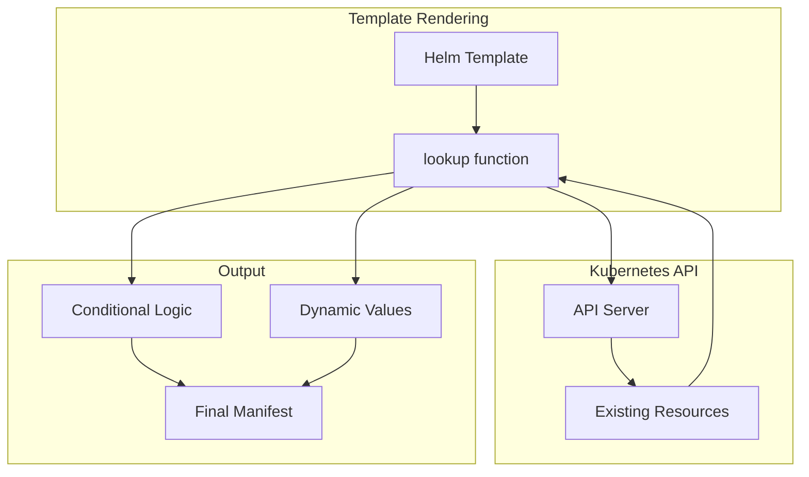

# How to Use Helm Lookup Function for Dynamic Resource Discovery

Author: [nawazdhandala](https://www.github.com/nawazdhandala)

Tags: Helm, Kubernetes, DevOps, Templates, Dynamic Discovery, Best Practices

Description: Guide to using Helm's lookup function to query existing cluster resources during template rendering for dynamic configuration and conditional logic.

> The Helm lookup function enables templates to query live Kubernetes resources during rendering. This guide covers using lookup for dynamic configuration, handling missing resources, and implementing patterns for resource discovery.

## Lookup Function Overview



## Basic Lookup Syntax

### Function Signature

```yaml
# lookup(apiVersion, kind, namespace, name)

# Returns empty dict if resource not found
# Returns resource if found
# During helm template (no cluster), always returns empty dict
```

### Query Single Resource

```yaml
# templates/deployment.yaml
{{- $existingSecret := lookup "v1" "Secret" .Release.Namespace "myapp-secrets" }}
{{- if $existingSecret }}
# Secret exists, use it
envFrom:
  - secretRef:
      name: myapp-secrets
{{- else }}
# Secret doesn't exist, create one
# Or handle differently
{{- end }}
```

### Query All Resources

```yaml
# templates/configmap.yaml
{{- $namespaces := lookup "v1" "Namespace" "" "" }}
# Returns all namespaces

{{- $secrets := lookup "v1" "Secret" .Release.Namespace "" }}
# Returns all secrets in release namespace
```

## Common Use Cases

### Check for Existing Resources

```yaml
# templates/certificate.yaml
{{- $existingCert := lookup "cert-manager.io/v1" "Certificate" .Release.Namespace "myapp-tls" }}
{{- if not $existingCert }}
apiVersion: cert-manager.io/v1
kind: Certificate
metadata:
  name: myapp-tls
spec:
  secretName: myapp-tls
  issuerRef:
    name: letsencrypt-prod
    kind: ClusterIssuer
  dnsNames:
    - {{ .Values.ingress.host }}
{{- end }}
```

### Discover Existing ConfigMaps

```yaml
# templates/deployment.yaml
{{- $configMaps := lookup "v1" "ConfigMap" .Release.Namespace "" }}
spec:
  template:
    spec:
      containers:
        - name: myapp
          envFrom:
            {{- range $name, $cm := $configMaps.items }}
            {{- if hasPrefix "myapp-" $name }}
            - configMapRef:
                name: {{ $name }}
            {{- end }}
            {{- end }}
```

### Get Cluster Information

```yaml
# templates/_helpers.tpl
{{- define "myapp.clusterDomain" -}}
{{- $kubeSystem := lookup "v1" "ConfigMap" "kube-system" "coredns" }}
{{- if $kubeSystem }}
{{- default "cluster.local" (index $kubeSystem.data "Corefile" | regexFind "kubernetes\\s+([^\\s]+)") }}
{{- else }}
cluster.local
{{- end }}
{{- end }}
```

### Check for CRD Existence

```yaml
# templates/servicemonitor.yaml
{{- $crd := lookup "apiextensions.k8s.io/v1" "CustomResourceDefinition" "" "servicemonitors.monitoring.coreos.com" }}
{{- if $crd }}
apiVersion: monitoring.coreos.com/v1
kind: ServiceMonitor
metadata:
  name: {{ include "myapp.fullname" . }}
spec:
  selector:
    matchLabels:
      {{- include "myapp.selectorLabels" . | nindent 6 }}
  endpoints:
    - port: metrics
      interval: 30s
{{- end }}
```

## Advanced Patterns

### Discover Service Dependencies

```yaml
# templates/deployment.yaml
{{- $dbService := lookup "v1" "Service" .Release.Namespace "postgresql" }}
{{- $redisService := lookup "v1" "Service" .Release.Namespace "redis" }}

spec:
  template:
    spec:
      containers:
        - name: myapp
          env:
            {{- if $dbService }}
            - name: DATABASE_HOST
              value: {{ $dbService.metadata.name }}.{{ .Release.Namespace }}.svc.cluster.local
            - name: DATABASE_PORT
              value: {{ (index $dbService.spec.ports 0).port | quote }}
            {{- end }}
            {{- if $redisService }}
            - name: REDIS_HOST
              value: {{ $redisService.metadata.name }}.{{ .Release.Namespace }}.svc.cluster.local
            {{- end }}
```

### Auto-discover Ingress Class

```yaml
# templates/ingress.yaml
{{- $ingressClasses := lookup "networking.k8s.io/v1" "IngressClass" "" "" }}
{{- $defaultClass := "" }}
{{- range $ingressClasses.items }}
  {{- if index .metadata.annotations "ingressclass.kubernetes.io/is-default-class" }}
    {{- $defaultClass = .metadata.name }}
  {{- end }}
{{- end }}

apiVersion: networking.k8s.io/v1
kind: Ingress
metadata:
  name: {{ include "myapp.fullname" . }}
spec:
  ingressClassName: {{ .Values.ingress.className | default $defaultClass }}
```

### Get Storage Class

```yaml
# templates/pvc.yaml
{{- $storageClasses := lookup "storage.k8s.io/v1" "StorageClass" "" "" }}
{{- $defaultSC := "" }}
{{- range $storageClasses.items }}
  {{- if eq (index .metadata.annotations "storageclass.kubernetes.io/is-default-class") "true" }}
    {{- $defaultSC = .metadata.name }}
  {{- end }}
{{- end }}

apiVersion: v1
kind: PersistentVolumeClaim
metadata:
  name: {{ include "myapp.fullname" . }}-data
spec:
  storageClassName: {{ .Values.persistence.storageClass | default $defaultSC }}
  accessModes:
    - ReadWriteOnce
  resources:
    requests:
      storage: {{ .Values.persistence.size }}
```

### Check Namespace Labels

```yaml
# templates/network-policy.yaml
{{- $namespace := lookup "v1" "Namespace" "" .Release.Namespace }}
{{- if and $namespace (index $namespace.metadata.labels "istio-injection") }}
# Namespace has Istio, configure accordingly
apiVersion: networking.k8s.io/v1
kind: NetworkPolicy
metadata:
  name: {{ include "myapp.fullname" . }}-allow-istio
spec:
  podSelector:
    matchLabels:
      {{- include "myapp.selectorLabels" . | nindent 6 }}
  ingress:
    - from:
        - namespaceSelector:
            matchLabels:
              istio-injection: enabled
{{- end }}
```

## Handling Empty Results

### Safe Access Pattern

```yaml
# templates/deployment.yaml
{{- $secret := lookup "v1" "Secret" .Release.Namespace .Values.existingSecret }}
{{- if and $secret $secret.data }}
envFrom:
  - secretRef:
      name: {{ .Values.existingSecret }}
{{- else }}
env:
  - name: API_KEY
    valueFrom:
      secretKeyRef:
        name: {{ include "myapp.fullname" . }}-secrets
        key: api-key
{{- end }}
```

### Default Values for Missing Resources

```yaml
# templates/_helpers.tpl
{{- define "myapp.databaseURL" -}}
{{- $dbSecret := lookup "v1" "Secret" .Release.Namespace "database-credentials" }}
{{- if $dbSecret }}
{{- index $dbSecret.data "url" | b64dec }}
{{- else }}
postgresql://localhost:5432/myapp
{{- end }}
{{- end }}
```

### Conditional Resource Creation

```yaml
# templates/secret.yaml
{{- $existing := lookup "v1" "Secret" .Release.Namespace (include "myapp.fullname" .) }}
{{- if not $existing }}
apiVersion: v1
kind: Secret
metadata:
  name: {{ include "myapp.fullname" . }}
type: Opaque
data:
  password: {{ randAlphaNum 32 | b64enc }}
{{- else }}
# Preserve existing secret - don't regenerate password
apiVersion: v1
kind: Secret
metadata:
  name: {{ include "myapp.fullname" . }}
type: Opaque
data:
  password: {{ index $existing.data "password" }}
{{- end }}
```

## Limitations and Considerations

### Template Mode Behavior

```yaml
# During `helm template` (no cluster connection):
# - lookup always returns empty dict
# - Cannot query cluster resources

# Safe pattern for both modes
{{- $resource := lookup "v1" "ConfigMap" .Release.Namespace "myconfig" }}
{{- if $resource }}
  # Use discovered values
{{- else }}
  # Use defaults (works in template mode)
{{- end }}
```

### Performance Considerations

```yaml
# Cache lookup results
{{- $allSecrets := lookup "v1" "Secret" .Release.Namespace "" }}

# Reuse cached result
{{- range $allSecrets.items }}
  {{- if hasPrefix "myapp-" .metadata.name }}
    # Process secret
  {{- end }}
{{- end }}

# DON'T do this - multiple API calls
{{- range $i := until 10 }}
  {{- $secret := lookup "v1" "Secret" .Release.Namespace (printf "secret-%d" $i) }}
{{- end }}
```

### Dry-run Limitations

```bash
# Lookup works during:
# - helm install
# - helm upgrade
# - helm upgrade --dry-run (connects to cluster)

# Lookup returns empty during:
# - helm template
# - helm upgrade --dry-run --dry-run-server=false
```

## Testing Lookup Functions

### Mock Data for Testing

```yaml
# test-values.yaml
# Provide defaults that would be discovered
mockLookup:
  databaseSecret:
    exists: true
    data:
      url: postgresql://db:5432/test
```

```yaml
# templates/deployment.yaml
{{- if .Values.mockLookup }}
  # Use mock data for testing
  {{- $dbSecret := .Values.mockLookup.databaseSecret }}
{{- else }}
  # Real lookup
  {{- $dbSecret := lookup "v1" "Secret" .Release.Namespace "database" }}
{{- end }}
```

### Unit Testing

```yaml
# tests/deployment_test.yaml
suite: deployment tests
templates:
  - deployment.yaml
tests:
  - it: should use discovered database when available
    set:
      mockLookup:
        databaseSecret:
          exists: true
          data:
            url: postgresql://test:5432/db
    asserts:
      - contains:
          path: spec.template.spec.containers[0].env
          content:
            name: DATABASE_URL
            value: postgresql://test:5432/db
```

## Best Practices

| Practice | Description |
|----------|-------------|
| Always Fallback | Provide defaults for template mode |
| Cache Results | Store lookup results in variables |
| Check Empty | Verify lookup returned data |
| Document Discovery | Comment what's being discovered |
| Limit Scope | Query specific resources, not all |
| Test Both Modes | Verify with and without cluster |

## Troubleshooting

```bash
# Debug lookup results
helm install myapp ./myapp --debug --dry-run 2>&1 | grep -A10 "lookup"

# Verify API access
kubectl auth can-i get secrets --as=system:serviceaccount:default:default

# Check resource exists
kubectl get secret myapp-secrets -o yaml

# Test lookup in isolation
helm template myapp ./myapp \
  --set debug=true \
  -s templates/debug.yaml
```

## Wrap-up

The Helm lookup function enables dynamic resource discovery during template rendering, allowing charts to adapt to existing cluster state. Use lookup to check for existing resources, discover service dependencies, and implement conditional logic. Always provide fallbacks for template mode and cache lookup results to minimize API calls.
