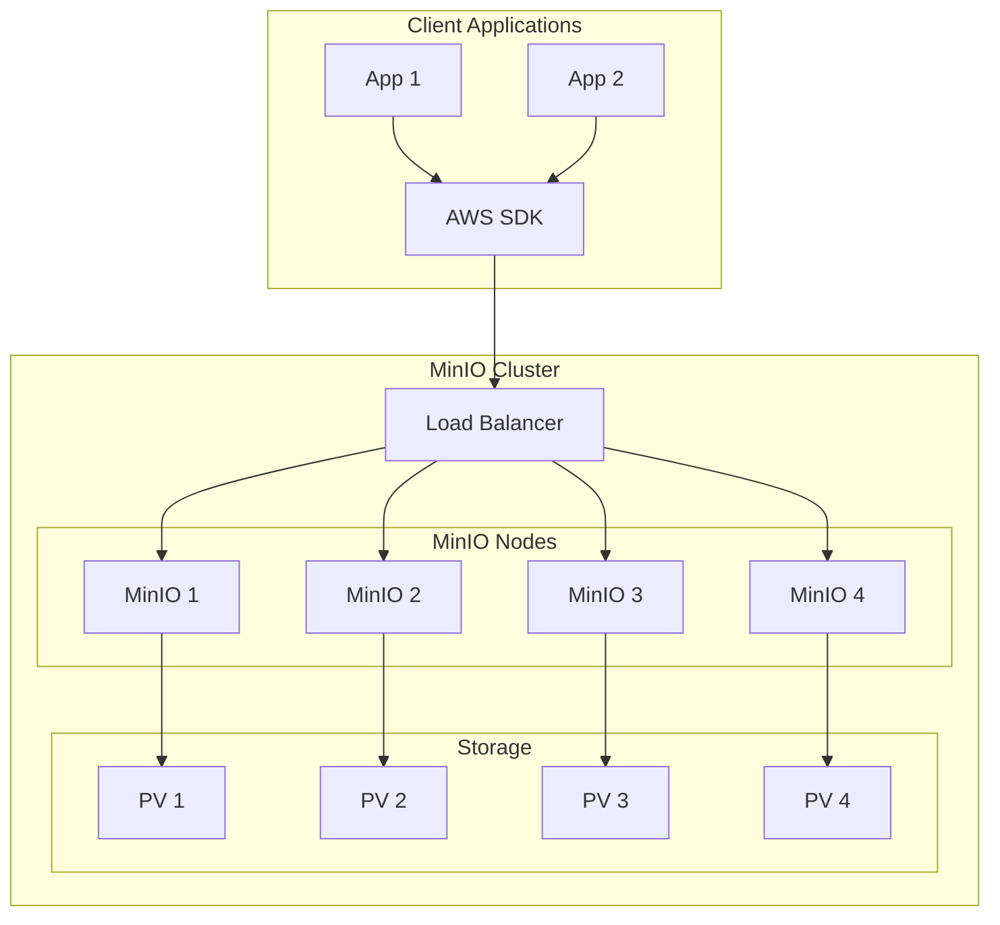

# How to Deploy MinIO Object Storage with Helm on Kubernetes

Author: [nawazdhandala](https://www.github.com/nawazdhandala)

Tags: Helm, Kubernetes, MinIO, Object Storage, S3, DevOps, Storage

Description: Complete guide to deploying MinIO object storage using Helm including distributed mode, TLS configuration, bucket policies, and integration with applications.

> MinIO provides high-performance S3-compatible object storage for Kubernetes. This guide covers deploying MinIO via Helm in both standalone and distributed modes with production-ready configurations.

## MinIO Architecture



## Installation

### Add Helm Repository

```bash
# Add MinIO operator repository
helm repo add minio-operator https://operator.min.io
helm repo update

# Or use Bitnami chart for simpler setups
helm repo add bitnami https://charts.bitnami.com/bitnami
helm repo update

# Search available versions
helm search repo minio
```

### Standalone Installation (Development)

```bash
# Quick standalone installation
helm install minio bitnami/minio \
  --namespace minio \
  --create-namespace \
  --set auth.rootUser=admin \
  --set auth.rootPassword=minio123456 \
  --set persistence.size=10Gi
```

## Production Configuration

### Distributed Mode Values

```yaml
# minio-distributed.yaml
mode: distributed

# Replicas (must be multiple of 4 for erasure coding)
statefulset:
  replicaCount: 4

# Root credentials
auth:
  rootUser: minio-admin
  rootPassword: ""  # Use existingSecret
  existingSecret: minio-credentials

# Persistence
persistence:
  enabled: true
  storageClass: fast-storage
  size: 100Gi
  accessModes:
    - ReadWriteOnce

# Resources
resources:
  requests:
    cpu: 500m
    memory: 1Gi
  limits:
    cpu: 2
    memory: 4Gi

# Service
service:
  type: ClusterIP
  ports:
    api: 9000
    console: 9001

# Ingress for Console
ingress:
  enabled: true
  ingressClassName: nginx
  hostname: minio-console.example.com
  annotations:
    cert-manager.io/cluster-issuer: letsencrypt-prod
  tls: true

# API Ingress
apiIngress:
  enabled: true
  ingressClassName: nginx
  hostname: minio.example.com
  annotations:
    cert-manager.io/cluster-issuer: letsencrypt-prod
    nginx.ingress.kubernetes.io/proxy-body-size: "0"
    nginx.ingress.kubernetes.io/proxy-read-timeout: "600"
    nginx.ingress.kubernetes.io/proxy-send-timeout: "600"
  tls: true

# Metrics
metrics:
  enabled: true
  serviceMonitor:
    enabled: true
    namespace: monitoring
    interval: 30s

# Pod Disruption Budget
pdb:
  create: true
  minAvailable: 2

# Anti-affinity
affinity:
  podAntiAffinity:
    requiredDuringSchedulingIgnoredDuringExecution:
      - labelSelector:
          matchLabels:
            app.kubernetes.io/name: minio
        topologyKey: kubernetes.io/hostname
```

### Create Credentials Secret

```bash
# Generate secure credentials
ROOT_USER=$(openssl rand -hex 16)
ROOT_PASSWORD=$(openssl rand -base64 32)

# Create secret
kubectl create namespace minio
kubectl create secret generic minio-credentials \
  --namespace minio \
  --from-literal=root-user=$ROOT_USER \
  --from-literal=root-password=$ROOT_PASSWORD

echo "Root User: $ROOT_USER"
echo "Root Password: $ROOT_PASSWORD"
```

### Deploy Distributed MinIO

```bash
helm install minio bitnami/minio \
  -f minio-distributed.yaml \
  --namespace minio \
  --create-namespace
```

## MinIO Operator Installation

### Install Operator

```bash
# Install MinIO Operator
helm install operator minio-operator/operator \
  --namespace minio-operator \
  --create-namespace

# Verify operator
kubectl get pods -n minio-operator
```

### Create Tenant

```yaml
# minio-tenant.yaml
apiVersion: minio.min.io/v2
kind: Tenant
metadata:
  name: minio-tenant
  namespace: minio
spec:
  image: minio/minio:RELEASE.2024-01-01T00-00-00Z
  imagePullPolicy: IfNotPresent
  
  # Pools configuration
  pools:
    - servers: 4
      volumesPerServer: 4
      volumeClaimTemplate:
        metadata:
          name: data
        spec:
          accessModes:
            - ReadWriteOnce
          resources:
            requests:
              storage: 100Gi
          storageClassName: fast-storage
      resources:
        requests:
          cpu: 500m
          memory: 1Gi
        limits:
          cpu: 2
          memory: 4Gi
      affinity:
        podAntiAffinity:
          requiredDuringSchedulingIgnoredDuringExecution:
            - labelSelector:
                matchLabels:
                  v1.min.io/tenant: minio-tenant
              topologyKey: kubernetes.io/hostname
  
  # Mount path
  mountPath: /export
  
  # Request automatic certificate
  requestAutoCert: true
  
  # Console configuration
  console:
    image: minio/console:v0.30.0
    replicas: 2
    
  # Prometheus integration
  prometheusOperator: true
  
  # Features
  features:
    bucketDNS: true
    
  # Environment variables
  env:
    - name: MINIO_BROWSER_REDIRECT_URL
      value: https://minio-console.example.com
```

### Apply Tenant

```bash
kubectl apply -f minio-tenant.yaml
```

## TLS Configuration

### Using Cert-Manager

```yaml
# minio-certificate.yaml
apiVersion: cert-manager.io/v1
kind: Certificate
metadata:
  name: minio-tls
  namespace: minio
spec:
  secretName: minio-tls
  issuerRef:
    name: letsencrypt-prod
    kind: ClusterIssuer
  dnsNames:
    - minio.example.com
    - minio-console.example.com
    - "*.minio.example.com"
```

### Internal TLS

```yaml
# In minio-tenant.yaml
spec:
  # Internal TLS between pods
  requestAutoCert: true
  
  # Or bring your own cert
  externalCertSecret:
    - name: minio-tls
      type: kubernetes.io/tls
```

## Bucket Configuration

### Default Buckets

```yaml
# minio-values.yaml
defaultBuckets: "data,backups,logs"

# Or with provisioning
provisioning:
  enabled: true
  buckets:
    - name: data
      policy: none
      purge: false
    - name: backups
      policy: none
      purge: false
      versioning: true
    - name: public-assets
      policy: download
      purge: false
```

### Bucket Policies

```yaml
# provisioning policies
provisioning:
  policies:
    - name: read-only-data
      statements:
        - resources:
            - "arn:aws:s3:::data"
            - "arn:aws:s3:::data/*"
          actions:
            - "s3:GetObject"
            - "s3:ListBucket"
    - name: readwrite-backups
      statements:
        - resources:
            - "arn:aws:s3:::backups"
            - "arn:aws:s3:::backups/*"
          actions:
            - "s3:*"
```

### Create Users and Policies

```yaml
# provisioning users
provisioning:
  users:
    - username: app-user
      password: ""
      existingSecret: app-user-credentials
      existingSecretPasswordKey: password
      policies:
        - readwrite-backups
        - read-only-data
    - username: backup-service
      password: ""
      existingSecret: backup-credentials
      existingSecretPasswordKey: password
      policies:
        - readwrite-backups
```

## Client Configuration

### MinIO Client (mc)

```bash
# Install mc
brew install minio/stable/mc

# Configure alias
mc alias set myminio https://minio.example.com ACCESS_KEY SECRET_KEY

# List buckets
mc ls myminio

# Create bucket
mc mb myminio/new-bucket

# Upload file
mc cp file.txt myminio/data/

# Download file
mc cp myminio/data/file.txt ./

# Sync directory
mc mirror ./local-dir myminio/data/backup/
```

### AWS SDK Configuration

```python
# Python with boto3
import boto3
from botocore.client import Config

s3 = boto3.client(
    's3',
    endpoint_url='https://minio.example.com',
    aws_access_key_id='ACCESS_KEY',
    aws_secret_access_key='SECRET_KEY',
    config=Config(signature_version='s3v4'),
    region_name='us-east-1'
)

# Upload file
s3.upload_file('local-file.txt', 'bucket-name', 'object-key')

# Download file
s3.download_file('bucket-name', 'object-key', 'local-file.txt')

# List objects
response = s3.list_objects_v2(Bucket='bucket-name')
for obj in response.get('Contents', []):
    print(obj['Key'])
```

### Kubernetes Application Integration

```yaml
# app-deployment.yaml
apiVersion: apps/v1
kind: Deployment
metadata:
  name: myapp
spec:
  template:
    spec:
      containers:
        - name: myapp
          image: myapp:latest
          env:
            - name: S3_ENDPOINT
              value: "http://minio.minio.svc.cluster.local:9000"
            - name: S3_ACCESS_KEY
              valueFrom:
                secretKeyRef:
                  name: minio-app-credentials
                  key: access-key
            - name: S3_SECRET_KEY
              valueFrom:
                secretKeyRef:
                  name: minio-app-credentials
                  key: secret-key
            - name: S3_BUCKET
              value: "app-data"
            - name: S3_REGION
              value: "us-east-1"
```

## Backup and Restore

### Backup MinIO Data

```yaml
# minio-backup-cronjob.yaml
apiVersion: batch/v1
kind: CronJob
metadata:
  name: minio-backup
  namespace: minio
spec:
  schedule: "0 2 * * *"
  jobTemplate:
    spec:
      template:
        spec:
          containers:
            - name: backup
              image: minio/mc:latest
              command:
                - /bin/sh
                - -c
                - |
                  mc alias set source http://minio:9000 $MINIO_ACCESS_KEY $MINIO_SECRET_KEY
                  mc alias set dest https://s3.amazonaws.com $AWS_ACCESS_KEY $AWS_SECRET_KEY
                  mc mirror source/data dest/minio-backup/$(date +%Y-%m-%d)/
              env:
                - name: MINIO_ACCESS_KEY
                  valueFrom:
                    secretKeyRef:
                      name: minio-credentials
                      key: root-user
                - name: MINIO_SECRET_KEY
                  valueFrom:
                    secretKeyRef:
                      name: minio-credentials
                      key: root-password
                - name: AWS_ACCESS_KEY
                  valueFrom:
                    secretKeyRef:
                      name: aws-credentials
                      key: access-key
                - name: AWS_SECRET_KEY
                  valueFrom:
                    secretKeyRef:
                      name: aws-credentials
                      key: secret-key
          restartPolicy: OnFailure
```

### Restore Data

```bash
# Restore from backup
mc mirror backup-location/minio-backup/2024-01-15/ myminio/data/
```

## Monitoring

### Prometheus Metrics

```yaml
# Enable in values
metrics:
  enabled: true
  serviceMonitor:
    enabled: true
    namespace: monitoring
    interval: 30s
    labels:
      release: prometheus
```

### Key Metrics

```promql
# Total storage used
minio_bucket_usage_total_bytes

# Object count
minio_bucket_usage_object_total

# Request rate
rate(minio_s3_requests_total[5m])

# Error rate
rate(minio_s3_requests_errors_total[5m])

# Latency
histogram_quantile(0.95, rate(minio_s3_requests_ttfb_seconds_bucket[5m]))

# Disk usage
minio_node_disk_used_bytes / minio_node_disk_total_bytes
```

### Grafana Dashboard

```json
{
  "panels": [
    {
      "title": "Storage Usage",
      "type": "gauge",
      "targets": [
        {
          "expr": "sum(minio_bucket_usage_total_bytes) / 1024 / 1024 / 1024",
          "legendFormat": "GB Used"
        }
      ]
    },
    {
      "title": "Request Rate",
      "type": "timeseries",
      "targets": [
        {
          "expr": "sum(rate(minio_s3_requests_total[5m])) by (api)",
          "legendFormat": "{{api}}"
        }
      ]
    }
  ]
}
```

## Troubleshooting

```bash
# Check MinIO pods
kubectl get pods -n minio -l app.kubernetes.io/name=minio

# View logs
kubectl logs -n minio -l app.kubernetes.io/name=minio -f

# Check PVC status
kubectl get pvc -n minio

# Test connectivity
kubectl run -it --rm test --image=minio/mc --restart=Never -- \
  mc alias set test http://minio.minio.svc.cluster.local:9000 admin minio123

# Check cluster health
mc admin info myminio

# Heal damaged objects
mc admin heal myminio
```

## Best Practices

| Practice | Description |
|----------|-------------|
| Use Distributed Mode | Production resilience |
| Enable Erasure Coding | Data protection (4+ nodes) |
| Set Resource Limits | Prevent OOM |
| Use External Secrets | Don't hardcode credentials |
| Enable TLS | Encrypt data in transit |
| Regular Backups | Disaster recovery |
| Monitor Storage | Alert before full |

## Wrap-up

MinIO provides enterprise-grade S3-compatible storage for Kubernetes. Deploy in distributed mode for production with erasure coding for data protection. Use the MinIO Operator for advanced features like automatic TLS and multi-tenancy. Integrate with applications using standard AWS SDK libraries for seamless S3 compatibility.
