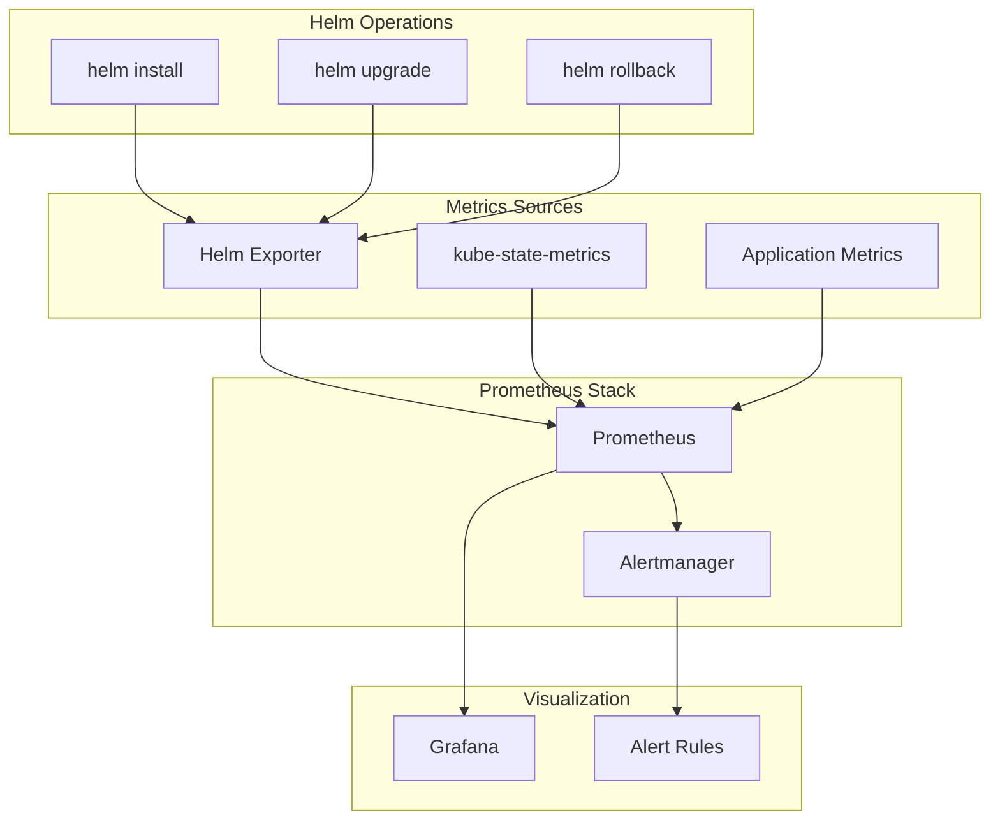

# How to Monitor Helm Release Health with Prometheus and Grafana

Author: [nawazdhandala](https://www.github.com/nawazdhandala)

Tags: Helm, Kubernetes, Prometheus, Grafana, Monitoring, DevOps, Observability

Description: Complete guide to monitoring Helm release health using Prometheus metrics and Grafana dashboards for tracking deployments, rollbacks, and chart status.

> Monitoring Helm releases helps catch deployment issues early and track chart lifecycle. This guide covers setting up Prometheus metrics collection and Grafana dashboards for comprehensive Helm release observability.

## Monitoring Architecture



## Installing Helm Exporter

### Via Helm Chart

```bash
# Add helm-exporter repository
helm repo add sstarcher https://shanestarcher.com/helm-charts/
helm repo update

# Install helm-exporter
helm install helm-exporter sstarcher/helm-exporter \
  --namespace monitoring \
  --create-namespace \
  --set serviceMonitor.enabled=true \
  --set serviceMonitor.namespace=monitoring
```

### Custom Helm Exporter Values

```yaml
# helm-exporter-values.yaml
replicaCount: 1

image:
  repository: sstarcher/helm-exporter
  tag: "1.2.5"

# Namespaces to monitor (empty = all)
namespaces: []

# Metrics configuration
config:
  helmDriver: secrets  # or configmaps
  
serviceMonitor:
  enabled: true
  namespace: monitoring
  interval: 30s
  scrapeTimeout: 10s
  
resources:
  limits:
    cpu: 100m
    memory: 128Mi
  requests:
    cpu: 50m
    memory: 64Mi
```

### Deploy with Values

```bash
helm install helm-exporter sstarcher/helm-exporter \
  -f helm-exporter-values.yaml \
  --namespace monitoring
```

## Prometheus Configuration

### ServiceMonitor for Helm Exporter

```yaml
# servicemonitor.yaml
apiVersion: monitoring.coreos.com/v1
kind: ServiceMonitor
metadata:
  name: helm-exporter
  namespace: monitoring
  labels:
    app: helm-exporter
spec:
  selector:
    matchLabels:
      app.kubernetes.io/name: helm-exporter
  endpoints:
    - port: http
      interval: 30s
      path: /metrics
  namespaceSelector:
    matchNames:
      - monitoring
```

### Scrape Config (Non-Operator)

```yaml
# prometheus.yml
scrape_configs:
  - job_name: 'helm-exporter'
    static_configs:
      - targets: ['helm-exporter.monitoring.svc.cluster.local:9571']
    scrape_interval: 30s
    metrics_path: /metrics
```

## Available Metrics

### Helm Exporter Metrics

```promql
# Release information
helm_chart_info{
  chart="myapp",
  chart_version="1.2.3",
  app_version="v1.0.0",
  namespace="production",
  release="myapp-prod"
}

# Release status
helm_release_status{
  release="myapp-prod",
  namespace="production",
  status="deployed"  # deployed, failed, pending-upgrade, etc.
}

# Release revision
helm_release_revision{
  release="myapp-prod",
  namespace="production"
}

# Release timestamps
helm_release_updated_timestamp{
  release="myapp-prod",
  namespace="production"
}
```

### Kube-State-Metrics for Workloads

```promql
# Deployment status from Helm releases
kube_deployment_status_replicas_available{
  deployment=~".*",
  namespace="production"
}

# Pod status
kube_pod_status_phase{
  phase="Running",
  namespace="production"
}

# Container restarts
kube_pod_container_status_restarts_total{
  namespace="production"
}
```

## Grafana Dashboard

### Dashboard JSON

```json
{
  "annotations": {
    "list": []
  },
  "title": "Helm Release Dashboard",
  "uid": "helm-releases",
  "panels": [
    {
      "title": "Releases by Status",
      "type": "piechart",
      "targets": [
        {
          "expr": "count by (status) (helm_release_status)",
          "legendFormat": "{{status}}"
        }
      ],
      "gridPos": { "h": 8, "w": 8, "x": 0, "y": 0 }
    },
    {
      "title": "Release Timeline",
      "type": "timeseries",
      "targets": [
        {
          "expr": "changes(helm_release_revision[1h])",
          "legendFormat": "{{release}}"
        }
      ],
      "gridPos": { "h": 8, "w": 16, "x": 8, "y": 0 }
    },
    {
      "title": "Release Details",
      "type": "table",
      "targets": [
        {
          "expr": "helm_chart_info",
          "format": "table",
          "instant": true
        }
      ],
      "transformations": [
        {
          "id": "organize",
          "options": {
            "renameByName": {
              "release": "Release",
              "namespace": "Namespace",
              "chart": "Chart",
              "chart_version": "Version",
              "app_version": "App Version"
            }
          }
        }
      ],
      "gridPos": { "h": 10, "w": 24, "x": 0, "y": 8 }
    }
  ]
}
```

### Key Dashboard Panels

```yaml
# Grafana dashboard panels configuration
panels:
  - name: Total Releases
    type: stat
    query: count(helm_chart_info)
    
  - name: Failed Releases
    type: stat
    query: count(helm_release_status{status="failed"})
    thresholds:
      - value: 0
        color: green
      - value: 1
        color: red
        
  - name: Recent Deployments
    type: table
    query: |
      topk(10, 
        helm_release_updated_timestamp * on(release, namespace) 
        group_left(chart, chart_version) helm_chart_info
      )
    
  - name: Release Age
    type: bargauge
    query: |
      (time() - helm_release_updated_timestamp) / 86400
    unit: days
```

## Prometheus Alert Rules

### Release Health Alerts

```yaml
# helm-alerts.yaml
apiVersion: monitoring.coreos.com/v1
kind: PrometheusRule
metadata:
  name: helm-release-alerts
  namespace: monitoring
spec:
  groups:
    - name: helm-releases
      rules:
        # Failed release alert
        - alert: HelmReleaseFailed
          expr: helm_release_status{status="failed"} == 1
          for: 5m
          labels:
            severity: critical
          annotations:
            summary: "Helm release {{ $labels.release }} failed"
            description: "Release {{ $labels.release }} in namespace {{ $labels.namespace }} is in failed state"
        
        # Pending release alert
        - alert: HelmReleasePending
          expr: helm_release_status{status=~"pending.*"} == 1
          for: 10m
          labels:
            severity: warning
          annotations:
            summary: "Helm release {{ $labels.release }} stuck pending"
            description: "Release {{ $labels.release }} has been in pending state for more than 10 minutes"
        
        # Stale release alert
        - alert: HelmReleaseStale
          expr: (time() - helm_release_updated_timestamp) > 2592000  # 30 days
          labels:
            severity: info
          annotations:
            summary: "Helm release {{ $labels.release }} is stale"
            description: "Release {{ $labels.release }} hasn't been updated in 30 days"
        
        # Rollback detected
        - alert: HelmRollbackDetected
          expr: delta(helm_release_revision[5m]) < 0
          labels:
            severity: warning
          annotations:
            summary: "Helm rollback detected for {{ $labels.release }}"
            description: "Release {{ $labels.release }} was rolled back"
```

### Workload Health Alerts

```yaml
# workload-alerts.yaml
apiVersion: monitoring.coreos.com/v1
kind: PrometheusRule
metadata:
  name: helm-workload-alerts
  namespace: monitoring
spec:
  groups:
    - name: helm-workloads
      rules:
        # Deployment not ready
        - alert: HelmDeploymentNotReady
          expr: |
            kube_deployment_status_replicas_available{deployment=~".*"}
            /
            kube_deployment_spec_replicas{deployment=~".*"}
            < 1
          for: 5m
          labels:
            severity: critical
          annotations:
            summary: "Deployment {{ $labels.deployment }} not ready"
            description: "Deployment {{ $labels.deployment }} has no available replicas"
        
        # High restart count
        - alert: PodHighRestartCount
          expr: |
            increase(kube_pod_container_status_restarts_total[1h]) > 5
          labels:
            severity: warning
          annotations:
            summary: "Pod {{ $labels.pod }} restarting frequently"
            description: "Pod {{ $labels.pod }} has restarted {{ $value }} times in the last hour"
```

## Custom Metrics with Helm Hooks

### Deployment Metrics Hook

```yaml
# templates/metrics-hook.yaml
{{- if .Values.metrics.deploymentHook.enabled }}
apiVersion: batch/v1
kind: Job
metadata:
  name: {{ include "myapp.fullname" . }}-metrics
  labels:
    {{- include "myapp.labels" . | nindent 4 }}
  annotations:
    "helm.sh/hook": post-install,post-upgrade
    "helm.sh/hook-weight": "10"
    "helm.sh/hook-delete-policy": hook-succeeded
spec:
  template:
    spec:
      restartPolicy: Never
      containers:
        - name: metrics-push
          image: curlimages/curl:latest
          command:
            - /bin/sh
            - -c
            - |
              # Push deployment metric to Prometheus Pushgateway
              cat <<EOF | curl --data-binary @- \
                http://pushgateway.monitoring.svc.cluster.local:9091/metrics/job/helm_deploy
              helm_deployment_timestamp{
                release="{{ .Release.Name }}",
                namespace="{{ .Release.Namespace }}",
                chart="{{ .Chart.Name }}",
                version="{{ .Chart.Version }}"
              } $(date +%s)
              helm_deployment_success{
                release="{{ .Release.Name }}",
                namespace="{{ .Release.Namespace }}"
              } 1
              EOF
{{- end }}
```

### Rollback Detection Hook

```yaml
# templates/rollback-hook.yaml
apiVersion: batch/v1
kind: Job
metadata:
  name: {{ include "myapp.fullname" . }}-rollback-notify
  annotations:
    "helm.sh/hook": post-rollback
    "helm.sh/hook-delete-policy": hook-succeeded
spec:
  template:
    spec:
      restartPolicy: Never
      containers:
        - name: notify
          image: curlimages/curl:latest
          command:
            - /bin/sh
            - -c
            - |
              # Push rollback metric
              cat <<EOF | curl --data-binary @- \
                http://pushgateway.monitoring.svc.cluster.local:9091/metrics/job/helm_rollback
              helm_rollback_total{
                release="{{ .Release.Name }}",
                namespace="{{ .Release.Namespace }}"
              } 1
              EOF
              
              # Notify via webhook
              curl -X POST \
                -H "Content-Type: application/json" \
                -d '{"text":"Rollback detected for {{ .Release.Name }}"}' \
                $WEBHOOK_URL
          env:
            - name: WEBHOOK_URL
              valueFrom:
                secretKeyRef:
                  name: webhook-config
                  key: url
```

## Recording Rules

### Prometheus Recording Rules

```yaml
# recording-rules.yaml
apiVersion: monitoring.coreos.com/v1
kind: PrometheusRule
metadata:
  name: helm-recording-rules
  namespace: monitoring
spec:
  groups:
    - name: helm-recordings
      interval: 1m
      rules:
        # Total releases per namespace
        - record: helm:releases_total:count
          expr: count by (namespace) (helm_chart_info)
        
        # Failed releases ratio
        - record: helm:releases_failed:ratio
          expr: |
            count(helm_release_status{status="failed"})
            /
            count(helm_release_status)
        
        # Average release age in days
        - record: helm:release_age_days:avg
          expr: |
            avg((time() - helm_release_updated_timestamp) / 86400)
        
        # Releases per chart
        - record: helm:releases_per_chart:count
          expr: count by (chart) (helm_chart_info)
```

## Integration with OneUptime

### Webhook Alert Integration

```yaml
# alertmanager-config.yaml
apiVersion: v1
kind: Secret
metadata:
  name: alertmanager-config
  namespace: monitoring
stringData:
  alertmanager.yaml: |
    global:
      resolve_timeout: 5m
    
    route:
      group_by: ['alertname', 'namespace']
      group_wait: 30s
      group_interval: 5m
      repeat_interval: 1h
      receiver: 'oneuptime'
      routes:
        - match:
            severity: critical
          receiver: 'oneuptime-critical'
    
    receivers:
      - name: 'oneuptime'
        webhook_configs:
          - url: 'https://oneuptime.example.com/api/webhooks/alerts'
            send_resolved: true
      
      - name: 'oneuptime-critical'
        webhook_configs:
          - url: 'https://oneuptime.example.com/api/webhooks/alerts'
            send_resolved: true
```

### OpenTelemetry Integration

```yaml
# opentelemetry-collector.yaml
receivers:
  prometheus:
    config:
      scrape_configs:
        - job_name: 'helm-exporter'
          static_configs:
            - targets: ['helm-exporter:9571']

processors:
  batch:
    timeout: 10s

exporters:
  otlp:
    endpoint: "https://otlp.oneuptime.com:443"
    headers:
      X-OneUptime-Token: "${ONEUPTIME_TOKEN}"

service:
  pipelines:
    metrics:
      receivers: [prometheus]
      processors: [batch]
      exporters: [otlp]
```

## Useful Queries

| Purpose | Query |
|---------|-------|
| Total releases | `count(helm_chart_info)` |
| Failed releases | `helm_release_status{status="failed"}` |
| Releases by namespace | `count by (namespace) (helm_chart_info)` |
| Outdated releases | `(time() - helm_release_updated_timestamp) > 604800` |
| Recent deployments | `changes(helm_release_revision[24h]) > 0` |
| Chart versions in use | `count by (chart, chart_version) (helm_chart_info)` |

## Best Practices

| Practice | Description |
|----------|-------------|
| Monitor All Namespaces | Configure exporter for full visibility |
| Set Retention | Keep metrics history for trend analysis |
| Alert on Failures | Immediate notification on failed releases |
| Track Rollbacks | Monitor for unexpected rollbacks |
| Dashboard per Team | Namespace-filtered views |
| Document Thresholds | Clear criteria for alerts |

## Wrap-up

Monitoring Helm releases with Prometheus and Grafana provides critical visibility into deployment health. The helm-exporter exposes release metadata as metrics, enabling alerting on failures, tracking deployment frequency, and identifying stale releases. Combined with workload metrics from kube-state-metrics, you get comprehensive observability for your Helm-managed applications.
