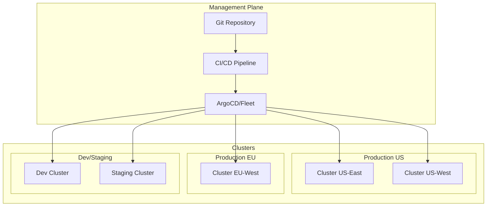

# Multi-Cluster Helm Deployments: Strategies and Patterns

Author: [nawazdhandala](https://www.github.com/nawazdhandala)

Tags: Helm, Kubernetes, DevOps, Multi-Cluster, Federation, GitOps

Description: Learn strategies and patterns for deploying Helm charts across multiple Kubernetes clusters with consistency, including GitOps approaches and cluster fleet management.

> Managing deployments across multiple Kubernetes clusters presents unique challenges: configuration drift, version consistency, and operational complexity. This guide covers strategies and tools for effective multi-cluster Helm deployments.

## Multi-Cluster Deployment Patterns



## Strategy 1: ArgoCD ApplicationSets

ArgoCD ApplicationSets automate Application generation across clusters.

### Install ArgoCD

```bash
# Create namespace
kubectl create namespace argocd

# Install ArgoCD
helm repo add argo https://argoproj.github.io/argo-helm
helm install argocd argo/argo-cd \
  --namespace argocd \
  --set server.service.type=LoadBalancer
```

### Register Clusters

```bash
# Add clusters to ArgoCD
argocd cluster add us-east-context --name us-east
argocd cluster add us-west-context --name us-west
argocd cluster add eu-west-context --name eu-west
```

### Cluster Generator

```yaml
# applicationset-cluster.yaml
apiVersion: argoproj.io/v1alpha1
kind: ApplicationSet
metadata:
  name: my-app
  namespace: argocd
spec:
  generators:
    # Deploy to all registered clusters
    - clusters:
        selector:
          matchLabels:
            env: production
  template:
    metadata:
      name: 'my-app-{{name}}'
    spec:
      project: default
      source:
        repoURL: https://github.com/myorg/helm-charts
        targetRevision: HEAD
        path: charts/my-app
        helm:
          valueFiles:
            - values.yaml
            - values-{{metadata.labels.region}}.yaml
      destination:
        server: '{{server}}'
        namespace: my-app
      syncPolicy:
        automated:
          prune: true
          selfHeal: true
        syncOptions:
          - CreateNamespace=true
```

### Git Generator with Cluster Matrix

```yaml
# applicationset-matrix.yaml
apiVersion: argoproj.io/v1alpha1
kind: ApplicationSet
metadata:
  name: my-app-matrix
  namespace: argocd
spec:
  generators:
    - matrix:
        generators:
          # First generator: clusters
          - clusters:
              selector:
                matchLabels:
                  env: production
          # Second generator: apps from Git
          - git:
              repoURL: https://github.com/myorg/apps
              revision: HEAD
              directories:
                - path: apps/*
  template:
    metadata:
      name: '{{path.basename}}-{{name}}'
    spec:
      project: default
      source:
        repoURL: https://github.com/myorg/helm-charts
        targetRevision: HEAD
        path: 'charts/{{path.basename}}'
        helm:
          valueFiles:
            - values.yaml
            - 'environments/{{metadata.labels.env}}/values.yaml'
      destination:
        server: '{{server}}'
        namespace: '{{path.basename}}'
```

## Strategy 2: Rancher Fleet

Fleet is Rancher's GitOps approach for multi-cluster management.

### Install Fleet

```bash
# Install Fleet
helm repo add fleet https://rancher.github.io/fleet-helm-charts/

helm install fleet-crd fleet/fleet-crd \
  --namespace cattle-fleet-system \
  --create-namespace

helm install fleet fleet/fleet \
  --namespace cattle-fleet-system
```

### GitRepo Definition

```yaml
# fleet-gitrepo.yaml
apiVersion: fleet.cattle.io/v1alpha1
kind: GitRepo
metadata:
  name: my-apps
  namespace: fleet-default
spec:
  repo: https://github.com/myorg/fleet-apps
  branch: main
  paths:
    - apps/*
  targets:
    - name: production
      clusterSelector:
        matchLabels:
          env: production
    - name: staging
      clusterSelector:
        matchLabels:
          env: staging
```

### Fleet Bundle

```yaml
# apps/my-app/fleet.yaml
namespace: my-app

helm:
  chart: my-app
  repo: https://charts.example.com
  version: "1.0.0"
  
  # Base values
  values:
    replicaCount: 3
    image:
      repository: myorg/my-app

# Cluster-specific overrides
targetCustomizations:
  - name: production-us
    clusterSelector:
      matchLabels:
        region: us
    helm:
      values:
        replicaCount: 5
        ingress:
          hosts:
            - app.us.example.com

  - name: production-eu
    clusterSelector:
      matchLabels:
        region: eu
    helm:
      values:
        replicaCount: 3
        ingress:
          hosts:
            - app.eu.example.com
```

## Strategy 3: Helmfile Multi-Cluster

Use Helmfile with multiple kubeconfig contexts.

### Helmfile Configuration

```yaml
# helmfile.yaml
environments:
  production-us-east:
    kubeContext: us-east-context
    values:
      - environments/production-us-east.yaml
  
  production-us-west:
    kubeContext: us-west-context
    values:
      - environments/production-us-west.yaml
  
  production-eu:
    kubeContext: eu-west-context
    values:
      - environments/production-eu.yaml
  
  staging:
    kubeContext: staging-context
    values:
      - environments/staging.yaml

repositories:
  - name: myrepo
    url: https://charts.example.com

releases:
  - name: my-app
    namespace: my-app
    chart: myrepo/my-app
    version: {{ .Values.chartVersion | default "1.0.0" }}
    values:
      - values/base.yaml
      - values/{{ .Environment.Name }}.yaml
    set:
      - name: global.cluster
        value: {{ .Environment.Name }}
```

### Environment Values

```yaml
# environments/production-us-east.yaml
chartVersion: "1.0.0"
region: us-east
replicaCount: 5

# environments/production-eu.yaml
chartVersion: "1.0.0"
region: eu-west
replicaCount: 3
```

### Deploy Script

```bash
#!/bin/bash
# deploy-all-clusters.sh

ENVIRONMENTS=(
  "production-us-east"
  "production-us-west"
  "production-eu"
)

for env in "${ENVIRONMENTS[@]}"; do
  echo "Deploying to $env..."
  helmfile -e "$env" apply
done
```

## Strategy 4: CI/CD Pipeline Multi-Cluster

### GitHub Actions

```yaml
# .github/workflows/deploy.yml
name: Multi-Cluster Deploy

on:
  push:
    branches: [main]

jobs:
  deploy:
    strategy:
      matrix:
        cluster:
          - name: us-east
            kubeconfig_secret: KUBECONFIG_US_EAST
            values_file: values-us-east.yaml
          - name: us-west
            kubeconfig_secret: KUBECONFIG_US_WEST
            values_file: values-us-west.yaml
          - name: eu-west
            kubeconfig_secret: KUBECONFIG_EU_WEST
            values_file: values-eu-west.yaml
    
    runs-on: ubuntu-latest
    
    steps:
      - uses: actions/checkout@v4
      
      - name: Setup Helm
        uses: azure/setup-helm@v3
      
      - name: Configure kubectl
        run: |
          echo "${{ secrets[matrix.cluster.kubeconfig_secret] }}" | base64 -d > kubeconfig
          echo "KUBECONFIG=kubeconfig" >> $GITHUB_ENV
      
      - name: Deploy to ${{ matrix.cluster.name }}
        run: |
          helm upgrade --install my-app ./charts/my-app \
            -n my-app \
            --create-namespace \
            -f values.yaml \
            -f ${{ matrix.cluster.values_file }} \
            --set global.cluster=${{ matrix.cluster.name }}
```

### GitLab CI

```yaml
# .gitlab-ci.yml
stages:
  - deploy

.deploy_template: &deploy_template
  stage: deploy
  image: alpine/helm:latest
  script:
    - helm upgrade --install my-app ./charts/my-app
        -n my-app --create-namespace
        -f values.yaml
        -f values-${CLUSTER}.yaml
        --set global.cluster=${CLUSTER}

deploy-us-east:
  <<: *deploy_template
  variables:
    CLUSTER: us-east
    KUBECONFIG: $KUBECONFIG_US_EAST
  environment:
    name: production-us-east

deploy-us-west:
  <<: *deploy_template
  variables:
    CLUSTER: us-west
    KUBECONFIG: $KUBECONFIG_US_WEST
  environment:
    name: production-us-west

deploy-eu-west:
  <<: *deploy_template
  variables:
    CLUSTER: eu-west
    KUBECONFIG: $KUBECONFIG_EU_WEST
  environment:
    name: production-eu-west
```

## Cluster-Specific Configuration

### Directory Structure

```
helm-configs/
├── base/
│   └── values.yaml           # Common values
├── clusters/
│   ├── us-east/
│   │   └── values.yaml       # US East overrides
│   ├── us-west/
│   │   └── values.yaml       # US West overrides
│   └── eu-west/
│       └── values.yaml       # EU West overrides
└── environments/
    ├── production/
    │   └── values.yaml       # Production settings
    └── staging/
        └── values.yaml       # Staging settings
```

### Base Values

```yaml
# base/values.yaml
replicaCount: 3

image:
  repository: myorg/my-app
  pullPolicy: IfNotPresent

resources:
  limits:
    cpu: 500m
    memory: 512Mi
  requests:
    cpu: 100m
    memory: 128Mi

autoscaling:
  enabled: true
  minReplicas: 3
  maxReplicas: 10
```

### Cluster-Specific Values

```yaml
# clusters/us-east/values.yaml
global:
  cluster: us-east
  region: us-east-1

ingress:
  hosts:
    - app.us-east.example.com

# Cloud-specific annotations
service:
  annotations:
    service.beta.kubernetes.io/aws-load-balancer-type: nlb
```

```yaml
# clusters/eu-west/values.yaml
global:
  cluster: eu-west
  region: eu-west-1

ingress:
  hosts:
    - app.eu.example.com

# Different resource limits for EU
resources:
  limits:
    cpu: 1000m
    memory: 1Gi
```

## Secrets Management Across Clusters

### External Secrets Operator

```yaml
# external-secret.yaml
apiVersion: external-secrets.io/v1beta1
kind: ExternalSecret
metadata:
  name: my-app-secrets
  namespace: my-app
spec:
  refreshInterval: 1h
  secretStoreRef:
    name: vault-backend
    kind: ClusterSecretStore
  target:
    name: my-app-secrets
  data:
    - secretKey: database-url
      remoteRef:
        key: my-app/{{ .Values.global.cluster }}/database
        property: url
```

### Sealed Secrets per Cluster

```bash
# Generate sealed secret for each cluster
for cluster in us-east us-west eu-west; do
  kubectl --context=$cluster-context get secret -n kube-system sealed-secrets-key -o yaml > ${cluster}-sealed-secrets-key.yaml
  
  kubeseal --controller-name=sealed-secrets \
    --controller-namespace=kube-system \
    --cert=${cluster}-sealed-secrets-key.yaml \
    --format=yaml \
    < secret.yaml > sealed-secret-${cluster}.yaml
done
```

## Monitoring Multi-Cluster Deployments

### Centralized Dashboard

```yaml
# prometheus-federation.yaml
# In central Prometheus
scrape_configs:
  - job_name: 'federate-us-east'
    honor_labels: true
    metrics_path: '/federate'
    params:
      'match[]':
        - '{job="helm-exporter"}'
    static_configs:
      - targets:
          - 'prometheus-us-east.example.com'
        labels:
          cluster: 'us-east'

  - job_name: 'federate-eu-west'
    honor_labels: true
    metrics_path: '/federate'
    params:
      'match[]':
        - '{job="helm-exporter"}'
    static_configs:
      - targets:
          - 'prometheus-eu-west.example.com'
        labels:
          cluster: 'eu-west'
```

### Deployment Status Dashboard

Track across clusters:
- Release versions per cluster
- Deployment status
- Sync status (for GitOps)
- Resource health

## Comparison of Strategies

| Strategy | Complexity | GitOps | Best For |
|----------|------------|--------|----------|
| ArgoCD ApplicationSets | Medium | Yes | Large fleet, GitOps |
| Fleet | Low | Yes | Rancher users |
| Helmfile | Low | No | Script-based workflows |
| CI/CD Pipeline | Medium | Partial | Existing CI/CD |

## Best Practices

| Practice | Description |
|----------|-------------|
| Version Lock | Same chart version across clusters |
| Config Hierarchy | Base → Environment → Cluster |
| Secrets Management | Use external secrets operators |
| Monitoring | Centralized visibility |
| Rollback Plan | Test rollback across clusters |
| Staging First | Deploy to staging before production |

## Wrap-up

Multi-cluster Helm deployments require careful planning for configuration management and deployment orchestration. ArgoCD ApplicationSets and Fleet provide GitOps-native solutions for cluster fleet management. Helmfile and CI/CD pipelines offer flexibility for custom workflows. Regardless of strategy, maintain consistent configuration through hierarchical values, centralize secrets management, and ensure visibility across all clusters through monitoring and dashboards.
