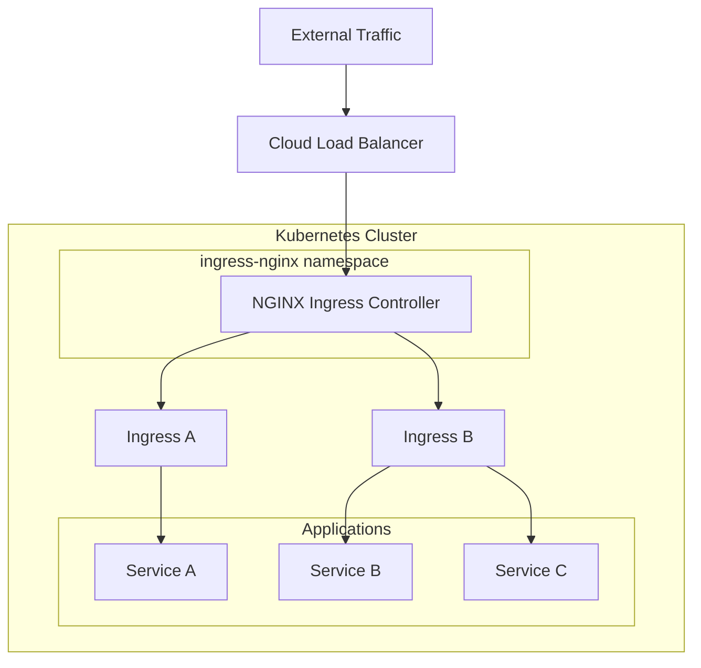

# Deploying NGINX Ingress Controller with Helm

Author: [nawazdhandala](https://www.github.com/nawazdhandala)

Tags: Helm, Kubernetes, DevOps, NGINX, Ingress, Load Balancing

Description: Complete guide to deploying and configuring NGINX Ingress Controller on Kubernetes using Helm for production traffic management.

> NGINX Ingress Controller is the most popular ingress solution for Kubernetes, providing load balancing, SSL termination, and advanced routing. This guide covers installation, configuration, and production best practices using Helm.

## Architecture Overview



## Installation

### Add Repository

```bash
# Add the ingress-nginx repository
helm repo add ingress-nginx https://kubernetes.github.io/ingress-nginx

# Update repositories
helm repo update

# Search for available versions
helm search repo ingress-nginx --versions
```

### Basic Installation

```bash
# Install with default values
helm install ingress-nginx ingress-nginx/ingress-nginx \
  --namespace ingress-nginx \
  --create-namespace
```

### Verify Installation

```bash
# Check pods
kubectl get pods -n ingress-nginx

# Check service
kubectl get svc -n ingress-nginx

# Wait for external IP
kubectl get svc ingress-nginx-controller -n ingress-nginx -w
```

## Production Configuration

### Complete Production Values

```yaml
# ingress-nginx-values.yaml
controller:
  # Replica count for high availability
  replicaCount: 3
  
  # Use Deployment or DaemonSet
  kind: Deployment
  
  # Resource limits
  resources:
    requests:
      cpu: 100m
      memory: 256Mi
    limits:
      cpu: 2000m
      memory: 2Gi
  
  # Autoscaling
  autoscaling:
    enabled: true
    minReplicas: 3
    maxReplicas: 10
    targetCPUUtilizationPercentage: 80
    targetMemoryUtilizationPercentage: 80
  
  # Pod disruption budget
  podDisruptionBudget:
    enabled: true
    minAvailable: 2
  
  # Pod anti-affinity for HA
  affinity:
    podAntiAffinity:
      preferredDuringSchedulingIgnoredDuringExecution:
      - weight: 100
        podAffinityTerm:
          labelSelector:
            matchExpressions:
            - key: app.kubernetes.io/name
              operator: In
              values:
              - ingress-nginx
          topologyKey: kubernetes.io/hostname
  
  # Node selector
  nodeSelector:
    kubernetes.io/os: linux
  
  # Tolerations
  tolerations:
    - key: "node-role.kubernetes.io/control-plane"
      operator: "Exists"
      effect: "NoSchedule"
  
  # Service configuration
  service:
    type: LoadBalancer
    annotations:
      # AWS annotations
      service.beta.kubernetes.io/aws-load-balancer-type: nlb
      service.beta.kubernetes.io/aws-load-balancer-cross-zone-load-balancing-enabled: "true"
      # GCP annotations
      # cloud.google.com/load-balancer-type: "External"
    externalTrafficPolicy: Local
  
  # Metrics for Prometheus
  metrics:
    enabled: true
    serviceMonitor:
      enabled: true
      namespace: monitoring
      additionalLabels:
        release: prometheus
  
  # Config map for NGINX settings
  config:
    # Use forwarded headers
    use-forwarded-headers: "true"
    compute-full-forwarded-for: "true"
    use-proxy-protocol: "false"
    
    # Timeouts
    proxy-connect-timeout: "10"
    proxy-read-timeout: "120"
    proxy-send-timeout: "120"
    
    # Buffer sizes
    proxy-buffer-size: "16k"
    proxy-buffers: "4 16k"
    
    # Client body size
    client-body-buffer-size: "16k"
    client-max-body-size: "100m"
    
    # Keepalive
    keep-alive: "75"
    keep-alive-requests: "1000"
    upstream-keepalive-connections: "100"
    upstream-keepalive-timeout: "60"
    upstream-keepalive-requests: "10000"
    
    # SSL settings
    ssl-protocols: "TLSv1.2 TLSv1.3"
    ssl-ciphers: "ECDHE-ECDSA-AES128-GCM-SHA256:ECDHE-RSA-AES128-GCM-SHA256:ECDHE-ECDSA-AES256-GCM-SHA384:ECDHE-RSA-AES256-GCM-SHA384"
    ssl-prefer-server-ciphers: "true"
    
    # Logging
    log-format-upstream: '$remote_addr - $remote_user [$time_local] "$request" $status $body_bytes_sent "$http_referer" "$http_user_agent" $request_length $request_time [$proxy_upstream_name] [$proxy_alternative_upstream_name] $upstream_addr $upstream_response_length $upstream_response_time $upstream_status $req_id'
    
    # Security headers
    add-headers: "ingress-nginx/custom-headers"
    
    # Enable real IP
    enable-real-ip: "true"
    
    # Rate limiting
    limit-req-status-code: "429"
    limit-conn-status-code: "429"
  
  # Admission webhooks
  admissionWebhooks:
    enabled: true
    failurePolicy: Fail
    
  # Ingress class
  ingressClassResource:
    name: nginx
    enabled: true
    default: true
    controllerValue: "k8s.io/ingress-nginx"

# Default backend for 404 responses
defaultBackend:
  enabled: true
  image:
    repository: registry.k8s.io/defaultbackend-amd64
    tag: "1.5"
  resources:
    requests:
      cpu: 10m
      memory: 20Mi
    limits:
      cpu: 100m
      memory: 64Mi
```

### Install with Production Values

```bash
helm install ingress-nginx ingress-nginx/ingress-nginx \
  --namespace ingress-nginx \
  --create-namespace \
  -f ingress-nginx-values.yaml
```

## Custom Headers ConfigMap

```yaml
# custom-headers-configmap.yaml
apiVersion: v1
kind: ConfigMap
metadata:
  name: custom-headers
  namespace: ingress-nginx
data:
  X-Frame-Options: "SAMEORIGIN"
  X-Content-Type-Options: "nosniff"
  X-XSS-Protection: "1; mode=block"
  Referrer-Policy: "strict-origin-when-cross-origin"
  Permissions-Policy: "geolocation=(), microphone=(), camera=()"
  Content-Security-Policy: "default-src 'self'; script-src 'self' 'unsafe-inline'; style-src 'self' 'unsafe-inline'"
```

## Create Ingress Resources

### Basic Ingress

```yaml
# basic-ingress.yaml
apiVersion: networking.k8s.io/v1
kind: Ingress
metadata:
  name: my-app-ingress
  namespace: my-app
  annotations:
    nginx.ingress.kubernetes.io/rewrite-target: /
spec:
  ingressClassName: nginx
  rules:
    - host: app.example.com
      http:
        paths:
          - path: /
            pathType: Prefix
            backend:
              service:
                name: my-app-service
                port:
                  number: 80
```

### SSL/TLS Ingress

```yaml
# ssl-ingress.yaml
apiVersion: networking.k8s.io/v1
kind: Ingress
metadata:
  name: my-app-ingress
  namespace: my-app
  annotations:
    nginx.ingress.kubernetes.io/ssl-redirect: "true"
    nginx.ingress.kubernetes.io/force-ssl-redirect: "true"
    cert-manager.io/cluster-issuer: letsencrypt-prod
spec:
  ingressClassName: nginx
  tls:
    - hosts:
        - app.example.com
      secretName: app-tls-secret
  rules:
    - host: app.example.com
      http:
        paths:
          - path: /
            pathType: Prefix
            backend:
              service:
                name: my-app-service
                port:
                  number: 80
```

### Path-Based Routing

```yaml
# path-routing-ingress.yaml
apiVersion: networking.k8s.io/v1
kind: Ingress
metadata:
  name: multi-path-ingress
  namespace: default
  annotations:
    nginx.ingress.kubernetes.io/use-regex: "true"
spec:
  ingressClassName: nginx
  rules:
    - host: api.example.com
      http:
        paths:
          - path: /api/v1
            pathType: Prefix
            backend:
              service:
                name: api-v1-service
                port:
                  number: 80
          - path: /api/v2
            pathType: Prefix
            backend:
              service:
                name: api-v2-service
                port:
                  number: 80
          - path: /
            pathType: Prefix
            backend:
              service:
                name: frontend-service
                port:
                  number: 80
```

## Common Annotations

### Rate Limiting

```yaml
apiVersion: networking.k8s.io/v1
kind: Ingress
metadata:
  name: rate-limited-ingress
  annotations:
    # Requests per second
    nginx.ingress.kubernetes.io/limit-rps: "10"
    # Connections per IP
    nginx.ingress.kubernetes.io/limit-connections: "5"
    # Burst size
    nginx.ingress.kubernetes.io/limit-burst-multiplier: "5"
    # Whitelist specific IPs
    nginx.ingress.kubernetes.io/limit-whitelist: "10.0.0.0/8,172.16.0.0/12"
```

### Authentication

```yaml
# Basic auth ingress
apiVersion: networking.k8s.io/v1
kind: Ingress
metadata:
  name: auth-ingress
  annotations:
    nginx.ingress.kubernetes.io/auth-type: basic
    nginx.ingress.kubernetes.io/auth-secret: basic-auth
    nginx.ingress.kubernetes.io/auth-realm: "Authentication Required"
```

Create the auth secret:

```bash
# Create htpasswd file
htpasswd -c auth admin

# Create secret
kubectl create secret generic basic-auth --from-file=auth -n my-namespace
```

### CORS Configuration

```yaml
apiVersion: networking.k8s.io/v1
kind: Ingress
metadata:
  name: cors-ingress
  annotations:
    nginx.ingress.kubernetes.io/enable-cors: "true"
    nginx.ingress.kubernetes.io/cors-allow-origin: "https://example.com, https://app.example.com"
    nginx.ingress.kubernetes.io/cors-allow-methods: "GET, POST, PUT, DELETE, OPTIONS"
    nginx.ingress.kubernetes.io/cors-allow-headers: "DNT,User-Agent,X-Requested-With,If-Modified-Since,Cache-Control,Content-Type,Range,Authorization"
    nginx.ingress.kubernetes.io/cors-expose-headers: "Content-Length,Content-Range"
    nginx.ingress.kubernetes.io/cors-max-age: "86400"
```

### Rewrite Rules

```yaml
apiVersion: networking.k8s.io/v1
kind: Ingress
metadata:
  name: rewrite-ingress
  annotations:
    nginx.ingress.kubernetes.io/rewrite-target: /$2
    nginx.ingress.kubernetes.io/use-regex: "true"
spec:
  rules:
    - host: app.example.com
      http:
        paths:
          # /api/users -> /users
          - path: /api(/|$)(.*)
            pathType: ImplementationSpecific
            backend:
              service:
                name: api-service
                port:
                  number: 80
```

### Proxy Settings

```yaml
apiVersion: networking.k8s.io/v1
kind: Ingress
metadata:
  name: proxy-settings-ingress
  annotations:
    # Timeouts
    nginx.ingress.kubernetes.io/proxy-connect-timeout: "30"
    nginx.ingress.kubernetes.io/proxy-read-timeout: "300"
    nginx.ingress.kubernetes.io/proxy-send-timeout: "300"
    
    # Body size
    nginx.ingress.kubernetes.io/proxy-body-size: "50m"
    
    # Buffer
    nginx.ingress.kubernetes.io/proxy-buffer-size: "16k"
    nginx.ingress.kubernetes.io/proxy-buffers-number: "4"
    
    # Backend protocol
    nginx.ingress.kubernetes.io/backend-protocol: "HTTPS"
```

### WebSocket Support

```yaml
apiVersion: networking.k8s.io/v1
kind: Ingress
metadata:
  name: websocket-ingress
  annotations:
    nginx.ingress.kubernetes.io/proxy-read-timeout: "3600"
    nginx.ingress.kubernetes.io/proxy-send-timeout: "3600"
    nginx.ingress.kubernetes.io/upstream-hash-by: "$remote_addr"
spec:
  rules:
    - host: ws.example.com
      http:
        paths:
          - path: /ws
            pathType: Prefix
            backend:
              service:
                name: websocket-service
                port:
                  number: 8080
```

## Cloud-Specific Configurations

### AWS (NLB)

```yaml
# aws-nlb-values.yaml
controller:
  service:
    type: LoadBalancer
    annotations:
      service.beta.kubernetes.io/aws-load-balancer-type: nlb
      service.beta.kubernetes.io/aws-load-balancer-cross-zone-load-balancing-enabled: "true"
      service.beta.kubernetes.io/aws-load-balancer-backend-protocol: tcp
      service.beta.kubernetes.io/aws-load-balancer-ssl-ports: "443"
      service.beta.kubernetes.io/aws-load-balancer-ssl-cert: arn:aws:acm:region:account:certificate/xxx
```

### GCP

```yaml
# gcp-values.yaml
controller:
  service:
    type: LoadBalancer
    annotations:
      cloud.google.com/load-balancer-type: "External"
      # For internal load balancer
      # cloud.google.com/load-balancer-type: "Internal"
```

### Azure

```yaml
# azure-values.yaml
controller:
  service:
    type: LoadBalancer
    annotations:
      service.beta.kubernetes.io/azure-load-balancer-health-probe-request-path: /healthz
      # For internal load balancer
      # service.beta.kubernetes.io/azure-load-balancer-internal: "true"
```

### Bare Metal (MetalLB)

```yaml
# metallb-values.yaml
controller:
  service:
    type: LoadBalancer
    annotations:
      metallb.universe.tf/address-pool: production
    loadBalancerIP: 192.168.1.100
```

## Monitoring

### Prometheus Metrics

Enable metrics in values:

```yaml
controller:
  metrics:
    enabled: true
    serviceMonitor:
      enabled: true
      namespace: monitoring
      additionalLabels:
        release: prometheus
```

### Grafana Dashboard

Import dashboard ID `9614` for NGINX Ingress metrics.

## Troubleshooting

### Check Controller Logs

```bash
# Get controller logs
kubectl logs -n ingress-nginx -l app.kubernetes.io/name=ingress-nginx

# Follow logs
kubectl logs -n ingress-nginx -l app.kubernetes.io/name=ingress-nginx -f
```

### Verify Ingress Configuration

```bash
# Get ingress NGINX config
kubectl exec -n ingress-nginx deploy/ingress-nginx-controller -- cat /etc/nginx/nginx.conf

# Check specific server block
kubectl exec -n ingress-nginx deploy/ingress-nginx-controller -- cat /etc/nginx/nginx.conf | grep -A 50 "server_name app.example.com"
```

### Debug Ingress

```bash
# Describe ingress
kubectl describe ingress my-ingress -n my-namespace

# Check endpoints
kubectl get endpoints my-service -n my-namespace

# Test from controller
kubectl exec -n ingress-nginx deploy/ingress-nginx-controller -- curl -v http://my-service.my-namespace.svc.cluster.local
```

## Annotations Reference

| Annotation | Description | Default |
|------------|-------------|---------|
| `ssl-redirect` | Force HTTPS | `true` |
| `proxy-body-size` | Max request body | `1m` |
| `proxy-read-timeout` | Backend timeout | `60s` |
| `limit-rps` | Rate limit per second | - |
| `whitelist-source-range` | IP whitelist | - |
| `rewrite-target` | URL rewrite target | - |
| `auth-type` | Auth type (basic) | - |
| `affinity` | Session affinity | - |

## Wrap-up

NGINX Ingress Controller provides robust traffic management for Kubernetes. Configure production values with appropriate replicas, resources, and autoscaling. Use annotations for SSL, rate limiting, authentication, and routing. Enable metrics for monitoring with Prometheus and Grafana. Customize configurations for your cloud provider and use the troubleshooting commands to debug issues.
