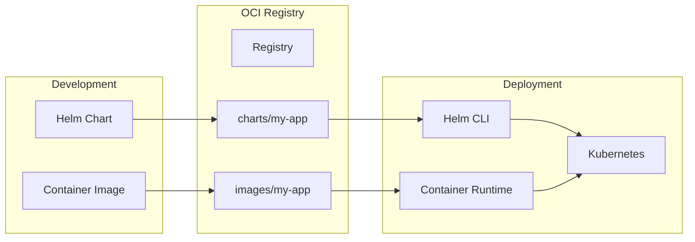

# Working with OCI Registries for Helm Charts

Author: [nawazdhandala](https://www.github.com/nawazdhandala)

Tags: Helm, Kubernetes, DevOps, OCI, Registry, Containers

Description: Learn how to use OCI-compliant registries like Docker Hub, GHCR, ECR, and ACR to store and distribute Helm charts alongside container images.

> Helm 3.8+ supports OCI registries natively, allowing you to store charts in the same registries as your container images. This simplifies infrastructure, unifies authentication, and enables familiar container workflows for chart distribution.

## What is OCI Registry Support?

OCI (Open Container Initiative) defines standards for container images. Helm charts can be stored as OCI artifacts in any OCI-compliant registry, alongside your container images.



## Benefits of OCI for Helm Charts

| Traditional Repository | OCI Registry |
| --- | --- |
| Separate index.yaml to maintain | No index needed |
| Different authentication systems | Unified auth with container images |
| Dedicated chart servers | Use existing registry infrastructure |
| Different tooling | Same tools for images and charts |

## Enable OCI Support

OCI support is enabled by default in Helm 3.8+. Check your version:

```bash
# Check Helm version (need 3.8+)
helm version

# If using older version, set environment variable
export HELM_EXPERIMENTAL_OCI=1
```

## Registry Authentication

### Login to Registry

Use `helm registry login` to authenticate.

```bash
# Docker Hub
helm registry login registry-1.docker.io -u USERNAME

# GitHub Container Registry (GHCR)
helm registry login ghcr.io -u USERNAME

# AWS ECR
aws ecr get-login-password --region us-east-1 | \
  helm registry login --username AWS --password-stdin 123456789.dkr.ecr.us-east-1.amazonaws.com

# Azure Container Registry
az acr login --name myregistry
# Or with token
helm registry login myregistry.azurecr.io -u 00000000-0000-0000-0000-000000000000 -p $(az acr login --name myregistry --expose-token --output tsv --query accessToken)

# Google Artifact Registry
gcloud auth print-access-token | helm registry login -u oauth2accesstoken --password-stdin us-docker.pkg.dev

# Generic with password from stdin
echo $REGISTRY_TOKEN | helm registry login registry.example.com -u USERNAME --password-stdin
```

### Logout from Registry

```bash
helm registry logout ghcr.io
```

## Push Charts to OCI Registry

### Package and Push

First package your chart, then push it to the registry.

```bash
# Package the chart
helm package ./my-chart
# Creates: my-chart-1.0.0.tgz

# Push to registry
helm push my-chart-1.0.0.tgz oci://ghcr.io/myorg/charts

# The chart is now at: oci://ghcr.io/myorg/charts/my-chart:1.0.0
```

### Push with Different Tag

By default, the chart version becomes the tag. You can push with additional tags.

```bash
# Push with version tag (automatic)
helm push my-chart-1.0.0.tgz oci://ghcr.io/myorg/charts
# Creates: oci://ghcr.io/myorg/charts/my-chart:1.0.0

# For additional tags, use registry tools
# Tag as latest using oras or registry API
oras tag ghcr.io/myorg/charts/my-chart:1.0.0 latest
```

## Pull Charts from OCI Registry

### Pull to Local Directory

```bash
# Pull chart archive
helm pull oci://ghcr.io/myorg/charts/my-chart --version 1.0.0

# Pull and extract
helm pull oci://ghcr.io/myorg/charts/my-chart --version 1.0.0 --untar

# Pull to specific directory
helm pull oci://ghcr.io/myorg/charts/my-chart --version 1.0.0 --destination ./charts
```

### Show Chart Information

```bash
# Show chart metadata
helm show chart oci://ghcr.io/myorg/charts/my-chart --version 1.0.0

# Show default values
helm show values oci://ghcr.io/myorg/charts/my-chart --version 1.0.0

# Show all information
helm show all oci://ghcr.io/myorg/charts/my-chart --version 1.0.0
```

## Install from OCI Registry

### Direct Installation

Install directly from OCI reference without adding a repository.

```bash
# Install chart
helm install my-release oci://ghcr.io/myorg/charts/my-chart --version 1.0.0

# Install with values
helm install my-release oci://ghcr.io/myorg/charts/my-chart \
  --version 1.0.0 \
  -f values.yaml

# Install with set values
helm install my-release oci://ghcr.io/myorg/charts/my-chart \
  --version 1.0.0 \
  --set image.tag=latest \
  --set replicaCount=3

# Install in specific namespace
helm install my-release oci://ghcr.io/myorg/charts/my-chart \
  --version 1.0.0 \
  --namespace my-namespace \
  --create-namespace
```

### Upgrade from OCI Registry

```bash
# Upgrade release
helm upgrade my-release oci://ghcr.io/myorg/charts/my-chart \
  --version 1.1.0 \
  -f values.yaml

# Upgrade or install
helm upgrade --install my-release oci://ghcr.io/myorg/charts/my-chart \
  --version 1.1.0
```

### Template from OCI Registry

```bash
# Generate manifests without installing
helm template my-release oci://ghcr.io/myorg/charts/my-chart \
  --version 1.0.0 \
  -f values.yaml
```

## Registry-Specific Guides

### Docker Hub

Docker Hub requires a paid subscription for private repositories.

```bash
# Login to Docker Hub
helm registry login registry-1.docker.io -u USERNAME

# Push chart (creates public repository by default)
helm push my-chart-1.0.0.tgz oci://registry-1.docker.io/myuser

# Install from Docker Hub
helm install my-release oci://registry-1.docker.io/myuser/my-chart --version 1.0.0
```

### GitHub Container Registry (GHCR)

GHCR is free for public packages and included with GitHub plans for private.

```bash
# Create personal access token with write:packages scope
# Login with token
echo $GITHUB_TOKEN | helm registry login ghcr.io -u USERNAME --password-stdin

# Push to GHCR
helm push my-chart-1.0.0.tgz oci://ghcr.io/myorg/charts

# Charts are private by default, make public in GitHub UI if needed

# Install from GHCR
helm install my-release oci://ghcr.io/myorg/charts/my-chart --version 1.0.0
```

### AWS Elastic Container Registry (ECR)

ECR integrates with AWS IAM for authentication.

```bash
# Get ECR login password
aws ecr get-login-password --region us-east-1 | \
  helm registry login --username AWS --password-stdin 123456789.dkr.ecr.us-east-1.amazonaws.com

# Create repository (if needed)
aws ecr create-repository --repository-name charts/my-chart

# Push to ECR
helm push my-chart-1.0.0.tgz oci://123456789.dkr.ecr.us-east-1.amazonaws.com/charts

# Install from ECR
helm install my-release oci://123456789.dkr.ecr.us-east-1.amazonaws.com/charts/my-chart --version 1.0.0
```

### Azure Container Registry (ACR)

ACR supports Helm charts as OCI artifacts.

```bash
# Login with Azure CLI
az acr login --name myregistry

# Push to ACR
helm push my-chart-1.0.0.tgz oci://myregistry.azurecr.io/charts

# Install from ACR
helm install my-release oci://myregistry.azurecr.io/charts/my-chart --version 1.0.0

# List charts in ACR
az acr repository list --name myregistry
az acr manifest list-metadata --registry myregistry --name charts/my-chart
```

### Google Artifact Registry

Google Artifact Registry supports Helm charts natively.

```bash
# Login
gcloud auth print-access-token | \
  helm registry login -u oauth2accesstoken --password-stdin us-docker.pkg.dev

# Create repository (Docker format supports Helm charts)
gcloud artifacts repositories create helm-charts \
  --repository-format=docker \
  --location=us \
  --description="Helm charts"

# Push to Artifact Registry
helm push my-chart-1.0.0.tgz oci://us-docker.pkg.dev/my-project/helm-charts

# Install from Artifact Registry
helm install my-release oci://us-docker.pkg.dev/my-project/helm-charts/my-chart --version 1.0.0
```

### Harbor

Harbor is an open-source registry with enterprise features.

```bash
# Login to Harbor
helm registry login harbor.example.com -u admin

# Push to Harbor
helm push my-chart-1.0.0.tgz oci://harbor.example.com/myproject

# Harbor also supports traditional chart repositories
helm repo add harbor https://harbor.example.com/chartrepo/myproject
```

## CI/CD Integration

### GitHub Actions

Automate chart publishing with GitHub Actions.

```yaml
# .github/workflows/publish-chart.yml
name: Publish Helm Chart

on:
  push:
    tags:
      - 'v*'

jobs:
  publish:
    runs-on: ubuntu-latest
    permissions:
      packages: write
      contents: read
    steps:
      - uses: actions/checkout@v4
      
      - name: Set up Helm
        uses: azure/setup-helm@v3
        
      - name: Extract version from tag
        id: version
        run: echo "version=${GITHUB_REF#refs/tags/v}" >> $GITHUB_OUTPUT
        
      - name: Update Chart version
        run: |
          sed -i "s/^version:.*/version: ${{ steps.version.outputs.version }}/" charts/my-chart/Chart.yaml
          
      - name: Package chart
        run: helm package charts/my-chart
        
      - name: Login to GHCR
        run: echo "${{ secrets.GITHUB_TOKEN }}" | helm registry login ghcr.io -u ${{ github.actor }} --password-stdin
        
      - name: Push chart
        run: helm push my-chart-${{ steps.version.outputs.version }}.tgz oci://ghcr.io/${{ github.repository_owner }}/charts
```

### GitLab CI

```yaml
# .gitlab-ci.yml
stages:
  - build
  - publish

variables:
  CHART_NAME: my-chart

package:
  stage: build
  image: alpine/helm:latest
  script:
    - helm package charts/${CHART_NAME}
  artifacts:
    paths:
      - "*.tgz"

publish:
  stage: publish
  image: alpine/helm:latest
  dependencies:
    - package
  before_script:
    - echo "${CI_REGISTRY_PASSWORD}" | helm registry login -u ${CI_REGISTRY_USER} --password-stdin ${CI_REGISTRY}
  script:
    - helm push ${CHART_NAME}-*.tgz oci://${CI_REGISTRY}/${CI_PROJECT_NAMESPACE}/charts
  only:
    - tags
```

### Jenkins Pipeline

```groovy
// Jenkinsfile
pipeline {
    agent any
    
    environment {
        REGISTRY = 'ghcr.io/myorg'
    }
    
    stages {
        stage('Package') {
            steps {
                sh 'helm package ./charts/my-chart'
            }
        }
        
        stage('Publish') {
            when {
                tag pattern: "v\\d+\\.\\d+\\.\\d+", comparator: "REGEXP"
            }
            steps {
                withCredentials([string(credentialsId: 'ghcr-token', variable: 'TOKEN')]) {
                    sh '''
                        echo $TOKEN | helm registry login ghcr.io -u jenkins --password-stdin
                        helm push my-chart-*.tgz oci://${REGISTRY}/charts
                    '''
                }
            }
        }
    }
}
```

## Dependencies with OCI

Use OCI charts as dependencies in your Chart.yaml.

```yaml
# Chart.yaml
apiVersion: v2
name: my-app
version: 1.0.0

dependencies:
  - name: redis
    version: 18.0.0
    repository: oci://registry-1.docker.io/bitnamicharts
  
  - name: my-library
    version: 2.0.0
    repository: oci://ghcr.io/myorg/charts
```

Update dependencies:

```bash
# Download OCI dependencies
helm dependency update ./my-app

# Build with dependencies
helm dependency build ./my-app
```

## ArgoCD with OCI Charts

Configure ArgoCD to use OCI charts.

```yaml
# ArgoCD Application
apiVersion: argoproj.io/v1alpha1
kind: Application
metadata:
  name: my-app
  namespace: argocd
spec:
  source:
    # OCI chart reference
    repoURL: ghcr.io/myorg/charts
    chart: my-chart
    targetRevision: 1.0.0
    helm:
      values: |
        replicaCount: 3
  destination:
    server: https://kubernetes.default.svc
    namespace: my-app
  syncPolicy:
    automated:
      prune: true
      selfHeal: true
```

Configure registry credentials in ArgoCD:

```yaml
# Secret for OCI registry
apiVersion: v1
kind: Secret
metadata:
  name: ghcr-creds
  namespace: argocd
  labels:
    argocd.argoproj.io/secret-type: repository
type: Opaque
stringData:
  url: ghcr.io/myorg/charts
  username: argocd
  password: ghp_xxxxxxxxxxxx
  type: helm
  enableOCI: "true"
```

## Best Practices

| Practice | Why |
| --- | --- |
| Use semantic versioning | Clear upgrade paths |
| Never overwrite tags | Reproducibility |
| Use digest references in production | Immutable deployments |
| Automate publishing in CI/CD | Consistency |
| Sign charts with Cosign | Supply chain security |
| Store charts near images | Simplified infrastructure |

## Sign Charts with Cosign

Add provenance to your charts using Sigstore's Cosign.

```bash
# Install cosign
brew install cosign

# Generate key pair (or use keyless)
cosign generate-key-pair

# Sign chart after pushing
cosign sign ghcr.io/myorg/charts/my-chart:1.0.0

# Verify signature
cosign verify ghcr.io/myorg/charts/my-chart:1.0.0
```

## Troubleshooting

### Common Issues

```bash
# Error: unauthorized
# Solution: Check login credentials
helm registry login ghcr.io -u USERNAME

# Error: manifest unknown
# Solution: Verify chart exists and version is correct
helm show chart oci://ghcr.io/myorg/charts/my-chart --version 1.0.0

# Error: OCI not enabled
# Solution: Upgrade Helm to 3.8+ or set environment variable
export HELM_EXPERIMENTAL_OCI=1

# Debug with verbose output
helm install my-release oci://ghcr.io/myorg/charts/my-chart --version 1.0.0 --debug
```

## Wrap-up

OCI registry support in Helm 3.8+ unifies chart and image distribution, leveraging existing container registry infrastructure. Push charts with `helm push`, install directly with `helm install` using OCI references, and use the same authentication mechanisms as container images. This approach simplifies DevOps workflows, reduces infrastructure complexity, and enables consistent artifact management across your organization.
