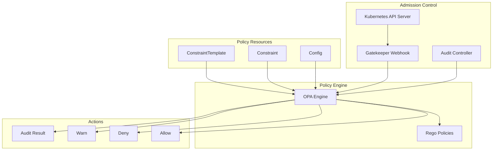

# Policy Enforcement with Helm and OPA Gatekeeper

Author: [nawazdhandala](https://www.github.com/nawazdhandala)

Tags: Helm, Kubernetes, DevOps, Security, OPA, Gatekeeper, Policy, Compliance

Description: Complete guide to deploying OPA Gatekeeper with Helm for Kubernetes policy enforcement and compliance automation.

> OPA Gatekeeper provides policy-as-code for Kubernetes, enabling automated enforcement of security policies, best practices, and compliance requirements. This guide covers deploying Gatekeeper with Helm and creating custom policies.

## Gatekeeper Architecture



## Installing Gatekeeper

### Add Helm Repository

```bash
# Add Gatekeeper Helm repository
helm repo add gatekeeper https://open-policy-agent.github.io/gatekeeper/charts
helm repo update

# Create namespace
kubectl create namespace gatekeeper-system
```

### Basic Installation

```bash
helm install gatekeeper gatekeeper/gatekeeper \
  --namespace gatekeeper-system \
  --wait
```

### Production Configuration

```yaml
# gatekeeper-values.yaml
# Replicas for high availability
replicas: 3
auditInterval: 60

# Audit configuration
audit:
  replicas: 1
  resources:
    limits:
      cpu: 1000m
      memory: 512Mi
    requests:
      cpu: 100m
      memory: 256Mi

# Controller manager
controllerManager:
  resources:
    limits:
      cpu: 1000m
      memory: 512Mi
    requests:
      cpu: 100m
      memory: 256Mi
      
  affinity:
    podAntiAffinity:
      preferredDuringSchedulingIgnoredDuringExecution:
        - weight: 100
          podAffinityTerm:
            labelSelector:
              matchExpressions:
                - key: control-plane
                  operator: In
                  values:
                    - controller-manager
            topologyKey: kubernetes.io/hostname

# Webhook configuration
webhookConfigurationPriorityClassName: system-cluster-critical
podSecurityContext:
  fsGroup: 1000

# Exemptions
exemptNamespaces:
  - kube-system
  - kube-public
  - kube-node-lease
  - gatekeeper-system

exemptNamespacePrefixes:
  - "kube-"

# Mutation support
mutatingWebhook:
  enabled: true
  
# External data provider
externalData:
  enabled: false

# Logging
logLevel: INFO
logDenies: true
logMutations: true

# Emit events
emitAdmissionEvents: true
emitAuditEvents: true

# Validation webhook
validatingWebhookFailurePolicy: Fail
validatingWebhookTimeout: 5
validatingWebhookAnnotations: {}

# Metrics
metricsBackend: prometheus
```

```bash
# Install with production values
helm install gatekeeper gatekeeper/gatekeeper \
  --namespace gatekeeper-system \
  -f gatekeeper-values.yaml
```

## ConstraintTemplates

### Require Labels

```yaml
# require-labels-template.yaml
apiVersion: templates.gatekeeper.sh/v1
kind: ConstraintTemplate
metadata:
  name: k8srequiredlabels
  annotations:
    metadata.gatekeeper.sh/title: "Required Labels"
    description: "Requires resources to contain specified labels"
spec:
  crd:
    spec:
      names:
        kind: K8sRequiredLabels
      validation:
        openAPIV3Schema:
          type: object
          properties:
            message:
              type: string
            labels:
              type: array
              items:
                type: object
                properties:
                  key:
                    type: string
                  allowedRegex:
                    type: string
                    
  targets:
    - target: admission.k8s.gatekeeper.sh
      rego: |
        package k8srequiredlabels
        
        get_message(parameters, _default) = msg {
          not parameters.message
          msg := _default
        }
        
        get_message(parameters, _) = msg {
          msg := parameters.message
        }
        
        violation[{"msg": msg, "details": {"missing_labels": missing}}] {
          provided := {label | input.review.object.metadata.labels[label]}
          required := {label | label := input.parameters.labels[_].key}
          missing := required - provided
          count(missing) > 0
          def_msg := sprintf("Missing required labels: %v", [missing])
          msg := get_message(input.parameters, def_msg)
        }
        
        violation[{"msg": msg}] {
          value := input.review.object.metadata.labels[key]
          expected := input.parameters.labels[_]
          expected.key == key
          expected.allowedRegex != ""
          not re_match(expected.allowedRegex, value)
          def_msg := sprintf("Label <%v: %v> does not match regex: %v", [key, value, expected.allowedRegex])
          msg := get_message(input.parameters, def_msg)
        }
```

### Container Limits

```yaml
# container-limits-template.yaml
apiVersion: templates.gatekeeper.sh/v1
kind: ConstraintTemplate
metadata:
  name: k8scontainerlimits
  annotations:
    metadata.gatekeeper.sh/title: "Container Limits"
    description: "Requires containers to have resource limits"
spec:
  crd:
    spec:
      names:
        kind: K8sContainerLimits
      validation:
        openAPIV3Schema:
          type: object
          properties:
            cpu:
              type: string
            memory:
              type: string
            exemptImages:
              type: array
              items:
                type: string
                
  targets:
    - target: admission.k8s.gatekeeper.sh
      rego: |
        package k8scontainerlimits
        
        missing(obj, field) = true {
          not obj[field]
        }
        
        missing(obj, field) = true {
          obj[field] == ""
        }
        
        is_exempt(container) {
          exempt_images := object.get(input.parameters, "exemptImages", [])
          img := container.image
          exemption := exempt_images[_]
          glob.match(exemption, [], img)
        }
        
        violation[{"msg": msg}] {
          container := input.review.object.spec.containers[_]
          not is_exempt(container)
          missing(container.resources.limits, "cpu")
          msg := sprintf("Container <%v> does not have CPU limit", [container.name])
        }
        
        violation[{"msg": msg}] {
          container := input.review.object.spec.containers[_]
          not is_exempt(container)
          missing(container.resources.limits, "memory")
          msg := sprintf("Container <%v> does not have memory limit", [container.name])
        }
```

### Allowed Repositories

```yaml
# allowed-repos-template.yaml
apiVersion: templates.gatekeeper.sh/v1
kind: ConstraintTemplate
metadata:
  name: k8sallowedrepos
  annotations:
    metadata.gatekeeper.sh/title: "Allowed Repositories"
    description: "Requires container images to begin with allowed prefixes"
spec:
  crd:
    spec:
      names:
        kind: K8sAllowedRepos
      validation:
        openAPIV3Schema:
          type: object
          properties:
            repos:
              type: array
              items:
                type: string
                
  targets:
    - target: admission.k8s.gatekeeper.sh
      rego: |
        package k8sallowedrepos
        
        violation[{"msg": msg}] {
          container := input.review.object.spec.containers[_]
          satisfied := [good | repo = input.parameters.repos[_] ; good = startswith(container.image, repo)]
          not any(satisfied)
          msg := sprintf("Container <%v> uses image <%v> from disallowed repository", [container.name, container.image])
        }
        
        violation[{"msg": msg}] {
          container := input.review.object.spec.initContainers[_]
          satisfied := [good | repo = input.parameters.repos[_] ; good = startswith(container.image, repo)]
          not any(satisfied)
          msg := sprintf("InitContainer <%v> uses image <%v> from disallowed repository", [container.name, container.image])
        }
```

### Block Privileged Containers

```yaml
# block-privileged-template.yaml
apiVersion: templates.gatekeeper.sh/v1
kind: ConstraintTemplate
metadata:
  name: k8sblockprivileged
  annotations:
    metadata.gatekeeper.sh/title: "Block Privileged Containers"
    description: "Blocks privileged containers"
spec:
  crd:
    spec:
      names:
        kind: K8sBlockPrivileged
      validation:
        openAPIV3Schema:
          type: object
          properties:
            exemptImages:
              type: array
              items:
                type: string
                
  targets:
    - target: admission.k8s.gatekeeper.sh
      rego: |
        package k8sblockprivileged
        
        is_exempt(container) {
          exempt_images := object.get(input.parameters, "exemptImages", [])
          img := container.image
          exemption := exempt_images[_]
          glob.match(exemption, [], img)
        }
        
        violation[{"msg": msg}] {
          c := input.review.object.spec.containers[_]
          not is_exempt(c)
          c.securityContext.privileged == true
          msg := sprintf("Privileged container not allowed: <%v>", [c.name])
        }
        
        violation[{"msg": msg}] {
          c := input.review.object.spec.initContainers[_]
          not is_exempt(c)
          c.securityContext.privileged == true
          msg := sprintf("Privileged initContainer not allowed: <%v>", [c.name])
        }
```

### Require Probes

```yaml
# require-probes-template.yaml
apiVersion: templates.gatekeeper.sh/v1
kind: ConstraintTemplate
metadata:
  name: k8srequireprobes
  annotations:
    metadata.gatekeeper.sh/title: "Require Probes"
    description: "Requires containers to define probes"
spec:
  crd:
    spec:
      names:
        kind: K8sRequireProbes
      validation:
        openAPIV3Schema:
          type: object
          properties:
            probes:
              type: array
              items:
                type: string
            exemptImages:
              type: array
              items:
                type: string
                
  targets:
    - target: admission.k8s.gatekeeper.sh
      rego: |
        package k8srequireprobes
        
        is_exempt(container) {
          exempt_images := object.get(input.parameters, "exemptImages", [])
          img := container.image
          exemption := exempt_images[_]
          glob.match(exemption, [], img)
        }
        
        probe_type_set = probe_types {
          probe_types := {type | type := input.parameters.probes[_]}
        }
        
        violation[{"msg": msg}] {
          container := input.review.object.spec.containers[_]
          not is_exempt(container)
          probe_type_set["readinessProbe"]
          not container.readinessProbe
          msg := sprintf("Container <%v> missing readinessProbe", [container.name])
        }
        
        violation[{"msg": msg}] {
          container := input.review.object.spec.containers[_]
          not is_exempt(container)
          probe_type_set["livenessProbe"]
          not container.livenessProbe
          msg := sprintf("Container <%v> missing livenessProbe", [container.name])
        }
```

## Constraints

### Apply Constraints

```yaml
# require-labels-constraint.yaml
apiVersion: constraints.gatekeeper.sh/v1beta1
kind: K8sRequiredLabels
metadata:
  name: require-owner-labels
spec:
  enforcementAction: deny  # deny, warn, or dryrun
  match:
    kinds:
      - apiGroups: [""]
        kinds: ["Namespace"]
      - apiGroups: ["apps"]
        kinds: ["Deployment", "StatefulSet", "DaemonSet"]
    excludedNamespaces:
      - kube-system
      - kube-public
      - gatekeeper-system
  parameters:
    message: "All resources must have 'owner' and 'environment' labels"
    labels:
      - key: owner
        allowedRegex: "^[a-z0-9-]+$"
      - key: environment
        allowedRegex: "^(dev|staging|production)$"

---
# container-limits-constraint.yaml
apiVersion: constraints.gatekeeper.sh/v1beta1
kind: K8sContainerLimits
metadata:
  name: require-container-limits
spec:
  enforcementAction: deny
  match:
    kinds:
      - apiGroups: [""]
        kinds: ["Pod"]
      - apiGroups: ["apps"]
        kinds: ["Deployment", "StatefulSet", "DaemonSet"]
    excludedNamespaces:
      - kube-system
  parameters:
    exemptImages:
      - "k8s.gcr.io/*"
      - "gcr.io/google-containers/*"

---
# allowed-repos-constraint.yaml
apiVersion: constraints.gatekeeper.sh/v1beta1
kind: K8sAllowedRepos
metadata:
  name: allowed-image-repos
spec:
  enforcementAction: deny
  match:
    kinds:
      - apiGroups: [""]
        kinds: ["Pod"]
    excludedNamespaces:
      - kube-system
  parameters:
    repos:
      - "gcr.io/myorg/"
      - "ghcr.io/myorg/"
      - "docker.io/myorg/"

---
# block-privileged-constraint.yaml
apiVersion: constraints.gatekeeper.sh/v1beta1
kind: K8sBlockPrivileged
metadata:
  name: block-privileged-containers
spec:
  enforcementAction: deny
  match:
    kinds:
      - apiGroups: [""]
        kinds: ["Pod"]
    excludedNamespaces:
      - kube-system
  parameters:
    exemptImages:
      - "gcr.io/google-containers/*"
```

## Helm Chart for Policies

### Chart Structure

```
gatekeeper-policies/
├── Chart.yaml
├── values.yaml
├── templates/
│   ├── _helpers.tpl
│   ├── constrainttemplates/
│   │   ├── require-labels.yaml
│   │   ├── container-limits.yaml
│   │   └── allowed-repos.yaml
│   └── constraints/
│       ├── require-labels.yaml
│       ├── container-limits.yaml
│       └── allowed-repos.yaml
```

### values.yaml

```yaml
# values.yaml
policies:
  requireLabels:
    enabled: true
    enforcementAction: deny
    labels:
      - key: owner
        allowedRegex: "^[a-z0-9-]+$"
      - key: environment
        allowedRegex: "^(dev|staging|production)$"
    excludedNamespaces:
      - kube-system
      - kube-public
      
  containerLimits:
    enabled: true
    enforcementAction: deny
    exemptImages:
      - "k8s.gcr.io/*"
      
  allowedRepos:
    enabled: true
    enforcementAction: deny
    repos:
      - "gcr.io/myorg/"
      - "ghcr.io/myorg/"
      
  blockPrivileged:
    enabled: true
    enforcementAction: deny
```

### Template Files

```yaml
# templates/constrainttemplates/require-labels.yaml
{{- if .Values.policies.requireLabels.enabled }}
apiVersion: templates.gatekeeper.sh/v1
kind: ConstraintTemplate
metadata:
  name: k8srequiredlabels
spec:
  crd:
    spec:
      names:
        kind: K8sRequiredLabels
      validation:
        openAPIV3Schema:
          type: object
          properties:
            labels:
              type: array
              items:
                type: object
                properties:
                  key:
                    type: string
                  allowedRegex:
                    type: string
  targets:
    - target: admission.k8s.gatekeeper.sh
      rego: |
        package k8srequiredlabels
        
        violation[{"msg": msg, "details": {"missing_labels": missing}}] {
          provided := {label | input.review.object.metadata.labels[label]}
          required := {label | label := input.parameters.labels[_].key}
          missing := required - provided
          count(missing) > 0
          msg := sprintf("Missing required labels: %v", [missing])
        }
{{- end }}
```

```yaml
# templates/constraints/require-labels.yaml
{{- if .Values.policies.requireLabels.enabled }}
apiVersion: constraints.gatekeeper.sh/v1beta1
kind: K8sRequiredLabels
metadata:
  name: require-labels
spec:
  enforcementAction: {{ .Values.policies.requireLabels.enforcementAction }}
  match:
    kinds:
      - apiGroups: ["apps"]
        kinds: ["Deployment", "StatefulSet"]
    excludedNamespaces:
      {{- toYaml .Values.policies.requireLabels.excludedNamespaces | nindent 6 }}
  parameters:
    labels:
      {{- toYaml .Values.policies.requireLabels.labels | nindent 6 }}
{{- end }}
```

## Monitoring

### ServiceMonitor

```yaml
# gatekeeper-servicemonitor.yaml
apiVersion: monitoring.coreos.com/v1
kind: ServiceMonitor
metadata:
  name: gatekeeper
  namespace: monitoring
spec:
  selector:
    matchLabels:
      gatekeeper.sh/system: "yes"
  namespaceSelector:
    matchNames:
      - gatekeeper-system
  endpoints:
    - port: metrics
      interval: 30s
```

### Alerts

```yaml
# gatekeeper-alerts.yaml
apiVersion: monitoring.coreos.com/v1
kind: PrometheusRule
metadata:
  name: gatekeeper-alerts
  namespace: monitoring
spec:
  groups:
    - name: gatekeeper
      rules:
        - alert: GatekeeperWebhookErrors
          expr: |
            sum(rate(gatekeeper_controller_webhook_request_errors_total[5m])) > 0
          for: 5m
          labels:
            severity: warning
          annotations:
            summary: Gatekeeper webhook errors detected
            
        - alert: GatekeeperConstraintViolations
          expr: |
            sum(gatekeeper_violations) > 0
          for: 5m
          labels:
            severity: warning
          annotations:
            summary: Policy violations detected
            description: "{{ $value }} policy violations exist"
            
        - alert: GatekeeperControllerDown
          expr: |
            absent(up{job="gatekeeper"})
          for: 5m
          labels:
            severity: critical
          annotations:
            summary: Gatekeeper controller is down
```

## Troubleshooting

```bash
# Check Gatekeeper status
kubectl get pods -n gatekeeper-system

# List ConstraintTemplates
kubectl get constrainttemplates

# List Constraints
kubectl get constraints

# Check constraint status
kubectl describe k8srequiredlabels require-owner-labels

# View violations
kubectl get k8srequiredlabels require-owner-labels -o yaml

# Check audit logs
kubectl logs -n gatekeeper-system -l control-plane=audit-controller

# Test policy in dry-run mode
kubectl apply -f deployment.yaml --dry-run=server

# Debug webhook
kubectl logs -n gatekeeper-system -l control-plane=controller-manager

# Check constraint template status
kubectl describe constrainttemplate k8srequiredlabels
```

## Best Practices

| Practice | Recommendation |
|----------|----------------|
| **Start with warn** | Use `enforcementAction: warn` before `deny` |
| **Dry run first** | Test policies in `dryrun` mode |
| **Exempt system namespaces** | Always exclude kube-system |
| **Use audit** | Enable audit to find existing violations |
| **Version templates** | Store ConstraintTemplates in version control |
| **Test policies** | Write unit tests for Rego policies |
| **Monitor violations** | Alert on policy violations |

## Wrap-up

OPA Gatekeeper provides powerful policy enforcement for Kubernetes clusters. Use Helm to deploy Gatekeeper with production settings, create ConstraintTemplates for your policies, and apply Constraints to enforce compliance. Start with warning mode and monitor violations before enforcing deny rules in production.
