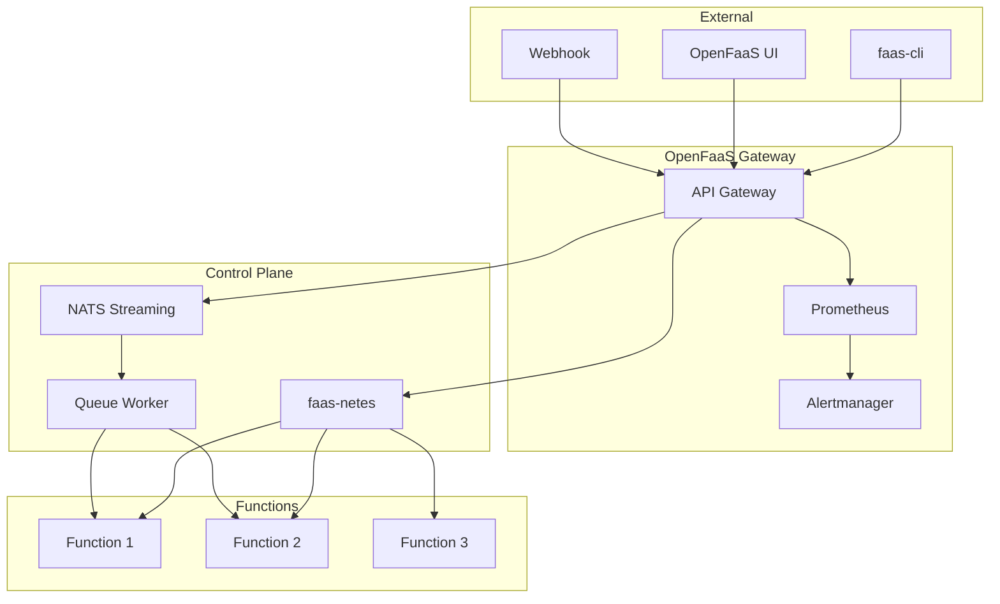

# Deploying OpenFaaS Serverless Functions with Helm

Author: [nawazdhandala](https://www.github.com/nawazdhandala)

Tags: Helm, Kubernetes, DevOps, OpenFaaS, Serverless, Functions, FaaS

Description: Complete guide to deploying OpenFaaS (Functions as a Service) on Kubernetes using Helm charts for building and running serverless functions.

> OpenFaaS makes it easy to deploy event-driven functions and microservices to Kubernetes without repetitive boilerplate coding. This guide covers deploying OpenFaaS using Helm charts with production configurations.

## OpenFaaS Architecture



## Prerequisites

```bash
# Check Kubernetes version
kubectl version

# Add OpenFaaS Helm repository
helm repo add openfaas https://openfaas.github.io/faas-netes/
helm repo update

# Search available versions
helm search repo openfaas --versions

# Install faas-cli
curl -sSL https://cli.openfaas.com | sudo sh
```

## Installation

### Create Namespaces

```bash
# Create namespaces
kubectl apply -f https://raw.githubusercontent.com/openfaas/faas-netes/master/namespaces.yml

# Or manually
kubectl create namespace openfaas
kubectl create namespace openfaas-fn
```

### Generate Credentials

```bash
# Generate a random password
PASSWORD=$(head -c 12 /dev/urandom | shasum| cut -d' ' -f1)

# Create secret
kubectl -n openfaas create secret generic basic-auth \
  --from-literal=basic-auth-user=admin \
  --from-literal=basic-auth-password="$PASSWORD"

# Save password
echo $PASSWORD > ~/openfaas-password.txt
```

### Install OpenFaaS

```yaml
# openfaas-values.yaml
functionNamespace: openfaas-fn
generateBasicAuth: false

# Gateway configuration
gateway:
  replicas: 2
  
  resources:
    requests:
      cpu: 50m
      memory: 120Mi
    limits:
      cpu: 500m
      memory: 256Mi
      
  readTimeout: 65s
  writeTimeout: 65s
  upstreamTimeout: 60s
  
  # Direct invocation (skip NATS queue)
  directFunctions: false
  
  # Scale from zero
  scaleFromZero: true

# faas-netes (Kubernetes provider)
faasnetes:
  replicas: 1
  
  resources:
    requests:
      cpu: 50m
      memory: 64Mi
    limits:
      cpu: 200m
      memory: 128Mi
      
  # Image pull policy for functions
  imagePullPolicy: "Always"

# Async invocations with NATS
nats:
  enabled: true
  
  resources:
    requests:
      cpu: 25m
      memory: 64Mi
    limits:
      cpu: 100m
      memory: 128Mi

queueWorker:
  replicas: 1
  
  resources:
    requests:
      cpu: 50m
      memory: 64Mi
    limits:
      cpu: 200m
      memory: 128Mi
      
  maxInflight: 1
  ackWait: "60s"

# Prometheus
prometheus:
  create: true
  
  resources:
    requests:
      cpu: 50m
      memory: 256Mi
    limits:
      cpu: 500m
      memory: 512Mi
      
  retention: "15d"

# Alertmanager
alertmanager:
  create: true
  
  resources:
    requests:
      cpu: 25m
      memory: 32Mi
    limits:
      cpu: 100m
      memory: 64Mi

# Basic auth
basic_auth: true

# Ingress
ingress:
  enabled: true
  annotations:
    kubernetes.io/ingress.class: nginx
    cert-manager.io/cluster-issuer: letsencrypt-prod
  hosts:
    - host: openfaas.example.com
      serviceName: gateway
      servicePort: 8080
      path: /
  tls:
    - secretName: openfaas-tls
      hosts:
        - openfaas.example.com

# Autoscaler (built-in)
autoscaler:
  enabled: true
  replicas: 1

# Function builder
operator:
  create: false
```

```bash
helm install openfaas openfaas/openfaas \
  --namespace openfaas \
  -f openfaas-values.yaml
```

### Verify Installation

```bash
# Check pods
kubectl get pods -n openfaas

# Get gateway URL
kubectl get svc -n openfaas gateway-external -o wide

# Login with faas-cli
export OPENFAAS_URL=https://openfaas.example.com
cat ~/openfaas-password.txt | faas-cli login --password-stdin

# Check version
faas-cli version
```

## OpenFaaS Pro (Enterprise)

```yaml
# openfaas-pro-values.yaml
openfaasPro: true

operator:
  create: true

# Event connector
eventSubscription:
  metering:
    enabled: true

# SSO with OIDC
oidcAuthPlugin:
  enabled: true
  provider: "https://accounts.google.com"
  clientId: "your-client-id"
  clientSecret: "your-client-secret"

# Kafka connector
kafkaConnector:
  enabled: true
  brokers: "kafka.kafka.svc.cluster.local:9092"
  topics: "events"

# SNS connector
snsConnector:
  enabled: true
  arn: "arn:aws:sns:us-east-1:123456789:events"

# Dashboard
dashboard:
  enabled: true
  publicURL: "https://dashboard.example.com"
```

## Deploy Functions

### Using faas-cli

```bash
# Pull templates
faas-cli template pull

# List available templates
faas-cli template store list

# Create new function
faas-cli new hello-world --lang python3

# Build function
faas-cli build -f hello-world.yml

# Push to registry
faas-cli push -f hello-world.yml

# Deploy function
faas-cli deploy -f hello-world.yml

# Or build, push, and deploy in one command
faas-cli up -f hello-world.yml
```

### Function YAML

```yaml
# hello-world.yml
version: 1.0
provider:
  name: openfaas
  gateway: https://openfaas.example.com

functions:
  hello-world:
    lang: python3
    handler: ./hello-world
    image: registry.example.com/hello-world:latest
    
    # Scaling
    labels:
      com.openfaas.scale.min: "1"
      com.openfaas.scale.max: "10"
      com.openfaas.scale.factor: "20"
      com.openfaas.scale.zero: "true"
      com.openfaas.scale.zero-duration: "15m"
      
    # Timeouts
    environment:
      read_timeout: "60s"
      write_timeout: "60s"
      exec_timeout: "60s"
      
    # Secrets
    secrets:
      - api-key
      
    # Constraints
    constraints:
      - "node.platform.os == linux"
      
    # Resources
    requests:
      cpu: 50m
      memory: 64Mi
    limits:
      cpu: 200m
      memory: 128Mi
```

### Python Function Example

```python
# hello-world/handler.py
import json

def handle(req):
    """
    Handle a request to the function
    Args:
        req (str): request body
    """
    try:
        data = json.loads(req)
        name = data.get('name', 'World')
    except:
        name = req if req else 'World'
    
    return json.dumps({
        'message': f'Hello, {name}!',
        'status': 'success'
    })
```

### Go Function Example

```go
// hello-go/handler.go
package function

import (
    "encoding/json"
    "fmt"
)

type Request struct {
    Name string `json:"name"`
}

type Response struct {
    Message string `json:"message"`
    Status  string `json:"status"`
}

// Handle a function invocation
func Handle(req []byte) string {
    var r Request
    
    if err := json.Unmarshal(req, &r); err != nil {
        r.Name = "World"
    }
    
    if r.Name == "" {
        r.Name = "World"
    }
    
    response := Response{
        Message: fmt.Sprintf("Hello, %s!", r.Name),
        Status:  "success",
    }
    
    output, _ := json.Marshal(response)
    return string(output)
}
```

### Node.js Function Example

```javascript
// hello-node/handler.js
'use strict'

module.exports = async (event, context) => {
  const body = event.body;
  let name = 'World';
  
  try {
    const data = JSON.parse(body);
    name = data.name || 'World';
  } catch (e) {
    name = body || 'World';
  }
  
  return context
    .status(200)
    .succeed({
      message: `Hello, ${name}!`,
      status: 'success'
    });
}
```

## Function Configuration

### Environment Variables

```yaml
functions:
  my-function:
    environment:
      # Custom environment
      DB_HOST: postgres.default.svc.cluster.local
      DB_PORT: "5432"
      
      # OpenFaaS runtime settings
      read_timeout: "120s"
      write_timeout: "120s"
      exec_timeout: "120s"
      write_debug: "true"
      
      # Watchdog mode
      mode: "http"  # http, streaming, serializing
```

### Secrets

```bash
# Create secret
faas-cli secret create api-key --from-literal="my-secret-key"

# Or from file
faas-cli secret create db-password --from-file=./password.txt

# Check secrets
faas-cli secret list
```

```yaml
# Reference in function
functions:
  my-function:
    secrets:
      - api-key
      - db-password
```

```python
# Access in function
def handle(req):
    # Secrets are mounted at /var/openfaas/secrets/
    with open('/var/openfaas/secrets/api-key', 'r') as f:
        api_key = f.read().strip()
    return f"API Key length: {len(api_key)}"
```

### Scaling Configuration

```yaml
functions:
  my-function:
    labels:
      # Minimum replicas
      com.openfaas.scale.min: "2"
      
      # Maximum replicas
      com.openfaas.scale.max: "20"
      
      # Scaling factor (% of max replicas to add/remove)
      com.openfaas.scale.factor: "25"
      
      # Scale to zero
      com.openfaas.scale.zero: "true"
      
      # Time before scaling to zero
      com.openfaas.scale.zero-duration: "30m"
      
      # Target load per replica
      com.openfaas.scale.target: "50"
      
      # Scaling type (rps, cpu, capacity)
      com.openfaas.scale.type: "rps"
```

## Async Invocations

### Async Call

```bash
# Invoke async (returns immediately with call-id)
curl -X POST https://openfaas.example.com/async-function/my-function \
  -H "Content-Type: application/json" \
  -H "X-Callback-Url: https://webhook.example.com/callback" \
  -d '{"data": "async processing"}'
```

### Queue Worker Configuration

```yaml
# openfaas-values.yaml
queueWorker:
  replicas: 3
  maxInflight: 5
  ackWait: "120s"
  
  # Retry configuration
  maxRetry: 3
  initialRetryDelay: "5s"
  maxRetryDelay: "300s"
```

## Helm Chart for Functions

### Custom Chart Structure

```
openfaas-functions/
├── Chart.yaml
├── values.yaml
└── templates/
    ├── functions.yaml
    └── secrets.yaml
```

### Values

```yaml
# values.yaml
gateway: https://openfaas.example.com
namespace: openfaas-fn

registry: registry.example.com

functions:
  - name: api-handler
    lang: python3
    image: api-handler
    tag: "1.0.0"
    scaling:
      min: 2
      max: 20
      factor: 25
      zeroScale: false
    resources:
      requests:
        cpu: 100m
        memory: 128Mi
      limits:
        cpu: 500m
        memory: 256Mi
    environment:
      LOG_LEVEL: info
    secrets:
      - api-key
      
  - name: event-processor
    lang: go
    image: event-processor
    tag: "1.0.0"
    scaling:
      min: 0
      max: 50
      zeroScale: true
      zeroDuration: "15m"
    async: true
```

### Function Template

```yaml
# templates/functions.yaml
{{- range .Values.functions }}
---
apiVersion: openfaas.com/v1
kind: Function
metadata:
  name: {{ .name }}
  namespace: {{ $.Values.namespace }}
spec:
  name: {{ .name }}
  image: {{ $.Values.registry }}/{{ .image }}:{{ .tag }}
  
  labels:
    com.openfaas.scale.min: {{ .scaling.min | quote }}
    com.openfaas.scale.max: {{ .scaling.max | quote }}
    com.openfaas.scale.factor: {{ .scaling.factor | default 20 | quote }}
    {{- if .scaling.zeroScale }}
    com.openfaas.scale.zero: "true"
    com.openfaas.scale.zero-duration: {{ .scaling.zeroDuration | default "15m" | quote }}
    {{- end }}
    
  {{- with .environment }}
  environment:
    {{- toYaml . | nindent 4 }}
  {{- end }}
  
  {{- with .secrets }}
  secrets:
    {{- toYaml . | nindent 4 }}
  {{- end }}
  
  requests:
    {{- toYaml .resources.requests | nindent 4 }}
  limits:
    {{- toYaml .resources.limits | nindent 4 }}
{{- end }}
```

## Monitoring

### Prometheus Metrics

```yaml
# Function metrics are exposed at /metrics
# Key metrics:
# - gateway_function_invocation_total
# - gateway_functions_seconds
# - gateway_service_count
# - http_request_duration_seconds
```

### Grafana Dashboard

```bash
# Import OpenFaaS dashboard
# Dashboard ID: 3434
```

### Alertmanager Configuration

```yaml
# alertmanager.yml
global:
  resolve_timeout: 1m
  
route:
  receiver: 'slack-notifications'
  group_by: ['alertname', 'function']
  group_wait: 30s
  group_interval: 5m
  repeat_interval: 3h
  
receivers:
  - name: 'slack-notifications'
    slack_configs:
      - api_url: 'https://hooks.slack.com/services/xxx'
        channel: '#alerts'
        send_resolved: true
```

### Alert Rules

```yaml
# prometheus-rules.yaml
groups:
  - name: openfaas
    rules:
      - alert: FunctionHighErrorRate
        expr: |
          sum(rate(gateway_function_invocation_total{code=~"5.."}[5m])) by (function_name)
          / sum(rate(gateway_function_invocation_total[5m])) by (function_name) > 0.05
        for: 5m
        labels:
          severity: warning
        annotations:
          summary: "High error rate for {{ $labels.function_name }}"
          
      - alert: FunctionScaledToZero
        expr: |
          gateway_service_count == 0
        for: 1m
        labels:
          severity: info
        annotations:
          summary: "Function {{ $labels.function_name }} scaled to zero"
          
      - alert: FunctionHighLatency
        expr: |
          histogram_quantile(0.99, 
            sum(rate(gateway_functions_seconds_bucket[5m])) by (function_name, le)
          ) > 5
        for: 10m
        labels:
          severity: warning
        annotations:
          summary: "High latency for {{ $labels.function_name }}"
```

## Event Connectors

### Kafka Connector

```yaml
# kafka-connector-values.yaml
kafka:
  brokerHosts: "kafka.kafka.svc.cluster.local:9092"
  topics: "events,orders,notifications"
  
upstream:
  timeout: "60s"
  
printResponseBody: true
printRequestBody: true
rebuildInterval: "30s"
```

### Cron Connector

```yaml
# cron-connector-values.yaml
schedule: "*/5 * * * *"
functionName: "scheduled-task"
topic: "cron"
```

## Troubleshooting

```bash
# Check function status
faas-cli list

# Check function logs
faas-cli logs my-function

# Invoke function
faas-cli invoke my-function <<< "test input"

# Check gateway logs
kubectl logs -n openfaas deploy/gateway -c gateway

# Check queue worker logs
kubectl logs -n openfaas deploy/queue-worker

# Describe function
kubectl describe function my-function -n openfaas-fn

# Check events
kubectl get events -n openfaas-fn --sort-by=.metadata.creationTimestamp

# Check autoscaler
kubectl logs -n openfaas deploy/autoscaler
```

## Wrap-up

OpenFaaS provides a simple yet powerful platform for running serverless functions on Kubernetes. Use the Helm chart for production deployments with proper scaling, async processing with NATS, and comprehensive monitoring. Configure appropriate timeouts and scaling parameters based on your function workloads, and leverage the faas-cli for streamlined development workflows.
