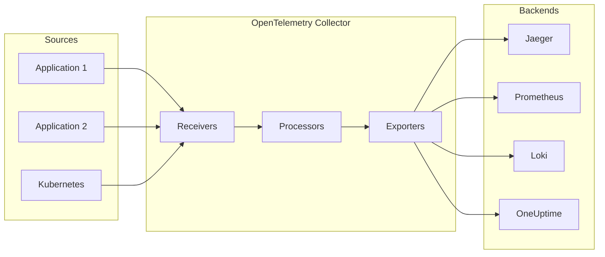

# How to Deploy OpenTelemetry Collector with Helm

Author: [nawazdhandala](https://www.github.com/nawazdhandala)

Tags: Helm, Kubernetes, DevOps, OpenTelemetry, Observability, Tracing, Metrics

Description: Complete guide to deploying the OpenTelemetry Collector using Helm for unified telemetry collection including traces, metrics, and logs.

> The OpenTelemetry Collector provides vendor-agnostic telemetry collection and processing. This guide covers deploying the collector with Helm for comprehensive observability in Kubernetes environments.

## Collector Architecture



## Prerequisites

```bash
# Add OpenTelemetry repository
helm repo add open-telemetry https://open-telemetry.github.io/opentelemetry-helm-charts
helm repo update

# Create namespace
kubectl create namespace observability
```

## Deployment Modes

### Mode 1: Deployment (Gateway)

```yaml
# otel-deployment-values.yaml
mode: deployment

replicaCount: 3

resources:
  requests:
    cpu: 200m
    memory: 256Mi
  limits:
    cpu: 1000m
    memory: 2Gi

autoscaling:
  enabled: true
  minReplicas: 3
  maxReplicas: 10
  targetCPUUtilizationPercentage: 80

config:
  receivers:
    otlp:
      protocols:
        grpc:
          endpoint: 0.0.0.0:4317
        http:
          endpoint: 0.0.0.0:4318
    
    prometheus:
      config:
        scrape_configs:
          - job_name: 'otel-collector'
            scrape_interval: 30s
            static_configs:
              - targets: ['0.0.0.0:8888']

  processors:
    batch:
      timeout: 10s
      send_batch_size: 10000
      send_batch_max_size: 11000
    
    memory_limiter:
      check_interval: 1s
      limit_percentage: 80
      spike_limit_percentage: 25
    
    resource:
      attributes:
        - key: environment
          value: production
          action: upsert
        - key: cluster
          value: main
          action: upsert

  exporters:
    otlp:
      endpoint: "oneuptime-otel.oneuptime.svc:4317"
      tls:
        insecure: true
    
    prometheus:
      endpoint: "0.0.0.0:8889"
      namespace: otel
      const_labels:
        source: otel-collector
    
    logging:
      loglevel: info

  service:
    pipelines:
      traces:
        receivers: [otlp]
        processors: [memory_limiter, batch]
        exporters: [otlp, logging]
      
      metrics:
        receivers: [otlp, prometheus]
        processors: [memory_limiter, batch]
        exporters: [prometheus, otlp]
      
      logs:
        receivers: [otlp]
        processors: [memory_limiter, batch]
        exporters: [otlp, logging]

service:
  type: ClusterIP
  ports:
    - name: otlp-grpc
      port: 4317
      targetPort: 4317
      protocol: TCP
    - name: otlp-http
      port: 4318
      targetPort: 4318
      protocol: TCP
    - name: prometheus
      port: 8889
      targetPort: 8889
      protocol: TCP
```

### Mode 2: DaemonSet (Agent)

```yaml
# otel-daemonset-values.yaml
mode: daemonset

resources:
  requests:
    cpu: 100m
    memory: 128Mi
  limits:
    cpu: 500m
    memory: 512Mi

hostNetwork: false

config:
  receivers:
    otlp:
      protocols:
        grpc:
          endpoint: 0.0.0.0:4317
        http:
          endpoint: 0.0.0.0:4318
    
    # Kubernetes metrics
    kubeletstats:
      collection_interval: 30s
      auth_type: serviceAccount
      endpoint: "https://${env:K8S_NODE_NAME}:10250"
      insecure_skip_verify: true
      metric_groups:
        - node
        - pod
        - container
    
    # Host metrics
    hostmetrics:
      collection_interval: 30s
      scrapers:
        cpu:
        disk:
        filesystem:
        load:
        memory:
        network:
        process:
          include:
            match_type: regexp
            names: [".*"]
        processes:
    
    # Filelog receiver for container logs
    filelog:
      include:
        - /var/log/pods/*/*/*.log
      exclude:
        - /var/log/pods/*/otel-collector/*.log
      start_at: beginning
      include_file_path: true
      include_file_name: false
      operators:
        - type: router
          id: get-format
          routes:
            - output: parser-docker
              expr: 'body matches "^\\{"'
            - output: parser-crio
              expr: 'body matches "^[^ Z]+ "'
            - output: parser-containerd
              expr: 'body matches "^[^ Z]+Z"'
        
        - type: json_parser
          id: parser-docker
          output: extract_metadata
          timestamp:
            parse_from: attributes.time
            layout: '%Y-%m-%dT%H:%M:%S.%LZ'
        
        - type: regex_parser
          id: parser-crio
          regex: '^(?P<time>[^ Z]+) (?P<stream>stdout|stderr) (?P<logtag>[^ ]*) ?(?P<log>.*)$'
          output: extract_metadata
          timestamp:
            parse_from: attributes.time
            layout_type: gotime
            layout: '2006-01-02T15:04:05.999999999Z07:00'
        
        - type: regex_parser
          id: parser-containerd
          regex: '^(?P<time>[^ ^Z]+Z) (?P<stream>stdout|stderr) (?P<logtag>[^ ]*) ?(?P<log>.*)$'
          output: extract_metadata
          timestamp:
            parse_from: attributes.time
            layout: '%Y-%m-%dT%H:%M:%S.%LZ'
        
        - type: move
          id: extract_metadata
          from: attributes.log
          to: body
        
        - type: regex_parser
          id: extract_metadata_from_filepath
          regex: '^.*\/(?P<namespace>[^_]+)_(?P<pod_name>[^_]+)_(?P<uid>[a-f0-9\-]{36})\/(?P<container_name>[^\._]+)\/(?P<restart_count>\d+)\.log$'
          parse_from: attributes["log.file.path"]
        
        - type: move
          from: attributes.namespace
          to: resource["k8s.namespace.name"]
        
        - type: move
          from: attributes.pod_name
          to: resource["k8s.pod.name"]
        
        - type: move
          from: attributes.container_name
          to: resource["k8s.container.name"]

  processors:
    batch:
      timeout: 5s
      send_batch_size: 1000
    
    memory_limiter:
      check_interval: 1s
      limit_mib: 400
      spike_limit_mib: 100
    
    k8sattributes:
      auth_type: serviceAccount
      passthrough: false
      extract:
        metadata:
          - k8s.namespace.name
          - k8s.deployment.name
          - k8s.statefulset.name
          - k8s.daemonset.name
          - k8s.cronjob.name
          - k8s.job.name
          - k8s.node.name
          - k8s.pod.name
          - k8s.pod.uid
          - k8s.pod.start_time
        labels:
          - tag_name: app
            key: app.kubernetes.io/name
            from: pod
          - tag_name: version
            key: app.kubernetes.io/version
            from: pod
      pod_association:
        - sources:
            - from: resource_attribute
              name: k8s.pod.ip
        - sources:
            - from: resource_attribute
              name: k8s.pod.uid
        - sources:
            - from: connection

  exporters:
    otlp:
      endpoint: "otel-collector-gateway.observability.svc:4317"
      tls:
        insecure: true

  service:
    pipelines:
      traces:
        receivers: [otlp]
        processors: [memory_limiter, k8sattributes, batch]
        exporters: [otlp]
      
      metrics:
        receivers: [otlp, kubeletstats, hostmetrics]
        processors: [memory_limiter, k8sattributes, batch]
        exporters: [otlp]
      
      logs:
        receivers: [otlp, filelog]
        processors: [memory_limiter, k8sattributes, batch]
        exporters: [otlp]

# Additional volumes for log collection
extraVolumes:
  - name: varlogpods
    hostPath:
      path: /var/log/pods
  - name: varlibdockercontainers
    hostPath:
      path: /var/lib/docker/containers

extraVolumeMounts:
  - name: varlogpods
    mountPath: /var/log/pods
    readOnly: true
  - name: varlibdockercontainers
    mountPath: /var/lib/docker/containers
    readOnly: true

# RBAC for k8s attributes
serviceAccount:
  create: true

clusterRole:
  create: true
  rules:
    - apiGroups: [""]
      resources: ["pods", "namespaces", "nodes"]
      verbs: ["get", "list", "watch"]
    - apiGroups: ["apps"]
      resources: ["replicasets", "deployments", "daemonsets", "statefulsets"]
      verbs: ["get", "list", "watch"]
    - apiGroups: ["batch"]
      resources: ["jobs", "cronjobs"]
      verbs: ["get", "list", "watch"]
```

## Deploy Collector

```bash
# Install gateway collector
helm install otel-gateway open-telemetry/opentelemetry-collector \
  --namespace observability \
  --values otel-deployment-values.yaml

# Install agent collectors
helm install otel-agent open-telemetry/opentelemetry-collector \
  --namespace observability \
  --values otel-daemonset-values.yaml
```

## Advanced Configuration

### Sampling Configuration

```yaml
config:
  processors:
    # Tail-based sampling
    tail_sampling:
      decision_wait: 10s
      num_traces: 100000
      expected_new_traces_per_sec: 1000
      policies:
        - name: errors-policy
          type: status_code
          status_code:
            status_codes:
              - ERROR
        - name: slow-traces-policy
          type: latency
          latency:
            threshold_ms: 1000
        - name: probabilistic-policy
          type: probabilistic
          probabilistic:
            sampling_percentage: 10
    
    # Probabilistic sampling (head-based)
    probabilistic_sampler:
      sampling_percentage: 10
```

### Service Metrics

```yaml
config:
  connectors:
    spanmetrics:
      histogram:
        explicit:
          buckets: [100us, 1ms, 2ms, 6ms, 10ms, 100ms, 250ms]
      dimensions:
        - name: http.method
          default: GET
        - name: http.status_code
      dimensions_cache_size: 1000
      aggregation_temporality: "AGGREGATION_TEMPORALITY_CUMULATIVE"
      metrics_flush_interval: 15s

  service:
    pipelines:
      traces:
        receivers: [otlp]
        processors: [batch]
        exporters: [otlp, spanmetrics]
      
      metrics/spanmetrics:
        receivers: [spanmetrics]
        processors: [batch]
        exporters: [prometheus]
```

## Best Practices

| Practice | Description |
|----------|-------------|
| Memory Limits | Configure memory_limiter processor |
| Batch Processing | Use batch processor for efficiency |
| Agent + Gateway | Deploy daemonset agents with central gateway |
| Sampling | Implement sampling for high-volume traces |
| Resource Attributes | Add k8sattributes for enrichment |
| Health Checks | Enable health check extension |

## Troubleshooting

```bash
# Check collector pods
kubectl get pods -n observability -l app.kubernetes.io/name=opentelemetry-collector

# View collector logs
kubectl logs -f deployment/otel-gateway-opentelemetry-collector -n observability

# Check collector metrics
kubectl port-forward svc/otel-gateway-opentelemetry-collector 8888:8888 -n observability
curl http://localhost:8888/metrics

# Verify configuration
kubectl exec -it deployment/otel-gateway-opentelemetry-collector -n observability -- cat /conf/relay.yaml
```

## Wrap-up

The OpenTelemetry Collector provides vendor-agnostic telemetry processing for Kubernetes. Deploy with Helm using gateway mode for central processing and daemonset mode for node-level collection. Configure appropriate receivers, processors, and exporters to build a comprehensive observability pipeline.
