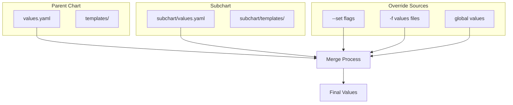

# How to Override Nested Values in Helm Charts

Author: [nawazdhandala](https://www.github.com/nawazdhandala)

Tags: Helm, Kubernetes, DevOps, Configuration, Values, Subcharts

Description: Deep dive into Helm's nested value override behavior, accessing subchart values, merge strategies, and common pitfalls when working with complex configurations.

> Understanding how Helm merges and overrides nested values is crucial for complex deployments. This guide covers deep merge behavior, subchart value access, and strategies for managing nested configurations without unexpected side effects.

## Nested Values Structure



## Basic Nested Value Override

### Default Values Structure

```yaml
# values.yaml
database:
  host: localhost
  port: 5432
  credentials:
    username: admin
    password: secret
  settings:
    maxConnections: 100
    timeout: 30s
    ssl:
      enabled: true
      mode: verify-full
```

### Override with --set

```bash
# Override single nested value
helm install myapp ./myapp --set database.host=db.example.com

# Override deeply nested value
helm install myapp ./myapp --set database.settings.ssl.mode=require

# Override multiple nested values
helm install myapp ./myapp \
  --set database.host=db.example.com \
  --set database.port=5433 \
  --set database.credentials.username=dbuser
```

### Override with Values File

```yaml
# override-values.yaml
database:
  host: db.production.svc
  credentials:
    username: prod_user
    password: prod_secret
  settings:
    maxConnections: 500
```

```bash
helm install myapp ./myapp -f override-values.yaml
```

## Deep Merge Behavior

### How Merge Works

```yaml
# Original values.yaml
config:
  server:
    host: localhost
    port: 8080
    tls:
      enabled: false
      cert: ""
      key: ""
  logging:
    level: info
    format: json

# Override values
config:
  server:
    host: api.example.com
    tls:
      enabled: true

# Result after merge
config:
  server:
    host: api.example.com  # Overridden
    port: 8080             # Preserved from original
    tls:
      enabled: true        # Overridden
      cert: ""             # Preserved from original
      key: ""              # Preserved from original
  logging:
    level: info            # Preserved from original
    format: json           # Preserved from original
```

### Replace vs Merge

```yaml
# Default values
resources:
  limits:
    cpu: 500m
    memory: 512Mi
  requests:
    cpu: 100m
    memory: 128Mi

# Override with --set replaces entire leaf
# This only sets cpu, memory is NOT preserved
helm install myapp ./myapp --set resources.limits.cpu=1000m

# Result
resources:
  limits:
    cpu: 1000m
    memory: 512Mi  # Still preserved
  requests:
    cpu: 100m
    memory: 128Mi
```

### List Override Behavior

```yaml
# Default values
env:
  - name: LOG_LEVEL
    value: info
  - name: PORT
    value: "8080"

# Override replaces the entire list!
# values-override.yaml
env:
  - name: LOG_LEVEL
    value: debug

# Result - original items are LOST
env:
  - name: LOG_LEVEL
    value: debug
```

## Accessing Subchart Values

### Subchart Default Values

```yaml
# charts/postgresql/values.yaml (subchart)
auth:
  username: postgres
  password: ""
  database: mydb

primary:
  resources:
    limits:
      memory: 256Mi
```

### Override Subchart Values

```yaml
# Parent chart values.yaml
postgresql:
  auth:
    username: myapp_user
    password: supersecret
    database: myapp_db
  primary:
    resources:
      limits:
        memory: 1Gi
```

### Global Values

```yaml
# values.yaml
global:
  imageRegistry: gcr.io/myproject
  imagePullSecrets:
    - name: gcr-secret
  storageClass: premium-ssd

# Accessible in subcharts as .Values.global.imageRegistry
postgresql:
  # Subchart can access global values
  global:
    imageRegistry: gcr.io/myproject
```

### Access Global in Templates

```yaml
# templates/deployment.yaml
spec:
  containers:
    - name: myapp
      image: {{ .Values.global.imageRegistry }}/myapp:{{ .Values.image.tag }}
      imagePullSecrets:
        {{- range .Values.global.imagePullSecrets }}
        - name: {{ .name }}
        {{- end }}
```

## Advanced Override Patterns

### Conditional Value Override

```yaml
# values.yaml
database:
  enabled: true
  external: false
  internal:
    host: postgresql
    port: 5432
  external:
    host: ""
    port: 5432

# templates/deployment.yaml
env:
  - name: DB_HOST
    {{- if .Values.database.external }}
    value: {{ .Values.database.external.host }}
    {{- else }}
    value: {{ .Values.database.internal.host }}
    {{- end }}
```

### Override with Defaults

```yaml
# _helpers.tpl
{{- define "myapp.database.host" -}}
{{- default .Values.database.internal.host .Values.database.external.host -}}
{{- end -}}

# templates/deployment.yaml
env:
  - name: DB_HOST
    value: {{ include "myapp.database.host" . }}
```

### Merging with tpl

```yaml
# values.yaml
config:
  baseConfig: |
    server.port=8080
    server.host=0.0.0.0
  additionalConfig: ""

# templates/configmap.yaml
apiVersion: v1
kind: ConfigMap
metadata:
  name: {{ include "myapp.fullname" . }}
data:
  application.properties: |
    {{ .Values.config.baseConfig }}
    {{ .Values.config.additionalConfig }}
```

## Subchart Value Isolation

### Prevent Value Leaking

```yaml
# Chart.yaml
dependencies:
  - name: postgresql
    version: "12.x.x"
    repository: https://charts.bitnami.com/bitnami
    condition: postgresql.enabled
    import-values:
      - child: primary.service
        parent: database.service
```

### Export Values to Parent

```yaml
# charts/database/values.yaml
exports:
  connectionString: postgresql://{{ .Values.auth.username }}@{{ include "postgresql.primary.fullname" . }}:5432/{{ .Values.auth.database }}

# Parent can import
# Chart.yaml
dependencies:
  - name: database
    import-values:
      - data
```

## Common Pitfalls

### Pitfall 1: List Replacement

```yaml
# Problem: Lists are replaced, not merged
# Original
tolerations:
  - key: "node-role"
    operator: "Exists"
    effect: "NoSchedule"

# Override adds new toleration but loses original
tolerations:
  - key: "gpu"
    operator: "Exists"

# Solution: Include all items
tolerations:
  - key: "node-role"
    operator: "Exists"
    effect: "NoSchedule"
  - key: "gpu"
    operator: "Exists"
```

### Pitfall 2: Null Values

```yaml
# Setting null removes the key
helm install myapp ./myapp --set database=null

# This removes the entire database section!
```

### Pitfall 3: Type Coercion

```yaml
# values.yaml
port: 8080  # number

# Override with string causes issues
helm install myapp ./myapp --set port="8080"

# Force number type
helm install myapp ./myapp --set-string port="8080"
```

### Pitfall 4: Special Characters

```bash
# Escape special characters in values
helm install myapp ./myapp --set 'password=p@ss\!word'

# Use --set-string for literal strings
helm install myapp ./myapp --set-string 'password=p@ss!word'

# Use --set-file for complex values
echo "complex=value;with;special;chars" > password.txt
helm install myapp ./myapp --set-file password=password.txt
```

## Value Precedence

```bash
# Precedence (highest to lowest):
# 1. --set / --set-string / --set-file (rightmost wins)
# 2. -f / --values files (rightmost wins)
# 3. Parent chart values.yaml
# 4. Subchart values.yaml

# Example with precedence
helm install myapp ./myapp \
  -f base-values.yaml \
  -f env-values.yaml \
  --set image.tag=v1.0.0

# env-values.yaml overrides base-values.yaml
# --set overrides both files
```

## Debugging Value Overrides

### Preview Final Values

```bash
# Show computed values
helm template myapp ./myapp \
  -f values-prod.yaml \
  --set database.password=secret \
  --debug | head -50

# Get values from installed release
helm get values myapp

# Get all values (including defaults)
helm get values myapp --all

# Compare values
helm get values myapp > current.yaml
helm show values ./myapp > default.yaml
diff current.yaml default.yaml
```

### Validate Nested Access

```yaml
# templates/debug.yaml
{{- if .Values.debug }}
apiVersion: v1
kind: ConfigMap
metadata:
  name: {{ include "myapp.fullname" . }}-debug
data:
  values: |
    database.host: {{ .Values.database.host | default "not set" }}
    database.port: {{ .Values.database.port | default "not set" }}
    database.settings.ssl.enabled: {{ .Values.database.settings.ssl.enabled | default "not set" }}
    global.imageRegistry: {{ .Values.global.imageRegistry | default "not set" }}
{{- end }}
```

## Best Practices

| Practice | Description |
|----------|-------------|
| Document Defaults | Comment all nested values |
| Use Defaults | Handle missing values gracefully |
| Avoid Deep Nesting | Limit to 3-4 levels |
| Consistent Types | Keep value types consistent |
| Test Merges | Verify merge behavior in CI |
| Global Sparingly | Limit global values usage |

## Wrap-up

Understanding Helm's nested value override behavior prevents configuration issues in complex deployments. Remember that deep merge preserves unset values, lists are replaced entirely, and subcharts can be configured through parent values or global values. Always test value overrides in development before deploying to production.
