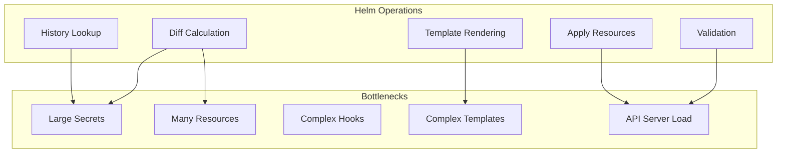

# Helm Performance Optimization: Large-Scale Deployments

Author: [nawazdhandala](https://www.github.com/nawazdhandala)

Tags: Helm, Kubernetes, DevOps, Performance, Optimization, Large-Scale

Description: Best practices and techniques for optimizing Helm performance in large-scale Kubernetes deployments with hundreds of releases and resources.

> As Kubernetes deployments grow, Helm operations can become slow and resource-intensive. This guide covers optimization techniques for improving Helm performance in large-scale environments with hundreds of releases and thousands of resources.

## Common Performance Bottlenecks



## Release Secret Optimization

### Problem: Large Release Secrets

Helm stores release history in Kubernetes secrets, which grow with each upgrade.

```bash
# Check release secret sizes
kubectl get secrets -n my-namespace -l owner=helm -o custom-columns="NAME:.metadata.name,SIZE:.data" | head -20

# Check specific release history size
kubectl get secret sh.helm.release.v1.my-release.v15 -o json | jq '.data | to_entries | map(.value | length) | add'
```

### Solution: Limit Release History

```bash
# Limit history during install/upgrade
helm upgrade my-release ./mychart \
  --history-max 5

# Set default in helmfile
helmDefaults:
  historyMax: 5
```

### Clean Up Old Releases

```bash
# List all release versions
kubectl get secrets -l owner=helm,name=my-release

# Manual cleanup (keep last 3)
for secret in $(kubectl get secrets -l owner=helm,name=my-release -o name | head -n -3); do
  kubectl delete $secret
done
```

## Template Rendering Optimization

### Reduce Template Complexity

```yaml
# Slow: Complex nested loops
{{- range $i, $env := .Values.environments }}
  {{- range $j, $svc := $.Values.services }}
    {{- range $k, $port := $svc.ports }}
      # Creates O(n³) iterations
    {{- end }}
  {{- end }}
{{- end }}

# Better: Pre-compute in values
# Or use tpl function sparingly
```

### Cache Common Computations

```yaml
# Define once at template level
{{- $labels := include "mychart.labels" . -}}
{{- $name := include "mychart.fullname" . -}}

# Reuse throughout template
metadata:
  name: {{ $name }}
  labels:
    {{- $labels | nindent 4 }}
```

### Minimize tpl Function Usage

```yaml
# Slow: Multiple tpl calls
env:
  - name: URL
    value: {{ tpl .Values.url . }}
  - name: HOST
    value: {{ tpl .Values.host . }}
  - name: PORT
    value: {{ tpl .Values.port . }}

# Better: Single tpl or avoid if possible
env:
  - name: URL
    value: {{ .Values.url }}  # Pre-resolve in values
```

## Resource Count Optimization

### Split Large Charts

```yaml
# Instead of one chart with 100+ resources
# Split into logical sub-charts

# parent-chart/Chart.yaml
dependencies:
  - name: frontend
    version: "1.0.0"
  - name: backend
    version: "1.0.0"
  - name: infrastructure
    version: "1.0.0"
```

### Use Conditional Resources

```yaml
# Only create resources when needed
{{- if .Values.monitoring.enabled }}
apiVersion: monitoring.coreos.com/v1
kind: ServiceMonitor
# ...
{{- end }}
```

### Separate CRDs from Main Chart

```yaml
# crds/
# ├── mycrd.yaml  # Installed separately

# Install CRDs first
kubectl apply -f crds/

# Then install chart without CRDs
helm install my-release ./mychart --skip-crds
```

## Kubernetes API Optimization

### Batch Operations

```bash
# Use atomic flag to batch operations
helm upgrade my-release ./mychart --atomic

# Increase timeout for large deployments
helm upgrade my-release ./mychart --timeout 30m
```

### Server-Side Apply

```bash
# Use server-side apply for better performance
helm upgrade my-release ./mychart \
  --server-side \
  --force-conflicts
```

### Reduce API Calls

```yaml
# Avoid excessive get/list operations in hooks
# Bad: Multiple kubectl calls
apiVersion: batch/v1
kind: Job
spec:
  template:
    spec:
      containers:
      - name: check
        command:
        - /bin/sh
        - -c
        - |
          kubectl get pods -l app=myapp | grep Running
          kubectl get svc myapp
          kubectl get endpoints myapp

# Better: Single check with proper readiness
```

## Parallel Processing

### Helmfile Parallel Execution

```yaml
# helmfile.yaml
helmDefaults:
  wait: true
  timeout: 600

# Use concurrency for independent releases
concurrency: 4

releases:
  - name: app-1
    chart: ./charts/app
  - name: app-2
    chart: ./charts/app
  - name: app-3
    chart: ./charts/app
```

```bash
# Run with concurrency
helmfile --concurrency 4 apply
```

### ArgoCD Parallel Sync

```yaml
# ArgoCD Application with wave annotations
apiVersion: argoproj.io/v1alpha1
kind: Application
spec:
  syncPolicy:
    syncOptions:
      - PrunePropagationPolicy=foreground
      - PruneLast=true
    automated:
      selfHeal: true
      prune: true
```

## Memory and CPU Optimization

### Helm Client Resources

```bash
# For large operations, increase Go memory limit
export GOMEMLIMIT=4GiB
helm upgrade my-release ./mychart
```

### CI/CD Runner Resources

```yaml
# GitLab CI with increased resources
deploy:
  tags:
    - large-runner
  variables:
    KUBERNETES_CPU_REQUEST: 2
    KUBERNETES_MEMORY_REQUEST: 4Gi
```

## Network Optimization

### Local Chart Repositories

```bash
# Use local ChartMuseum for frequently used charts
docker run -d -p 8080:8080 chartmuseum/chartmuseum

# Push charts locally
helm push mychart.tgz http://localhost:8080

# Add local repo
helm repo add local http://localhost:8080
```

### OCI Registry Caching

```yaml
# Use registry mirrors/proxies
# In containerd config.toml
[plugins."io.containerd.grpc.v1.cri".registry.mirrors]
  [plugins."io.containerd.grpc.v1.cri".registry.mirrors."ghcr.io"]
    endpoint = ["https://registry-cache.example.com"]
```

## Benchmarking Helm Operations

### Measure Operation Times

```bash
# Time template rendering
time helm template my-release ./mychart > /dev/null

# Time with debug output
time helm template my-release ./mychart --debug 2>&1 | tail -1

# Profile with verbose output
helm upgrade my-release ./mychart -v 5 2>&1 | grep -E "time|duration"
```

### Create Performance Tests

```bash
#!/bin/bash
# benchmark.sh

echo "Benchmarking Helm operations..."

# Template rendering
echo "Template rendering:"
time for i in {1..10}; do
  helm template test ./mychart > /dev/null
done

# Dry run
echo "Dry run:"
time helm upgrade test ./mychart --dry-run > /dev/null

# Full upgrade (if safe)
echo "Upgrade:"
time helm upgrade test ./mychart
```

## Values File Optimization

### Avoid Large Inline Data

```yaml
# Bad: Large inline data
config:
  file: |
    <10000 lines of configuration>

# Better: Use ConfigMap from file
# Or external config management
```

### Use YAML Anchors

```yaml
# Define common values once
defaults: &defaults
  resources:
    limits:
      cpu: 500m
      memory: 512Mi
    requests:
      cpu: 100m
      memory: 128Mi

# Reuse with anchors
services:
  api:
    <<: *defaults
  worker:
    <<: *defaults
```

## Hooks Optimization

### Avoid Long-Running Hooks

```yaml
# Bad: Complex pre-install hook
annotations:
  "helm.sh/hook": pre-install
# Long database migration that blocks install

# Better: Use Jobs with proper timeouts
spec:
  activeDeadlineSeconds: 300
  backoffLimit: 3
```

### Use Hook Weights Efficiently

```yaml
# Order hooks properly
# Lower weights run first
annotations:
  "helm.sh/hook": pre-upgrade
  "helm.sh/hook-weight": "-5"  # Runs first

annotations:
  "helm.sh/hook": pre-upgrade
  "helm.sh/hook-weight": "0"   # Runs second
```

## Monitoring Helm Performance

### Prometheus Metrics

```yaml
# Track Helm operations in CI/CD
- name: Track Helm deploy time
  run: |
    START=$(date +%s)
    helm upgrade my-release ./mychart
    END=$(date +%s)
    DURATION=$((END - START))
    
    # Push to Prometheus Pushgateway
    echo "helm_deploy_duration_seconds{release=\"my-release\"} $DURATION" | \
      curl --data-binary @- http://pushgateway:9091/metrics/job/helm
```

### Grafana Dashboard

Track these metrics:
- Helm operation duration
- Release secret sizes
- Number of resources per release
- API server latency during deploys

## Performance Checklist

| Area | Optimization | Impact |
|------|-------------|--------|
| History | Limit to 3-5 versions | High |
| Templates | Reduce complexity | Medium |
| Resources | Split large charts | High |
| API | Server-side apply | Medium |
| Parallel | Concurrent releases | High |
| Values | Avoid large inline data | Medium |
| Hooks | Minimize and timeout | Medium |
| Network | Local chart cache | Low |

## Example: Optimized Chart Structure

```
optimized-chart/
├── Chart.yaml
├── values.yaml
├── templates/
│   ├── _helpers.tpl      # Cached computations
│   ├── deployment.yaml   # Single resource type per file
│   ├── service.yaml
│   ├── configmap.yaml
│   └── hpa.yaml
└── crds/                 # Separate CRDs
    └── mycrd.yaml
```

```yaml
# Chart.yaml
apiVersion: v2
name: optimized-chart
version: 1.0.0

# No unnecessary dependencies
# Lean structure
```

```yaml
# values.yaml
# Minimal, well-structured values
replicaCount: 3
image:
  repository: myapp
  tag: "1.0.0"

# Conditionals for optional resources
monitoring:
  enabled: false
```

## Wrap-up

Optimizing Helm for large-scale deployments requires attention to release history management, template efficiency, resource organization, and API server load. Limit release history, split large charts into smaller components, use parallel processing where possible, and monitor operation times. These optimizations become critical as deployments scale to hundreds of releases and thousands of resources.
