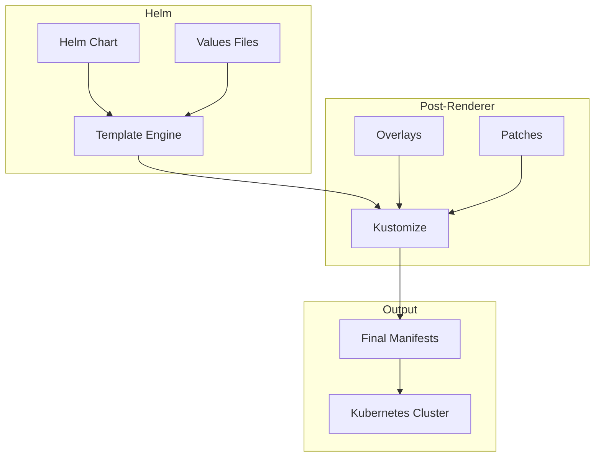

# How to Use Helm Post Renderers with Kustomize

Author: [nawazdhandala](https://www.github.com/nawazdhandala)

Tags: Helm, Kubernetes, DevOps, Kustomize, Post Rendering, Customization

Description: Guide to combining Helm with Kustomize using post-renderers for additional customization, overlays, and patches on Helm-generated manifests.

> Post-renderers allow you to modify Helm output before deployment. This guide covers using Kustomize as a post-renderer to apply overlays, patches, and transformations to Helm-generated manifests.

## Post-Renderer Architecture



## Basic Post-Renderer Usage

### Creating a Post-Renderer Script

```bash
#!/bin/bash
# kustomize-post-renderer.sh

# Read stdin (Helm output) into a temporary file
cat > /tmp/helm-output.yaml

# Create kustomization that uses Helm output as a resource
cat > /tmp/kustomization.yaml <<EOF
apiVersion: kustomize.config.k8s.io/v1beta1
kind: Kustomization
resources:
  - helm-output.yaml
EOF

# Run kustomize and output to stdout
cd /tmp && kustomize build .
```

```bash
# Make script executable
chmod +x kustomize-post-renderer.sh

# Use with Helm
helm install myapp charts/myapp \
  --post-renderer ./kustomize-post-renderer.sh
```

### Using Kustomize Directly

```bash
# Simple kustomize post-renderer
helm template myapp charts/myapp | kustomize build -

# With Helm install
helm install myapp charts/myapp \
  --post-renderer-args "--enable-helm" \
  --post-renderer kustomize
```

## Advanced Post-Renderer Setup

### Directory Structure

```
project/
├── charts/
│   └── myapp/
│       ├── Chart.yaml
│       ├── values.yaml
│       └── templates/
├── kustomize/
│   ├── base/
│   │   └── kustomization.yaml
│   └── overlays/
│       ├── development/
│       │   ├── kustomization.yaml
│       │   └── patches/
│       ├── staging/
│       │   ├── kustomization.yaml
│       │   └── patches/
│       └── production/
│           ├── kustomization.yaml
│           └── patches/
└── scripts/
    └── post-renderer.sh
```

### Flexible Post-Renderer Script

```bash
#!/bin/bash
# scripts/post-renderer.sh

set -e

# Get overlay from environment or default to base
OVERLAY=${KUSTOMIZE_OVERLAY:-base}
KUSTOMIZE_DIR=${KUSTOMIZE_DIR:-./kustomize}

# Create temp directory
TEMP_DIR=$(mktemp -d)
trap "rm -rf $TEMP_DIR" EXIT

# Save Helm output
cat > "$TEMP_DIR/helm-output.yaml"

# Copy kustomization files
if [ -d "$KUSTOMIZE_DIR/overlays/$OVERLAY" ]; then
  cp -r "$KUSTOMIZE_DIR/overlays/$OVERLAY"/* "$TEMP_DIR/"
elif [ -d "$KUSTOMIZE_DIR/base" ]; then
  cp -r "$KUSTOMIZE_DIR/base"/* "$TEMP_DIR/"
fi

# Add Helm output as resource
cat >> "$TEMP_DIR/kustomization.yaml" <<EOF
resources:
  - helm-output.yaml
EOF

# Build and output
kustomize build "$TEMP_DIR"
```

```bash
# Use with specific overlay
KUSTOMIZE_OVERLAY=production helm install myapp charts/myapp \
  --post-renderer ./scripts/post-renderer.sh
```

## Kustomization Examples

### Base Kustomization

```yaml
# kustomize/base/kustomization.yaml
apiVersion: kustomize.config.k8s.io/v1beta1
kind: Kustomization

# Common labels for all resources
commonLabels:
  team: platform

# Common annotations
commonAnnotations:
  managed-by: helm-kustomize

# Namespace transformation
namespace: myapp
```

### Development Overlay

```yaml
# kustomize/overlays/development/kustomization.yaml
apiVersion: kustomize.config.k8s.io/v1beta1
kind: Kustomization

# Inherit from base
resources: []

# Development-specific labels
commonLabels:
  environment: development

# Patches for development
patches:
  - path: patches/deployment-dev.yaml
  - path: patches/resources-dev.yaml

# ConfigMap generator for dev
configMapGenerator:
  - name: myapp-dev-config
    literals:
      - LOG_LEVEL=debug
      - ENABLE_PROFILING=true
```

### Development Patches

```yaml
# kustomize/overlays/development/patches/deployment-dev.yaml
apiVersion: apps/v1
kind: Deployment
metadata:
  name: myapp
spec:
  replicas: 1
  template:
    spec:
      containers:
        - name: myapp
          env:
            - name: ENVIRONMENT
              value: development
```

```yaml
# kustomize/overlays/development/patches/resources-dev.yaml
apiVersion: apps/v1
kind: Deployment
metadata:
  name: myapp
spec:
  template:
    spec:
      containers:
        - name: myapp
          resources:
            limits:
              cpu: 200m
              memory: 256Mi
            requests:
              cpu: 50m
              memory: 64Mi
```

### Production Overlay

```yaml
# kustomize/overlays/production/kustomization.yaml
apiVersion: kustomize.config.k8s.io/v1beta1
kind: Kustomization

commonLabels:
  environment: production

# Production patches
patches:
  - path: patches/deployment-prod.yaml
  - path: patches/pdb.yaml
  - path: patches/network-policy.yaml

# Image transformer for production
images:
  - name: myorg/myapp
    newTag: v1.2.3-prod
    digest: sha256:abc123...

# Replica count transformer
replicas:
  - name: myapp
    count: 5
```

### Production Patches

```yaml
# kustomize/overlays/production/patches/deployment-prod.yaml
apiVersion: apps/v1
kind: Deployment
metadata:
  name: myapp
spec:
  template:
    spec:
      affinity:
        podAntiAffinity:
          preferredDuringSchedulingIgnoredDuringExecution:
            - weight: 100
              podAffinityTerm:
                labelSelector:
                  matchLabels:
                    app: myapp
                topologyKey: kubernetes.io/hostname
      topologySpreadConstraints:
        - maxSkew: 1
          topologyKey: topology.kubernetes.io/zone
          whenUnsatisfiable: ScheduleAnyway
          labelSelector:
            matchLabels:
              app: myapp
```

```yaml
# kustomize/overlays/production/patches/pdb.yaml
apiVersion: policy/v1
kind: PodDisruptionBudget
metadata:
  name: myapp-pdb
spec:
  minAvailable: 2
  selector:
    matchLabels:
      app: myapp
```

```yaml
# kustomize/overlays/production/patches/network-policy.yaml
apiVersion: networking.k8s.io/v1
kind: NetworkPolicy
metadata:
  name: myapp-network-policy
spec:
  podSelector:
    matchLabels:
      app: myapp
  policyTypes:
    - Ingress
    - Egress
  ingress:
    - from:
        - namespaceSelector:
            matchLabels:
              name: ingress-nginx
      ports:
        - protocol: TCP
          port: 8080
  egress:
    - to:
        - namespaceSelector:
            matchLabels:
              name: database
      ports:
        - protocol: TCP
          port: 5432
```

## Strategic Merge Patches

### Patch Containers

```yaml
# patches/add-sidecar.yaml
apiVersion: apps/v1
kind: Deployment
metadata:
  name: myapp
spec:
  template:
    spec:
      containers:
        - name: sidecar
          image: fluentd:latest
          volumeMounts:
            - name: logs
              mountPath: /var/log/app
      volumes:
        - name: logs
          emptyDir: {}
```

### JSON Patches

```yaml
# kustomization.yaml
patches:
  - target:
      kind: Deployment
      name: myapp
    patch: |-
      - op: add
        path: /spec/template/spec/containers/0/env/-
        value:
          name: NEW_ENV_VAR
          value: "new-value"
      - op: replace
        path: /spec/template/spec/containers/0/resources/limits/memory
        value: "1Gi"
```

## ArgoCD Integration

### Application with Post-Renderer

```yaml
# argocd-application.yaml
apiVersion: argoproj.io/v1alpha1
kind: Application
metadata:
  name: myapp
spec:
  source:
    repoURL: https://github.com/org/charts.git
    path: charts/myapp
    targetRevision: main
    helm:
      releaseName: myapp
      valueFiles:
        - values.yaml
    # Kustomize post-rendering
    kustomize:
      images:
        - myorg/myapp:v1.2.3
      commonLabels:
        environment: production
```

### ApplicationSet with Kustomize

```yaml
# applicationset.yaml
apiVersion: argoproj.io/v1alpha1
kind: ApplicationSet
metadata:
  name: myapp-environments
spec:
  generators:
    - list:
        elements:
          - environment: development
            overlay: development
          - environment: staging
            overlay: staging
          - environment: production
            overlay: production
  template:
    metadata:
      name: 'myapp-{{environment}}'
    spec:
      source:
        repoURL: https://github.com/org/charts.git
        path: charts/myapp
        helm:
          releaseName: myapp
        kustomize:
          images:
            - myorg/myapp=myorg/myapp:{{environment}}
```

## CI/CD Integration

### GitHub Actions

```yaml
# .github/workflows/deploy.yaml
name: Deploy with Post-Renderer

on:
  push:
    branches: [main]

jobs:
  deploy:
    runs-on: ubuntu-latest
    strategy:
      matrix:
        environment: [development, staging, production]
    steps:
      - uses: actions/checkout@v4
      
      - name: Setup Helm
        uses: azure/setup-helm@v3
        
      - name: Setup Kustomize
        uses: imranismail/setup-kustomize@v2
        
      - name: Configure Kubernetes
        uses: azure/k8s-set-context@v3
        with:
          kubeconfig: ${{ secrets.KUBECONFIG }}
          
      - name: Deploy
        env:
          KUSTOMIZE_OVERLAY: ${{ matrix.environment }}
        run: |
          helm upgrade --install myapp charts/myapp \
            --namespace myapp-${{ matrix.environment }} \
            --create-namespace \
            -f values-${{ matrix.environment }}.yaml \
            --post-renderer ./scripts/post-renderer.sh \
            --wait
```

### Makefile Integration

```makefile
# Makefile

CHART_DIR := charts/myapp
KUSTOMIZE_DIR := kustomize
NAMESPACE := myapp

.PHONY: template-dev template-prod install-dev install-prod

template-dev:
	KUSTOMIZE_OVERLAY=development helm template myapp $(CHART_DIR) \
		-f values-development.yaml \
		--post-renderer ./scripts/post-renderer.sh

template-prod:
	KUSTOMIZE_OVERLAY=production helm template myapp $(CHART_DIR) \
		-f values-production.yaml \
		--post-renderer ./scripts/post-renderer.sh

install-dev:
	KUSTOMIZE_OVERLAY=development helm upgrade --install myapp $(CHART_DIR) \
		--namespace $(NAMESPACE)-dev \
		--create-namespace \
		-f values-development.yaml \
		--post-renderer ./scripts/post-renderer.sh

install-prod:
	KUSTOMIZE_OVERLAY=production helm upgrade --install myapp $(CHART_DIR) \
		--namespace $(NAMESPACE)-prod \
		--create-namespace \
		-f values-production.yaml \
		--post-renderer ./scripts/post-renderer.sh
```

## When to Use Each Tool

| Use Case | Helm | Kustomize | Both |
|----------|------|-----------|------|
| Package management | ✅ | ❌ | ✅ |
| Template engine | ✅ | ❌ | ✅ |
| Overlays | ❌ | ✅ | ✅ |
| Strategic patches | ❌ | ✅ | ✅ |
| Third-party charts | ✅ | ❌ | ✅ |
| Environment-specific | ✅ | ✅ | ✅ |

## Best Practices

| Practice | Description |
|----------|-------------|
| Keep Overlays Simple | Don't duplicate Helm functionality |
| Use for Additions | Add resources Helm doesn't support |
| Environment Patches | Use overlays for env-specific config |
| Test Output | Always preview combined output |
| Version Control | Track all kustomization files |
| Documentation | Document why post-renderer is needed |

## Troubleshooting

```bash
# Debug post-renderer output
helm template myapp charts/myapp \
  --post-renderer ./scripts/post-renderer.sh \
  --debug 2>&1 | head -100

# Test kustomize build separately
helm template myapp charts/myapp > /tmp/helm.yaml
cd kustomize/overlays/production
kustomize build . --load-restrictor LoadRestrictionsNone

# Verify patches apply correctly
kustomize build kustomize/overlays/production --enable-alpha-plugins
```

## Wrap-up

Combining Helm with Kustomize post-renderers provides flexibility for environment-specific customizations without modifying upstream charts. Use post-renderers for adding resources, applying patches, and transforming output that Helm values alone cannot achieve. Keep overlays focused on additions rather than duplicating Helm's templating capabilities.
