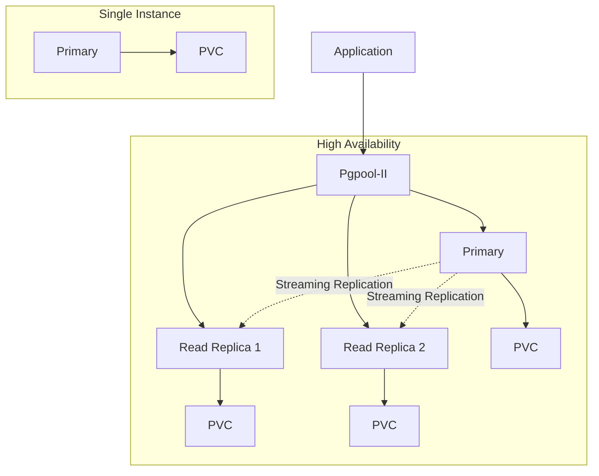

# Deploying PostgreSQL on Kubernetes with Helm

Author: [nawazdhandala](https://www.github.com/nawazdhandala)

Tags: Helm, Kubernetes, DevOps, PostgreSQL, Database, HA

Description: Complete guide to deploying PostgreSQL on Kubernetes using Helm charts, covering single instances, high availability, backups, and production configurations.

> PostgreSQL is a powerful open-source relational database. This guide covers deploying PostgreSQL on Kubernetes using Bitnami's Helm chart, from simple single-instance deployments to production-ready high-availability clusters.

## Architecture Options



## Installation

### Add Repository

```bash
# Add Bitnami repository
helm repo add bitnami https://charts.bitnami.com/bitnami

# Update repositories
helm repo update

# Search for available versions
helm search repo bitnami/postgresql --versions
```

### Basic Installation

```bash
# Install with default values
helm install postgresql bitnami/postgresql \
  --namespace database \
  --create-namespace

# Get password
export POSTGRES_PASSWORD=$(kubectl get secret postgresql -n database -o jsonpath="{.data.postgres-password}" | base64 -d)
echo $POSTGRES_PASSWORD
```

### Connect to PostgreSQL

```bash
# Port forward
kubectl port-forward svc/postgresql 5432:5432 -n database

# Connect with psql
psql -h localhost -U postgres -d postgres
```

## Production Configuration

### Complete Production Values

```yaml
# postgresql-values.yaml
global:
  postgresql:
    auth:
      # Use existing secret instead of generating password
      existingSecret: "postgresql-credentials"
      secretKeys:
        adminPasswordKey: "postgres-password"
        userPasswordKey: "password"
        replicationPasswordKey: "replication-password"

auth:
  # Database and user to create
  database: myapp
  username: myapp_user

primary:
  # Resource allocation
  resources:
    requests:
      memory: 512Mi
      cpu: 250m
    limits:
      memory: 2Gi
      cpu: 2000m
  
  # Persistent storage
  persistence:
    enabled: true
    storageClass: "standard"
    size: 50Gi
    # Access mode
    accessModes:
      - ReadWriteOnce
  
  # Pod disruption budget
  podDisruptionBudget:
    create: true
    minAvailable: 1
  
  # Affinity rules
  affinity:
    nodeAffinity:
      requiredDuringSchedulingIgnoredDuringExecution:
        nodeSelectorTerms:
        - matchExpressions:
          - key: node-type
            operator: In
            values:
            - database
  
  # PostgreSQL configuration
  configuration: |
    max_connections = 200
    shared_buffers = 512MB
    effective_cache_size = 1536MB
    maintenance_work_mem = 128MB
    checkpoint_completion_target = 0.9
    wal_buffers = 16MB
    default_statistics_target = 100
    random_page_cost = 1.1
    effective_io_concurrency = 200
    min_wal_size = 1GB
    max_wal_size = 4GB
    max_worker_processes = 4
    max_parallel_workers_per_gather = 2
    max_parallel_workers = 4
    max_parallel_maintenance_workers = 2
    log_destination = 'stderr'
    logging_collector = off
    log_min_duration_statement = 1000
    log_checkpoints = on
    log_connections = on
    log_disconnections = on
    log_lock_waits = on
  
  # pg_hba authentication configuration
  pgHbaConfiguration: |
    local all all trust
    host all all 127.0.0.1/32 md5
    host all all ::1/128 md5
    host all all 0.0.0.0/0 md5
    host replication all 0.0.0.0/0 md5
  
  # Init scripts
  initdb:
    scripts:
      init.sql: |
        -- Create extensions
        CREATE EXTENSION IF NOT EXISTS pg_stat_statements;
        CREATE EXTENSION IF NOT EXISTS pgcrypto;
        
        -- Create additional schemas
        CREATE SCHEMA IF NOT EXISTS analytics;
        
        -- Grant permissions
        GRANT ALL PRIVILEGES ON DATABASE myapp TO myapp_user;
        GRANT ALL PRIVILEGES ON SCHEMA public TO myapp_user;
        GRANT ALL PRIVILEGES ON SCHEMA analytics TO myapp_user;
  
  # Liveness and readiness probes
  livenessProbe:
    enabled: true
    initialDelaySeconds: 30
    periodSeconds: 10
    timeoutSeconds: 5
    failureThreshold: 6
  
  readinessProbe:
    enabled: true
    initialDelaySeconds: 5
    periodSeconds: 10
    timeoutSeconds: 5
    failureThreshold: 6
  
  # Extra volume mounts for custom configs
  extraVolumes:
    - name: custom-scripts
      configMap:
        name: postgresql-custom-scripts
  
  extraVolumeMounts:
    - name: custom-scripts
      mountPath: /docker-entrypoint-initdb.d/custom

# Metrics for Prometheus
metrics:
  enabled: true
  serviceMonitor:
    enabled: true
    namespace: monitoring
    labels:
      release: prometheus
  resources:
    requests:
      memory: 64Mi
      cpu: 50m
    limits:
      memory: 128Mi
      cpu: 100m

# Network policy
networkPolicy:
  enabled: true
  ingressRules:
    primaryAccessOnlyFrom:
      enabled: true
      namespaceSelector:
        matchLabels:
          postgres-access: "true"
```

### Create Credentials Secret

```bash
# Create secret with credentials
kubectl create secret generic postgresql-credentials \
  --namespace database \
  --from-literal=postgres-password=$(openssl rand -base64 32) \
  --from-literal=password=$(openssl rand -base64 32) \
  --from-literal=replication-password=$(openssl rand -base64 32)
```

### Install with Production Values

```bash
helm install postgresql bitnami/postgresql \
  --namespace database \
  --create-namespace \
  -f postgresql-values.yaml
```

## High Availability with Replication

### HA Configuration

```yaml
# postgresql-ha-values.yaml
architecture: replication

auth:
  postgresPassword: "your-secure-password"
  replicationPassword: "replication-password"
  database: myapp
  username: myapp_user
  password: "user-password"

primary:
  resources:
    requests:
      memory: 1Gi
      cpu: 500m
    limits:
      memory: 4Gi
      cpu: 2000m
  
  persistence:
    enabled: true
    storageClass: "standard"
    size: 100Gi
  
  configuration: |
    max_connections = 200
    shared_buffers = 1GB
    wal_level = replica
    max_wal_senders = 10
    max_replication_slots = 10
    hot_standby = on
    synchronous_commit = on

readReplicas:
  # Number of read replicas
  replicaCount: 2
  
  resources:
    requests:
      memory: 1Gi
      cpu: 500m
    limits:
      memory: 4Gi
      cpu: 2000m
  
  persistence:
    enabled: true
    storageClass: "standard"
    size: 100Gi
  
  # Pod anti-affinity for spreading replicas
  affinity:
    podAntiAffinity:
      preferredDuringSchedulingIgnoredDuringExecution:
      - weight: 100
        podAffinityTerm:
          labelSelector:
            matchLabels:
              app.kubernetes.io/component: read
          topologyKey: kubernetes.io/hostname

metrics:
  enabled: true
  serviceMonitor:
    enabled: true
```

### Using Bitnami PostgreSQL HA Chart

For more advanced HA with Pgpool:

```bash
# Install PostgreSQL HA chart
helm install postgresql bitnami/postgresql-ha \
  --namespace database \
  --create-namespace \
  -f postgresql-ha-values.yaml
```

```yaml
# postgresql-ha-advanced-values.yaml
postgresql:
  replicaCount: 3
  
  resources:
    requests:
      memory: 1Gi
      cpu: 500m
  
  persistence:
    enabled: true
    size: 100Gi

pgpool:
  replicaCount: 2
  
  resources:
    requests:
      memory: 256Mi
      cpu: 250m
  
  # Connection pooling settings
  configuration: |
    num_init_children = 32
    max_pool = 4
    connection_cache = on
    connection_life_time = 300
    client_idle_limit = 0
```

## Backup and Restore

### Enable Backups with Volume Snapshots

```yaml
# postgresql-backup-values.yaml
primary:
  persistence:
    enabled: true
    storageClass: "csi-driver-class"  # Must support snapshots
    size: 100Gi

backup:
  enabled: true
  cronjob:
    schedule: "0 2 * * *"  # Daily at 2 AM
    concurrencyPolicy: Forbid
    storage:
      storageClass: "standard"
      size: 100Gi
```

### Manual Backup with pg_dump

Create a backup job:

```yaml
# postgresql-backup-job.yaml
apiVersion: batch/v1
kind: CronJob
metadata:
  name: postgresql-backup
  namespace: database
spec:
  schedule: "0 2 * * *"
  concurrencyPolicy: Forbid
  jobTemplate:
    spec:
      template:
        spec:
          containers:
          - name: backup
            image: bitnami/postgresql:15
            env:
            - name: PGPASSWORD
              valueFrom:
                secretKeyRef:
                  name: postgresql-credentials
                  key: postgres-password
            command:
            - /bin/bash
            - -c
            - |
              pg_dump -h postgresql -U postgres myapp | gzip > /backup/myapp-$(date +%Y%m%d-%H%M%S).sql.gz
              # Upload to S3 (requires aws-cli)
              # aws s3 cp /backup/*.gz s3://my-bucket/postgres-backups/
            volumeMounts:
            - name: backup
              mountPath: /backup
          restartPolicy: OnFailure
          volumes:
          - name: backup
            persistentVolumeClaim:
              claimName: postgresql-backup-pvc
```

### Restore from Backup

```bash
# Copy backup to pod
kubectl cp backup.sql.gz database/postgresql-0:/tmp/

# Restore
kubectl exec -it postgresql-0 -n database -- bash -c "gunzip -c /tmp/backup.sql.gz | psql -U postgres myapp"
```

## Connection Pooling with PgBouncer

```yaml
# pgbouncer-values.yaml
# Deploy alongside PostgreSQL

image:
  repository: bitnami/pgbouncer
  tag: latest

database:
  host: postgresql
  port: 5432
  user: postgres
  password: "password"

pgbouncer:
  poolMode: transaction
  maxClientConn: 1000
  defaultPoolSize: 20
  minPoolSize: 5
  reservePoolSize: 5
  reservePoolTimeout: 5
  maxDbConnections: 100
```

Install PgBouncer:

```bash
helm install pgbouncer bitnami/pgbouncer \
  --namespace database \
  -f pgbouncer-values.yaml
```

## SSL/TLS Configuration

### Enable TLS

```yaml
# postgresql-tls-values.yaml
tls:
  enabled: true
  autoGenerated: true
  # Or use existing certificates
  # certificatesSecret: "postgresql-tls"
  # certFilename: "tls.crt"
  # certKeyFilename: "tls.key"
  # certCAFilename: "ca.crt"

primary:
  configuration: |
    ssl = on
    ssl_cert_file = '/opt/bitnami/postgresql/certs/tls.crt'
    ssl_key_file = '/opt/bitnami/postgresql/certs/tls.key'
    ssl_ca_file = '/opt/bitnami/postgresql/certs/ca.crt'
```

### Create TLS Secret

```bash
# Generate certificates
openssl req -new -x509 -days 365 -nodes \
  -out server.crt -keyout server.key \
  -subj "/CN=postgresql"

# Create secret
kubectl create secret generic postgresql-tls \
  --namespace database \
  --from-file=tls.crt=server.crt \
  --from-file=tls.key=server.key \
  --from-file=ca.crt=server.crt
```

## Monitoring Queries

Useful queries for monitoring:

```sql
-- Active connections
SELECT count(*) FROM pg_stat_activity WHERE state = 'active';

-- Connection by state
SELECT state, count(*) FROM pg_stat_activity GROUP BY state;

-- Long running queries
SELECT pid, now() - pg_stat_activity.query_start AS duration, query, state
FROM pg_stat_activity
WHERE (now() - pg_stat_activity.query_start) > interval '5 minutes';

-- Table sizes
SELECT schemaname, tablename, 
       pg_size_pretty(pg_total_relation_size(schemaname||'.'||tablename)) as size
FROM pg_tables 
ORDER BY pg_total_relation_size(schemaname||'.'||tablename) DESC 
LIMIT 10;

-- Cache hit ratio
SELECT 
  sum(heap_blks_read) as heap_read,
  sum(heap_blks_hit)  as heap_hit,
  sum(heap_blks_hit) / (sum(heap_blks_hit) + sum(heap_blks_read)) as ratio
FROM pg_statio_user_tables;

-- Replication status
SELECT client_addr, state, sent_lsn, write_lsn, flush_lsn, replay_lsn
FROM pg_stat_replication;
```

## Resource Sizing Guide

| Workload Size | CPU | Memory | Storage | Connections |
|---------------|-----|--------|---------|-------------|
| Development | 250m | 512Mi | 10Gi | 50 |
| Small | 500m | 1Gi | 50Gi | 100 |
| Medium | 1000m | 2Gi | 100Gi | 200 |
| Large | 2000m | 4Gi | 500Gi | 500 |
| XL | 4000m | 8Gi | 1Ti | 1000 |

## Troubleshooting

### Check Logs

```bash
# Primary logs
kubectl logs postgresql-0 -n database

# Check events
kubectl get events -n database --sort-by='.lastTimestamp'
```

### Check Replication Status

```bash
# Connect to primary
kubectl exec -it postgresql-0 -n database -- psql -U postgres -c "SELECT * FROM pg_stat_replication;"

# Check replication lag
kubectl exec -it postgresql-0 -n database -- psql -U postgres -c "SELECT client_addr, state, sent_lsn - replay_lsn AS replication_lag FROM pg_stat_replication;"
```

### Connection Issues

```bash
# Test connection
kubectl run -it --rm --image=bitnami/postgresql:15 test-pg -- psql -h postgresql -U postgres -d myapp -c "SELECT 1"

# Check service
kubectl get svc postgresql -n database
kubectl describe svc postgresql -n database
```

## Wrap-up

PostgreSQL on Kubernetes with Helm provides flexible deployment options from single instances to highly available clusters. Use appropriate resource sizing, enable persistence with suitable storage classes, configure replication for HA, and set up regular backups. Monitor with Prometheus metrics and use connection pooling with PgBouncer for production workloads. Always test backup and restore procedures before going to production.
