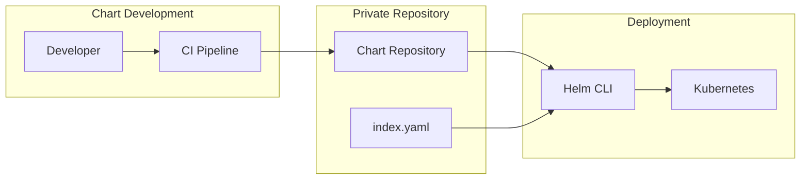

# How to Create a Private Helm Chart Repository

Author: [nawazdhandala](https://www.github.com/nawazdhandala)

Tags: Helm, Kubernetes, DevOps, Charts, Repository, Private

Description: Learn how to set up a private Helm chart repository using ChartMuseum, GitHub Pages, S3, or OCI registries for hosting internal charts securely.

> Public charts are great for getting started, but production environments need private repositories for proprietary applications, customized charts, and controlled distribution. Here's how to set up your own.

## Why Private Helm Repositories?

Private repositories give you control over chart distribution, versioning, and access. They're essential for:

- Hosting proprietary application charts
- Customizing public charts with company standards
- Controlling who can access and deploy charts
- Air-gapped and compliance-restricted environments



## Option 1: ChartMuseum

ChartMuseum is a dedicated Helm chart repository server with an API for uploading charts.

### Deploy ChartMuseum with Helm

The easiest way to run ChartMuseum is using its own Helm chart. This configuration sets up a basic instance with local storage.

```bash
# Add the ChartMuseum repository
helm repo add chartmuseum https://chartmuseum.github.io/charts
helm repo update

# Create namespace
kubectl create namespace chartmuseum

# Install ChartMuseum
helm install chartmuseum chartmuseum/chartmuseum \
  --namespace chartmuseum \
  --set env.open.DISABLE_API=false \
  --set persistence.enabled=true \
  --set persistence.size=10Gi
```

### ChartMuseum with S3 Backend

For production, use cloud storage for persistence. This configuration uses AWS S3.

```yaml
# chartmuseum-values.yaml
env:
  open:
    # Enable the API for chart uploads
    DISABLE_API: false
    # Use S3 storage backend
    STORAGE: amazon
    STORAGE_AMAZON_BUCKET: my-helm-charts
    STORAGE_AMAZON_REGION: us-east-1
    # Enable chart versioning
    ALLOW_OVERWRITE: false
    
# Use IAM roles for authentication (recommended)
serviceAccount:
  create: true
  annotations:
    eks.amazonaws.com/role-arn: arn:aws:iam::123456789:role/chartmuseum-role

persistence:
  enabled: false  # Not needed with S3

ingress:
  enabled: true
  annotations:
    cert-manager.io/cluster-issuer: letsencrypt-prod
  hosts:
    - name: charts.mycompany.com
      path: /
  tls:
    - secretName: chartmuseum-tls
      hosts:
        - charts.mycompany.com
```

Install with production values:

```bash
helm install chartmuseum chartmuseum/chartmuseum \
  --namespace chartmuseum \
  -f chartmuseum-values.yaml
```

### Upload Charts to ChartMuseum

Use curl or the helm-push plugin to upload charts.

```bash
# Install the helm-push plugin
helm plugin install https://github.com/chartmuseum/helm-push

# Package your chart
helm package ./my-chart

# Push to ChartMuseum using the plugin
helm cm-push my-chart-1.0.0.tgz chartmuseum

# Or use curl directly
curl --data-binary "@my-chart-1.0.0.tgz" https://charts.mycompany.com/api/charts
```

### Use Charts from ChartMuseum

Add the repository and install charts like any other repository.

```bash
# Add the private repository
helm repo add mycompany https://charts.mycompany.com

# Update and search
helm repo update
helm search repo mycompany

# Install a chart
helm install my-app mycompany/my-chart
```

## Option 2: GitHub Pages

GitHub Pages provides free static hosting, perfect for smaller teams with charts in Git.

### Repository Structure

Create a repository with the following structure:

```
helm-charts/
├── charts/
│   ├── my-app/
│   │   ├── Chart.yaml
│   │   ├── values.yaml
│   │   └── templates/
│   └── another-app/
├── docs/           # GitHub Pages serves from here
│   └── index.yaml  # Generated by helm repo index
└── .github/
    └── workflows/
        └── release.yml
```

### GitHub Actions Workflow

Automate chart packaging and publishing with this workflow. It packages charts, generates the repository index, and publishes to GitHub Pages.

```yaml
# .github/workflows/release.yml
name: Release Charts

on:
  push:
    branches:
      - main
    paths:
      - 'charts/**'

jobs:
  release:
    runs-on: ubuntu-latest
    steps:
      - name: Checkout
        uses: actions/checkout@v4
        with:
          fetch-depth: 0

      - name: Configure Git
        run: |
          git config user.name "$GITHUB_ACTOR"
          git config user.email "$GITHUB_ACTOR@users.noreply.github.com"

      - name: Install Helm
        uses: azure/setup-helm@v3

      - name: Package charts
        run: |
          mkdir -p docs
          for chart in charts/*/; do
            helm package "$chart" -d docs/
          done

      - name: Generate index
        run: |
          helm repo index docs/ --url https://${{ github.repository_owner }}.github.io/${{ github.event.repository.name }}/

      - name: Publish to GitHub Pages
        uses: peaceiris/actions-gh-pages@v3
        with:
          github_token: ${{ secrets.GITHUB_TOKEN }}
          publish_dir: ./docs
```

### Enable GitHub Pages

1. Go to repository Settings → Pages
2. Set Source to "Deploy from a branch"
3. Select `gh-pages` branch, `/ (root)` folder

### Use the GitHub Pages Repository

```bash
# Add the repository
helm repo add mycompany https://myorg.github.io/helm-charts

# Install charts
helm install my-app mycompany/my-app
```

## Option 3: AWS S3

S3 provides a simple, cost-effective option for static chart hosting.

### Create and Configure S3 Bucket

Set up an S3 bucket with proper permissions for chart hosting.

```bash
# Create the bucket
aws s3 mb s3://my-helm-charts --region us-east-1

# Enable static website hosting (optional, for HTTP access)
aws s3 website s3://my-helm-charts --index-document index.yaml
```

### Upload Charts to S3

Package charts and upload them along with the index file.

```bash
# Package the chart
helm package ./my-chart

# Upload the chart package
aws s3 cp my-chart-1.0.0.tgz s3://my-helm-charts/

# Generate the index (download existing first if updating)
aws s3 cp s3://my-helm-charts/index.yaml . 2>/dev/null || true
helm repo index . --url https://my-helm-charts.s3.amazonaws.com --merge index.yaml

# Upload the updated index
aws s3 cp index.yaml s3://my-helm-charts/
```

### CI/CD Script for S3

Automate chart publishing with this script.

```bash
#!/bin/bash
# publish-chart.sh - Publish a Helm chart to S3

set -e

CHART_DIR=$1
BUCKET="my-helm-charts"
REPO_URL="https://${BUCKET}.s3.amazonaws.com"

# Package the chart
echo "Packaging chart..."
helm package "$CHART_DIR"
CHART_FILE=$(ls *.tgz | head -1)

# Download existing index
echo "Downloading existing index..."
aws s3 cp "s3://${BUCKET}/index.yaml" ./existing-index.yaml 2>/dev/null || echo "No existing index"

# Upload the chart
echo "Uploading chart..."
aws s3 cp "$CHART_FILE" "s3://${BUCKET}/"

# Regenerate index
echo "Regenerating index..."
if [ -f ./existing-index.yaml ]; then
  helm repo index . --url "$REPO_URL" --merge ./existing-index.yaml
else
  helm repo index . --url "$REPO_URL"
fi

# Upload new index
echo "Uploading index..."
aws s3 cp index.yaml "s3://${BUCKET}/"

echo "Chart published successfully!"
```

### Use the S3 Repository

Configure Helm to use the S3 bucket. For private buckets, use the helm-s3 plugin.

```bash
# For public buckets, add directly
helm repo add mycompany https://my-helm-charts.s3.amazonaws.com

# For private buckets, install the helm-s3 plugin
helm plugin install https://github.com/hypnoglow/helm-s3

# Initialize the repository (first time only)
helm s3 init s3://my-helm-charts

# Add the repository
helm repo add mycompany s3://my-helm-charts

# Use normally
helm repo update
helm install my-app mycompany/my-app
```

## Option 4: OCI Registry (Recommended)

Helm 3.8+ supports OCI registries natively. Use your existing container registry for charts.

### Push Charts to OCI Registry

OCI registries like Docker Hub, GHCR, ECR, and Harbor can host Helm charts.

```bash
# Login to the registry
helm registry login ghcr.io -u USERNAME

# Package the chart
helm package ./my-chart

# Push to OCI registry
helm push my-chart-1.0.0.tgz oci://ghcr.io/myorg/charts

# The chart is now available at:
# oci://ghcr.io/myorg/charts/my-chart:1.0.0
```

### Pull and Install from OCI

OCI charts don't require `helm repo add`. Reference them directly.

```bash
# Pull a chart
helm pull oci://ghcr.io/myorg/charts/my-chart --version 1.0.0

# Install directly
helm install my-app oci://ghcr.io/myorg/charts/my-chart --version 1.0.0

# Template for inspection
helm template my-app oci://ghcr.io/myorg/charts/my-chart --version 1.0.0
```

### GitHub Actions for OCI Publishing

Automate OCI chart publishing with GitHub Actions.

```yaml
# .github/workflows/publish-chart.yml
name: Publish Helm Chart

on:
  push:
    tags:
      - 'v*'

jobs:
  publish:
    runs-on: ubuntu-latest
    permissions:
      packages: write
      contents: read
    steps:
      - uses: actions/checkout@v4
      
      - name: Install Helm
        uses: azure/setup-helm@v3
        
      - name: Login to GHCR
        run: |
          echo "${{ secrets.GITHUB_TOKEN }}" | helm registry login ghcr.io -u ${{ github.actor }} --password-stdin
          
      - name: Package and Push
        run: |
          # Extract version from tag
          VERSION=${GITHUB_REF#refs/tags/v}
          
          # Update Chart.yaml version
          sed -i "s/^version:.*/version: ${VERSION}/" charts/my-app/Chart.yaml
          
          # Package and push
          helm package charts/my-app
          helm push my-app-${VERSION}.tgz oci://ghcr.io/${{ github.repository_owner }}/charts
```

## Authentication and Access Control

### Basic Auth for ChartMuseum

Configure username/password authentication.

```yaml
# chartmuseum-values.yaml
env:
  secret:
    BASIC_AUTH_USER: admin
    BASIC_AUTH_PASS: secretpassword
```

Use with Helm:

```bash
helm repo add mycompany https://charts.mycompany.com \
  --username admin \
  --password secretpassword
```

### Token Authentication for OCI

Most OCI registries support token-based authentication.

```bash
# Login with token
echo $REGISTRY_TOKEN | helm registry login ghcr.io -u USERNAME --password-stdin

# For CI/CD, use environment variables
export HELM_REGISTRY_CONFIG=~/.config/helm/registry/config.json
```

## Repository Best Practices

| Practice | Why |
| --- | --- |
| Version all charts with SemVer | Clear upgrade paths, dependency management |
| Never overwrite published versions | Reproducibility, trust |
| Use CI/CD for publishing | Consistency, audit trail |
| Sign charts in production | Supply chain security |
| Mirror public charts internally | Air-gap support, availability |
| Document chart sources | Team knowledge, compliance |

## Comparison of Options

| Feature | ChartMuseum | GitHub Pages | S3 | OCI Registry |
| --- | --- | --- | --- | --- |
| Setup complexity | Medium | Low | Low | Low |
| Cost | Server costs | Free | Storage costs | Registry costs |
| API for uploads | Yes | No (Git push) | No (aws s3 cp) | Yes |
| Authentication | Built-in | GitHub | IAM | Registry auth |
| Best for | Large teams | Small teams | AWS users | Container users |

## Wrap-up

Private Helm repositories give you control over chart distribution and access. For teams already using OCI registries, the native OCI support in Helm 3.8+ is the simplest path. ChartMuseum provides a dedicated solution with upload APIs and multiple storage backends. GitHub Pages works well for small teams with charts in Git. Choose based on your existing infrastructure, team size, and security requirements.
