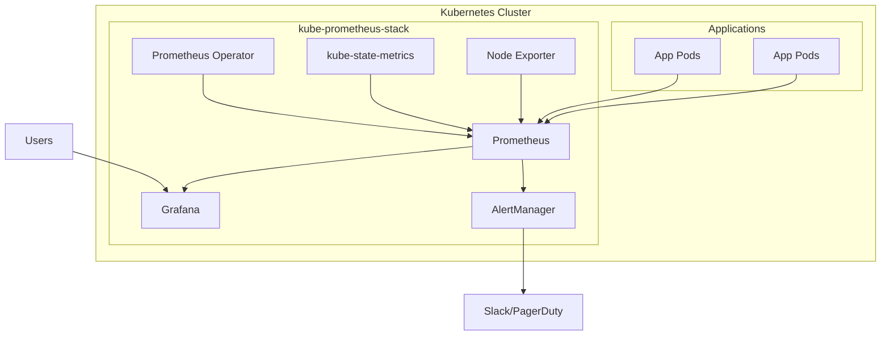

# Deploying Prometheus and Grafana with Helm

Author: [nawazdhandala](https://www.github.com/nawazdhandala)

Tags: Helm, Kubernetes, DevOps, Prometheus, Grafana, Monitoring, Observability

Description: Complete guide to deploying a production-ready Prometheus and Grafana monitoring stack on Kubernetes using Helm charts.

> A robust monitoring stack is essential for any Kubernetes deployment. This guide covers deploying Prometheus for metrics collection, Grafana for visualization, and AlertManager for alerting using the kube-prometheus-stack Helm chart.

## Architecture Overview



## Install kube-prometheus-stack

The kube-prometheus-stack includes Prometheus, Grafana, AlertManager, and useful exporters.

### Add Repository

```bash
# Add the prometheus-community repo
helm repo add prometheus-community https://prometheus-community.github.io/helm-charts

# Update repositories
helm repo update

# Search for available versions
helm search repo kube-prometheus-stack --versions
```

### Basic Installation

```bash
# Create monitoring namespace
kubectl create namespace monitoring

# Install with default values
helm install prometheus prometheus-community/kube-prometheus-stack \
  --namespace monitoring \
  --create-namespace
```

### Verify Installation

```bash
# Check all pods are running
kubectl get pods -n monitoring

# Check services
kubectl get svc -n monitoring

# Check that Prometheus is scraping targets
kubectl port-forward svc/prometheus-kube-prometheus-prometheus 9090:9090 -n monitoring
# Open http://localhost:9090/targets
```

## Custom Values Configuration

### Complete Production Values

```yaml
# prometheus-values.yaml
prometheus:
  prometheusSpec:
    # Resource limits
    resources:
      requests:
        memory: 2Gi
        cpu: 500m
      limits:
        memory: 4Gi
        cpu: 2000m
    
    # Storage configuration
    storageSpec:
      volumeClaimTemplate:
        spec:
          storageClassName: standard
          accessModes: ["ReadWriteOnce"]
          resources:
            requests:
              storage: 50Gi
    
    # Retention settings
    retention: 30d
    retentionSize: 45GB
    
    # Scrape interval
    scrapeInterval: 30s
    evaluationInterval: 30s
    
    # Enable admin API
    enableAdminAPI: true
    
    # Pod disruption budget
    podDisruptionBudget:
      enabled: true
      minAvailable: 1

    # Affinity and tolerations
    affinity:
      nodeAffinity:
        requiredDuringSchedulingIgnoredDuringExecution:
          nodeSelectorTerms:
          - matchExpressions:
            - key: node-type
              operator: In
              values:
              - monitoring

alertmanager:
  alertmanagerSpec:
    storage:
      volumeClaimTemplate:
        spec:
          storageClassName: standard
          accessModes: ["ReadWriteOnce"]
          resources:
            requests:
              storage: 10Gi
    
    resources:
      requests:
        memory: 256Mi
        cpu: 100m
      limits:
        memory: 512Mi
        cpu: 500m

grafana:
  enabled: true
  
  # Admin credentials
  adminPassword: "admin-password"
  
  # Persistence
  persistence:
    enabled: true
    size: 10Gi
    storageClassName: standard
  
  # Resources
  resources:
    requests:
      memory: 256Mi
      cpu: 100m
    limits:
      memory: 512Mi
      cpu: 500m
  
  # Ingress configuration
  ingress:
    enabled: true
    ingressClassName: nginx
    annotations:
      cert-manager.io/cluster-issuer: letsencrypt-prod
    hosts:
      - grafana.example.com
    tls:
      - secretName: grafana-tls
        hosts:
          - grafana.example.com
  
  # Additional data sources
  additionalDataSources:
    - name: Loki
      type: loki
      url: http://loki:3100
      access: proxy

# Node Exporter configuration
nodeExporter:
  enabled: true

# kube-state-metrics configuration
kubeStateMetrics:
  enabled: true

# Default scraping configurations
defaultRules:
  create: true
  rules:
    alertmanager: true
    etcd: true
    configReloaders: true
    general: true
    k8s: true
    kubeApiserverAvailability: true
    kubeApiserverBurnrate: true
    kubeApiserverHistogram: true
    kubeApiserverSlos: true
    kubeControllerManager: true
    kubelet: true
    kubeProxy: true
    kubePrometheusGeneral: true
    kubePrometheusNodeRecording: true
    kubernetesApps: true
    kubernetesResources: true
    kubernetesStorage: true
    kubernetesSystem: true
    kubeSchedulerAlerting: true
    kubeSchedulerRecording: true
    kubeStateMetrics: true
    network: true
    node: true
    nodeExporterAlerting: true
    nodeExporterRecording: true
    prometheus: true
    prometheusOperator: true
```

### Install with Custom Values

```bash
helm install prometheus prometheus-community/kube-prometheus-stack \
  --namespace monitoring \
  --create-namespace \
  -f prometheus-values.yaml
```

## Configure AlertManager

### Alert Routing Configuration

```yaml
# alertmanager-config.yaml
alertmanager:
  config:
    global:
      resolve_timeout: 5m
      smtp_smarthost: 'smtp.gmail.com:587'
      smtp_from: 'alerts@example.com'
      smtp_auth_username: 'alerts@example.com'
      smtp_auth_password: 'password'
      slack_api_url: 'https://hooks.slack.com/services/xxx/xxx/xxx'

    route:
      group_by: ['alertname', 'cluster', 'service']
      group_wait: 30s
      group_interval: 5m
      repeat_interval: 4h
      receiver: 'default-receiver'
      routes:
        - match:
            severity: critical
          receiver: 'pagerduty'
          continue: true
        - match:
            severity: warning
          receiver: 'slack-warnings'
        - match_re:
            service: ^(api|web)$
          receiver: 'team-backend'

    receivers:
      - name: 'default-receiver'
        email_configs:
          - to: 'team@example.com'
      
      - name: 'slack-warnings'
        slack_configs:
          - channel: '#alerts-warning'
            send_resolved: true
            title: '{{ .Status | toUpper }}: {{ .CommonLabels.alertname }}'
            text: '{{ range .Alerts }}{{ .Annotations.description }}{{ end }}'
      
      - name: 'pagerduty'
        pagerduty_configs:
          - service_key: 'your-pagerduty-service-key'
            severity: '{{ .CommonLabels.severity }}'
      
      - name: 'team-backend'
        slack_configs:
          - channel: '#backend-alerts'
            send_resolved: true

    inhibit_rules:
      - source_match:
          severity: 'critical'
        target_match:
          severity: 'warning'
        equal: ['alertname', 'cluster', 'service']
```

## Custom PrometheusRules

### Create Custom Alerting Rules

```yaml
# custom-alerts.yaml
apiVersion: monitoring.coreos.com/v1
kind: PrometheusRule
metadata:
  name: custom-alerts
  namespace: monitoring
  labels:
    release: prometheus
spec:
  groups:
    - name: application-alerts
      rules:
        - alert: HighErrorRate
          expr: |
            sum(rate(http_requests_total{status=~"5.."}[5m])) 
            / 
            sum(rate(http_requests_total[5m])) > 0.05
          for: 5m
          labels:
            severity: critical
          annotations:
            summary: High error rate detected
            description: Error rate is {{ printf "%.2f" $value }}% on {{ $labels.instance }}

        - alert: HighLatency
          expr: |
            histogram_quantile(0.95, 
              sum(rate(http_request_duration_seconds_bucket[5m])) by (le, service)
            ) > 1
          for: 5m
          labels:
            severity: warning
          annotations:
            summary: High latency detected
            description: 95th percentile latency is {{ printf "%.2f" $value }}s

        - alert: PodCrashLooping
          expr: |
            rate(kube_pod_container_status_restarts_total[15m]) > 0.2
          for: 5m
          labels:
            severity: warning
          annotations:
            summary: Pod is crash looping
            description: Pod {{ $labels.namespace }}/{{ $labels.pod }} is restarting frequently

        - alert: HighMemoryUsage
          expr: |
            container_memory_usage_bytes{container!=""} 
            / 
            container_spec_memory_limit_bytes{container!=""} > 0.9
          for: 5m
          labels:
            severity: warning
          annotations:
            summary: High memory usage
            description: Container {{ $labels.container }} in {{ $labels.pod }} using > 90% memory
```

Apply custom rules:

```bash
kubectl apply -f custom-alerts.yaml
```

## ServiceMonitor for Applications

### Create ServiceMonitor

```yaml
# servicemonitor.yaml
apiVersion: monitoring.coreos.com/v1
kind: ServiceMonitor
metadata:
  name: my-app-monitor
  namespace: monitoring
  labels:
    release: prometheus
spec:
  selector:
    matchLabels:
      app: my-app
  namespaceSelector:
    matchNames:
      - my-app-namespace
  endpoints:
    - port: metrics
      path: /metrics
      interval: 30s
      scrapeTimeout: 10s
```

### Application Service

```yaml
# app-service.yaml
apiVersion: v1
kind: Service
metadata:
  name: my-app
  namespace: my-app-namespace
  labels:
    app: my-app
spec:
  selector:
    app: my-app
  ports:
    - name: http
      port: 8080
    - name: metrics
      port: 9090
```

## Configure Grafana Dashboards

### Add Dashboards via ConfigMap

```yaml
# grafana-dashboard-configmap.yaml
apiVersion: v1
kind: ConfigMap
metadata:
  name: custom-dashboard
  namespace: monitoring
  labels:
    grafana_dashboard: "1"
data:
  my-dashboard.json: |
    {
      "dashboard": {
        "title": "My Application Dashboard",
        "panels": [
          {
            "title": "Request Rate",
            "type": "graph",
            "targets": [
              {
                "expr": "rate(http_requests_total[5m])",
                "legendFormat": "{{method}} {{path}}"
              }
            ]
          }
        ]
      }
    }
```

### Import Community Dashboards

```yaml
# grafana-values.yaml
grafana:
  dashboardProviders:
    dashboardproviders.yaml:
      apiVersion: 1
      providers:
        - name: 'default'
          orgId: 1
          folder: ''
          type: file
          disableDeletion: false
          editable: true
          options:
            path: /var/lib/grafana/dashboards/default

  dashboards:
    default:
      kubernetes-cluster:
        gnetId: 7249
        revision: 1
        datasource: Prometheus
      node-exporter:
        gnetId: 1860
        revision: 31
        datasource: Prometheus
      nginx-ingress:
        gnetId: 9614
        revision: 1
        datasource: Prometheus
```

## High Availability Setup

### HA Prometheus Values

```yaml
# prometheus-ha-values.yaml
prometheus:
  prometheusSpec:
    replicas: 2
    
    # Enable Thanos sidecar for HA
    thanos:
      image: quay.io/thanos/thanos:v0.32.0
      objectStorageConfig:
        key: thanos.yaml
        name: thanos-objstore-secret

    # Pod anti-affinity for HA
    affinity:
      podAntiAffinity:
        requiredDuringSchedulingIgnoredDuringExecution:
        - labelSelector:
            matchExpressions:
            - key: app.kubernetes.io/name
              operator: In
              values:
              - prometheus
          topologyKey: kubernetes.io/hostname

alertmanager:
  alertmanagerSpec:
    replicas: 3
    
    # HA cluster configuration
    clusterAdvertiseAddress: false
    
    affinity:
      podAntiAffinity:
        requiredDuringSchedulingIgnoredDuringExecution:
        - labelSelector:
            matchExpressions:
            - key: app.kubernetes.io/name
              operator: In
              values:
              - alertmanager
          topologyKey: kubernetes.io/hostname

grafana:
  replicas: 2
  
  # Use external database for HA
  env:
    GF_DATABASE_TYPE: postgres
    GF_DATABASE_HOST: postgres:5432
    GF_DATABASE_NAME: grafana
    GF_DATABASE_USER: grafana
  
  envFromSecret: grafana-db-credentials
```

### Thanos Object Storage Secret

```yaml
# thanos-secret.yaml
apiVersion: v1
kind: Secret
metadata:
  name: thanos-objstore-secret
  namespace: monitoring
type: Opaque
stringData:
  thanos.yaml: |
    type: S3
    config:
      bucket: prometheus-thanos
      endpoint: s3.amazonaws.com
      access_key: AKIAXXXXXXXX
      secret_key: XXXXXXXX
```

## Access Prometheus and Grafana

### Port Forwarding

```bash
# Access Prometheus
kubectl port-forward svc/prometheus-kube-prometheus-prometheus 9090:9090 -n monitoring

# Access Grafana
kubectl port-forward svc/prometheus-grafana 3000:80 -n monitoring

# Access AlertManager
kubectl port-forward svc/prometheus-kube-prometheus-alertmanager 9093:9093 -n monitoring
```

### Get Grafana Credentials

```bash
# Get admin password
kubectl get secret prometheus-grafana -n monitoring -o jsonpath="{.data.admin-password}" | base64 --decode
```

## Resource Sizing Guide

| Cluster Size | Prometheus CPU | Prometheus Memory | Storage |
|--------------|----------------|-------------------|---------|
| Small (< 50 pods) | 500m | 1Gi | 20Gi |
| Medium (50-200 pods) | 1000m | 2Gi | 50Gi |
| Large (200-500 pods) | 2000m | 4Gi | 100Gi |
| XL (500+ pods) | 4000m | 8Gi | 200Gi |

## Upgrade the Stack

```bash
# Update repo
helm repo update

# Check for new versions
helm search repo kube-prometheus-stack --versions

# Upgrade with existing values
helm upgrade prometheus prometheus-community/kube-prometheus-stack \
  --namespace monitoring \
  -f prometheus-values.yaml
```

## Uninstall

```bash
# Uninstall the stack
helm uninstall prometheus -n monitoring

# Clean up CRDs (optional - they persist after uninstall)
kubectl delete crd alertmanagerconfigs.monitoring.coreos.com
kubectl delete crd alertmanagers.monitoring.coreos.com
kubectl delete crd podmonitors.monitoring.coreos.com
kubectl delete crd probes.monitoring.coreos.com
kubectl delete crd prometheusagents.monitoring.coreos.com
kubectl delete crd prometheuses.monitoring.coreos.com
kubectl delete crd prometheusrules.monitoring.coreos.com
kubectl delete crd scrapeconfigs.monitoring.coreos.com
kubectl delete crd servicemonitors.monitoring.coreos.com
kubectl delete crd thanosrulers.monitoring.coreos.com
```

## Wrap-up

The kube-prometheus-stack Helm chart provides a complete monitoring solution for Kubernetes. Customize the values for production use with appropriate resources, storage, and retention settings. Use ServiceMonitors to scrape your applications, PrometheusRules for custom alerts, and configure AlertManager for routing notifications. For high availability, deploy multiple replicas with pod anti-affinity and consider using Thanos for long-term storage and cross-cluster federation.
