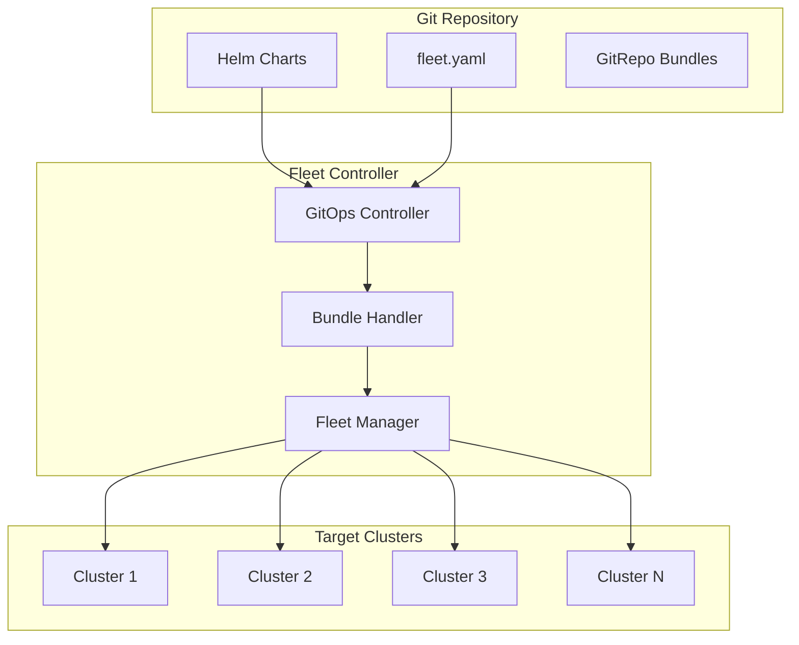
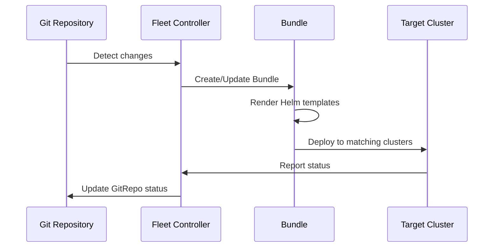

# How to Use Rancher Fleet for GitOps at Scale with Helm Charts

Author: [nawazdhandala](https://www.github.com/nawazdhandala)

Tags: Helm, Kubernetes, Rancher, Fleet, GitOps, Multi-cluster, DevOps

Description: Complete guide to using Rancher Fleet for GitOps-based Helm deployments across multiple Kubernetes clusters at enterprise scale.

> Rancher Fleet enables GitOps-based Helm deployments across hundreds of Kubernetes clusters. This guide covers Fleet architecture, configuration, and best practices for managing Helm charts at scale.

## Fleet Architecture



## Installing Fleet

### Via Rancher

```bash
# Fleet is automatically installed with Rancher
# Access via Rancher UI: Continuous Delivery > Git Repos

# Or install standalone
helm repo add fleet https://rancher.github.io/fleet-helm-charts/
helm repo update

# Install Fleet CRDs
helm install -n cattle-fleet-system fleet-crd fleet/fleet-crd \
  --create-namespace

# Install Fleet controller
helm install -n cattle-fleet-system fleet fleet/fleet \
  --create-namespace
```

### Standalone Fleet

```bash
# Install Fleet standalone (without Rancher)
kubectl create namespace cattle-fleet-system

helm install fleet-crd fleet/fleet-crd \
  -n cattle-fleet-system

helm install fleet fleet/fleet \
  -n cattle-fleet-system \
  --set apiServerURL=https://kubernetes.default.svc.cluster.local \
  --set apiServerCA="$(kubectl config view --flatten -o jsonpath='{.clusters[0].cluster.certificate-authority-data}' | base64 -d)"
```

## Basic Fleet Configuration

### GitRepo Resource

```yaml
# gitrepo.yaml
apiVersion: fleet.cattle.io/v1alpha1
kind: GitRepo
metadata:
  name: helm-apps
  namespace: fleet-default
spec:
  # Git repository URL
  repo: https://github.com/myorg/helm-charts
  
  # Branch or tag
  branch: main
  
  # Paths to process
  paths:
    - charts/app1
    - charts/app2
  
  # Target clusters
  targets:
    - name: production
      clusterSelector:
        matchLabels:
          env: production
    - name: staging
      clusterSelector:
        matchLabels:
          env: staging
```

### Fleet.yaml for Helm Charts

```yaml
# charts/myapp/fleet.yaml
defaultNamespace: myapp

helm:
  # Chart location (relative to this directory)
  chart: .
  
  # Release name
  releaseName: myapp
  
  # Values file
  valuesFiles:
    - values.yaml
  
  # Inline values
  values:
    replicaCount: 3
    image:
      tag: v1.2.3

# Target-specific overrides
targetCustomizations:
  - name: production
    helm:
      values:
        replicaCount: 5
        resources:
          limits:
            cpu: "2"
            memory: 4Gi
  
  - name: staging
    helm:
      values:
        replicaCount: 2
        resources:
          limits:
            cpu: "500m"
            memory: 1Gi
```

## Multi-Cluster Targeting

### Cluster Groups

```yaml
# cluster-group.yaml
apiVersion: fleet.cattle.io/v1alpha1
kind: ClusterGroup
metadata:
  name: us-production
  namespace: fleet-default
spec:
  selector:
    matchLabels:
      region: us
      env: production
---
apiVersion: fleet.cattle.io/v1alpha1
kind: ClusterGroup
metadata:
  name: eu-production
  namespace: fleet-default
spec:
  selector:
    matchLabels:
      region: eu
      env: production
```

### Advanced Targeting

```yaml
# gitrepo-advanced.yaml
apiVersion: fleet.cattle.io/v1alpha1
kind: GitRepo
metadata:
  name: regional-apps
  namespace: fleet-default
spec:
  repo: https://github.com/myorg/helm-charts
  branch: main
  paths:
    - charts/*
  
  targets:
    # Match by cluster group
    - name: us-prod
      clusterGroup: us-production
    
    # Match by labels
    - name: eu-prod
      clusterSelector:
        matchLabels:
          region: eu
          env: production
    
    # Match by expressions
    - name: high-memory-clusters
      clusterSelector:
        matchExpressions:
          - key: memory-class
            operator: In
            values:
              - high
              - extreme
```

## Environment-Specific Values

### Directory Structure

```
helm-charts/
├── base/
│   └── myapp/
│       ├── Chart.yaml
│       ├── values.yaml
│       ├── fleet.yaml
│       └── templates/
├── overlays/
│   ├── production/
│   │   ├── fleet.yaml
│   │   └── values.yaml
│   ├── staging/
│   │   ├── fleet.yaml
│   │   └── values.yaml
│   └── development/
│       ├── fleet.yaml
│       └── values.yaml
```

### Base Fleet Configuration

```yaml
# base/myapp/fleet.yaml
defaultNamespace: myapp

helm:
  chart: .
  releaseName: myapp
  
  # Common values
  values:
    image:
      repository: myregistry.io/myapp
    
    monitoring:
      enabled: true
```

### Production Overlay

```yaml
# overlays/production/fleet.yaml
defaultNamespace: myapp-production

helm:
  chart: ../../base/myapp
  releaseName: myapp-production
  
  valuesFiles:
    - ../../base/myapp/values.yaml
    - values.yaml
  
  values:
    replicaCount: 10
    
    resources:
      limits:
        cpu: "4"
        memory: 8Gi
      requests:
        cpu: "2"
        memory: 4Gi
    
    autoscaling:
      enabled: true
      minReplicas: 10
      maxReplicas: 50

targetCustomizations:
  - name: us-east
    clusterSelector:
      matchLabels:
        region: us-east
    helm:
      values:
        nodeSelector:
          topology.kubernetes.io/zone: us-east-1a
  
  - name: us-west
    clusterSelector:
      matchLabels:
        region: us-west
    helm:
      values:
        nodeSelector:
          topology.kubernetes.io/zone: us-west-2a
```

## Helm Chart from Repository

### Using External Charts

```yaml
# fleet.yaml for external chart
defaultNamespace: monitoring

helm:
  # External repository chart
  repo: https://prometheus-community.github.io/helm-charts
  chart: kube-prometheus-stack
  version: "51.0.0"
  releaseName: monitoring
  
  # Values override
  valuesFiles:
    - values.yaml

targetCustomizations:
  - name: production
    clusterSelector:
      matchLabels:
        env: production
    helm:
      values:
        prometheus:
          prometheusSpec:
            retention: 30d
            storageSpec:
              volumeClaimTemplate:
                spec:
                  resources:
                    requests:
                      storage: 100Gi
```

### OCI Registry Charts

```yaml
# fleet.yaml for OCI chart
defaultNamespace: myapp

helm:
  # OCI registry
  repo: oci://registry.example.com/charts
  chart: myapp
  version: "1.2.3"
  releaseName: myapp

# Authentication via ImagePullSecrets or Rancher secrets
```

## Bundle Lifecycle

### Bundle Stages



### Monitoring Bundles

```bash
# List bundles
kubectl get bundles -n fleet-default

# Describe bundle
kubectl describe bundle helm-apps-myapp -n fleet-default

# Check bundle deployment status
kubectl get bundledeployments -A

# View bundle content
kubectl get bundle helm-apps-myapp -n fleet-default -o yaml
```

## Drift Detection and Correction

### Configure Drift Policy

```yaml
# fleet.yaml
defaultNamespace: myapp

helm:
  chart: .
  releaseName: myapp

# Drift correction settings
correctDrift:
  enabled: true
  force: false
  keepFailHistory: true

# Compare options
diff:
  comparePatches:
    - apiVersion: apps/v1
      kind: Deployment
      name: myapp
      operations:
        - op: remove
          path: /spec/replicas  # Ignore HPA-managed replicas
```

### Pausing Sync

```yaml
# Pause synchronization
apiVersion: fleet.cattle.io/v1alpha1
kind: GitRepo
metadata:
  name: helm-apps
  namespace: fleet-default
  annotations:
    # Pause this GitRepo
    fleet.cattle.io/paused: "true"
spec:
  repo: https://github.com/myorg/helm-charts
  branch: main
```

## Secrets Management

### Sealed Secrets Integration

```yaml
# fleet.yaml
defaultNamespace: myapp

helm:
  chart: .
  releaseName: myapp

# Depend on sealed-secrets being installed
dependsOn:
  - name: sealed-secrets
    namespace: kube-system
```

### External Secrets

```yaml
# fleet.yaml with external secrets
defaultNamespace: myapp

helm:
  chart: .
  releaseName: myapp
  
  values:
    # Reference ExternalSecret
    database:
      existingSecret: myapp-db-credentials

# ExternalSecret in same bundle
yaml:
  overlays:
    - name: external-secret
      contents: |
        apiVersion: external-secrets.io/v1beta1
        kind: ExternalSecret
        metadata:
          name: myapp-db-credentials
        spec:
          secretStoreRef:
            name: vault-backend
            kind: ClusterSecretStore
          target:
            name: myapp-db-credentials
          data:
            - secretKey: password
              remoteRef:
                key: myapp/database
                property: password
```

## Rollout Strategies

### Progressive Rollout

```yaml
# gitrepo.yaml with rollout strategy
apiVersion: fleet.cattle.io/v1alpha1
kind: GitRepo
metadata:
  name: helm-apps
  namespace: fleet-default
spec:
  repo: https://github.com/myorg/helm-charts
  branch: main
  
  targets:
    # Deploy to canary first
    - name: canary
      clusterSelector:
        matchLabels:
          tier: canary
    
    # Then staging
    - name: staging
      clusterSelector:
        matchLabels:
          env: staging
    
    # Finally production (requires manual approval)
    - name: production
      clusterSelector:
        matchLabels:
          env: production
```

### Cluster-by-Cluster Rollout

```yaml
# fleet.yaml
defaultNamespace: myapp

helm:
  chart: .
  releaseName: myapp

rolloutStrategy:
  # Deploy to one cluster at a time
  maxConcurrent: 1
  
  # Wait between clusters
  pauseBetweenBatches: 5m
  
  # Auto-pause on errors
  autoPromote: false
```

## Monitoring Fleet Deployments

### Prometheus Metrics

```yaml
# ServiceMonitor for Fleet
apiVersion: monitoring.coreos.com/v1
kind: ServiceMonitor
metadata:
  name: fleet-controller
  namespace: cattle-fleet-system
spec:
  selector:
    matchLabels:
      app: fleet-controller
  endpoints:
    - port: metrics
      interval: 30s
```

### Grafana Dashboard Queries

```promql
# Bundle deployment status
sum by (state) (fleet_bundle_deployment_status)

# GitRepo sync status
fleet_gitrepo_status{status="ready"}

# Deployment failures
increase(fleet_bundle_deployment_errors_total[1h])
```

## Troubleshooting

### Common Issues

```bash
# Check Fleet controller logs
kubectl logs -n cattle-fleet-system -l app=fleet-controller -f

# Check GitRepo status
kubectl get gitrepo -n fleet-default -o wide

# Debug bundle deployment
kubectl describe bundledeployment <name> -n fleet-default

# Check cluster registration
kubectl get clusters.fleet.cattle.io -n fleet-default

# Force re-sync
kubectl annotate gitrepo helm-apps -n fleet-default \
  fleet.cattle.io/force-sync-generation=$(date +%s) --overwrite
```

### Debug Fleet.yaml

```bash
# Validate fleet.yaml locally
fleet apply --dry-run -b ./charts/myapp

# Test Helm rendering
cd charts/myapp
helm template . -f values.yaml
```

## Best Practices

| Practice | Description |
|----------|-------------|
| Use Cluster Groups | Organize clusters logically |
| Layer Configurations | Base + overlay pattern |
| Version Charts | Pin chart versions in fleet.yaml |
| Monitor Bundles | Track deployment status |
| Progressive Rollout | Canary → Staging → Production |
| Pause on Errors | Review before continuing |

## Fleet vs Other GitOps Tools

| Feature | Fleet | ArgoCD | Flux |
|---------|-------|--------|------|
| Multi-cluster | Native | App-of-apps | Kustomization |
| Helm Support | Built-in | Built-in | HelmRelease |
| Scale | 1M+ clusters | 100s clusters | 100s clusters |
| UI | Rancher | ArgoCD UI | Flux UI (3rd party) |
| Learning Curve | Low | Medium | Medium |

## Wrap-up

Rancher Fleet simplifies GitOps-based Helm deployments at scale. Its cluster targeting, environment overlays, and progressive rollout capabilities make it ideal for enterprise multi-cluster management. Combined with Rancher's UI, Fleet provides a powerful platform for managing Kubernetes deployments across hundreds or thousands of clusters.
