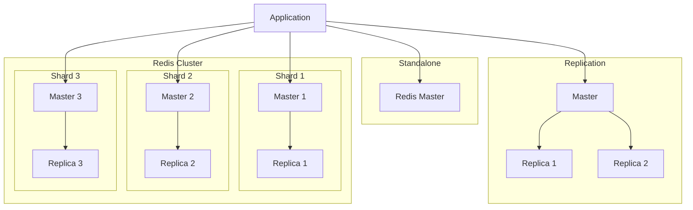

# Deploying Redis Cluster on Kubernetes with Helm

Author: [nawazdhandala](https://www.github.com/nawazdhandala)

Tags: Helm, Kubernetes, DevOps, Redis, Caching, High Availability

Description: Complete guide to deploying Redis on Kubernetes using Helm charts, covering standalone instances, replication, clustering, and production configurations.

> Redis is a powerful in-memory data store used for caching, session storage, and messaging. This guide covers deploying Redis on Kubernetes using Bitnami's Helm chart, from simple instances to highly available Redis clusters.

## Architecture Options



## Installation

### Add Repository

```bash
# Add Bitnami repository
helm repo add bitnami https://charts.bitnami.com/bitnami

# Update repositories
helm repo update

# Search for available versions
helm search repo bitnami/redis --versions
```

### Basic Installation (Standalone)

```bash
# Install standalone Redis
helm install redis bitnami/redis \
  --namespace cache \
  --create-namespace \
  --set architecture=standalone

# Get password
export REDIS_PASSWORD=$(kubectl get secret redis -n cache -o jsonpath="{.data.redis-password}" | base64 -d)
echo $REDIS_PASSWORD
```

### Connect to Redis

```bash
# Port forward
kubectl port-forward svc/redis-master 6379:6379 -n cache

# Connect with redis-cli
redis-cli -a $REDIS_PASSWORD
```

## Replication Setup

### Replication Values

```yaml
# redis-replication-values.yaml
architecture: replication

auth:
  enabled: true
  password: "your-secure-password"

master:
  count: 1
  resources:
    requests:
      memory: 256Mi
      cpu: 100m
    limits:
      memory: 1Gi
      cpu: 500m
  
  persistence:
    enabled: true
    storageClass: "standard"
    size: 10Gi
  
  configuration: |
    maxmemory 512mb
    maxmemory-policy allkeys-lru
    appendonly yes
    appendfsync everysec

replica:
  replicaCount: 2
  resources:
    requests:
      memory: 256Mi
      cpu: 100m
    limits:
      memory: 1Gi
      cpu: 500m
  
  persistence:
    enabled: true
    storageClass: "standard"
    size: 10Gi
  
  # Pod anti-affinity
  affinity:
    podAntiAffinity:
      preferredDuringSchedulingIgnoredDuringExecution:
      - weight: 100
        podAffinityTerm:
          labelSelector:
            matchLabels:
              app.kubernetes.io/component: replica
          topologyKey: kubernetes.io/hostname

sentinel:
  enabled: true
  quorum: 2
  resources:
    requests:
      memory: 64Mi
      cpu: 50m
    limits:
      memory: 128Mi
      cpu: 100m

metrics:
  enabled: true
  serviceMonitor:
    enabled: true
    namespace: monitoring
    labels:
      release: prometheus
```

### Install with Replication

```bash
helm install redis bitnami/redis \
  --namespace cache \
  --create-namespace \
  -f redis-replication-values.yaml
```

## Production Configuration

### Complete Production Values

```yaml
# redis-production-values.yaml
architecture: replication

global:
  storageClass: "fast-ssd"

auth:
  enabled: true
  existingSecret: "redis-credentials"
  existingSecretPasswordKey: "redis-password"

master:
  count: 1
  
  resources:
    requests:
      memory: 1Gi
      cpu: 500m
    limits:
      memory: 4Gi
      cpu: 2000m
  
  persistence:
    enabled: true
    size: 50Gi
  
  podDisruptionBudget:
    create: true
    minAvailable: 1
  
  configuration: |
    # Memory management
    maxmemory 3gb
    maxmemory-policy allkeys-lru
    maxmemory-samples 10
    
    # Persistence
    appendonly yes
    appendfsync everysec
    auto-aof-rewrite-percentage 100
    auto-aof-rewrite-min-size 64mb
    
    # Network
    tcp-backlog 511
    timeout 0
    tcp-keepalive 300
    
    # Performance
    activerehashing yes
    hz 10
    dynamic-hz yes
    
    # Logging
    loglevel notice
    
    # Slow log
    slowlog-log-slower-than 10000
    slowlog-max-len 128
  
  nodeSelector:
    node-type: cache
  
  tolerations:
    - key: "dedicated"
      operator: "Equal"
      value: "cache"
      effect: "NoSchedule"

replica:
  replicaCount: 3
  
  resources:
    requests:
      memory: 1Gi
      cpu: 500m
    limits:
      memory: 4Gi
      cpu: 2000m
  
  persistence:
    enabled: true
    size: 50Gi
  
  podDisruptionBudget:
    create: true
    minAvailable: 2
  
  affinity:
    podAntiAffinity:
      requiredDuringSchedulingIgnoredDuringExecution:
      - labelSelector:
          matchLabels:
            app.kubernetes.io/component: replica
        topologyKey: kubernetes.io/hostname
  
  autoscaling:
    enabled: true
    minReplicas: 3
    maxReplicas: 10
    targetCPU: 80
    targetMemory: 80

sentinel:
  enabled: true
  quorum: 2
  
  resources:
    requests:
      memory: 128Mi
      cpu: 100m
    limits:
      memory: 256Mi
      cpu: 200m
  
  configuration: |
    down-after-milliseconds 5000
    failover-timeout 60000
    parallel-syncs 1

networkPolicy:
  enabled: true
  allowExternal: false
  ingressNSMatchLabels:
    redis-access: "true"

metrics:
  enabled: true
  serviceMonitor:
    enabled: true
    namespace: monitoring
    labels:
      release: prometheus
  
  prometheusRule:
    enabled: true
    namespace: monitoring
    labels:
      release: prometheus
    rules:
      - alert: RedisDown
        expr: redis_up == 0
        for: 5m
        labels:
          severity: critical
        annotations:
          summary: Redis instance is down
      - alert: RedisMemoryHigh
        expr: redis_memory_used_bytes / redis_memory_max_bytes > 0.9
        for: 5m
        labels:
          severity: warning
        annotations:
          summary: Redis memory usage is high
```

### Create Credentials Secret

```bash
kubectl create secret generic redis-credentials \
  --namespace cache \
  --from-literal=redis-password=$(openssl rand -base64 32)
```

## Redis Cluster (Sharded)

For horizontal scaling with data partitioning:

```yaml
# redis-cluster-values.yaml
# Use the bitnami/redis-cluster chart for true clustering

cluster:
  nodes: 6  # 3 masters + 3 replicas
  replicas: 1

redis:
  resources:
    requests:
      memory: 1Gi
      cpu: 500m
    limits:
      memory: 4Gi
      cpu: 2000m
  
  configuration: |
    maxmemory 3gb
    maxmemory-policy allkeys-lru
    cluster-require-full-coverage no
    cluster-allow-reads-when-down yes

persistence:
  enabled: true
  storageClass: "fast-ssd"
  size: 50Gi

metrics:
  enabled: true
  serviceMonitor:
    enabled: true

usePassword: true
password: "your-secure-password"
```

### Install Redis Cluster

```bash
helm install redis-cluster bitnami/redis-cluster \
  --namespace cache \
  --create-namespace \
  -f redis-cluster-values.yaml
```

## TLS Configuration

```yaml
# redis-tls-values.yaml
tls:
  enabled: true
  authClients: true
  autoGenerated: true
  # Or use existing certificates
  # existingSecret: "redis-tls"
  # certFilename: "tls.crt"
  # certKeyFilename: "tls.key"
  # certCAFilename: "ca.crt"

master:
  configuration: |
    tls-port 6379
    port 0
    tls-replication yes
    tls-auth-clients yes
```

## Connection Pooling

Configure your application with connection pooling:

### Python (redis-py)

```python
import redis

# Connection pool
pool = redis.ConnectionPool(
    host='redis-master.cache.svc.cluster.local',
    port=6379,
    password='your-password',
    max_connections=50,
    decode_responses=True
)

# Client with pool
client = redis.Redis(connection_pool=pool)

# For Sentinel
from redis.sentinel import Sentinel

sentinel = Sentinel([
    ('redis.cache.svc.cluster.local', 26379)
], socket_timeout=0.5, password='your-password')

# Get master
master = sentinel.master_for('mymaster', password='your-password')
master.set('key', 'value')

# Get replica for reads
replica = sentinel.slave_for('mymaster', password='your-password')
value = replica.get('key')
```

### Node.js (ioredis)

```javascript
const Redis = require('ioredis');

// Single instance
const redis = new Redis({
  host: 'redis-master.cache.svc.cluster.local',
  port: 6379,
  password: 'your-password',
  maxRetriesPerRequest: 3,
  retryDelayOnFailover: 100,
});

// With Sentinel
const redis = new Redis({
  sentinels: [
    { host: 'redis.cache.svc.cluster.local', port: 26379 }
  ],
  name: 'mymaster',
  password: 'your-password',
  sentinelPassword: 'your-password'
});

// Redis Cluster
const cluster = new Redis.Cluster([
  { host: 'redis-cluster-0.redis-cluster-headless.cache.svc.cluster.local', port: 6379 },
  { host: 'redis-cluster-1.redis-cluster-headless.cache.svc.cluster.local', port: 6379 },
  { host: 'redis-cluster-2.redis-cluster-headless.cache.svc.cluster.local', port: 6379 }
], {
  redisOptions: {
    password: 'your-password'
  }
});
```

## Backup and Restore

### Create Backup Job

```yaml
# redis-backup-job.yaml
apiVersion: batch/v1
kind: CronJob
metadata:
  name: redis-backup
  namespace: cache
spec:
  schedule: "0 2 * * *"
  concurrencyPolicy: Forbid
  jobTemplate:
    spec:
      template:
        spec:
          containers:
          - name: backup
            image: bitnami/redis:7.2
            env:
            - name: REDIS_PASSWORD
              valueFrom:
                secretKeyRef:
                  name: redis-credentials
                  key: redis-password
            command:
            - /bin/bash
            - -c
            - |
              redis-cli -h redis-master -a $REDIS_PASSWORD --rdb /backup/dump-$(date +%Y%m%d-%H%M%S).rdb
              # Optional: Upload to S3
              # aws s3 cp /backup/*.rdb s3://my-bucket/redis-backups/
            volumeMounts:
            - name: backup
              mountPath: /backup
          restartPolicy: OnFailure
          volumes:
          - name: backup
            persistentVolumeClaim:
              claimName: redis-backup-pvc
```

### Restore from Backup

```bash
# Copy RDB file to pod
kubectl cp dump.rdb cache/redis-master-0:/data/

# Restart Redis to load the backup
kubectl rollout restart statefulset redis-master -n cache
```

## Monitoring Queries

Useful Redis commands for monitoring:

```bash
# Connect to Redis
kubectl exec -it redis-master-0 -n cache -- redis-cli -a $REDIS_PASSWORD

# Server info
INFO

# Memory usage
INFO memory
MEMORY STATS

# Connected clients
INFO clients
CLIENT LIST

# Replication status
INFO replication

# Slow log
SLOWLOG GET 10

# Key statistics
INFO keyspace
DBSIZE

# Monitor commands in real-time
MONITOR
```

## Resource Sizing Guide

| Use Case | CPU | Memory | Storage | Replicas |
|----------|-----|--------|---------|----------|
| Development | 100m | 256Mi | 1Gi | 1 |
| Session Cache | 250m | 512Mi | 5Gi | 2 |
| Application Cache | 500m | 2Gi | 10Gi | 2-3 |
| Message Queue | 500m | 1Gi | 20Gi | 3 |
| Large Scale | 2000m | 8Gi | 100Gi | 3+ |

## Troubleshooting

### Check Logs

```bash
# Master logs
kubectl logs redis-master-0 -n cache

# Replica logs
kubectl logs redis-replicas-0 -n cache

# Sentinel logs
kubectl logs redis-node-0 -c sentinel -n cache
```

### Check Replication

```bash
# Connect to master
kubectl exec -it redis-master-0 -n cache -- redis-cli -a $REDIS_PASSWORD INFO replication

# Check sentinel status
kubectl exec -it redis-node-0 -c sentinel -n cache -- redis-cli -p 26379 SENTINEL masters
kubectl exec -it redis-node-0 -c sentinel -n cache -- redis-cli -p 26379 SENTINEL replicas mymaster
```

### Common Issues

**High Memory Usage:**
```bash
# Check memory
redis-cli INFO memory

# Clear keys with pattern (careful!)
redis-cli KEYS "pattern:*" | xargs redis-cli DEL

# Set eviction policy
CONFIG SET maxmemory-policy allkeys-lru
```

**Replication Lag:**
```bash
# Check lag
redis-cli INFO replication | grep lag
```

## Wrap-up

Redis on Kubernetes with Helm provides flexible deployment options from standalone instances to highly available clusters. Use replication with Sentinel for automatic failover, or Redis Cluster for horizontal scaling. Configure appropriate memory limits and eviction policies, enable persistence for data durability, and set up monitoring with Prometheus metrics. Always use authentication and consider TLS for production deployments.
