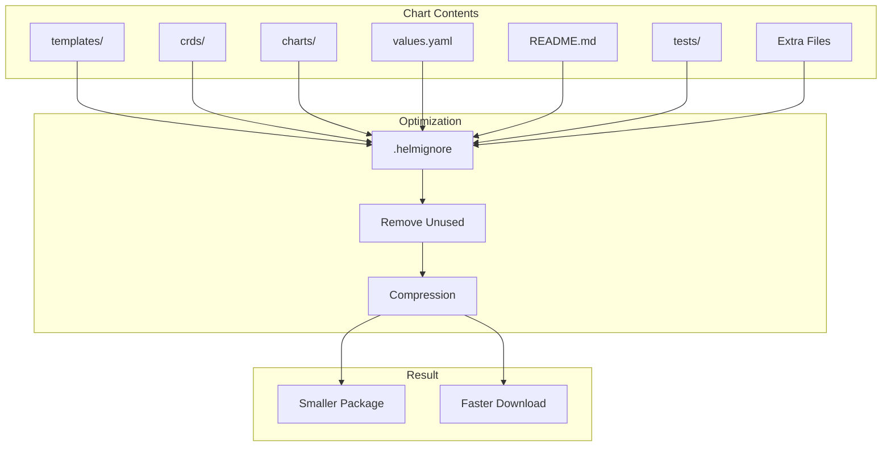

# How to Reduce Helm Chart Size and Improve Download Times

Author: [nawazdhandala](https://www.github.com/nawazdhandala)

Tags: Helm, Kubernetes, DevOps, Performance, Optimization, CI/CD

Description: Guide to optimizing Helm chart size through .helmignore patterns, file exclusion, and compression techniques for faster CI/CD pipelines and downloads.

> Large Helm charts slow down CI/CD pipelines and deployments. This guide covers techniques to reduce chart size including .helmignore patterns, removing unnecessary files, and optimizing chart structure for faster distribution.

## Chart Size Analysis



## Analyzing Chart Size

### Check Current Size

```bash
# Package chart to see size
helm package charts/myapp
ls -lh myapp-*.tgz

# Unpack to analyze contents
tar tzf myapp-1.0.0.tgz | head -50

# Count files and show sizes
tar tzf myapp-1.0.0.tgz | wc -l
tar tzvf myapp-1.0.0.tgz | awk '{total += $3} END {print "Total: " total/1024 " KB"}'

# Find largest files
tar tzvf myapp-1.0.0.tgz | sort -k3 -rn | head -20
```

### Compare Before and After

```bash
#!/bin/bash
# analyze-chart.sh

CHART_DIR=$1

echo "=== Chart Analysis: $CHART_DIR ==="

# File count by directory
echo -e "\nFile counts by directory:"
find "$CHART_DIR" -type f | sed "s|$CHART_DIR/||" | cut -d'/' -f1 | sort | uniq -c

# Size by directory
echo -e "\nSize by directory:"
du -sh "$CHART_DIR"/*

# Total size
echo -e "\nTotal unpacked size:"
du -sh "$CHART_DIR"

# Packaged size
helm package "$CHART_DIR" -d /tmp >/dev/null
PACKAGE=$(ls -1t /tmp/*.tgz | head -1)
echo -e "\nPackaged size:"
ls -lh "$PACKAGE"
rm -f "$PACKAGE"
```

## .helmignore Configuration

### Comprehensive .helmignore

```gitignore
# .helmignore

# Version control
.git
.git/
.gitignore
.gitattributes

# IDE and editor files
.idea/
.vscode/
*.swp
*.swo
*~
.DS_Store

# Build artifacts
*.tgz
*.tar.gz
.helmignore.bak

# Test files (if not needed in package)
tests/
*_test.yaml
*_test.go
test/
__tests__/
*.test.yaml

# Documentation extras
docs/
*.md
!README.md
!NOTES.txt
CHANGELOG.md
CONTRIBUTING.md
LICENSE

# CI/CD configurations
.github/
.gitlab-ci.yml
.travis.yml
Jenkinsfile
azure-pipelines.yml
.circleci/
Makefile

# Development files
Dockerfile
docker-compose.yml
.dockerignore
.editorconfig
.pre-commit-config.yaml

# Examples and samples
examples/
samples/
demo/

# Backup files
*.bak
*.backup
*.orig

# Temporary files
tmp/
temp/
*.tmp

# Node.js (if using helm-docs or similar)
node_modules/
package.json
package-lock.json
yarn.lock

# Python
__pycache__/
*.py
*.pyc
requirements.txt
venv/

# Schema files (if large and not needed at runtime)
# values.schema.json  # Uncomment if not needed

# Subchart sources (packaged charts exist in charts/)
charts/*.tgz.prov
charts/*.tgz.sig

# Local overrides
values-local.yaml
values-dev.yaml
secrets.yaml
*.enc.yaml
```

### Verify .helmignore Effect

```bash
# Show what's included/excluded
helm package charts/myapp --debug 2>&1 | grep -E "(skipping|copying)"

# Compare packaged vs source
tar tzf myapp-1.0.0.tgz > packaged-files.txt
find charts/myapp -type f | sed 's|charts/myapp/||' | sort > source-files.txt
diff source-files.txt packaged-files.txt
```

## Reducing File Sizes

### Minimize values.yaml Comments

```yaml
# Before: Heavily commented
# values.yaml
# This is the main configuration file for the application.
# 
# Replica Configuration
# --------------------
# replicaCount controls the number of pod replicas.
# Minimum is 1, maximum recommended is 10 for production.
# For high availability, use at least 3 replicas.
replicaCount: 3

# After: Minimal comments
# values.yaml
# Default values for myapp.
# See README.md for full documentation.
replicaCount: 3
```

### Split Large Templates

```yaml
# Instead of one large deployment.yaml (1000+ lines)
# Split into focused files

# templates/deployment.yaml - Core deployment
# templates/deployment-volumes.yaml - Volume configuration  
# templates/deployment-env.yaml - Environment variables

# Use named templates for reuse
{{- define "myapp.volumes" -}}
# Volume definitions
{{- end -}}
```

### Optimize Template Logic

```yaml
# Before: Verbose with repeated logic
{{- if and .Values.ingress.enabled (eq .Values.ingress.className "nginx") }}
apiVersion: networking.k8s.io/v1
kind: Ingress
# ... 50 lines
{{- end }}
{{- if and .Values.ingress.enabled (eq .Values.ingress.className "traefik") }}
apiVersion: networking.k8s.io/v1
kind: Ingress
# ... 50 lines (similar)
{{- end }}

# After: Consolidated
{{- if .Values.ingress.enabled }}
apiVersion: networking.k8s.io/v1
kind: Ingress
metadata:
  name: {{ include "myapp.fullname" . }}
  annotations:
    {{- include (printf "myapp.ingress.%s.annotations" .Values.ingress.className) . | nindent 4 }}
spec:
  ingressClassName: {{ .Values.ingress.className }}
  # Common spec
{{- end }}
```

## Managing Dependencies

### Use Dependency Aliases

```yaml
# Chart.yaml
dependencies:
  - name: postgresql
    version: "12.x.x"
    repository: https://charts.bitnami.com/bitnami
    condition: postgresql.enabled
    # Don't include if large and rarely needed
    tags:
      - database
```

### Optional Dependencies

```bash
# Build without optional dependencies
helm dependency build charts/myapp --skip-refresh

# Only include needed dependencies
helm package charts/myapp
```

### Trim Subchart Files

```bash
# After helm dependency update, subcharts are in charts/
# You can remove unnecessary files from downloaded charts

# Create script to trim subcharts
cat > trim-subcharts.sh << 'EOF'
#!/bin/bash
for chart in charts/*/; do
  # Remove README files
  rm -f "$chart"/*.md
  # Remove test files
  rm -rf "$chart/tests"
  # Remove CI files
  rm -rf "$chart/ci"
done
EOF
```

## CI/CD Optimization

### Cache Dependencies

```yaml
# .github/workflows/deploy.yaml
name: Deploy

on: [push]

jobs:
  deploy:
    runs-on: ubuntu-latest
    steps:
      - uses: actions/checkout@v4
      
      - name: Cache Helm Dependencies
        uses: actions/cache@v3
        with:
          path: charts/*/charts
          key: helm-deps-${{ hashFiles('charts/*/Chart.lock') }}
          
      - name: Setup Helm
        uses: azure/setup-helm@v3
        
      - name: Build Dependencies
        run: helm dependency build charts/myapp
        
      - name: Package Chart
        run: helm package charts/myapp
```

### Parallel Chart Operations

```yaml
# .github/workflows/package.yaml
jobs:
  package:
    runs-on: ubuntu-latest
    strategy:
      matrix:
        chart: [app1, app2, app3]
    steps:
      - uses: actions/checkout@v4
      
      - name: Package ${{ matrix.chart }}
        run: |
          helm dependency build charts/${{ matrix.chart }}
          helm package charts/${{ matrix.chart }} -d packages/
          
      - uses: actions/upload-artifact@v3
        with:
          name: ${{ matrix.chart }}-chart
          path: packages/${{ matrix.chart }}-*.tgz
```

### Incremental Packaging

```bash
#!/bin/bash
# package-changed.sh

# Only package charts that changed
CHANGED_CHARTS=$(git diff --name-only HEAD~1 | grep "^charts/" | cut -d'/' -f2 | sort -u)

for chart in $CHANGED_CHARTS; do
  if [ -d "charts/$chart" ]; then
    echo "Packaging $chart..."
    helm package "charts/$chart" -d packages/
  fi
done
```

## OCI Registry Optimization

### Enable Compression

```bash
# OCI registries typically handle compression
# Helm packages are already gzipped

# Verify compression
file myapp-1.0.0.tgz
# Output: myapp-1.0.0.tgz: gzip compressed data

# Check compression ratio
gzip -l myapp-1.0.0.tgz
```

### Layer Caching

```bash
# Push to OCI registry
helm push myapp-1.0.0.tgz oci://registry.example.com/charts

# OCI registries cache layers
# Subsequent pulls of similar charts are faster
```

## Size Comparison Table

| Optimization | Size Reduction | Impact |
|--------------|----------------|--------|
| .helmignore | 20-50% | No functional change |
| Remove docs | 5-15% | Less in-chart docs |
| Trim subcharts | 10-30% | Faster dependency pull |
| Optimize templates | 5-10% | Cleaner code |
| Remove tests | 5-10% | No in-chart tests |
| Split large files | 0% | Better maintenance |

## Monitoring Chart Size

### Pre-commit Hook

```bash
#!/bin/bash
# .git/hooks/pre-commit

MAX_SIZE=500000  # 500KB

for chart in charts/*/; do
  CHART_NAME=$(basename "$chart")
  
  # Package to temp
  helm package "$chart" -d /tmp >/dev/null 2>&1
  PACKAGE="/tmp/${CHART_NAME}-*.tgz"
  SIZE=$(stat -f%z $PACKAGE 2>/dev/null || stat -c%s $PACKAGE)
  rm -f $PACKAGE
  
  if [ "$SIZE" -gt "$MAX_SIZE" ]; then
    echo "ERROR: Chart $CHART_NAME exceeds size limit"
    echo "Size: $SIZE bytes (max: $MAX_SIZE)"
    exit 1
  fi
done
```

### CI Size Check

```yaml
# .github/workflows/size-check.yaml
name: Chart Size Check

on: [pull_request]

jobs:
  check-size:
    runs-on: ubuntu-latest
    steps:
      - uses: actions/checkout@v4
      
      - name: Check Chart Sizes
        run: |
          MAX_KB=500
          
          for chart in charts/*/; do
            helm package "$chart" -d /tmp
            PACKAGE=$(ls -1t /tmp/*.tgz | head -1)
            SIZE=$(du -k "$PACKAGE" | cut -f1)
            CHART_NAME=$(basename "$chart")
            
            echo "$CHART_NAME: ${SIZE}KB"
            
            if [ "$SIZE" -gt "$MAX_KB" ]; then
              echo "::error::$CHART_NAME exceeds ${MAX_KB}KB limit"
              exit 1
            fi
            
            rm -f "$PACKAGE"
          done
```

## Best Practices

| Practice | Description |
|----------|-------------|
| Maintain .helmignore | Update regularly |
| Document in README | Move docs out of values.yaml |
| Monitor Size | Set CI size limits |
| Use Subcharts Wisely | Only include needed deps |
| Clean Before Package | Remove temp files |
| Test After Trimming | Verify chart still works |

## Troubleshooting

```bash
# Why is my chart so large?
tar tzvf myapp-1.0.0.tgz | sort -k3 -rn | head -20

# Check .helmignore is being read
helm package charts/myapp --debug 2>&1 | grep "helmignore"

# Verify specific file is excluded
tar tzf myapp-1.0.0.tgz | grep "should-be-excluded.txt"

# Force rebuild without cache
rm -rf charts/myapp/charts/*.tgz
helm dependency build charts/myapp
helm package charts/myapp
```

## Wrap-up

Optimizing Helm chart size improves CI/CD performance and deployment speed. Use comprehensive .helmignore patterns to exclude development files, minimize documentation within the chart, and manage dependencies efficiently. Monitor chart sizes in CI to prevent bloat and maintain fast deployment times.
