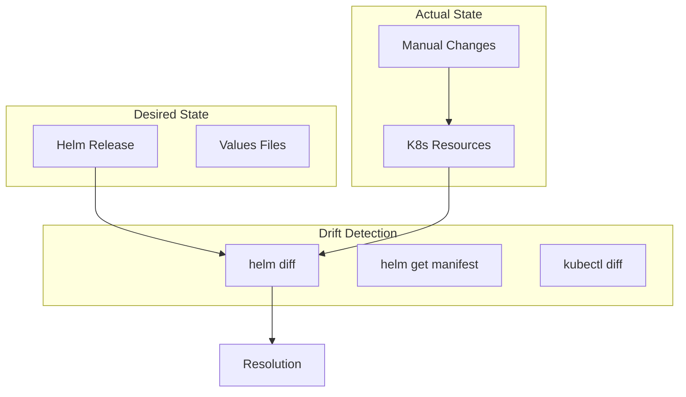

# How to Resolve Helm Release Version Conflicts and Drift

Author: [nawazdhandala](https://www.github.com/nawazdhandala)

Tags: Helm, Kubernetes, DevOps, Troubleshooting, GitOps, Drift Detection

Description: Guide to detecting and resolving Helm release version conflicts, configuration drift, and reconciling state between Helm and Kubernetes.

> Configuration drift occurs when the actual state of Kubernetes resources diverges from what Helm expects. This guide covers detecting drift, resolving version conflicts, and implementing strategies to prevent out-of-band changes.

## Understanding Drift and Conflicts



## Detecting Configuration Drift

### Install helm-diff Plugin

```bash
# Install helm-diff plugin
helm plugin install https://github.com/databus23/helm-diff

# Verify installation
helm diff version
```

### Compare Release to Live State

```bash
# Show differences between release and cluster
helm diff upgrade myapp charts/myapp -f values.yaml

# Show differences with color
helm diff upgrade myapp charts/myapp -f values.yaml --color

# Suppress secrets in diff
helm diff upgrade myapp charts/myapp -f values.yaml --suppress-secrets

# Show only specific resources
helm diff upgrade myapp charts/myapp -f values.yaml --show-secrets

# Detailed diff with context
helm diff upgrade myapp charts/myapp -f values.yaml --context 5
```

### Compare Manifests Manually

```bash
# Get stored manifest from release
helm get manifest myapp > helm-manifest.yaml

# Get live resources
kubectl get deployment,service,configmap -l app.kubernetes.io/instance=myapp -o yaml > live-manifest.yaml

# Compare files
diff helm-manifest.yaml live-manifest.yaml

# Using kubectl diff
helm template myapp charts/myapp -f values.yaml | kubectl diff -f -
```

### Detect Drift with kubectl

```bash
# Server-side dry run to detect drift
helm template myapp charts/myapp -f values.yaml | kubectl apply --dry-run=server -f -

# Compare specific resources
kubectl diff -f <(helm template myapp charts/myapp -f values.yaml -s templates/deployment.yaml)
```

## Resolving Version Conflicts

### Check Release History

```bash
# View release history
helm history myapp

# Output
REVISION    UPDATED                     STATUS      CHART           APP VERSION   DESCRIPTION
1           Mon Jan 15 10:00:00 2024    deployed    myapp-1.0.0     1.0.0         Install complete
2           Mon Jan 15 12:00:00 2024    deployed    myapp-1.1.0     1.1.0         Upgrade complete
3           Mon Jan 15 14:00:00 2024    failed      myapp-1.2.0     1.2.0         Upgrade failed
```

### Rollback to Previous Version

```bash
# Rollback to specific revision
helm rollback myapp 2

# Rollback with force
helm rollback myapp 2 --force

# Rollback and wait for completion
helm rollback myapp 2 --wait --timeout 5m

# Dry run rollback
helm rollback myapp 2 --dry-run
```

### Force Upgrade to Reconcile State

```bash
# Force upgrade to sync state
helm upgrade myapp charts/myapp -f values.yaml --force

# Force with cleanup on failure
helm upgrade myapp charts/myapp -f values.yaml --force --cleanup-on-fail

# Atomic upgrade (auto-rollback on failure)
helm upgrade myapp charts/myapp -f values.yaml --atomic --timeout 10m
```

## Handling Failed Releases

### Check Release Status

```bash
# Check current status
helm status myapp

# Get detailed information
helm status myapp --show-desc

# Check for stuck releases
helm list --all --filter myapp
```

### Fix Pending Releases

```bash
# Release stuck in pending-upgrade
kubectl get secret -l owner=helm,name=myapp

# Delete the pending secret
kubectl delete secret sh.helm.release.v1.myapp.v4

# Retry the upgrade
helm upgrade myapp charts/myapp -f values.yaml
```

### Manual State Recovery

```bash
# Export release secret
kubectl get secret sh.helm.release.v1.myapp.v3 -o jsonpath='{.data.release}' | base64 -d | base64 -d | gzip -d > release.json

# Inspect release state
cat release.json | jq '.info.status'

# Manually mark release as deployed (use with caution)
# This requires editing the release secret
```

## Preventing Drift

### Use GitOps Tools

```yaml
# ArgoCD Application with auto-sync
apiVersion: argoproj.io/v1alpha1
kind: Application
metadata:
  name: myapp
spec:
  source:
    repoURL: https://github.com/org/charts.git
    path: charts/myapp
    helm:
      valueFiles:
        - values.yaml
  syncPolicy:
    automated:
      prune: true
      selfHeal: true  # Automatically fix drift
    syncOptions:
      - CreateNamespace=true
```

### Implement Change Detection

```yaml
# .github/workflows/drift-detection.yaml
name: Drift Detection

on:
  schedule:
    - cron: '0 */6 * * *'  # Every 6 hours
  workflow_dispatch:

jobs:
  detect-drift:
    runs-on: ubuntu-latest
    steps:
      - uses: actions/checkout@v4
      
      - name: Setup Helm
        uses: azure/setup-helm@v3
        
      - name: Install helm-diff
        run: helm plugin install https://github.com/databus23/helm-diff
        
      - name: Configure Kubeconfig
        run: |
          echo "${{ secrets.KUBECONFIG }}" > kubeconfig
          export KUBECONFIG=kubeconfig
          
      - name: Check for Drift
        run: |
          drift=$(helm diff upgrade myapp charts/myapp -f values.yaml 2>&1)
          if [ -n "$drift" ]; then
            echo "::warning::Configuration drift detected!"
            echo "$drift"
            # Send notification
          fi
```

### Add Annotations to Prevent Manual Changes

```yaml
# templates/deployment.yaml
apiVersion: apps/v1
kind: Deployment
metadata:
  name: {{ include "myapp.fullname" . }}
  annotations:
    helm.sh/managed-by: Helm
    meta.helm.sh/release-name: {{ .Release.Name }}
    meta.helm.sh/release-namespace: {{ .Release.Namespace }}
    # Custom annotation to warn against manual edits
    myorg.com/warning: "Managed by Helm - do not edit manually"
```

### Use Admission Controllers

```yaml
# Kyverno policy to prevent manual changes
apiVersion: kyverno.io/v1
kind: ClusterPolicy
metadata:
  name: prevent-manual-helm-changes
spec:
  validationFailureAction: enforce
  background: true
  rules:
    - name: check-helm-managed
      match:
        any:
          - resources:
              kinds:
                - Deployment
                - Service
                - ConfigMap
              selector:
                matchLabels:
                  app.kubernetes.io/managed-by: Helm
      validate:
        message: "Resources managed by Helm cannot be modified directly. Use Helm to make changes."
        deny:
          conditions:
            any:
              - key: "{{request.operation}}"
                operator: In
                value: ["UPDATE", "DELETE"]
              - key: "{{request.userInfo.username}}"
                operator: NotEquals
                value: "system:serviceaccount:argocd:argocd-application-controller"
```

## Reconciliation Strategies

### Full Reconciliation

```bash
# Delete and reinstall (clean slate)
helm uninstall myapp
helm install myapp charts/myapp -f values.yaml

# Or use replace strategy
helm upgrade myapp charts/myapp -f values.yaml --force --reset-values
```

### Selective Reconciliation

```bash
# Apply specific resource changes
helm template myapp charts/myapp -f values.yaml -s templates/deployment.yaml | kubectl apply -f -

# Patch resources to match Helm state
helm get manifest myapp | kubectl apply --server-side --force-conflicts -f -
```

### Three-Way Merge Strategy

```yaml
# Enable three-way merge in Helm 3
# This is the default behavior
helm upgrade myapp charts/myapp -f values.yaml

# Helm 3 performs three-way merge:
# 1. Last applied configuration (from release secret)
# 2. Live state (from cluster)
# 3. Desired state (from chart)
```

## Monitoring and Alerting

### Prometheus Metrics

```yaml
# prometheus-rules.yaml
apiVersion: monitoring.coreos.com/v1
kind: PrometheusRule
metadata:
  name: helm-drift-alerts
spec:
  groups:
    - name: helm-drift
      interval: 5m
      rules:
        - alert: HelmReleaseFailed
          expr: |
            helm_release_info{status!="deployed"} == 1
          for: 10m
          labels:
            severity: warning
          annotations:
            summary: "Helm release {{ $labels.name }} is in {{ $labels.status }} state"
            
        - alert: HelmReleaseOutdated
          expr: |
            time() - helm_release_info{} > 86400 * 30
          labels:
            severity: info
          annotations:
            summary: "Helm release {{ $labels.name }} hasn't been updated in 30 days"
```

### Drift Detection Script

```bash
#!/bin/bash
# drift-check.sh

RELEASES=$(helm list -q)

for release in $RELEASES; do
  echo "Checking drift for $release..."
  
  drift=$(helm diff upgrade "$release" "$(helm get chart "$release")" \
    -f <(helm get values "$release") 2>&1)
  
  if [ -n "$drift" ]; then
    echo "DRIFT DETECTED in $release:"
    echo "$drift"
    
    # Send alert
    curl -X POST "$WEBHOOK_URL" \
      -H "Content-Type: application/json" \
      -d "{\"text\":\"Drift detected in Helm release: $release\"}"
  else
    echo "No drift detected in $release"
  fi
done
```

## Best Practices

| Practice | Description |
|----------|-------------|
| GitOps First | Use ArgoCD or Flux for automatic reconciliation |
| Avoid Manual Changes | Never kubectl edit Helm-managed resources |
| Regular Drift Checks | Schedule drift detection in CI/CD |
| Atomic Upgrades | Use --atomic flag for safe upgrades |
| History Retention | Keep release history for rollbacks |
| Document Changes | Add annotations explaining configurations |

## Troubleshooting

```bash
# Debug release state
helm status myapp --show-resources

# Check Helm storage
kubectl get secrets -l owner=helm --all-namespaces

# Verify release ownership
kubectl get deployment myapp -o jsonpath='{.metadata.labels.app\.kubernetes\.io/managed-by}'

# Force resource adoption
kubectl annotate deployment myapp meta.helm.sh/release-name=myapp
kubectl annotate deployment myapp meta.helm.sh/release-namespace=default
kubectl label deployment myapp app.kubernetes.io/managed-by=Helm
```

## Wrap-up

Configuration drift and version conflicts are common challenges in Helm deployments. Use helm-diff for detection, implement GitOps practices for automatic reconciliation, and enforce policies to prevent manual changes. Regular monitoring and alerting ensure drift is caught early before it causes production issues.
