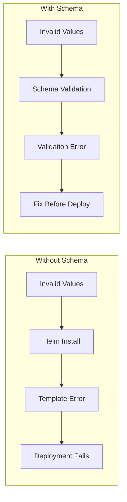

# Schema Validation for Helm Charts with values.schema.json

Author: [nawazdhandala](https://www.github.com/nawazdhandala)

Tags: Helm, Kubernetes, DevOps, Validation, JSON Schema, Charts

Description: Learn how to validate Helm chart values using JSON Schema to catch configuration errors early and improve chart usability.

> Configuration errors discovered at deploy time are frustrating and costly. JSON Schema validation for Helm values catches mistakes during development, provides IDE autocomplete, and documents your chart's interface clearly.

## Why Schema Validation?

Without schema validation, users can pass any values to your chart, leading to:
- Runtime template errors
- Invalid Kubernetes manifests
- Silent misconfigurations
- Poor developer experience



## Creating values.schema.json

Create a `values.schema.json` file in your chart root alongside `values.yaml`.

### Basic Schema Structure

```json
{
  "$schema": "http://json-schema.org/draft-07/schema#",
  "type": "object",
  "title": "My Chart Values",
  "description": "Configuration values for My Chart",
  "properties": {
    "replicaCount": {
      "type": "integer",
      "minimum": 1,
      "default": 1,
      "description": "Number of replicas to deploy"
    },
    "image": {
      "type": "object",
      "properties": {
        "repository": {
          "type": "string",
          "description": "Container image repository"
        },
        "tag": {
          "type": "string",
          "description": "Container image tag"
        },
        "pullPolicy": {
          "type": "string",
          "enum": ["Always", "IfNotPresent", "Never"],
          "default": "IfNotPresent",
          "description": "Image pull policy"
        }
      },
      "required": ["repository"]
    }
  },
  "required": ["image"]
}
```

## JSON Schema Types

### String Properties

```json
{
  "properties": {
    "name": {
      "type": "string",
      "description": "Application name",
      "minLength": 1,
      "maxLength": 63,
      "pattern": "^[a-z0-9]([-a-z0-9]*[a-z0-9])?$"
    },
    "environment": {
      "type": "string",
      "enum": ["development", "staging", "production"],
      "default": "development"
    },
    "logLevel": {
      "type": "string",
      "enum": ["debug", "info", "warn", "error"],
      "default": "info"
    }
  }
}
```

### Numeric Properties

```json
{
  "properties": {
    "replicaCount": {
      "type": "integer",
      "minimum": 1,
      "maximum": 100,
      "default": 1
    },
    "port": {
      "type": "integer",
      "minimum": 1,
      "maximum": 65535,
      "default": 8080
    },
    "cpuLimit": {
      "type": ["string", "number"],
      "description": "CPU limit (e.g., '500m' or 0.5)"
    },
    "memoryLimit": {
      "type": "string",
      "pattern": "^[0-9]+(Mi|Gi)$",
      "description": "Memory limit (e.g., '512Mi', '1Gi')"
    }
  }
}
```

### Boolean Properties

```json
{
  "properties": {
    "enabled": {
      "type": "boolean",
      "default": true,
      "description": "Enable the component"
    },
    "ingress": {
      "type": "object",
      "properties": {
        "enabled": {
          "type": "boolean",
          "default": false
        },
        "tls": {
          "type": "boolean",
          "default": false
        }
      }
    }
  }
}
```

### Array Properties

```json
{
  "properties": {
    "hosts": {
      "type": "array",
      "description": "List of hostnames",
      "items": {
        "type": "string",
        "pattern": "^[a-z0-9]([-a-z0-9]*[a-z0-9])?(\\.[a-z0-9]([-a-z0-9]*[a-z0-9])?)*$"
      },
      "minItems": 1,
      "uniqueItems": true
    },
    "ports": {
      "type": "array",
      "items": {
        "type": "object",
        "properties": {
          "name": {
            "type": "string"
          },
          "port": {
            "type": "integer",
            "minimum": 1,
            "maximum": 65535
          },
          "protocol": {
            "type": "string",
            "enum": ["TCP", "UDP"],
            "default": "TCP"
          }
        },
        "required": ["name", "port"]
      }
    }
  }
}
```

### Nested Objects

```json
{
  "properties": {
    "resources": {
      "type": "object",
      "description": "Resource requests and limits",
      "properties": {
        "requests": {
          "type": "object",
          "properties": {
            "cpu": {
              "type": "string",
              "pattern": "^[0-9]+m?$"
            },
            "memory": {
              "type": "string",
              "pattern": "^[0-9]+(Mi|Gi)$"
            }
          }
        },
        "limits": {
          "type": "object",
          "properties": {
            "cpu": {
              "type": "string",
              "pattern": "^[0-9]+m?$"
            },
            "memory": {
              "type": "string",
              "pattern": "^[0-9]+(Mi|Gi)$"
            }
          }
        }
      }
    }
  }
}
```

## Advanced Schema Features

### Conditional Validation

Use `if`/`then`/`else` for conditional requirements.

```json
{
  "properties": {
    "ingress": {
      "type": "object",
      "properties": {
        "enabled": {
          "type": "boolean"
        },
        "hosts": {
          "type": "array",
          "items": {
            "type": "string"
          }
        },
        "tls": {
          "type": "array"
        }
      },
      "if": {
        "properties": {
          "enabled": { "const": true }
        }
      },
      "then": {
        "required": ["hosts"]
      }
    }
  }
}
```

### OneOf for Alternatives

Allow mutually exclusive configurations.

```json
{
  "properties": {
    "persistence": {
      "type": "object",
      "oneOf": [
        {
          "properties": {
            "enabled": { "const": false }
          },
          "required": ["enabled"]
        },
        {
          "properties": {
            "enabled": { "const": true },
            "storageClass": { "type": "string" },
            "size": {
              "type": "string",
              "pattern": "^[0-9]+(Gi|Ti)$"
            }
          },
          "required": ["enabled", "size"]
        }
      ]
    }
  }
}
```

### AnyOf for Multiple Valid Schemas

```json
{
  "properties": {
    "database": {
      "anyOf": [
        {
          "properties": {
            "embedded": { "const": true }
          },
          "required": ["embedded"]
        },
        {
          "properties": {
            "embedded": { "const": false },
            "host": { "type": "string" },
            "port": { "type": "integer" },
            "name": { "type": "string" }
          },
          "required": ["embedded", "host", "port", "name"]
        }
      ]
    }
  }
}
```

### References for Reusability

Define reusable schemas with `$defs`.

```json
{
  "$schema": "http://json-schema.org/draft-07/schema#",
  "$defs": {
    "resources": {
      "type": "object",
      "properties": {
        "requests": {
          "type": "object",
          "properties": {
            "cpu": { "type": "string" },
            "memory": { "type": "string" }
          }
        },
        "limits": {
          "type": "object",
          "properties": {
            "cpu": { "type": "string" },
            "memory": { "type": "string" }
          }
        }
      }
    },
    "probe": {
      "type": "object",
      "properties": {
        "enabled": { "type": "boolean", "default": true },
        "path": { "type": "string", "default": "/" },
        "port": { "type": ["string", "integer"] },
        "initialDelaySeconds": { "type": "integer", "minimum": 0 },
        "periodSeconds": { "type": "integer", "minimum": 1 }
      }
    }
  },
  "properties": {
    "resources": { "$ref": "#/$defs/resources" },
    "livenessProbe": { "$ref": "#/$defs/probe" },
    "readinessProbe": { "$ref": "#/$defs/probe" }
  }
}
```

## Complete Example Schema

Here's a comprehensive schema for a typical web application chart:

```json
{
  "$schema": "http://json-schema.org/draft-07/schema#",
  "type": "object",
  "title": "Web Application Chart Values",
  "description": "Helm values for deploying a web application",
  "$defs": {
    "resourceQuantity": {
      "type": "string",
      "pattern": "^[0-9]+(m|Mi|Gi)?$"
    },
    "resources": {
      "type": "object",
      "properties": {
        "requests": {
          "type": "object",
          "properties": {
            "cpu": { "$ref": "#/$defs/resourceQuantity" },
            "memory": { "$ref": "#/$defs/resourceQuantity" }
          }
        },
        "limits": {
          "type": "object",
          "properties": {
            "cpu": { "$ref": "#/$defs/resourceQuantity" },
            "memory": { "$ref": "#/$defs/resourceQuantity" }
          }
        }
      }
    }
  },
  "properties": {
    "replicaCount": {
      "type": "integer",
      "minimum": 1,
      "maximum": 100,
      "default": 1,
      "description": "Number of pod replicas"
    },
    "image": {
      "type": "object",
      "description": "Container image configuration",
      "properties": {
        "repository": {
          "type": "string",
          "description": "Image repository",
          "examples": ["nginx", "myregistry.com/myapp"]
        },
        "tag": {
          "type": "string",
          "description": "Image tag (defaults to Chart appVersion)"
        },
        "pullPolicy": {
          "type": "string",
          "enum": ["Always", "IfNotPresent", "Never"],
          "default": "IfNotPresent"
        }
      },
      "required": ["repository"]
    },
    "imagePullSecrets": {
      "type": "array",
      "description": "Image pull secrets",
      "items": {
        "type": "object",
        "properties": {
          "name": { "type": "string" }
        },
        "required": ["name"]
      },
      "default": []
    },
    "nameOverride": {
      "type": "string",
      "maxLength": 63,
      "pattern": "^[a-z0-9]([-a-z0-9]*[a-z0-9])?$"
    },
    "fullnameOverride": {
      "type": "string",
      "maxLength": 63,
      "pattern": "^[a-z0-9]([-a-z0-9]*[a-z0-9])?$"
    },
    "serviceAccount": {
      "type": "object",
      "properties": {
        "create": {
          "type": "boolean",
          "default": true
        },
        "annotations": {
          "type": "object",
          "additionalProperties": { "type": "string" }
        },
        "name": {
          "type": "string"
        }
      }
    },
    "podAnnotations": {
      "type": "object",
      "additionalProperties": { "type": "string" },
      "default": {}
    },
    "podSecurityContext": {
      "type": "object",
      "properties": {
        "runAsNonRoot": { "type": "boolean" },
        "runAsUser": { "type": "integer" },
        "runAsGroup": { "type": "integer" },
        "fsGroup": { "type": "integer" }
      }
    },
    "securityContext": {
      "type": "object",
      "properties": {
        "allowPrivilegeEscalation": { "type": "boolean" },
        "readOnlyRootFilesystem": { "type": "boolean" },
        "runAsNonRoot": { "type": "boolean" },
        "runAsUser": { "type": "integer" },
        "capabilities": {
          "type": "object",
          "properties": {
            "drop": {
              "type": "array",
              "items": { "type": "string" }
            },
            "add": {
              "type": "array",
              "items": { "type": "string" }
            }
          }
        }
      }
    },
    "service": {
      "type": "object",
      "properties": {
        "type": {
          "type": "string",
          "enum": ["ClusterIP", "NodePort", "LoadBalancer"],
          "default": "ClusterIP"
        },
        "port": {
          "type": "integer",
          "minimum": 1,
          "maximum": 65535,
          "default": 80
        }
      }
    },
    "ingress": {
      "type": "object",
      "properties": {
        "enabled": {
          "type": "boolean",
          "default": false
        },
        "className": {
          "type": "string"
        },
        "annotations": {
          "type": "object",
          "additionalProperties": { "type": "string" }
        },
        "hosts": {
          "type": "array",
          "items": {
            "type": "object",
            "properties": {
              "host": {
                "type": "string",
                "format": "hostname"
              },
              "paths": {
                "type": "array",
                "items": {
                  "type": "object",
                  "properties": {
                    "path": { "type": "string" },
                    "pathType": {
                      "type": "string",
                      "enum": ["Prefix", "Exact", "ImplementationSpecific"]
                    }
                  },
                  "required": ["path", "pathType"]
                }
              }
            },
            "required": ["host", "paths"]
          }
        },
        "tls": {
          "type": "array",
          "items": {
            "type": "object",
            "properties": {
              "secretName": { "type": "string" },
              "hosts": {
                "type": "array",
                "items": { "type": "string" }
              }
            }
          }
        }
      },
      "if": {
        "properties": { "enabled": { "const": true } }
      },
      "then": {
        "required": ["hosts"]
      }
    },
    "resources": { "$ref": "#/$defs/resources" },
    "autoscaling": {
      "type": "object",
      "properties": {
        "enabled": {
          "type": "boolean",
          "default": false
        },
        "minReplicas": {
          "type": "integer",
          "minimum": 1
        },
        "maxReplicas": {
          "type": "integer",
          "minimum": 1
        },
        "targetCPUUtilizationPercentage": {
          "type": "integer",
          "minimum": 1,
          "maximum": 100
        }
      },
      "if": {
        "properties": { "enabled": { "const": true } }
      },
      "then": {
        "required": ["minReplicas", "maxReplicas"]
      }
    },
    "nodeSelector": {
      "type": "object",
      "additionalProperties": { "type": "string" }
    },
    "tolerations": {
      "type": "array",
      "items": {
        "type": "object",
        "properties": {
          "key": { "type": "string" },
          "operator": {
            "type": "string",
            "enum": ["Exists", "Equal"]
          },
          "value": { "type": "string" },
          "effect": {
            "type": "string",
            "enum": ["NoSchedule", "PreferNoSchedule", "NoExecute"]
          }
        }
      }
    },
    "affinity": {
      "type": "object"
    }
  },
  "required": ["image"]
}
```

## Validate During Development

### Using Helm

Helm automatically validates values against the schema during install, upgrade, and template commands.

```bash
# Schema validation happens automatically
helm install my-release ./my-chart -f values.yaml

# Validation also runs during template
helm template my-release ./my-chart -f values.yaml

# Force validation with dry-run
helm install my-release ./my-chart -f values.yaml --dry-run
```

### Validation Error Example

```bash
$ helm install my-release ./my-chart --set replicaCount=-1

Error: values don't meet the specifications of the schema(s):
- replicaCount: Must be greater than or equal to 1
```

### Using JSON Schema Tools

Validate outside of Helm for CI/CD integration.

```bash
# Install ajv-cli
npm install -g ajv-cli

# Validate values file against schema
ajv validate -s values.schema.json -d values.yaml

# Convert YAML to JSON for validation
yq eval -o=json values.yaml | ajv validate -s values.schema.json
```

## IDE Integration

### VS Code

Install the "YAML" extension by Red Hat for schema validation in VS Code.

Add to `.vscode/settings.json`:

```json
{
  "yaml.schemas": {
    "./values.schema.json": "values*.yaml"
  }
}
```

### Schema Association in values.yaml

Add a comment to associate the schema:

```yaml
# yaml-language-server: $schema=values.schema.json
replicaCount: 1
image:
  repository: nginx
  tag: latest
```

## CI/CD Integration

### GitHub Actions

```yaml
name: Validate Chart

on: [push, pull_request]

jobs:
  validate:
    runs-on: ubuntu-latest
    steps:
      - uses: actions/checkout@v4
      
      - name: Set up Helm
        uses: azure/setup-helm@v3
        
      - name: Validate schema
        run: |
          # Dry-run validates against schema
          helm template my-chart ./charts/my-chart -f ./charts/my-chart/values.yaml
          
      - name: Validate test values
        run: |
          for values in ./charts/my-chart/ci/*.yaml; do
            echo "Validating $values"
            helm template my-chart ./charts/my-chart -f "$values"
          done
```

### Pre-commit Hook

```yaml
# .pre-commit-config.yaml
repos:
  - repo: local
    hooks:
      - id: helm-schema-validate
        name: Validate Helm values schema
        entry: bash -c 'helm template test ./charts/my-chart'
        language: system
        files: values.*\.yaml$
```

## Generate Schema from Values

Use tools to generate a starting schema from your values.yaml.

```bash
# Install helm-values-schema-json plugin
helm plugin install https://github.com/losisin/helm-values-schema-json

# Generate schema from values.yaml
helm schema -input values.yaml -output values.schema.json
```

## Best Practices

| Practice | Why |
| --- | --- |
| Start simple, add constraints | Avoid blocking valid configs |
| Use descriptions | Self-documenting schema |
| Provide defaults | Better UX |
| Use enums where possible | Catch typos |
| Validate patterns | Kubernetes naming rules |
| Add examples | Help users understand format |
| Use $defs for reusability | DRY schema definitions |

## Common Patterns

### Kubernetes Name Pattern

```json
{
  "pattern": "^[a-z0-9]([-a-z0-9]*[a-z0-9])?$",
  "maxLength": 63
}
```

### Resource Quantity Pattern

```json
{
  "pattern": "^([0-9]+)(m|Mi|Gi|Ki|Ti|Pi|Ei)?$"
}
```

### Duration Pattern

```json
{
  "pattern": "^[0-9]+(s|m|h)$"
}
```

## Wrap-up

JSON Schema validation for Helm charts catches configuration errors before deployment, provides IDE autocomplete, and documents your chart's interface. Start with a basic schema covering required values and common constraints, then expand as needed. Use conditional validation for interdependent values, define reusable schemas with `$defs`, and integrate validation into your CI/CD pipeline. A well-designed schema significantly improves the chart user experience and reduces deployment failures.
