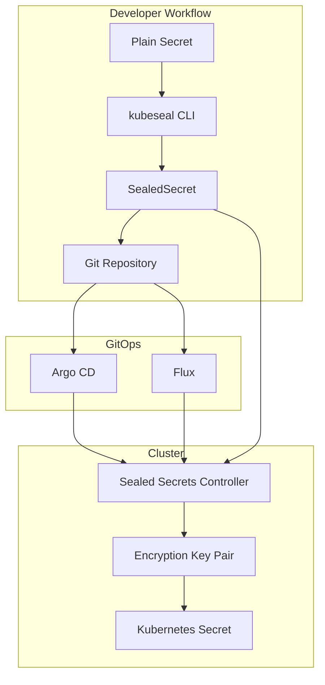

# Secrets Management with Helm and Sealed Secrets

Author: [nawazdhandala](https://www.github.com/nawazdhandala)

Tags: Helm, Kubernetes, DevOps, Security, Secrets, GitOps, Encryption

Description: Complete guide to managing Kubernetes secrets securely with Sealed Secrets and Helm for GitOps workflows.

> Sealed Secrets enables storing encrypted secrets in Git repositories, making them safe for version control. This guide covers deploying the Sealed Secrets controller with Helm and integrating encrypted secrets into your GitOps workflow.

## Sealed Secrets Architecture



## Installing Sealed Secrets Controller

### Add Helm Repository

```bash
# Add Sealed Secrets Helm repository
helm repo add sealed-secrets https://bitnami-labs.github.io/sealed-secrets
helm repo update

# Create namespace
kubectl create namespace sealed-secrets
```

### Basic Installation

```bash
helm install sealed-secrets sealed-secrets/sealed-secrets \
  --namespace sealed-secrets \
  --wait
```

### Production Configuration

```yaml
# sealed-secrets-values.yaml
# Controller configuration
fullnameOverride: sealed-secrets-controller

# Replica count
replicaCount: 1

# Resources
resources:
  requests:
    cpu: 50m
    memory: 64Mi
  limits:
    cpu: 200m
    memory: 256Mi

# Security context
securityContext:
  runAsNonRoot: true
  runAsUser: 1001
  fsGroup: 65534

# Pod security context
podSecurityContext:
  fsGroup: 65534

# Service configuration
service:
  type: ClusterIP
  port: 8080

# Metrics
metrics:
  serviceMonitor:
    enabled: true
    namespace: monitoring
    interval: 30s

# Command args
commandArgs:
  # Key rotation interval (default: 30d)
  - --key-renew-period=720h
  # Key cutoff time
  - --key-cutoff-time=48h
  # Update status
  - --update-status

# Network policy
networkPolicy:
  enabled: true

# RBAC
rbac:
  create: true
  pspEnabled: false

# Service account
serviceAccount:
  create: true
  name: sealed-secrets-controller

# Pod annotations
podAnnotations:
  prometheus.io/scrape: "true"
  prometheus.io/port: "8080"

# Node selector
nodeSelector: {}

# Tolerations
tolerations: []

# Affinity
affinity:
  podAntiAffinity:
    preferredDuringSchedulingIgnoredDuringExecution:
      - weight: 100
        podAffinityTerm:
          labelSelector:
            matchExpressions:
              - key: app.kubernetes.io/name
                operator: In
                values:
                  - sealed-secrets
          topologyKey: kubernetes.io/hostname
```

```bash
# Install with production values
helm install sealed-secrets sealed-secrets/sealed-secrets \
  --namespace sealed-secrets \
  -f sealed-secrets-values.yaml
```

## Installing kubeseal CLI

```bash
# macOS
brew install kubeseal

# Linux
KUBESEAL_VERSION=$(curl -s https://api.github.com/repos/bitnami-labs/sealed-secrets/releases/latest | jq -r '.tag_name' | cut -c2-)
wget "https://github.com/bitnami-labs/sealed-secrets/releases/download/v${KUBESEAL_VERSION}/kubeseal-${KUBESEAL_VERSION}-linux-amd64.tar.gz"
tar -xvzf kubeseal-${KUBESEAL_VERSION}-linux-amd64.tar.gz kubeseal
sudo install -m 755 kubeseal /usr/local/bin/kubeseal

# Verify installation
kubeseal --version
```

## Creating Sealed Secrets

### Basic SealedSecret

```bash
# Create a regular secret manifest
cat <<EOF > secret.yaml
apiVersion: v1
kind: Secret
metadata:
  name: my-secret
  namespace: default
type: Opaque
stringData:
  username: admin
  password: supersecret123
EOF

# Seal the secret
kubeseal --format yaml < secret.yaml > sealed-secret.yaml

# Apply the sealed secret
kubectl apply -f sealed-secret.yaml

# Verify the secret was created
kubectl get secret my-secret
```

### Using stdin

```bash
# Create sealed secret from literal
echo -n "mypassword" | kubeseal --raw \
  --namespace default \
  --name my-secret \
  --from-file=/dev/stdin

# Full secret from stdin
kubectl create secret generic my-secret \
  --from-literal=password=supersecret \
  --dry-run=client -o yaml | \
  kubeseal --format yaml > sealed-secret.yaml
```

### Different Scopes

```bash
# Strict scope (default) - bound to name and namespace
kubeseal --format yaml < secret.yaml > sealed-secret.yaml

# Namespace-wide scope - can be renamed within namespace
kubeseal --scope namespace-wide --format yaml < secret.yaml > sealed-secret.yaml

# Cluster-wide scope - can be used anywhere
kubeseal --scope cluster-wide --format yaml < sealed-secret.yaml > sealed-secret.yaml
```

### SealedSecret Manifest

```yaml
# sealed-secret.yaml (generated)
apiVersion: bitnami.com/v1alpha1
kind: SealedSecret
metadata:
  name: my-secret
  namespace: default
  annotations:
    sealedsecrets.bitnami.com/cluster-wide: "false"
    sealedsecrets.bitnami.com/namespace-wide: "false"
spec:
  encryptedData:
    username: AgBy8hCK...encrypted...==
    password: AgCtr8xP...encrypted...==
  template:
    metadata:
      name: my-secret
      namespace: default
    type: Opaque
```

### SealedSecret with Labels and Annotations

```yaml
# secret-with-metadata.yaml
apiVersion: v1
kind: Secret
metadata:
  name: database-credentials
  namespace: production
  labels:
    app: myapp
    environment: production
  annotations:
    description: "Database credentials for production"
type: Opaque
stringData:
  DB_HOST: db.example.com
  DB_USER: appuser
  DB_PASSWORD: supersecret
```

```bash
# Seal with metadata preserved
kubeseal --format yaml < secret-with-metadata.yaml > sealed-database-credentials.yaml
```

## Helm Integration

### Chart with SealedSecrets

```yaml
# values.yaml
secrets:
  database:
    enabled: true
    encryptedData:
      DB_HOST: AgBy8hCK...encrypted...==
      DB_USER: AgCtr8xP...encrypted...==
      DB_PASSWORD: AgDtr9yQ...encrypted...==
      
  api:
    enabled: true
    encryptedData:
      API_KEY: AgExy7zR...encrypted...==
```

### SealedSecret Template

```yaml
# templates/sealedsecret.yaml
{{- range $name, $secret := .Values.secrets }}
{{- if $secret.enabled }}
---
apiVersion: bitnami.com/v1alpha1
kind: SealedSecret
metadata:
  name: {{ $name }}-secret
  namespace: {{ $.Release.Namespace }}
  labels:
    {{- include "myapp.labels" $ | nindent 4 }}
spec:
  encryptedData:
    {{- range $key, $value := $secret.encryptedData }}
    {{ $key }}: {{ $value }}
    {{- end }}
  template:
    metadata:
      name: {{ $name }}-secret
      namespace: {{ $.Release.Namespace }}
      labels:
        {{- include "myapp.labels" $ | nindent 8 }}
    type: {{ $secret.type | default "Opaque" }}
{{- end }}
{{- end }}
```

### Alternative: Pre-sealed Values File

```yaml
# values-sealed.yaml
# Store encrypted values directly
database:
  host:
    sealed: AgBy8hCK...encrypted...==
  credentials:
    username:
      sealed: AgCtr8xP...encrypted...==
    password:
      sealed: AgDtr9yQ...encrypted...==
```

### Helper Script for Sealing

```bash
#!/bin/bash
# seal-values.sh

# Fetch public certificate
kubeseal --fetch-cert > sealed-secrets-cert.pem

# Seal individual values
seal_value() {
  local value="$1"
  local namespace="$2"
  local name="$3"
  
  echo -n "$value" | kubeseal --raw \
    --cert sealed-secrets-cert.pem \
    --namespace "$namespace" \
    --name "$name"
}

# Example usage
DB_PASSWORD_SEALED=$(seal_value "supersecret" "production" "database-secret")
echo "database.password.sealed: $DB_PASSWORD_SEALED"
```

## Key Management

### Backup Encryption Keys

```bash
# Backup the private key (CRITICAL!)
kubectl get secret -n sealed-secrets -l sealedsecrets.bitnami.com/sealed-secrets-key \
  -o yaml > sealed-secrets-keys-backup.yaml

# Store securely (e.g., HashiCorp Vault, AWS Secrets Manager)
# NEVER commit to Git!
```

### Restore Keys to New Cluster

```bash
# Apply backed up keys to new cluster
kubectl apply -f sealed-secrets-keys-backup.yaml

# Restart controller to pick up keys
kubectl rollout restart deployment/sealed-secrets-controller -n sealed-secrets
```

### Key Rotation

```yaml
# sealed-secrets-values.yaml
commandArgs:
  # Rotate keys every 30 days
  - --key-renew-period=720h
  # Keep old keys for 48 hours after rotation
  - --key-cutoff-time=48h
```

```bash
# Manual key rotation
kubectl annotate sealedsecret my-secret \
  sealedsecrets.bitnami.com/managed="true"
```

### Multiple Key Pairs

```bash
# List all sealing keys
kubectl get secret -n sealed-secrets \
  -l sealedsecrets.bitnami.com/sealed-secrets-key

# Fetch specific certificate
kubeseal --fetch-cert \
  --controller-name sealed-secrets-controller \
  --controller-namespace sealed-secrets > cert.pem
```

## GitOps Integration

### Directory Structure

```
gitops-repo/
├── apps/
│   └── myapp/
│       ├── Chart.yaml
│       ├── values.yaml
│       └── templates/
│           └── sealedsecret.yaml
├── sealed-secrets/
│   ├── production/
│   │   ├── database-credentials.yaml
│   │   └── api-keys.yaml
│   └── staging/
│       ├── database-credentials.yaml
│       └── api-keys.yaml
└── README.md
```

### Argo CD Integration

```yaml
# argocd-application.yaml
apiVersion: argoproj.io/v1alpha1
kind: Application
metadata:
  name: myapp
  namespace: argocd
spec:
  project: default
  source:
    repoURL: https://github.com/myorg/gitops-repo.git
    targetRevision: main
    path: apps/myapp
  destination:
    server: https://kubernetes.default.svc
    namespace: production
  syncPolicy:
    automated:
      prune: true
      selfHeal: true
```

### Flux Integration

```yaml
# kustomization.yaml
apiVersion: kustomize.config.k8s.io/v1beta1
kind: Kustomization
resources:
  - sealed-secrets/production/database-credentials.yaml
  - sealed-secrets/production/api-keys.yaml
```

## CI/CD Pipeline

### GitHub Actions

```yaml
# .github/workflows/seal-secrets.yaml
name: Seal Secrets

on:
  workflow_dispatch:
    inputs:
      secret_name:
        description: 'Secret name'
        required: true
      namespace:
        description: 'Namespace'
        required: true
        default: 'production'

jobs:
  seal:
    runs-on: ubuntu-latest
    steps:
      - uses: actions/checkout@v4
      
      - name: Install kubeseal
        run: |
          wget https://github.com/bitnami-labs/sealed-secrets/releases/download/v0.24.0/kubeseal-0.24.0-linux-amd64.tar.gz
          tar -xvzf kubeseal-0.24.0-linux-amd64.tar.gz kubeseal
          sudo install kubeseal /usr/local/bin/
          
      - name: Seal secret
        env:
          SEALED_SECRETS_CERT: ${{ secrets.SEALED_SECRETS_CERT }}
        run: |
          echo "$SEALED_SECRETS_CERT" > cert.pem
          
          # Create and seal secret
          kubectl create secret generic ${{ inputs.secret_name }} \
            --from-literal=value="${{ secrets.SECRET_VALUE }}" \
            --namespace ${{ inputs.namespace }} \
            --dry-run=client -o yaml | \
            kubeseal --cert cert.pem --format yaml > \
            sealed-secrets/${{ inputs.namespace }}/${{ inputs.secret_name }}.yaml
            
      - name: Commit sealed secret
        run: |
          git config user.name github-actions
          git config user.email github-actions@github.com
          git add sealed-secrets/
          git commit -m "Add sealed secret: ${{ inputs.secret_name }}"
          git push
```

## Monitoring

### Prometheus Metrics

```yaml
# servicemonitor.yaml
apiVersion: monitoring.coreos.com/v1
kind: ServiceMonitor
metadata:
  name: sealed-secrets
  namespace: monitoring
spec:
  selector:
    matchLabels:
      app.kubernetes.io/name: sealed-secrets
  namespaceSelector:
    matchNames:
      - sealed-secrets
  endpoints:
    - port: http
      interval: 30s
```

### Alerts

```yaml
# alerts.yaml
apiVersion: monitoring.coreos.com/v1
kind: PrometheusRule
metadata:
  name: sealed-secrets-alerts
  namespace: monitoring
spec:
  groups:
    - name: sealed-secrets
      rules:
        - alert: SealedSecretsUnsealErrors
          expr: |
            increase(sealed_secrets_controller_unseal_errors_total[1h]) > 0
          for: 5m
          labels:
            severity: warning
          annotations:
            summary: SealedSecrets unseal errors
            description: The Sealed Secrets controller has encountered unseal errors
            
        - alert: SealedSecretsControllerDown
          expr: |
            absent(up{job="sealed-secrets"})
          for: 5m
          labels:
            severity: critical
          annotations:
            summary: Sealed Secrets controller is down
```

## Troubleshooting

```bash
# Check controller status
kubectl get pods -n sealed-secrets
kubectl logs -n sealed-secrets deployment/sealed-secrets-controller

# Verify sealed secret
kubectl get sealedsecret my-secret -o yaml

# Check if secret was created
kubectl get secret my-secret -o yaml

# Debug unseal issues
kubectl describe sealedsecret my-secret

# Fetch public certificate
kubeseal --fetch-cert \
  --controller-name sealed-secrets-controller \
  --controller-namespace sealed-secrets

# Validate sealed secret
kubeseal --validate < sealed-secret.yaml

# Re-encrypt with new key
kubeseal --re-encrypt < sealed-secret.yaml > new-sealed-secret.yaml
```

## Best Practices

| Practice | Recommendation |
|----------|----------------|
| **Key backup** | Always backup encryption keys securely |
| **Scope** | Use strict scope unless namespace/cluster-wide is needed |
| **Rotation** | Enable automatic key rotation |
| **Validation** | Validate sealed secrets before committing |
| **Monitoring** | Monitor for unseal errors |
| **GitOps** | Store only SealedSecrets in Git, never plain secrets |
| **CI/CD** | Seal secrets in CI/CD pipeline, not locally |

## Wrap-up

Sealed Secrets provides a secure way to store encrypted secrets in Git repositories for GitOps workflows. Use Helm to deploy the controller, kubeseal CLI to encrypt secrets, and integrate with your CI/CD pipeline for automated secret management. Always backup encryption keys and monitor for unseal errors.
