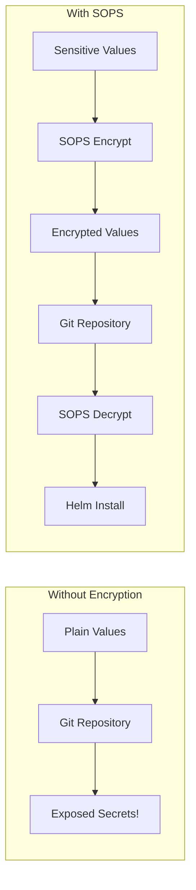

# How to Manage Secrets in Helm with helm-secrets and SOPS

Author: [nawazdhandala](https://www.github.com/nawazdhandala)

Tags: Helm, Kubernetes, DevOps, Security, Secrets, SOPS

Description: Learn how to encrypt and manage sensitive values in Helm charts using helm-secrets plugin and Mozilla SOPS for secure GitOps workflows.

> Storing secrets in plain text in Git is a security nightmare. helm-secrets with SOPS lets you encrypt sensitive values while keeping your GitOps workflow intact-secrets live in Git, but only authorized systems can decrypt them.

## The Problem with Secrets in Git

Helm values files often contain sensitive data: database passwords, API keys, certificates. Committing these in plain text exposes them to anyone with repository access.



## Install SOPS

SOPS (Secrets OPerationS) is Mozilla's tool for encrypting files with various key providers.

```bash
# macOS
brew install sops

# Linux
curl -LO https://github.com/getsops/sops/releases/download/v3.8.1/sops-v3.8.1.linux.amd64
chmod +x sops-v3.8.1.linux.amd64
sudo mv sops-v3.8.1.linux.amd64 /usr/local/bin/sops

# Verify installation
sops --version
```

## Install helm-secrets Plugin

The helm-secrets plugin integrates SOPS with Helm.

```bash
# Install the plugin
helm plugin install https://github.com/jkroepke/helm-secrets

# Verify installation
helm secrets --help
```

## Configure Encryption Key

SOPS supports multiple key providers. Choose based on your infrastructure.

### Option 1: Age Keys (Recommended for Simplicity)

Age is a simple, modern encryption tool that works well for teams.

```bash
# Install age
brew install age  # macOS
# or
apt install age   # Ubuntu

# Generate a key pair
age-keygen -o key.txt

# Output:
# Public key: age1xxxxxxxxxxxxxxxxxxxxxxxxxxxxxxxxxxxxxxxxxxxxxxxxxxxxxxxx
# Created key file: key.txt

# Keep key.txt secure! Add to .gitignore
echo "key.txt" >> .gitignore
```

### Option 2: AWS KMS

For AWS environments, KMS provides centralized key management.

```bash
# Create a KMS key
aws kms create-key --description "Helm secrets encryption key"

# Note the KeyId from the output
# Grant access to your team/services via IAM policies
```

### Option 3: GCP KMS

For Google Cloud environments.

```bash
# Create a keyring and key
gcloud kms keyrings create helm-secrets --location global
gcloud kms keys create helm-key \
  --location global \
  --keyring helm-secrets \
  --purpose encryption
```

### Option 4: HashiCorp Vault

For organizations using Vault for secrets management.

```bash
# Enable transit secrets engine
vault secrets enable transit

# Create an encryption key
vault write -f transit/keys/helm-secrets
```

## Configure SOPS

Create a `.sops.yaml` configuration file in your repository root.

### Age Configuration

```yaml
# .sops.yaml
creation_rules:
  # Encrypt files matching these patterns with age
  - path_regex: secrets\.yaml$
    age: age1xxxxxxxxxxxxxxxxxxxxxxxxxxxxxxxxxxxxxxxxxxxxxxxxxxxxxxxx
  
  - path_regex: secrets/.*\.yaml$
    age: age1xxxxxxxxxxxxxxxxxxxxxxxxxxxxxxxxxxxxxxxxxxxxxxxxxxxxxxxx
```

### AWS KMS Configuration

```yaml
# .sops.yaml
creation_rules:
  - path_regex: secrets\.yaml$
    kms: 'arn:aws:kms:us-east-1:123456789:key/mrk-xxxxxxxxxxxxx'
    
  # Different keys per environment
  - path_regex: environments/dev/secrets\.yaml$
    kms: 'arn:aws:kms:us-east-1:123456789:key/dev-key-id'
    
  - path_regex: environments/production/secrets\.yaml$
    kms: 'arn:aws:kms:us-east-1:123456789:key/prod-key-id'
```

### Multi-Key Configuration

Encrypt with multiple keys for redundancy or multi-team access.

```yaml
# .sops.yaml
creation_rules:
  - path_regex: secrets\.yaml$
    # Multiple age keys - any can decrypt
    age: >-
      age1team1xxxxxxxxxxxxxxxxxxxxxxxxxxxxxxxxxxxxxxxxxxxxxxxxxx,
      age1team2xxxxxxxxxxxxxxxxxxxxxxxxxxxxxxxxxxxxxxxxxxxxxxxxxx
    # Also encrypt with KMS for CI/CD
    kms: 'arn:aws:kms:us-east-1:123456789:key/ci-key-id'
```

## Create Encrypted Secrets File

### Structure Your Values

Separate secrets from regular values for clarity.

```
my-chart/
├── Chart.yaml
├── values.yaml           # Non-sensitive defaults
├── secrets.yaml          # Encrypted sensitive values
└── environments/
    ├── dev/
    │   ├── values.yaml
    │   └── secrets.yaml  # Encrypted
    └── production/
        ├── values.yaml
        └── secrets.yaml  # Encrypted
```

### Create the Secrets File

Create a plain YAML file with sensitive values.

```yaml
# secrets.yaml (before encryption)
database:
  password: super-secret-password
  
redis:
  password: redis-secret-123

api:
  key: sk-xxxxxxxxxxxxxxxxxxxx
  
smtp:
  username: mail@example.com
  password: smtp-password
```

### Encrypt the File

```bash
# Encrypt using SOPS directly
sops --encrypt secrets.yaml > secrets.yaml.enc
mv secrets.yaml.enc secrets.yaml

# Or encrypt in-place
sops --encrypt --in-place secrets.yaml

# Using helm-secrets
helm secrets encrypt secrets.yaml > secrets.enc.yaml
```

### Encrypted File Structure

After encryption, the file looks like this (age example):

```yaml
# secrets.yaml (after encryption)
database:
    password: ENC[AES256_GCM,data:k8LjKpL2mWnX9A==,iv:...,tag:...,type:str]
redis:
    password: ENC[AES256_GCM,data:7Y3bNmPqRs==,iv:...,tag:...,type:str]
api:
    key: ENC[AES256_GCM,data:xH4mK9pLwQrT5Y==,iv:...,tag:...,type:str]
smtp:
    username: ENC[AES256_GCM,data:mail@example.com,iv:...,tag:...,type:str]
    password: ENC[AES256_GCM,data:9Lp3mN7xR==,iv:...,tag:...,type:str]
sops:
    age:
        - recipient: age1xxxxxxxxxxxxxxxxxxxxxxxxxxxxxxxxxxxxxxxxxxxxxxxxx
          enc: |
            -----BEGIN AGE ENCRYPTED FILE-----
            ...
            -----END AGE ENCRYPTED FILE-----
    lastmodified: "2024-01-15T10:30:00Z"
    mac: ENC[AES256_GCM,data:...,iv:...,tag:...,type:str]
    version: 3.8.1
```

## Edit Encrypted Files

### Using SOPS Directly

```bash
# Open in editor, decrypted view
sops secrets.yaml

# Make changes, save, file is re-encrypted automatically
```

### Using helm-secrets

```bash
# Edit encrypted file
helm secrets edit secrets.yaml

# View decrypted content (without editing)
helm secrets view secrets.yaml
```

### Decrypt for Inspection

```bash
# Decrypt to stdout
sops --decrypt secrets.yaml

# Decrypt to file (be careful not to commit!)
sops --decrypt secrets.yaml > secrets-decrypted.yaml
```

## Use helm-secrets with Helm

### Install with Encrypted Values

Use the `secrets` wrapper command to decrypt values during Helm operations.

```bash
# Install with encrypted secrets file
helm secrets install my-release ./my-chart \
  -f values.yaml \
  -f secrets.yaml

# Upgrade with secrets
helm secrets upgrade my-release ./my-chart \
  -f values.yaml \
  -f secrets.yaml

# Template with secrets (for debugging)
helm secrets template my-release ./my-chart \
  -f values.yaml \
  -f secrets.yaml
```

### Multiple Values Files

Combine regular and encrypted values files.

```bash
# Development deployment
helm secrets install my-app ./my-chart \
  -f values.yaml \
  -f environments/dev/values.yaml \
  -f environments/dev/secrets.yaml

# Production deployment
helm secrets install my-app ./my-chart \
  -f values.yaml \
  -f environments/production/values.yaml \
  -f environments/production/secrets.yaml
```

## Reference Secrets in Templates

In your Helm templates, reference secrets like any other value.

### Create a Kubernetes Secret

```yaml
# templates/secret.yaml
apiVersion: v1
kind: Secret
metadata:
  name: {{ include "my-chart.fullname" . }}
  labels:
    {{- include "my-chart.labels" . | nindent 4 }}
type: Opaque
data:
  # Values are base64 encoded in Kubernetes secrets
  database-password: {{ .Values.database.password | b64enc | quote }}
  redis-password: {{ .Values.redis.password | b64enc | quote }}
  api-key: {{ .Values.api.key | b64enc | quote }}
stringData:
  # Or use stringData for plain text (Kubernetes encodes it)
  smtp-username: {{ .Values.smtp.username | quote }}
  smtp-password: {{ .Values.smtp.password | quote }}
```

### Reference in Deployments

Mount secrets or use as environment variables.

```yaml
# templates/deployment.yaml
apiVersion: apps/v1
kind: Deployment
metadata:
  name: {{ include "my-chart.fullname" . }}
spec:
  template:
    spec:
      containers:
        - name: {{ .Chart.Name }}
          image: "{{ .Values.image.repository }}:{{ .Values.image.tag }}"
          env:
            # Reference from Secret
            - name: DATABASE_PASSWORD
              valueFrom:
                secretKeyRef:
                  name: {{ include "my-chart.fullname" . }}
                  key: database-password
            - name: REDIS_PASSWORD
              valueFrom:
                secretKeyRef:
                  name: {{ include "my-chart.fullname" . }}
                  key: redis-password
          # Or mount as volume
          volumeMounts:
            - name: secrets
              mountPath: /etc/secrets
              readOnly: true
      volumes:
        - name: secrets
          secret:
            secretName: {{ include "my-chart.fullname" . }}
```

## CI/CD Integration

### GitHub Actions

Set up decryption in CI/CD pipelines.

```yaml
# .github/workflows/deploy.yml
name: Deploy with Helm Secrets

on:
  push:
    branches: [main]

jobs:
  deploy:
    runs-on: ubuntu-latest
    steps:
      - uses: actions/checkout@v4
      
      - name: Set up Helm
        uses: azure/setup-helm@v3
        
      - name: Install SOPS
        run: |
          curl -LO https://github.com/getsops/sops/releases/download/v3.8.1/sops-v3.8.1.linux.amd64
          chmod +x sops-v3.8.1.linux.amd64
          sudo mv sops-v3.8.1.linux.amd64 /usr/local/bin/sops
          
      - name: Install helm-secrets
        run: helm plugin install https://github.com/jkroepke/helm-secrets
        
      - name: Configure age key
        run: |
          mkdir -p ~/.config/sops/age
          echo "${{ secrets.SOPS_AGE_KEY }}" > ~/.config/sops/age/keys.txt
          
      - name: Configure kubectl
        run: |
          echo "${{ secrets.KUBECONFIG }}" | base64 -d > kubeconfig
          export KUBECONFIG=kubeconfig
          
      - name: Deploy
        run: |
          helm secrets upgrade --install my-app ./charts/my-app \
            -f values.yaml \
            -f secrets.yaml \
            --namespace production \
            --wait
```

### AWS KMS in CI/CD

For AWS KMS, use IAM roles or credentials.

```yaml
# .github/workflows/deploy.yml
jobs:
  deploy:
    runs-on: ubuntu-latest
    permissions:
      id-token: write  # For OIDC
      contents: read
    steps:
      - uses: actions/checkout@v4
      
      - name: Configure AWS credentials
        uses: aws-actions/configure-aws-credentials@v4
        with:
          role-to-assume: arn:aws:iam::123456789:role/deploy-role
          aws-region: us-east-1
          
      # SOPS will automatically use AWS credentials for KMS
      - name: Deploy
        run: |
          helm secrets upgrade --install my-app ./charts/my-app \
            -f values.yaml \
            -f secrets.yaml
```

### GitLab CI

```yaml
# .gitlab-ci.yml
deploy:
  stage: deploy
  image: alpine/helm:latest
  before_script:
    - apk add --no-cache curl
    - curl -LO https://github.com/getsops/sops/releases/download/v3.8.1/sops-v3.8.1.linux.amd64
    - chmod +x sops-v3.8.1.linux.amd64
    - mv sops-v3.8.1.linux.amd64 /usr/local/bin/sops
    - helm plugin install https://github.com/jkroepke/helm-secrets
    - mkdir -p ~/.config/sops/age
    - echo "$SOPS_AGE_KEY" > ~/.config/sops/age/keys.txt
  script:
    - helm secrets upgrade --install my-app ./charts/my-app
      -f values.yaml
      -f secrets.yaml
      --namespace $CI_ENVIRONMENT_NAME
```

## ArgoCD Integration

For GitOps with ArgoCD, use the helm-secrets plugin.

### Install helm-secrets in ArgoCD

Customize the ArgoCD repo-server to include helm-secrets.

```yaml
# argocd-repo-server-patch.yaml
apiVersion: apps/v1
kind: Deployment
metadata:
  name: argocd-repo-server
  namespace: argocd
spec:
  template:
    spec:
      initContainers:
        - name: install-helm-secrets
          image: alpine:latest
          command: ["/bin/sh", "-c"]
          args:
            - |
              apk add --no-cache curl bash
              curl -LO https://github.com/getsops/sops/releases/download/v3.8.1/sops-v3.8.1.linux.amd64
              chmod +x sops-v3.8.1.linux.amd64
              mv sops-v3.8.1.linux.amd64 /custom-tools/sops
              helm plugin install https://github.com/jkroepke/helm-secrets
          volumeMounts:
            - name: custom-tools
              mountPath: /custom-tools
      containers:
        - name: repo-server
          env:
            - name: HELM_PLUGINS
              value: /home/argocd/.local/share/helm/plugins
            - name: SOPS_AGE_KEY_FILE
              value: /sops/age/keys.txt
          volumeMounts:
            - name: custom-tools
              mountPath: /usr/local/bin/sops
              subPath: sops
            - name: sops-age-key
              mountPath: /sops/age
      volumes:
        - name: custom-tools
          emptyDir: {}
        - name: sops-age-key
          secret:
            secretName: sops-age-key
```

### ArgoCD Application with Secrets

Reference encrypted values in your Application.

```yaml
apiVersion: argoproj.io/v1alpha1
kind: Application
metadata:
  name: my-app
  namespace: argocd
spec:
  source:
    repoURL: https://github.com/myorg/gitops-repo.git
    targetRevision: main
    path: charts/my-app
    helm:
      valueFiles:
        - values.yaml
        - secrets://secrets.yaml  # Special prefix for encrypted files
```

## Key Rotation

Periodically rotate encryption keys for security.

### Rotate Age Keys

```bash
# Generate new key
age-keygen -o new-key.txt

# Update .sops.yaml with new key
# Then re-encrypt all secrets
sops updatekeys secrets.yaml

# Or re-encrypt manually
sops --decrypt secrets.yaml | sops --encrypt /dev/stdin > secrets.new.yaml
mv secrets.new.yaml secrets.yaml
```

### Add New Team Members

When a new team member joins, add their key to `.sops.yaml` and re-encrypt.

```bash
# Update .sops.yaml with additional key
# Then update all encrypted files
find . -name "secrets.yaml" -exec sops updatekeys {} \;
```

## Best Practices

| Practice | Why |
| --- | --- |
| Separate secrets from values | Clearer structure, easier rotation |
| Use different keys per environment | Limit blast radius |
| Encrypt entire values, not partial | Avoid partial exposure |
| Commit .sops.yaml | Team consistency |
| Never commit decryption keys | Security |
| Rotate keys periodically | Reduce risk |
| Audit key access | Compliance |

## Wrap-up

helm-secrets with SOPS provides a secure way to manage sensitive Helm values in Git repositories. Choose an encryption backend based on your infrastructure-age for simplicity, KMS for cloud-native, Vault for enterprise. Always keep decryption keys secure and separate from your repository. With proper key management and CI/CD integration, you get the benefits of GitOps without exposing sensitive data.
