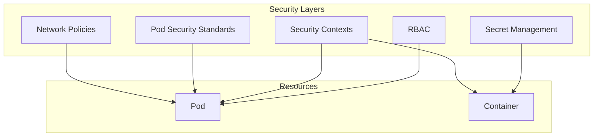

# Securing Helm Charts with Security Contexts and Network Policies

Author: [nawazdhandala](https://www.github.com/nawazdhandala)

Tags: Helm, Kubernetes, DevOps, Security, Network Policies, Pod Security

Description: Learn how to implement security best practices in Helm charts using security contexts, network policies, and pod security standards.

> Security isn't an afterthought—it's a requirement. This guide shows you how to build secure-by-default Helm charts with proper security contexts, network isolation, and pod security standards.

## Security Layers in Kubernetes

Security in Kubernetes operates at multiple levels, and Helm charts should configure all of them.



## Pod Security Context

Pod-level security settings apply to all containers in the pod.

### Basic Pod Security Context

Configure the security context in your Deployment template.

```yaml
# templates/deployment.yaml
apiVersion: apps/v1
kind: Deployment
metadata:
  name: {{ include "my-chart.fullname" . }}
spec:
  template:
    spec:
      securityContext:
        # Run as non-root user
        runAsNonRoot: true
        runAsUser: {{ .Values.securityContext.runAsUser }}
        runAsGroup: {{ .Values.securityContext.runAsGroup }}
        # Set filesystem group for volume mounts
        fsGroup: {{ .Values.securityContext.fsGroup }}
        # Ensure volumes are owned by fsGroup
        fsGroupChangePolicy: OnRootMismatch
        # Kernel parameters (requires privileged)
        sysctls: []
        # Supplemental groups
        supplementalGroups: []
```

### Values File for Security Context

```yaml
# values.yaml
securityContext:
  runAsNonRoot: true
  runAsUser: 1000
  runAsGroup: 1000
  fsGroup: 1000
```

## Container Security Context

Container-level settings provide fine-grained control per container.

### Secure Container Configuration

```yaml
# templates/deployment.yaml
spec:
  template:
    spec:
      containers:
        - name: {{ .Chart.Name }}
          image: "{{ .Values.image.repository }}:{{ .Values.image.tag }}"
          securityContext:
            # Prevent privilege escalation
            allowPrivilegeEscalation: false
            # Run as non-root
            runAsNonRoot: true
            runAsUser: {{ .Values.containerSecurityContext.runAsUser }}
            # Drop all capabilities
            capabilities:
              drop:
                - ALL
              # Add only what's needed
              add: {{ toYaml .Values.containerSecurityContext.capabilities.add | nindent 16 }}
            # Read-only root filesystem
            readOnlyRootFilesystem: {{ .Values.containerSecurityContext.readOnlyRootFilesystem }}
            # Seccomp profile
            seccompProfile:
              type: RuntimeDefault
```

### Comprehensive Security Values

```yaml
# values.yaml
containerSecurityContext:
  allowPrivilegeEscalation: false
  runAsNonRoot: true
  runAsUser: 1000
  readOnlyRootFilesystem: true
  capabilities:
    drop:
      - ALL
    add: []  # Add specific capabilities if needed

# For applications that need specific capabilities
# add:
#   - NET_BIND_SERVICE  # Bind to ports < 1024
#   - CHOWN            # Change file ownership
```

### Read-Only Filesystem with Writable Directories

When using `readOnlyRootFilesystem: true`, mount writable volumes for temp directories.

```yaml
# templates/deployment.yaml
spec:
  template:
    spec:
      containers:
        - name: {{ .Chart.Name }}
          securityContext:
            readOnlyRootFilesystem: true
          volumeMounts:
            # Writable tmp directory
            - name: tmp
              mountPath: /tmp
            # Application cache
            - name: cache
              mountPath: /app/cache
      volumes:
        - name: tmp
          emptyDir: {}
        - name: cache
          emptyDir:
            sizeLimit: 100Mi
```

## Pod Security Standards

Kubernetes Pod Security Standards define three levels: Privileged, Baseline, and Restricted.

### Restricted Pod Security (Recommended)

The restricted profile provides maximum security.

```yaml
# templates/deployment.yaml
apiVersion: apps/v1
kind: Deployment
metadata:
  name: {{ include "my-chart.fullname" . }}
spec:
  template:
    spec:
      # Restricted profile requirements
      securityContext:
        runAsNonRoot: true
        runAsUser: 1000
        runAsGroup: 1000
        fsGroup: 1000
        seccompProfile:
          type: RuntimeDefault
      containers:
        - name: {{ .Chart.Name }}
          securityContext:
            allowPrivilegeEscalation: false
            runAsNonRoot: true
            capabilities:
              drop:
                - ALL
            seccompProfile:
              type: RuntimeDefault
```

### Namespace-Level Enforcement

Create namespace with PSS labels.

```yaml
# templates/namespace.yaml
{{- if .Values.namespace.create }}
apiVersion: v1
kind: Namespace
metadata:
  name: {{ .Release.Namespace }}
  labels:
    # Enforce restricted profile
    pod-security.kubernetes.io/enforce: restricted
    pod-security.kubernetes.io/enforce-version: latest
    # Warn on baseline violations
    pod-security.kubernetes.io/warn: restricted
    pod-security.kubernetes.io/warn-version: latest
    # Audit all violations
    pod-security.kubernetes.io/audit: restricted
    pod-security.kubernetes.io/audit-version: latest
{{- end }}
```

## Network Policies

Network policies control pod-to-pod communication.

### Default Deny All

Start with a deny-all policy and explicitly allow needed traffic.

```yaml
# templates/networkpolicy-deny-all.yaml
{{- if .Values.networkPolicy.enabled }}
apiVersion: networking.k8s.io/v1
kind: NetworkPolicy
metadata:
  name: {{ include "my-chart.fullname" . }}-deny-all
  labels:
    {{- include "my-chart.labels" . | nindent 4 }}
spec:
  podSelector:
    matchLabels:
      {{- include "my-chart.selectorLabels" . | nindent 6 }}
  policyTypes:
    - Ingress
    - Egress
{{- end }}
```

### Allow Application Traffic

Allow specific ingress and egress traffic.

```yaml
# templates/networkpolicy.yaml
{{- if .Values.networkPolicy.enabled }}
apiVersion: networking.k8s.io/v1
kind: NetworkPolicy
metadata:
  name: {{ include "my-chart.fullname" . }}
  labels:
    {{- include "my-chart.labels" . | nindent 4 }}
spec:
  podSelector:
    matchLabels:
      {{- include "my-chart.selectorLabels" . | nindent 6 }}
  policyTypes:
    - Ingress
    - Egress
  
  ingress:
    # Allow traffic from ingress controller
    - from:
        - namespaceSelector:
            matchLabels:
              kubernetes.io/metadata.name: ingress-nginx
          podSelector:
            matchLabels:
              app.kubernetes.io/name: ingress-nginx
      ports:
        - protocol: TCP
          port: {{ .Values.service.port }}
    
    # Allow traffic from same namespace
    {{- if .Values.networkPolicy.allowSameNamespace }}
    - from:
        - podSelector: {}
      ports:
        - protocol: TCP
          port: {{ .Values.service.port }}
    {{- end }}
  
  egress:
    # Allow DNS
    - to:
        - namespaceSelector: {}
          podSelector:
            matchLabels:
              k8s-app: kube-dns
      ports:
        - protocol: UDP
          port: 53
        - protocol: TCP
          port: 53
    
    # Allow database access
    {{- if .Values.networkPolicy.database.enabled }}
    - to:
        - podSelector:
            matchLabels:
              app.kubernetes.io/name: postgresql
      ports:
        - protocol: TCP
          port: 5432
    {{- end }}
    
    # Allow Redis access
    {{- if .Values.networkPolicy.redis.enabled }}
    - to:
        - podSelector:
            matchLabels:
              app.kubernetes.io/name: redis
      ports:
        - protocol: TCP
          port: 6379
    {{- end }}
    
    # Allow external HTTPS
    {{- if .Values.networkPolicy.allowExternalHTTPS }}
    - to:
        - ipBlock:
            cidr: 0.0.0.0/0
      ports:
        - protocol: TCP
          port: 443
    {{- end }}
{{- end }}
```

### Network Policy Values

```yaml
# values.yaml
networkPolicy:
  enabled: true
  allowSameNamespace: true
  database:
    enabled: true
  redis:
    enabled: true
  allowExternalHTTPS: true
  # Custom rules
  additionalIngress: []
  additionalEgress: []
```

## RBAC Configuration

Create minimal RBAC permissions for your application.

### ServiceAccount

```yaml
# templates/serviceaccount.yaml
{{- if .Values.serviceAccount.create }}
apiVersion: v1
kind: ServiceAccount
metadata:
  name: {{ include "my-chart.serviceAccountName" . }}
  labels:
    {{- include "my-chart.labels" . | nindent 4 }}
  {{- with .Values.serviceAccount.annotations }}
  annotations:
    {{- toYaml . | nindent 4 }}
  {{- end }}
automountServiceAccountToken: {{ .Values.serviceAccount.automountToken }}
{{- end }}
```

### Role with Minimal Permissions

```yaml
# templates/role.yaml
{{- if .Values.rbac.create }}
apiVersion: rbac.authorization.k8s.io/v1
kind: Role
metadata:
  name: {{ include "my-chart.fullname" . }}
  labels:
    {{- include "my-chart.labels" . | nindent 4 }}
rules:
  # Only grant permissions that are actually needed
  - apiGroups: [""]
    resources: ["configmaps"]
    verbs: ["get", "list", "watch"]
  - apiGroups: [""]
    resources: ["secrets"]
    resourceNames: 
      - {{ include "my-chart.fullname" . }}-config
    verbs: ["get"]
{{- end }}
```

### RoleBinding

```yaml
# templates/rolebinding.yaml
{{- if .Values.rbac.create }}
apiVersion: rbac.authorization.k8s.io/v1
kind: RoleBinding
metadata:
  name: {{ include "my-chart.fullname" . }}
  labels:
    {{- include "my-chart.labels" . | nindent 4 }}
roleRef:
  apiGroup: rbac.authorization.k8s.io
  kind: Role
  name: {{ include "my-chart.fullname" . }}
subjects:
  - kind: ServiceAccount
    name: {{ include "my-chart.serviceAccountName" . }}
    namespace: {{ .Release.Namespace }}
{{- end }}
```

### RBAC Values

```yaml
# values.yaml
serviceAccount:
  create: true
  annotations: {}
  name: ""
  automountToken: false  # Don't mount token unless needed

rbac:
  create: true
  rules: []
```

## Secret Management

Handle secrets securely in your charts.

### External Secret Reference

Reference secrets that exist outside the chart.

```yaml
# templates/deployment.yaml
env:
  - name: DATABASE_PASSWORD
    valueFrom:
      secretKeyRef:
        name: {{ .Values.existingSecret | default (include "my-chart.fullname" .) }}
        key: {{ .Values.existingSecretKey | default "database-password" }}
```

### Create Secret with Proper Labels

```yaml
# templates/secret.yaml
{{- if not .Values.existingSecret }}
apiVersion: v1
kind: Secret
metadata:
  name: {{ include "my-chart.fullname" . }}
  labels:
    {{- include "my-chart.labels" . | nindent 4 }}
type: Opaque
data:
  database-password: {{ .Values.database.password | b64enc | quote }}
  api-key: {{ .Values.apiKey | b64enc | quote }}
{{- end }}
```

### Secrets Values

```yaml
# values.yaml
# Reference existing secret instead of creating one
existingSecret: ""
existingSecretKey: ""

# Only used if existingSecret is not set
database:
  password: ""  # Set via --set or external secret

apiKey: ""
```

## Image Security

### Pull Policy and Digest

```yaml
# templates/deployment.yaml
spec:
  template:
    spec:
      containers:
        - name: {{ .Chart.Name }}
          image: "{{ .Values.image.repository }}:{{ .Values.image.tag | default .Chart.AppVersion }}"
          imagePullPolicy: {{ .Values.image.pullPolicy }}
      {{- with .Values.imagePullSecrets }}
      imagePullSecrets:
        {{- toYaml . | nindent 8 }}
      {{- end }}
```

### Image Values

```yaml
# values.yaml
image:
  repository: myregistry.com/my-app
  pullPolicy: IfNotPresent
  # Use specific tag or digest for production
  tag: ""  # Defaults to Chart.appVersion
  # Or use digest for immutable reference
  # digest: sha256:abc123...

imagePullSecrets:
  - name: registry-credentials
```

### Use Digest Instead of Tag

For maximum security, use image digests.

```yaml
# templates/deployment.yaml
{{- $imageRef := .Values.image.repository }}
{{- if .Values.image.digest }}
{{- $imageRef = printf "%s@%s" .Values.image.repository .Values.image.digest }}
{{- else }}
{{- $imageRef = printf "%s:%s" .Values.image.repository (.Values.image.tag | default .Chart.AppVersion) }}
{{- end }}
image: {{ $imageRef }}
```

## Complete Secure Deployment Template

Putting it all together:

```yaml
# templates/deployment.yaml
apiVersion: apps/v1
kind: Deployment
metadata:
  name: {{ include "my-chart.fullname" . }}
  labels:
    {{- include "my-chart.labels" . | nindent 4 }}
spec:
  replicas: {{ .Values.replicaCount }}
  selector:
    matchLabels:
      {{- include "my-chart.selectorLabels" . | nindent 6 }}
  template:
    metadata:
      labels:
        {{- include "my-chart.selectorLabels" . | nindent 8 }}
    spec:
      serviceAccountName: {{ include "my-chart.serviceAccountName" . }}
      automountServiceAccountToken: {{ .Values.serviceAccount.automountToken }}
      
      securityContext:
        {{- toYaml .Values.podSecurityContext | nindent 8 }}
      
      containers:
        - name: {{ .Chart.Name }}
          image: "{{ .Values.image.repository }}:{{ .Values.image.tag | default .Chart.AppVersion }}"
          imagePullPolicy: {{ .Values.image.pullPolicy }}
          
          securityContext:
            {{- toYaml .Values.containerSecurityContext | nindent 12 }}
          
          ports:
            - name: http
              containerPort: {{ .Values.service.targetPort }}
              protocol: TCP
          
          livenessProbe:
            httpGet:
              path: /health
              port: http
          
          readinessProbe:
            httpGet:
              path: /ready
              port: http
          
          resources:
            {{- toYaml .Values.resources | nindent 12 }}
          
          volumeMounts:
            - name: tmp
              mountPath: /tmp
            {{- with .Values.extraVolumeMounts }}
            {{- toYaml . | nindent 12 }}
            {{- end }}
      
      volumes:
        - name: tmp
          emptyDir:
            sizeLimit: 100Mi
        {{- with .Values.extraVolumes }}
        {{- toYaml . | nindent 8 }}
        {{- end }}
      
      {{- with .Values.imagePullSecrets }}
      imagePullSecrets:
        {{- toYaml . | nindent 8 }}
      {{- end }}
      
      {{- with .Values.nodeSelector }}
      nodeSelector:
        {{- toYaml . | nindent 8 }}
      {{- end }}
```

### Complete Secure Values

```yaml
# values.yaml
replicaCount: 1

image:
  repository: myregistry.com/my-app
  pullPolicy: IfNotPresent
  tag: ""

imagePullSecrets: []

serviceAccount:
  create: true
  annotations: {}
  name: ""
  automountToken: false

rbac:
  create: true

podSecurityContext:
  runAsNonRoot: true
  runAsUser: 1000
  runAsGroup: 1000
  fsGroup: 1000
  seccompProfile:
    type: RuntimeDefault

containerSecurityContext:
  allowPrivilegeEscalation: false
  runAsNonRoot: true
  runAsUser: 1000
  readOnlyRootFilesystem: true
  capabilities:
    drop:
      - ALL

networkPolicy:
  enabled: true
  allowSameNamespace: true

service:
  type: ClusterIP
  port: 80
  targetPort: 8080

resources:
  limits:
    cpu: 500m
    memory: 512Mi
  requests:
    cpu: 100m
    memory: 128Mi
```

## Security Checklist

| Item | Description | Priority |
| --- | --- | --- |
| runAsNonRoot | Prevent running as root | Critical |
| readOnlyRootFilesystem | Prevent filesystem writes | High |
| allowPrivilegeEscalation: false | Prevent privilege escalation | Critical |
| Drop ALL capabilities | Minimize attack surface | High |
| Network policies | Control traffic flow | High |
| Resource limits | Prevent resource abuse | High |
| ServiceAccount without token | Minimize API access | Medium |
| Image pull policy | Control image source | Medium |
| Seccomp profile | Restrict syscalls | Medium |

## Wrap-up

Security in Helm charts requires attention at multiple levels: pod security contexts for runtime restrictions, network policies for traffic isolation, RBAC for API access control, and proper secret management. Start with the restricted pod security profile and add permissions only when necessary. Always use non-root users, read-only filesystems, and drop all capabilities by default. Network policies should start with deny-all and explicitly allow required traffic. These practices create defense in depth, making your deployments resilient against attacks.
