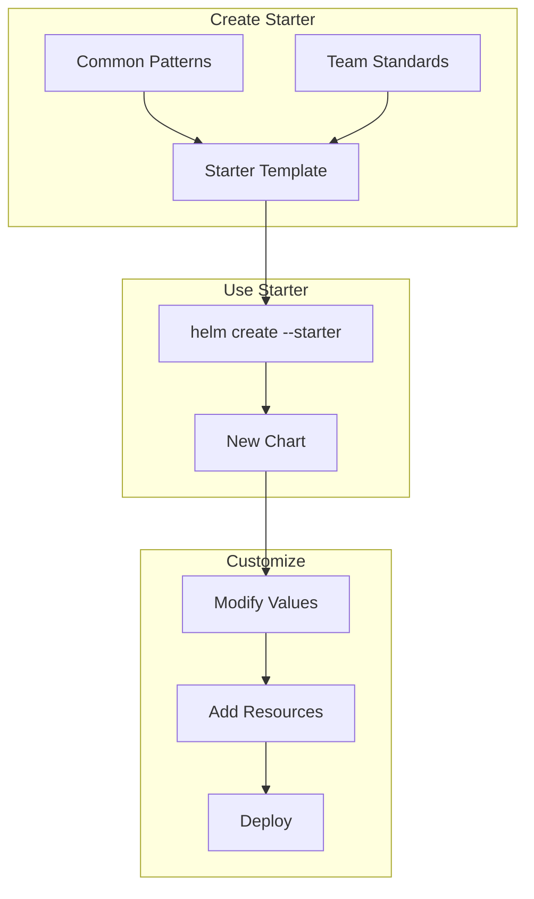

# How to Create Helm Starter Templates for Standardized Charts

Author: [nawazdhandala](https://www.github.com/nawazdhandala)

Tags: Helm, Kubernetes, DevOps, Templates, Standardization, Best Practices

Description: Guide to creating Helm starter templates for consistent chart scaffolding including directory structure, common patterns, and team standardization.

> Helm starters provide pre-configured chart scaffolds for consistent chart creation across teams. This guide covers creating, sharing, and using starter templates to standardize your Helm charts.

## Starter Template Workflow



## Creating a Starter Template

### Starter Directory Structure

```bash
# Starters location
~/.local/share/helm/starters/
# or
$HELM_DATA_HOME/starters/

# Create starter directory
mkdir -p ~/.local/share/helm/starters/my-starter

# Starter structure
my-starter/
├── Chart.yaml
├── values.yaml
├── values.schema.json
├── .helmignore
├── README.md
├── NOTES.txt
└── templates/
    ├── _helpers.tpl
    ├── deployment.yaml
    ├── service.yaml
    ├── ingress.yaml
    ├── hpa.yaml
    ├── pdb.yaml
    ├── serviceaccount.yaml
    ├── configmap.yaml
    ├── secret.yaml
    └── tests/
        └── test-connection.yaml
```

### Chart.yaml Template

```yaml
# Chart.yaml
apiVersion: v2
name: <CHARTNAME>
description: A Helm chart for <CHARTNAME>
type: application
version: 0.1.0
appVersion: "1.0.0"
maintainers:
  - name: Platform Team
    email: platform@example.com
keywords:
  - <CHARTNAME>
home: https://github.com/myorg/<CHARTNAME>
sources:
  - https://github.com/myorg/<CHARTNAME>
annotations:
  category: application
```

### values.yaml Template

```yaml
# values.yaml
# Default values for <CHARTNAME>.

# Number of replicas
replicaCount: 1

# Image configuration
image:
  repository: ""
  pullPolicy: IfNotPresent
  tag: ""

# Image pull secrets
imagePullSecrets: []

# Override names
nameOverride: ""
fullnameOverride: ""

# Service account
serviceAccount:
  create: true
  automount: true
  annotations: {}
  name: ""

# Pod annotations and labels
podAnnotations: {}
podLabels: {}

# Security contexts
podSecurityContext:
  fsGroup: 1000

securityContext:
  capabilities:
    drop:
      - ALL
  readOnlyRootFilesystem: true
  runAsNonRoot: true
  runAsUser: 1000

# Service configuration
service:
  type: ClusterIP
  port: 80

# Ingress configuration
ingress:
  enabled: false
  className: ""
  annotations: {}
  hosts:
    - host: chart-example.local
      paths:
        - path: /
          pathType: ImplementationSpecific
  tls: []

# Resources
resources:
  limits:
    cpu: 500m
    memory: 512Mi
  requests:
    cpu: 100m
    memory: 128Mi

# Autoscaling
autoscaling:
  enabled: false
  minReplicas: 1
  maxReplicas: 10
  targetCPUUtilizationPercentage: 80
  targetMemoryUtilizationPercentage: 80

# Pod Disruption Budget
podDisruptionBudget:
  enabled: false
  minAvailable: 1
  # maxUnavailable: 1

# Liveness and readiness probes
livenessProbe:
  httpGet:
    path: /healthz
    port: http
  initialDelaySeconds: 15
  periodSeconds: 10
  timeoutSeconds: 5
  failureThreshold: 3

readinessProbe:
  httpGet:
    path: /readyz
    port: http
  initialDelaySeconds: 5
  periodSeconds: 5
  timeoutSeconds: 3
  failureThreshold: 3

# Startup probe (for slow-starting apps)
startupProbe:
  enabled: false
  httpGet:
    path: /healthz
    port: http
  initialDelaySeconds: 10
  periodSeconds: 10
  timeoutSeconds: 5
  failureThreshold: 30

# Node selection
nodeSelector: {}
tolerations: []
affinity: {}

# Topology spread constraints
topologySpreadConstraints: []

# Extra environment variables
extraEnv: []

# Extra environment variables from ConfigMaps/Secrets
extraEnvFrom: []

# Config map data
config: {}

# Secrets
secrets: {}

# Extra volumes and volume mounts
extraVolumes: []
extraVolumeMounts: []

# Metrics
metrics:
  enabled: false
  port: 9090
  path: /metrics
  serviceMonitor:
    enabled: false
    interval: 30s
    labels: {}
```

### _helpers.tpl Template

```yaml
# templates/_helpers.tpl
{{/*
Expand the name of the chart.
*/}}
{{- define "<CHARTNAME>.name" -}}
{{- default .Chart.Name .Values.nameOverride | trunc 63 | trimSuffix "-" }}
{{- end }}

{{/*
Create a default fully qualified app name.
*/}}
{{- define "<CHARTNAME>.fullname" -}}
{{- if .Values.fullnameOverride }}
{{- .Values.fullnameOverride | trunc 63 | trimSuffix "-" }}
{{- else }}
{{- $name := default .Chart.Name .Values.nameOverride }}
{{- if contains $name .Release.Name }}
{{- .Release.Name | trunc 63 | trimSuffix "-" }}
{{- else }}
{{- printf "%s-%s" .Release.Name $name | trunc 63 | trimSuffix "-" }}
{{- end }}
{{- end }}
{{- end }}

{{/*
Create chart name and version as used by the chart label.
*/}}
{{- define "<CHARTNAME>.chart" -}}
{{- printf "%s-%s" .Chart.Name .Chart.Version | replace "+" "_" | trunc 63 | trimSuffix "-" }}
{{- end }}

{{/*
Common labels
*/}}
{{- define "<CHARTNAME>.labels" -}}
helm.sh/chart: {{ include "<CHARTNAME>.chart" . }}
{{ include "<CHARTNAME>.selectorLabels" . }}
{{- if .Chart.AppVersion }}
app.kubernetes.io/version: {{ .Chart.AppVersion | quote }}
{{- end }}
app.kubernetes.io/managed-by: {{ .Release.Service }}
{{- end }}

{{/*
Selector labels
*/}}
{{- define "<CHARTNAME>.selectorLabels" -}}
app.kubernetes.io/name: {{ include "<CHARTNAME>.name" . }}
app.kubernetes.io/instance: {{ .Release.Name }}
{{- end }}

{{/*
Create the name of the service account to use
*/}}
{{- define "<CHARTNAME>.serviceAccountName" -}}
{{- if .Values.serviceAccount.create }}
{{- default (include "<CHARTNAME>.fullname" .) .Values.serviceAccount.name }}
{{- else }}
{{- default "default" .Values.serviceAccount.name }}
{{- end }}
{{- end }}

{{/*
Create image name
*/}}
{{- define "<CHARTNAME>.image" -}}
{{- $tag := .Values.image.tag | default .Chart.AppVersion -}}
{{- printf "%s:%s" .Values.image.repository $tag -}}
{{- end }}

{{/*
Pod annotations
*/}}
{{- define "<CHARTNAME>.podAnnotations" -}}
{{- with .Values.podAnnotations }}
{{- toYaml . }}
{{- end }}
{{- if .Values.metrics.enabled }}
prometheus.io/scrape: "true"
prometheus.io/port: {{ .Values.metrics.port | quote }}
prometheus.io/path: {{ .Values.metrics.path | quote }}
{{- end }}
{{- end }}
```

### deployment.yaml Template

```yaml
# templates/deployment.yaml
apiVersion: apps/v1
kind: Deployment
metadata:
  name: {{ include "<CHARTNAME>.fullname" . }}
  labels:
    {{- include "<CHARTNAME>.labels" . | nindent 4 }}
spec:
  {{- if not .Values.autoscaling.enabled }}
  replicas: {{ .Values.replicaCount }}
  {{- end }}
  selector:
    matchLabels:
      {{- include "<CHARTNAME>.selectorLabels" . | nindent 6 }}
  template:
    metadata:
      annotations:
        {{- include "<CHARTNAME>.podAnnotations" . | nindent 8 }}
      labels:
        {{- include "<CHARTNAME>.labels" . | nindent 8 }}
        {{- with .Values.podLabels }}
        {{- toYaml . | nindent 8 }}
        {{- end }}
    spec:
      {{- with .Values.imagePullSecrets }}
      imagePullSecrets:
        {{- toYaml . | nindent 8 }}
      {{- end }}
      serviceAccountName: {{ include "<CHARTNAME>.serviceAccountName" . }}
      securityContext:
        {{- toYaml .Values.podSecurityContext | nindent 8 }}
      containers:
        - name: {{ .Chart.Name }}
          securityContext:
            {{- toYaml .Values.securityContext | nindent 12 }}
          image: {{ include "<CHARTNAME>.image" . | quote }}
          imagePullPolicy: {{ .Values.image.pullPolicy }}
          ports:
            - name: http
              containerPort: {{ .Values.service.port }}
              protocol: TCP
            {{- if .Values.metrics.enabled }}
            - name: metrics
              containerPort: {{ .Values.metrics.port }}
              protocol: TCP
            {{- end }}
          {{- with .Values.livenessProbe }}
          livenessProbe:
            {{- toYaml . | nindent 12 }}
          {{- end }}
          {{- with .Values.readinessProbe }}
          readinessProbe:
            {{- toYaml . | nindent 12 }}
          {{- end }}
          {{- if .Values.startupProbe.enabled }}
          startupProbe:
            {{- toYaml (omit .Values.startupProbe "enabled") | nindent 12 }}
          {{- end }}
          resources:
            {{- toYaml .Values.resources | nindent 12 }}
          {{- with .Values.extraEnv }}
          env:
            {{- toYaml . | nindent 12 }}
          {{- end }}
          {{- with .Values.extraEnvFrom }}
          envFrom:
            {{- toYaml . | nindent 12 }}
          {{- end }}
          volumeMounts:
            {{- if .Values.config }}
            - name: config
              mountPath: /etc/config
              readOnly: true
            {{- end }}
            {{- with .Values.extraVolumeMounts }}
            {{- toYaml . | nindent 12 }}
            {{- end }}
      volumes:
        {{- if .Values.config }}
        - name: config
          configMap:
            name: {{ include "<CHARTNAME>.fullname" . }}
        {{- end }}
        {{- with .Values.extraVolumes }}
        {{- toYaml . | nindent 8 }}
        {{- end }}
      {{- with .Values.nodeSelector }}
      nodeSelector:
        {{- toYaml . | nindent 8 }}
      {{- end }}
      {{- with .Values.affinity }}
      affinity:
        {{- toYaml . | nindent 8 }}
      {{- end }}
      {{- with .Values.tolerations }}
      tolerations:
        {{- toYaml . | nindent 8 }}
      {{- end }}
      {{- with .Values.topologySpreadConstraints }}
      topologySpreadConstraints:
        {{- toYaml . | nindent 8 }}
      {{- end }}
```

### pdb.yaml Template

```yaml
# templates/pdb.yaml
{{- if .Values.podDisruptionBudget.enabled }}
apiVersion: policy/v1
kind: PodDisruptionBudget
metadata:
  name: {{ include "<CHARTNAME>.fullname" . }}
  labels:
    {{- include "<CHARTNAME>.labels" . | nindent 4 }}
spec:
  {{- if .Values.podDisruptionBudget.minAvailable }}
  minAvailable: {{ .Values.podDisruptionBudget.minAvailable }}
  {{- end }}
  {{- if .Values.podDisruptionBudget.maxUnavailable }}
  maxUnavailable: {{ .Values.podDisruptionBudget.maxUnavailable }}
  {{- end }}
  selector:
    matchLabels:
      {{- include "<CHARTNAME>.selectorLabels" . | nindent 6 }}
{{- end }}
```

### ServiceMonitor Template

```yaml
# templates/servicemonitor.yaml
{{- if and .Values.metrics.enabled .Values.metrics.serviceMonitor.enabled }}
apiVersion: monitoring.coreos.com/v1
kind: ServiceMonitor
metadata:
  name: {{ include "<CHARTNAME>.fullname" . }}
  labels:
    {{- include "<CHARTNAME>.labels" . | nindent 4 }}
    {{- with .Values.metrics.serviceMonitor.labels }}
    {{- toYaml . | nindent 4 }}
    {{- end }}
spec:
  selector:
    matchLabels:
      {{- include "<CHARTNAME>.selectorLabels" . | nindent 6 }}
  endpoints:
    - port: metrics
      interval: {{ .Values.metrics.serviceMonitor.interval }}
      path: {{ .Values.metrics.path }}
{{- end }}
```

## Installing Starters

### Local Installation

```bash
# Copy starter to Helm starters directory
cp -r my-starter ~/.local/share/helm/starters/

# Verify installation
ls ~/.local/share/helm/starters/
```

### Share via Git

```bash
# Clone starters repository
git clone https://github.com/myorg/helm-starters.git ~/.local/share/helm/starters/org-starters

# Structure
org-starters/
├── microservice/
├── cronjob/
├── statefulapp/
└── README.md
```

## Using Starters

### Create Chart from Starter

```bash
# Create new chart using starter
helm create myapp --starter my-starter

# Or with full path
helm create myapp --starter ~/.local/share/helm/starters/my-starter

# Verify created chart
ls myapp/
```

### Post-Creation Customization

```bash
# After creating from starter
cd myapp

# Update Chart.yaml
# - Set proper name
# - Update version
# - Add dependencies

# Update values.yaml
# - Set image repository
# - Configure resources
# - Enable features

# Test the chart
helm lint .
helm template . | kubectl apply --dry-run=client -f -
```

## Starter Variants

### Microservice Starter

```yaml
# microservice-starter/values.yaml
# Focused on stateless microservices

replicaCount: 2

autoscaling:
  enabled: true
  minReplicas: 2
  maxReplicas: 20

podDisruptionBudget:
  enabled: true
  minAvailable: 1

# Anti-affinity for HA
affinity:
  podAntiAffinity:
    preferredDuringSchedulingIgnoredDuringExecution:
      - weight: 100
        podAffinityTerm:
          labelSelector:
            matchLabels:
              app.kubernetes.io/name: "{{ .Chart.Name }}"
          topologyKey: kubernetes.io/hostname

metrics:
  enabled: true
  serviceMonitor:
    enabled: true
```

### CronJob Starter

```yaml
# cronjob-starter/templates/cronjob.yaml
apiVersion: batch/v1
kind: CronJob
metadata:
  name: {{ include "<CHARTNAME>.fullname" . }}
  labels:
    {{- include "<CHARTNAME>.labels" . | nindent 4 }}
spec:
  schedule: {{ .Values.schedule | quote }}
  concurrencyPolicy: {{ .Values.concurrencyPolicy }}
  successfulJobsHistoryLimit: {{ .Values.successfulJobsHistoryLimit }}
  failedJobsHistoryLimit: {{ .Values.failedJobsHistoryLimit }}
  jobTemplate:
    spec:
      template:
        spec:
          restartPolicy: {{ .Values.restartPolicy }}
          containers:
            - name: {{ .Chart.Name }}
              image: {{ include "<CHARTNAME>.image" . | quote }}
              {{- with .Values.command }}
              command:
                {{- toYaml . | nindent 16 }}
              {{- end }}
              resources:
                {{- toYaml .Values.resources | nindent 16 }}
```

### StatefulSet Starter

```yaml
# stateful-starter/templates/statefulset.yaml
apiVersion: apps/v1
kind: StatefulSet
metadata:
  name: {{ include "<CHARTNAME>.fullname" . }}
  labels:
    {{- include "<CHARTNAME>.labels" . | nindent 4 }}
spec:
  serviceName: {{ include "<CHARTNAME>.fullname" . }}-headless
  replicas: {{ .Values.replicaCount }}
  selector:
    matchLabels:
      {{- include "<CHARTNAME>.selectorLabels" . | nindent 6 }}
  template:
    # ... pod template
  volumeClaimTemplates:
    - metadata:
        name: data
      spec:
        accessModes: [ "ReadWriteOnce" ]
        storageClassName: {{ .Values.persistence.storageClass }}
        resources:
          requests:
            storage: {{ .Values.persistence.size }}
```

## Best Practices

| Practice | Description |
|----------|-------------|
| Version Starters | Track changes in Git |
| Document Usage | README with examples |
| Include Tests | Test templates included |
| Security Defaults | Secure configurations |
| Consistent Naming | Use <CHARTNAME> placeholder |
| Multiple Variants | Different app types |

## Troubleshooting

```bash
# Check starter location
helm env | grep HELM_DATA_HOME

# List available starters
ls $(helm env | grep HELM_DATA_HOME | cut -d= -f2)/starters/

# Test starter manually
helm create test-chart --starter my-starter
helm lint test-chart/
rm -rf test-chart/

# Debug template rendering
helm template test-chart --debug
```

## Wrap-up

Helm starters standardize chart creation across teams by providing pre-configured templates with best practices built in. Create starters for different application types (microservices, cronjobs, stateful apps), share them via Git, and use them to maintain consistency in your Helm charts.
