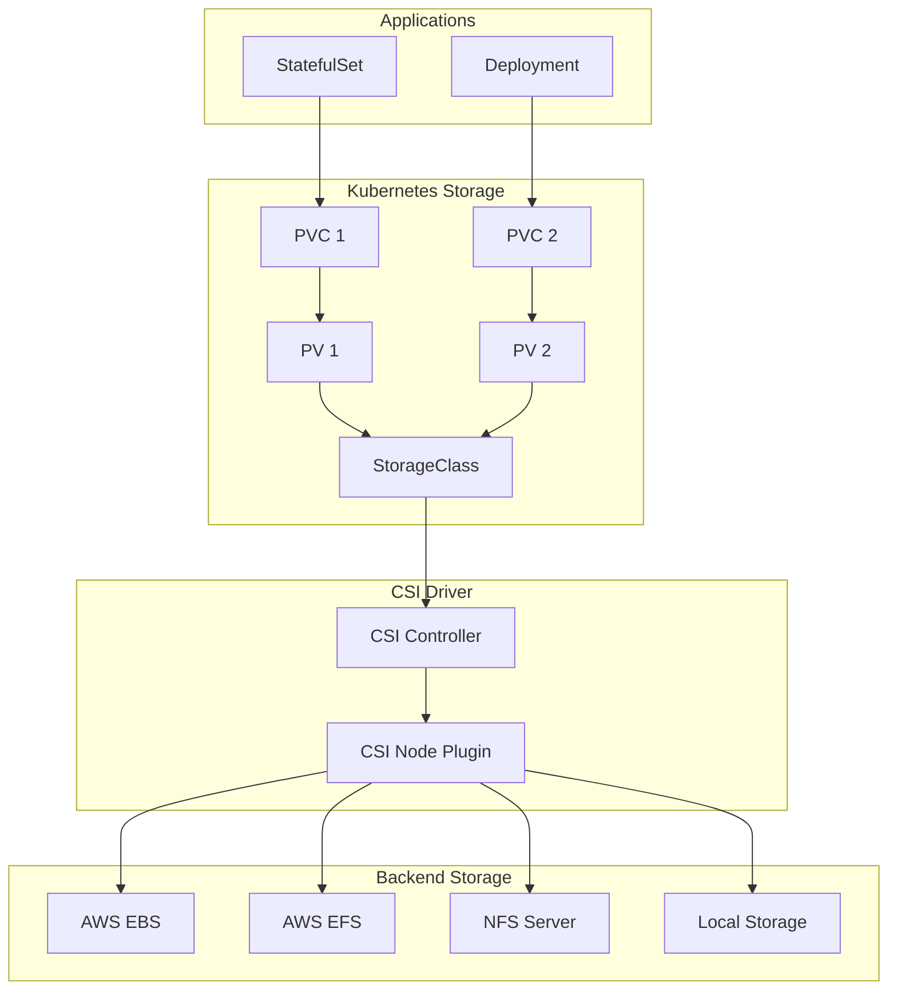

# Deploying Storage Classes and Persistent Volumes with Helm

Author: [nawazdhandala](https://www.github.com/nawazdhandala)

Tags: Helm, Kubernetes, DevOps, Storage, Persistent Volumes, CSI

Description: Comprehensive guide to deploying and managing storage classes, persistent volumes, and CSI drivers using Helm charts for stateful applications.

> Persistent storage is essential for stateful applications in Kubernetes. This guide covers deploying storage classes, CSI drivers, and managing persistent volumes using Helm charts for various cloud providers and on-premises solutions.

## Storage Architecture



## CSI Drivers Overview

| Driver | Provider | Use Case |
|--------|----------|----------|
| aws-ebs-csi-driver | AWS | Block storage |
| aws-efs-csi-driver | AWS | Shared file storage |
| azuredisk-csi-driver | Azure | Block storage |
| azurefile-csi-driver | Azure | File shares |
| gcp-pd-csi-driver | GCP | Persistent disks |
| csi-driver-nfs | Generic | NFS shares |
| longhorn | Rancher | Distributed storage |
| rook-ceph | Rook | Object/block/file |

## AWS EBS CSI Driver

### Add Repository

```bash
helm repo add aws-ebs-csi-driver https://kubernetes-sigs.github.io/aws-ebs-csi-driver
helm repo update
```

### IAM Configuration

```bash
# Create IAM policy
cat <<EOF > ebs-csi-policy.json
{
  "Version": "2012-10-17",
  "Statement": [
    {
      "Effect": "Allow",
      "Action": [
        "ec2:CreateSnapshot",
        "ec2:AttachVolume",
        "ec2:DetachVolume",
        "ec2:ModifyVolume",
        "ec2:DescribeAvailabilityZones",
        "ec2:DescribeInstances",
        "ec2:DescribeSnapshots",
        "ec2:DescribeTags",
        "ec2:DescribeVolumes",
        "ec2:DescribeVolumesModifications"
      ],
      "Resource": "*"
    },
    {
      "Effect": "Allow",
      "Action": [
        "ec2:CreateTags"
      ],
      "Resource": [
        "arn:aws:ec2:*:*:volume/*",
        "arn:aws:ec2:*:*:snapshot/*"
      ],
      "Condition": {
        "StringEquals": {
          "ec2:CreateAction": [
            "CreateVolume",
            "CreateSnapshot"
          ]
        }
      }
    },
    {
      "Effect": "Allow",
      "Action": [
        "ec2:DeleteTags"
      ],
      "Resource": [
        "arn:aws:ec2:*:*:volume/*",
        "arn:aws:ec2:*:*:snapshot/*"
      ]
    },
    {
      "Effect": "Allow",
      "Action": [
        "ec2:CreateVolume"
      ],
      "Resource": "*",
      "Condition": {
        "StringLike": {
          "aws:RequestTag/ebs.csi.aws.com/cluster": "true"
        }
      }
    },
    {
      "Effect": "Allow",
      "Action": [
        "ec2:CreateVolume"
      ],
      "Resource": "*",
      "Condition": {
        "StringLike": {
          "aws:RequestTag/CSIVolumeName": "*"
        }
      }
    },
    {
      "Effect": "Allow",
      "Action": [
        "ec2:DeleteVolume"
      ],
      "Resource": "*",
      "Condition": {
        "StringLike": {
          "ec2:ResourceTag/ebs.csi.aws.com/cluster": "true"
        }
      }
    },
    {
      "Effect": "Allow",
      "Action": [
        "ec2:DeleteVolume"
      ],
      "Resource": "*",
      "Condition": {
        "StringLike": {
          "ec2:ResourceTag/CSIVolumeName": "*"
        }
      }
    },
    {
      "Effect": "Allow",
      "Action": [
        "ec2:DeleteSnapshot"
      ],
      "Resource": "*",
      "Condition": {
        "StringLike": {
          "ec2:ResourceTag/CSIVolumeSnapshotName": "*"
        }
      }
    }
  ]
}
EOF
```

### Install EBS CSI Driver

```yaml
# ebs-csi-values.yaml
controller:
  replicaCount: 2
  
  resources:
    requests:
      cpu: 10m
      memory: 40Mi
    limits:
      cpu: 100m
      memory: 256Mi

  serviceAccount:
    create: true
    name: ebs-csi-controller-sa
    annotations:
      eks.amazonaws.com/role-arn: arn:aws:iam::ACCOUNT_ID:role/AmazonEKS_EBS_CSI_DriverRole

node:
  resources:
    requests:
      cpu: 10m
      memory: 40Mi
    limits:
      cpu: 100m
      memory: 256Mi

storageClasses:
  - name: ebs-sc
    annotations:
      storageclass.kubernetes.io/is-default-class: "true"
    volumeBindingMode: WaitForFirstConsumer
    reclaimPolicy: Delete
    parameters:
      type: gp3
      encrypted: "true"
      
  - name: ebs-sc-io1
    volumeBindingMode: WaitForFirstConsumer
    reclaimPolicy: Retain
    parameters:
      type: io1
      iopsPerGB: "50"
      encrypted: "true"
```

```bash
helm install aws-ebs-csi-driver aws-ebs-csi-driver/aws-ebs-csi-driver \
  --namespace kube-system \
  -f ebs-csi-values.yaml
```

## AWS EFS CSI Driver

### Install EFS CSI Driver

```yaml
# efs-csi-values.yaml
controller:
  serviceAccount:
    create: true
    name: efs-csi-controller-sa
    annotations:
      eks.amazonaws.com/role-arn: arn:aws:iam::ACCOUNT_ID:role/AmazonEKS_EFS_CSI_DriverRole

storageClasses:
  - name: efs-sc
    mountOptions:
      - tls
    parameters:
      provisioningMode: efs-ap
      fileSystemId: fs-xxxxxxxxx
      directoryPerms: "700"
      basePath: "/dynamic_provisioning"
    reclaimPolicy: Delete
    volumeBindingMode: Immediate
```

```bash
helm repo add aws-efs-csi-driver https://kubernetes-sigs.github.io/aws-efs-csi-driver
helm install aws-efs-csi-driver aws-efs-csi-driver/aws-efs-csi-driver \
  --namespace kube-system \
  -f efs-csi-values.yaml
```

## NFS CSI Driver

### Install NFS CSI Driver

```bash
helm repo add csi-driver-nfs https://raw.githubusercontent.com/kubernetes-csi/csi-driver-nfs/master/charts
helm repo update
```

```yaml
# nfs-csi-values.yaml
controller:
  replicas: 2
  resources:
    limits:
      memory: 200Mi
    requests:
      cpu: 10m
      memory: 20Mi

node:
  resources:
    limits:
      memory: 200Mi
    requests:
      cpu: 10m
      memory: 20Mi

storageClass:
  create: true
  name: nfs-csi
  server: nfs-server.example.com
  share: /exported/path
  reclaimPolicy: Delete
  volumeBindingMode: Immediate
  mountOptions:
    - hard
    - nfsvers=4.1
```

```bash
helm install csi-driver-nfs csi-driver-nfs/csi-driver-nfs \
  --namespace kube-system \
  -f nfs-csi-values.yaml
```

## Longhorn Distributed Storage

### Install Longhorn

```bash
helm repo add longhorn https://charts.longhorn.io
helm repo update
```

```yaml
# longhorn-values.yaml
persistence:
  defaultClass: true
  defaultClassReplicaCount: 3

csi:
  attacherReplicaCount: 2
  provisionerReplicaCount: 2
  resizerReplicaCount: 2
  snapshotterReplicaCount: 2

defaultSettings:
  backupTarget: s3://longhorn-backups@us-east-1/
  backupTargetCredentialSecret: longhorn-backup-secret
  createDefaultDiskLabeledNodes: true
  defaultDataPath: /var/lib/longhorn
  replicaSoftAntiAffinity: false
  storageOverProvisioningPercentage: 100
  storageMinimalAvailablePercentage: 15
  upgradeChecker: false
  defaultReplicaCount: 3

ingress:
  enabled: true
  host: longhorn.example.com
  tls: true
  tlsSecret: longhorn-tls

resources:
  limits:
    cpu: 500m
    memory: 512Mi
  requests:
    cpu: 100m
    memory: 128Mi
```

```bash
helm install longhorn longhorn/longhorn \
  --namespace longhorn-system \
  --create-namespace \
  -f longhorn-values.yaml
```

### Longhorn Storage Classes

```yaml
# longhorn-storage-classes.yaml
apiVersion: storage.k8s.io/v1
kind: StorageClass
metadata:
  name: longhorn-fast
provisioner: driver.longhorn.io
allowVolumeExpansion: true
reclaimPolicy: Delete
volumeBindingMode: Immediate
parameters:
  numberOfReplicas: "3"
  staleReplicaTimeout: "2880"
  fromBackup: ""
  fsType: ext4
  dataLocality: "best-effort"
  diskSelector: "ssd"
  nodeSelector: "storage"

---
apiVersion: storage.k8s.io/v1
kind: StorageClass
metadata:
  name: longhorn-backup
provisioner: driver.longhorn.io
allowVolumeExpansion: true
reclaimPolicy: Retain
parameters:
  numberOfReplicas: "2"
  recurringJobs: '[{"name":"backup", "task":"backup", "cron":"0 2 * * *", "retain":5}]'
```

## Rook-Ceph

### Install Rook-Ceph Operator

```bash
helm repo add rook-release https://charts.rook.io/release
helm repo update
```

```yaml
# rook-ceph-operator-values.yaml
currentNamespaceOnly: false

resources:
  limits:
    cpu: 500m
    memory: 512Mi
  requests:
    cpu: 100m
    memory: 128Mi

csi:
  enableRbdDriver: true
  enableCephfsDriver: true
  enableGrpcMetrics: true
  
  csiRBDProvisionerResource: |
    - name: csi-provisioner
      resource:
        requests:
          cpu: 100m
          memory: 128Mi
        limits:
          cpu: 500m
          memory: 256Mi

enableDiscoveryDaemon: true
```

```bash
helm install rook-ceph rook-release/rook-ceph \
  --namespace rook-ceph \
  --create-namespace \
  -f rook-ceph-operator-values.yaml
```

### Create Ceph Cluster

```yaml
# ceph-cluster.yaml
apiVersion: ceph.rook.io/v1
kind: CephCluster
metadata:
  name: rook-ceph
  namespace: rook-ceph
spec:
  cephVersion:
    image: quay.io/ceph/ceph:v18.2.0
  dataDirHostPath: /var/lib/rook
  mon:
    count: 3
    allowMultiplePerNode: false
  mgr:
    count: 2
    modules:
      - name: pg_autoscaler
        enabled: true
  dashboard:
    enabled: true
    ssl: true
  storage:
    useAllNodes: true
    useAllDevices: true
    deviceFilter: ^sd[b-z]
  resources:
    mon:
      limits:
        cpu: "1"
        memory: 2Gi
      requests:
        cpu: 500m
        memory: 1Gi
    osd:
      limits:
        cpu: "2"
        memory: 4Gi
      requests:
        cpu: 500m
        memory: 2Gi
```

### Ceph Storage Classes

```yaml
# ceph-storage-classes.yaml
apiVersion: storage.k8s.io/v1
kind: StorageClass
metadata:
  name: rook-ceph-block
provisioner: rook-ceph.rbd.csi.ceph.com
parameters:
  clusterID: rook-ceph
  pool: replicapool
  imageFormat: "2"
  imageFeatures: layering
  csi.storage.k8s.io/provisioner-secret-name: rook-csi-rbd-provisioner
  csi.storage.k8s.io/provisioner-secret-namespace: rook-ceph
  csi.storage.k8s.io/controller-expand-secret-name: rook-csi-rbd-provisioner
  csi.storage.k8s.io/controller-expand-secret-namespace: rook-ceph
  csi.storage.k8s.io/node-stage-secret-name: rook-csi-rbd-node
  csi.storage.k8s.io/node-stage-secret-namespace: rook-ceph
  csi.storage.k8s.io/fstype: ext4
allowVolumeExpansion: true
reclaimPolicy: Delete

---
apiVersion: storage.k8s.io/v1
kind: StorageClass
metadata:
  name: rook-cephfs
provisioner: rook-ceph.cephfs.csi.ceph.com
parameters:
  clusterID: rook-ceph
  fsName: cephfs
  pool: cephfs-data
  csi.storage.k8s.io/provisioner-secret-name: rook-csi-cephfs-provisioner
  csi.storage.k8s.io/provisioner-secret-namespace: rook-ceph
  csi.storage.k8s.io/controller-expand-secret-name: rook-csi-cephfs-provisioner
  csi.storage.k8s.io/controller-expand-secret-namespace: rook-ceph
  csi.storage.k8s.io/node-stage-secret-name: rook-csi-cephfs-node
  csi.storage.k8s.io/node-stage-secret-namespace: rook-ceph
allowVolumeExpansion: true
reclaimPolicy: Delete
```

## Custom Storage Classes

### StorageClass Templates

```yaml
# storage-class-template.yaml
{{- range .Values.storageClasses }}
---
apiVersion: storage.k8s.io/v1
kind: StorageClass
metadata:
  name: {{ .name }}
  annotations:
    {{- if .default }}
    storageclass.kubernetes.io/is-default-class: "true"
    {{- end }}
provisioner: {{ .provisioner }}
{{- with .parameters }}
parameters:
  {{- toYaml . | nindent 2 }}
{{- end }}
reclaimPolicy: {{ .reclaimPolicy | default "Delete" }}
volumeBindingMode: {{ .volumeBindingMode | default "WaitForFirstConsumer" }}
allowVolumeExpansion: {{ .allowVolumeExpansion | default true }}
{{- with .mountOptions }}
mountOptions:
  {{- toYaml . | nindent 2 }}
{{- end }}
{{- end }}
```

### Values for Multiple Storage Classes

```yaml
# storage-values.yaml
storageClasses:
  - name: fast-ssd
    default: false
    provisioner: ebs.csi.aws.com
    reclaimPolicy: Delete
    volumeBindingMode: WaitForFirstConsumer
    allowVolumeExpansion: true
    parameters:
      type: gp3
      iops: "3000"
      throughput: "125"
      encrypted: "true"

  - name: standard
    default: true
    provisioner: ebs.csi.aws.com
    parameters:
      type: gp3
      encrypted: "true"

  - name: archival
    default: false
    provisioner: ebs.csi.aws.com
    reclaimPolicy: Retain
    parameters:
      type: sc1
      encrypted: "true"

  - name: shared-data
    default: false
    provisioner: efs.csi.aws.com
    parameters:
      provisioningMode: efs-ap
      fileSystemId: fs-xxxxxxxxx
      directoryPerms: "755"
```

## Volume Snapshots

### Install Snapshot Controller

```yaml
# snapshot-controller-values.yaml
controller:
  replicas: 2
  resources:
    limits:
      cpu: 100m
      memory: 128Mi
    requests:
      cpu: 10m
      memory: 32Mi
```

### VolumeSnapshotClass

```yaml
# volume-snapshot-class.yaml
apiVersion: snapshot.storage.k8s.io/v1
kind: VolumeSnapshotClass
metadata:
  name: ebs-snapshot-class
driver: ebs.csi.aws.com
deletionPolicy: Delete
parameters:
  tagSpecification_1: "key=Environment,value=production"
  tagSpecification_2: "key=Team,value=platform"

---
apiVersion: snapshot.storage.k8s.io/v1
kind: VolumeSnapshotClass
metadata:
  name: ceph-snapshot-class
driver: rook-ceph.rbd.csi.ceph.com
deletionPolicy: Delete
parameters:
  clusterID: rook-ceph
  csi.storage.k8s.io/snapshotter-secret-name: rook-csi-rbd-provisioner
  csi.storage.k8s.io/snapshotter-secret-namespace: rook-ceph
```

### Create Volume Snapshot

```yaml
# volume-snapshot.yaml
apiVersion: snapshot.storage.k8s.io/v1
kind: VolumeSnapshot
metadata:
  name: data-snapshot
spec:
  volumeSnapshotClassName: ebs-snapshot-class
  source:
    persistentVolumeClaimName: data-pvc
```

### Restore from Snapshot

```yaml
# restore-from-snapshot.yaml
apiVersion: v1
kind: PersistentVolumeClaim
metadata:
  name: restored-data-pvc
spec:
  storageClassName: ebs-sc
  dataSource:
    name: data-snapshot
    kind: VolumeSnapshot
    apiGroup: snapshot.storage.k8s.io
  accessModes:
    - ReadWriteOnce
  resources:
    requests:
      storage: 50Gi
```

## Monitoring Storage

### Prometheus Rules

```yaml
# storage-prometheus-rules.yaml
apiVersion: monitoring.coreos.com/v1
kind: PrometheusRule
metadata:
  name: storage-alerts
spec:
  groups:
    - name: storage
      rules:
        - alert: PersistentVolumeFillingUp
          expr: |
            kubelet_volume_stats_available_bytes{job="kubelet"}
            / kubelet_volume_stats_capacity_bytes{job="kubelet"} < 0.15
          for: 1h
          labels:
            severity: warning
          annotations:
            summary: PersistentVolume is filling up
            
        - alert: PersistentVolumeErrors
          expr: kube_persistentvolume_status_phase{phase=~"Failed|Pending"} > 0
          for: 5m
          labels:
            severity: critical
          annotations:
            summary: PersistentVolume has errors
            
        - alert: CSIDriverNotReady
          expr: csi_plugin_count == 0
          for: 5m
          labels:
            severity: critical
          annotations:
            summary: CSI driver is not ready
```

## Troubleshooting

```bash
# Check storage classes
kubectl get storageclass

# Check PVs and PVCs
kubectl get pv,pvc -A

# Check CSI pods
kubectl get pods -n kube-system -l app=ebs-csi-controller

# Check CSI logs
kubectl logs -n kube-system -l app=ebs-csi-controller -c csi-provisioner

# Describe PVC issues
kubectl describe pvc <pvc-name>

# Check volume attachments
kubectl get volumeattachment

# Debug provisioning
kubectl logs -n kube-system deployment/csi-controller -c csi-provisioner -f
```

## Wrap-up

Proper storage configuration is critical for stateful applications in Kubernetes. Use appropriate CSI drivers for your infrastructure, configure storage classes with correct reclaim policies, and implement volume snapshots for backup and recovery. Consider using distributed storage solutions like Longhorn or Rook-Ceph for on-premises deployments that require high availability and data redundancy.
