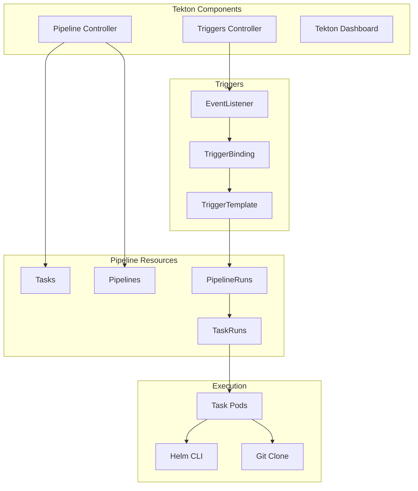

# Automating Helm Deployments with Tekton Pipelines

Author: [nawazdhandala](https://www.github.com/nawazdhandala)

Tags: Helm, Kubernetes, DevOps, Tekton, CI/CD, Pipelines, Cloud Native

Description: Complete guide to building Helm deployment pipelines using Tekton for cloud-native CI/CD automation on Kubernetes.

> Tekton provides Kubernetes-native CI/CD building blocks for creating powerful pipelines. This guide covers building Helm deployment pipelines using Tekton tasks and pipelines.

## Tekton Architecture



## Prerequisites

### Install Tekton

```bash
# Install Tekton Pipelines
kubectl apply --filename https://storage.googleapis.com/tekton-releases/pipeline/latest/release.yaml

# Install Tekton Triggers
kubectl apply --filename https://storage.googleapis.com/tekton-releases/triggers/latest/release.yaml

# Install Tekton Dashboard
kubectl apply --filename https://storage.googleapis.com/tekton-releases/dashboard/latest/release.yaml

# Verify installation
kubectl get pods -n tekton-pipelines
```

### Install with Helm

```bash
helm repo add tekton https://tekton-releases.storage.googleapis.com/charts
helm repo update

helm install tekton-pipelines tekton/tekton-pipeline \
  --namespace tekton-pipelines \
  --create-namespace
```

### Install Tekton CLI

```bash
# macOS
brew install tektoncd-cli

# Linux
curl -LO https://github.com/tektoncd/cli/releases/download/v0.33.0/tkn_0.33.0_Linux_x86_64.tar.gz
tar xvzf tkn_0.33.0_Linux_x86_64.tar.gz
mv tkn /usr/local/bin/
```

## Helm Tasks

### Helm Lint Task

```yaml
# helm-lint-task.yaml
apiVersion: tekton.dev/v1beta1
kind: Task
metadata:
  name: helm-lint
  namespace: tekton-pipelines
spec:
  description: Lint Helm charts
  
  params:
    - name: chart-path
      description: Path to the Helm chart
      type: string
      default: "."
    - name: strict
      description: Use strict mode for linting
      type: string
      default: "true"
      
  workspaces:
    - name: source
      description: Workspace containing the chart
      
  steps:
    - name: lint
      image: alpine/helm:3.13.0
      workingDir: $(workspaces.source.path)
      script: |
        #!/bin/sh
        set -e
        
        echo "Linting chart at $(params.chart-path)"
        
        # Basic lint
        helm lint $(params.chart-path)
        
        # Strict lint if enabled
        if [ "$(params.strict)" = "true" ]; then
          echo "Running strict lint..."
          helm lint $(params.chart-path) --strict
        fi
        
        echo "Lint passed!"
```

### Helm Test Task

```yaml
# helm-test-task.yaml
apiVersion: tekton.dev/v1beta1
kind: Task
metadata:
  name: helm-test
  namespace: tekton-pipelines
spec:
  description: Run Helm chart tests
  
  params:
    - name: chart-path
      description: Path to the Helm chart
      type: string
      
  workspaces:
    - name: source
      description: Workspace containing the chart
      
  steps:
    - name: unittest
      image: helmunittest/helm-unittest:3.13.0-0.3.5
      workingDir: $(workspaces.source.path)
      script: |
        #!/bin/sh
        set -e
        
        echo "Running Helm unit tests"
        helm unittest $(params.chart-path)
        
    - name: template-validate
      image: alpine/helm:3.13.0
      workingDir: $(workspaces.source.path)
      script: |
        #!/bin/sh
        set -e
        
        echo "Validating templates"
        helm template test $(params.chart-path) > /tmp/rendered.yaml
        
        # Install kubeconform
        wget -qO /tmp/kubeconform.tar.gz \
          https://github.com/yannh/kubeconform/releases/download/v0.6.0/kubeconform-linux-amd64.tar.gz
        tar -xzf /tmp/kubeconform.tar.gz -C /usr/local/bin
        
        # Validate
        kubeconform -summary -strict /tmp/rendered.yaml
```

### Helm Package Task

```yaml
# helm-package-task.yaml
apiVersion: tekton.dev/v1beta1
kind: Task
metadata:
  name: helm-package
  namespace: tekton-pipelines
spec:
  description: Package Helm chart
  
  params:
    - name: chart-path
      description: Path to the Helm chart
      type: string
    - name: version
      description: Chart version
      type: string
      default: ""
    - name: app-version
      description: App version
      type: string
      default: ""
      
  workspaces:
    - name: source
      description: Workspace containing the chart
    - name: output
      description: Workspace for packaged chart
      
  results:
    - name: chart-name
      description: Name of the packaged chart
    - name: chart-version
      description: Version of the packaged chart
      
  steps:
    - name: update-deps
      image: alpine/helm:3.13.0
      workingDir: $(workspaces.source.path)
      script: |
        #!/bin/sh
        set -e
        
        echo "Updating dependencies"
        helm dependency update $(params.chart-path)
        
    - name: package
      image: alpine/helm:3.13.0
      workingDir: $(workspaces.source.path)
      script: |
        #!/bin/sh
        set -e
        
        VERSION_ARG=""
        if [ -n "$(params.version)" ]; then
          VERSION_ARG="--version $(params.version)"
        fi
        
        APP_VERSION_ARG=""
        if [ -n "$(params.app-version)" ]; then
          APP_VERSION_ARG="--app-version $(params.app-version)"
        fi
        
        echo "Packaging chart"
        helm package $(params.chart-path) \
          -d $(workspaces.output.path) \
          $VERSION_ARG $APP_VERSION_ARG
        
        # Extract chart info
        CHART_FILE=$(ls $(workspaces.output.path)/*.tgz)
        CHART_NAME=$(basename $CHART_FILE | sed 's/-[0-9].*//')
        CHART_VERSION=$(basename $CHART_FILE | sed 's/.*-\([0-9].*\)\.tgz/\1/')
        
        echo -n "$CHART_NAME" > $(results.chart-name.path)
        echo -n "$CHART_VERSION" > $(results.chart-version.path)
        
        echo "Packaged: $CHART_NAME version $CHART_VERSION"
```

### Helm Push Task

```yaml
# helm-push-task.yaml
apiVersion: tekton.dev/v1beta1
kind: Task
metadata:
  name: helm-push
  namespace: tekton-pipelines
spec:
  description: Push Helm chart to registry
  
  params:
    - name: registry
      description: OCI registry URL
      type: string
    - name: chart-name
      description: Chart name
      type: string
      
  workspaces:
    - name: charts
      description: Workspace containing packaged charts
      
  steps:
    - name: push
      image: alpine/helm:3.13.0
      workingDir: $(workspaces.charts.path)
      env:
        - name: REGISTRY_USERNAME
          valueFrom:
            secretKeyRef:
              name: registry-credentials
              key: username
        - name: REGISTRY_PASSWORD
          valueFrom:
            secretKeyRef:
              name: registry-credentials
              key: password
      script: |
        #!/bin/sh
        set -e
        
        echo "Logging in to registry"
        echo "$REGISTRY_PASSWORD" | helm registry login $(params.registry) \
          --username "$REGISTRY_USERNAME" --password-stdin
        
        echo "Pushing chart"
        for chart in *.tgz; do
          helm push $chart oci://$(params.registry)/charts
        done
        
        echo "Push complete!"
```

### Helm Deploy Task

```yaml
# helm-deploy-task.yaml
apiVersion: tekton.dev/v1beta1
kind: Task
metadata:
  name: helm-deploy
  namespace: tekton-pipelines
spec:
  description: Deploy Helm chart to Kubernetes
  
  params:
    - name: release-name
      description: Helm release name
      type: string
    - name: chart
      description: Chart name or path
      type: string
    - name: namespace
      description: Target namespace
      type: string
      default: "default"
    - name: version
      description: Chart version
      type: string
      default: ""
    - name: values-file
      description: Path to values file
      type: string
      default: ""
    - name: set-values
      description: Values to set (comma-separated key=value pairs)
      type: string
      default: ""
    - name: wait
      description: Wait for deployment
      type: string
      default: "true"
    - name: timeout
      description: Timeout for wait
      type: string
      default: "5m"
      
  workspaces:
    - name: source
      description: Workspace containing values files
      optional: true
      
  steps:
    - name: deploy
      image: alpine/helm:3.13.0
      script: |
        #!/bin/sh
        set -e
        
        # Build helm command
        CMD="helm upgrade --install $(params.release-name) $(params.chart)"
        CMD="$CMD --namespace $(params.namespace) --create-namespace"
        
        if [ -n "$(params.version)" ]; then
          CMD="$CMD --version $(params.version)"
        fi
        
        if [ -n "$(params.values-file)" ]; then
          CMD="$CMD -f $(workspaces.source.path)/$(params.values-file)"
        fi
        
        if [ -n "$(params.set-values)" ]; then
          CMD="$CMD --set $(params.set-values)"
        fi
        
        if [ "$(params.wait)" = "true" ]; then
          CMD="$CMD --wait --timeout $(params.timeout)"
        fi
        
        echo "Executing: $CMD"
        eval $CMD
        
        echo "Deployment complete!"
        helm status $(params.release-name) -n $(params.namespace)
```

### Helm Rollback Task

```yaml
# helm-rollback-task.yaml
apiVersion: tekton.dev/v1beta1
kind: Task
metadata:
  name: helm-rollback
  namespace: tekton-pipelines
spec:
  description: Rollback Helm release
  
  params:
    - name: release-name
      description: Helm release name
      type: string
    - name: namespace
      description: Target namespace
      type: string
    - name: revision
      description: Revision to rollback to (0 for previous)
      type: string
      default: "0"
      
  steps:
    - name: rollback
      image: alpine/helm:3.13.0
      script: |
        #!/bin/sh
        set -e
        
        if [ "$(params.revision)" = "0" ]; then
          echo "Rolling back to previous revision"
          helm rollback $(params.release-name) -n $(params.namespace) --wait
        else
          echo "Rolling back to revision $(params.revision)"
          helm rollback $(params.release-name) $(params.revision) \
            -n $(params.namespace) --wait
        fi
        
        helm status $(params.release-name) -n $(params.namespace)
```

## Complete CI/CD Pipeline

### Helm CI/CD Pipeline

```yaml
# helm-cicd-pipeline.yaml
apiVersion: tekton.dev/v1beta1
kind: Pipeline
metadata:
  name: helm-cicd-pipeline
  namespace: tekton-pipelines
spec:
  description: Complete Helm CI/CD pipeline
  
  params:
    - name: git-url
      description: Git repository URL
      type: string
    - name: git-revision
      description: Git revision
      type: string
      default: "main"
    - name: chart-path
      description: Path to Helm chart
      type: string
      default: "charts/myapp"
    - name: registry
      description: OCI registry URL
      type: string
    - name: deploy-namespace
      description: Deployment namespace
      type: string
      default: "default"
      
  workspaces:
    - name: shared-workspace
    - name: chart-output
    
  tasks:
    - name: git-clone
      taskRef:
        name: git-clone
        kind: ClusterTask
      params:
        - name: url
          value: $(params.git-url)
        - name: revision
          value: $(params.git-revision)
      workspaces:
        - name: output
          workspace: shared-workspace
          
    - name: lint
      taskRef:
        name: helm-lint
      runAfter: [git-clone]
      params:
        - name: chart-path
          value: $(params.chart-path)
      workspaces:
        - name: source
          workspace: shared-workspace
          
    - name: test
      taskRef:
        name: helm-test
      runAfter: [lint]
      params:
        - name: chart-path
          value: $(params.chart-path)
      workspaces:
        - name: source
          workspace: shared-workspace
          
    - name: package
      taskRef:
        name: helm-package
      runAfter: [test]
      params:
        - name: chart-path
          value: $(params.chart-path)
      workspaces:
        - name: source
          workspace: shared-workspace
        - name: output
          workspace: chart-output
          
    - name: push
      taskRef:
        name: helm-push
      runAfter: [package]
      params:
        - name: registry
          value: $(params.registry)
        - name: chart-name
          value: $(tasks.package.results.chart-name)
      workspaces:
        - name: charts
          workspace: chart-output
          
    - name: deploy
      taskRef:
        name: helm-deploy
      runAfter: [push]
      params:
        - name: release-name
          value: $(tasks.package.results.chart-name)
        - name: chart
          value: oci://$(params.registry)/charts/$(tasks.package.results.chart-name)
        - name: version
          value: $(tasks.package.results.chart-version)
        - name: namespace
          value: $(params.deploy-namespace)
      workspaces:
        - name: source
          workspace: shared-workspace
```

### Run Pipeline

```yaml
# helm-cicd-pipelinerun.yaml
apiVersion: tekton.dev/v1beta1
kind: PipelineRun
metadata:
  generateName: helm-cicd-
  namespace: tekton-pipelines
spec:
  pipelineRef:
    name: helm-cicd-pipeline
    
  params:
    - name: git-url
      value: "https://github.com/myorg/helm-charts.git"
    - name: git-revision
      value: "main"
    - name: chart-path
      value: "charts/myapp"
    - name: registry
      value: "ghcr.io/myorg"
    - name: deploy-namespace
      value: "production"
      
  workspaces:
    - name: shared-workspace
      volumeClaimTemplate:
        spec:
          accessModes: ["ReadWriteOnce"]
          resources:
            requests:
              storage: 1Gi
    - name: chart-output
      volumeClaimTemplate:
        spec:
          accessModes: ["ReadWriteOnce"]
          resources:
            requests:
              storage: 100Mi
```

## Multi-Environment Pipeline

```yaml
# helm-multienv-pipeline.yaml
apiVersion: tekton.dev/v1beta1
kind: Pipeline
metadata:
  name: helm-multienv-pipeline
  namespace: tekton-pipelines
spec:
  params:
    - name: chart-name
    - name: chart-version
    - name: registry
      
  tasks:
    - name: deploy-dev
      taskRef:
        name: helm-deploy
      params:
        - name: release-name
          value: $(params.chart-name)
        - name: chart
          value: oci://$(params.registry)/charts/$(params.chart-name)
        - name: version
          value: $(params.chart-version)
        - name: namespace
          value: dev
        - name: values-file
          value: environments/dev/values.yaml
          
    - name: test-dev
      taskRef:
        name: integration-tests
      runAfter: [deploy-dev]
      params:
        - name: namespace
          value: dev
          
    - name: deploy-staging
      taskRef:
        name: helm-deploy
      runAfter: [test-dev]
      params:
        - name: release-name
          value: $(params.chart-name)
        - name: chart
          value: oci://$(params.registry)/charts/$(params.chart-name)
        - name: version
          value: $(params.chart-version)
        - name: namespace
          value: staging
        - name: values-file
          value: environments/staging/values.yaml
          
    - name: test-staging
      taskRef:
        name: integration-tests
      runAfter: [deploy-staging]
      params:
        - name: namespace
          value: staging
          
    - name: approval
      taskRef:
        name: manual-approval
      runAfter: [test-staging]
      
    - name: deploy-production
      taskRef:
        name: helm-deploy
      runAfter: [approval]
      params:
        - name: release-name
          value: $(params.chart-name)
        - name: chart
          value: oci://$(params.registry)/charts/$(params.chart-name)
        - name: version
          value: $(params.chart-version)
        - name: namespace
          value: production
        - name: values-file
          value: environments/production/values.yaml
```

## Triggers

### GitHub Webhook Trigger

```yaml
# github-trigger.yaml
apiVersion: triggers.tekton.dev/v1beta1
kind: TriggerBinding
metadata:
  name: github-push-binding
  namespace: tekton-pipelines
spec:
  params:
    - name: git-url
      value: $(body.repository.clone_url)
    - name: git-revision
      value: $(body.head_commit.id)
    - name: git-branch
      value: $(body.ref)

---
apiVersion: triggers.tekton.dev/v1beta1
kind: TriggerTemplate
metadata:
  name: helm-pipeline-template
  namespace: tekton-pipelines
spec:
  params:
    - name: git-url
    - name: git-revision
    - name: git-branch
      
  resourcetemplates:
    - apiVersion: tekton.dev/v1beta1
      kind: PipelineRun
      metadata:
        generateName: helm-cicd-
      spec:
        pipelineRef:
          name: helm-cicd-pipeline
        params:
          - name: git-url
            value: $(tt.params.git-url)
          - name: git-revision
            value: $(tt.params.git-revision)
          - name: chart-path
            value: "charts/myapp"
          - name: registry
            value: "ghcr.io/myorg"
          - name: deploy-namespace
            value: "production"
        workspaces:
          - name: shared-workspace
            volumeClaimTemplate:
              spec:
                accessModes: ["ReadWriteOnce"]
                resources:
                  requests:
                    storage: 1Gi
          - name: chart-output
            volumeClaimTemplate:
              spec:
                accessModes: ["ReadWriteOnce"]
                resources:
                  requests:
                    storage: 100Mi

---
apiVersion: triggers.tekton.dev/v1beta1
kind: EventListener
metadata:
  name: github-listener
  namespace: tekton-pipelines
spec:
  serviceAccountName: tekton-triggers-sa
  triggers:
    - name: github-push
      interceptors:
        - ref:
            name: "github"
          params:
            - name: "eventTypes"
              value: ["push"]
        - ref:
            name: "cel"
          params:
            - name: "filter"
              value: "body.ref == 'refs/heads/main'"
      bindings:
        - ref: github-push-binding
      template:
        ref: helm-pipeline-template
```

## Monitoring

### ServiceMonitor for Tekton

```yaml
# tekton-servicemonitor.yaml
apiVersion: monitoring.coreos.com/v1
kind: ServiceMonitor
metadata:
  name: tekton-pipelines
  namespace: monitoring
spec:
  selector:
    matchLabels:
      app.kubernetes.io/component: controller
  namespaceSelector:
    matchNames:
      - tekton-pipelines
  endpoints:
    - port: metrics
      path: /metrics
      interval: 30s
```

## Troubleshooting

```bash
# List pipelines
tkn pipeline list -n tekton-pipelines

# List pipeline runs
tkn pipelinerun list -n tekton-pipelines

# Get pipeline run details
tkn pipelinerun describe <pipelinerun-name> -n tekton-pipelines

# Get pipeline run logs
tkn pipelinerun logs <pipelinerun-name> -n tekton-pipelines

# List tasks
tkn task list -n tekton-pipelines

# List task runs
tkn taskrun list -n tekton-pipelines

# Start a pipeline
tkn pipeline start helm-cicd-pipeline \
  -p git-url=https://github.com/myorg/charts.git \
  -p registry=ghcr.io/myorg \
  -n tekton-pipelines

# Access Tekton Dashboard
kubectl port-forward -n tekton-pipelines svc/tekton-dashboard 9097:9097
```

## Wrap-up

Tekton provides Kubernetes-native CI/CD building blocks for creating powerful Helm deployment pipelines. Use Tasks for reusable operations, Pipelines for orchestrating workflows, and Triggers for event-driven automation. Integrate with your source control system for GitOps workflows and monitor your pipelines with Prometheus metrics.
