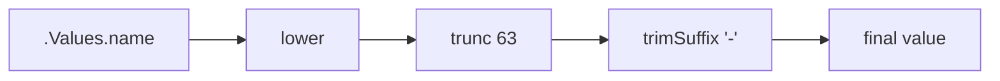

# Mastering Helm Template Functions and Pipelines

Author: [nawazdhandala](https://www.github.com/nawazdhandala)

Tags: Helm, Kubernetes, DevOps, Templates, Go Templates, Functions

Description: Learn how to use Helm template functions, pipelines, and the Sprig library to create powerful, flexible Kubernetes manifests.

> Helm templates use Go's text/template language enhanced with Sprig functions. Mastering these tools lets you build charts that adapt to any environment, validate inputs, and generate complex configurations dynamically.

## Template Basics

Helm templates use double curly braces for actions and expressions.

```yaml
# Basic value reference
apiVersion: v1
kind: ConfigMap
metadata:
  name: {{ .Release.Name }}-config
data:
  # Direct value access
  app-name: {{ .Values.appName }}
  # With default
  log-level: {{ .Values.logLevel | default "info" }}
```

### Built-in Objects

Helm provides several built-in objects:

| Object | Description |
| --- | --- |
| `.Values` | Values from values.yaml and --set |
| `.Release` | Release information (name, namespace, etc.) |
| `.Chart` | Chart.yaml contents |
| `.Files` | Access to non-template files |
| `.Capabilities` | Kubernetes cluster capabilities |
| `.Template` | Current template information |

```yaml
metadata:
  name: {{ .Release.Name }}
  namespace: {{ .Release.Namespace }}
  labels:
    chart: {{ .Chart.Name }}-{{ .Chart.Version }}
    app.kubernetes.io/managed-by: {{ .Release.Service }}
```

## Pipelines

Pipelines chain functions together, passing each result to the next function.

```yaml
# Basic pipeline: value | function1 | function2
name: {{ .Values.name | lower | trunc 63 | trimSuffix "-" }}

# More complex pipeline
annotations:
  checksum/config: {{ include "my-chart.configmap" . | sha256sum }}
```



## String Functions

### Case Manipulation

```yaml
data:
  # Convert to lowercase
  lowercase: {{ .Values.name | lower }}
  # Convert to uppercase
  uppercase: {{ .Values.name | upper }}
  # Title case
  titlecase: {{ .Values.name | title }}
  # Camel case
  camelcase: {{ .Values.name | camelcase }}
  # Snake case
  snakecase: {{ .Values.name | snakecase }}
  # Kebab case
  kebabcase: {{ .Values.name | kebabcase }}
```

### String Manipulation

```yaml
data:
  # Trim whitespace
  trimmed: {{ .Values.name | trim }}
  # Trim specific characters
  trimmed-suffix: {{ .Values.name | trimSuffix "-" }}
  trimmed-prefix: {{ .Values.name | trimPrefix "app-" }}
  
  # Truncate to length
  short-name: {{ .Values.name | trunc 63 }}
  
  # Replace characters
  safe-name: {{ .Values.name | replace "_" "-" }}
  
  # Substring
  first-ten: {{ .Values.name | substr 0 10 }}
  
  # Repeat
  repeated: {{ "ab" | repeat 3 }}  # ababab
  
  # Quote strings
  quoted: {{ .Values.name | quote }}
  single-quoted: {{ .Values.name | squote }}
```

### String Testing

```yaml
{{- if hasPrefix "prod-" .Values.environment }}
# Production-specific config
{{- end }}

{{- if hasSuffix "-api" .Values.serviceName }}
# API service config
{{- end }}

{{- if contains "test" .Values.name }}
# Test environment
{{- end }}

# Regular expression matching
{{- if regexMatch "^v[0-9]+\\.[0-9]+\\.[0-9]+$" .Values.version }}
# Valid semver
{{- end }}
```

### Printf and Formatting

```yaml
data:
  # Printf formatting
  url: {{ printf "%s://%s:%d" .Values.protocol .Values.host .Values.port }}
  
  # Formatted number
  percentage: {{ printf "%.2f%%" .Values.ratio }}
  
  # Build connection string
  connection: {{ printf "postgres://%s:%s@%s:%d/%s" 
    .Values.database.user 
    .Values.database.password 
    .Values.database.host 
    .Values.database.port 
    .Values.database.name }}
```

## Type Conversion Functions

```yaml
data:
  # Convert to string
  port-string: {{ .Values.port | toString }}
  
  # Convert to integer
  replicas: {{ .Values.replicaCount | int }}
  
  # Convert to int64
  big-number: {{ .Values.bigNumber | int64 }}
  
  # Convert to float64
  ratio: {{ .Values.ratio | float64 }}
  
  # To JSON
  config-json: {{ .Values.config | toJson }}
  
  # To YAML
  config-yaml: |
    {{ .Values.config | toYaml | nindent 4 }}
  
  # To pretty JSON
  config-pretty: |
    {{ .Values.config | toPrettyJson | nindent 4 }}
```

## List Functions

### Creating and Accessing Lists

```yaml
{{- $myList := list "a" "b" "c" }}
first: {{ first $myList }}        # a
last: {{ last $myList }}          # c
rest: {{ rest $myList }}          # [b c]
initial: {{ initial $myList }}    # [a b]

# Length
count: {{ len $myList }}          # 3

# Index access
second: {{ index $myList 1 }}     # b

# Check if contains
{{- if has "b" $myList }}
contains-b: true
{{- end }}
```

### List Manipulation

```yaml
# Append to list
{{- $extended := append $myList "d" }}

# Prepend to list
{{- $prepended := prepend $myList "z" }}

# Concatenate lists
{{- $combined := concat $list1 $list2 }}

# Remove duplicates
{{- $unique := uniq $myList }}

# Reverse list
{{- $reversed := reverse $myList }}

# Sort list
{{- $sorted := sortAlpha $myList }}

# Slice
{{- $sliced := slice $myList 1 3 }}  # [b c]
```

### Iterating Lists

```yaml
# Range over list
{{- range $myList }}
- {{ . }}
{{- end }}

# Range with index
{{- range $index, $value := $myList }}
- index: {{ $index }}, value: {{ $value }}
{{- end }}

# Join list to string
all-items: {{ join "," $myList }}
```

## Dictionary Functions

### Creating and Accessing Dictionaries

```yaml
# Create a dictionary
{{- $myDict := dict "key1" "value1" "key2" "value2" }}

# Access values
value1: {{ get $myDict "key1" }}

# With default
value3: {{ get $myDict "key3" | default "fallback" }}

# Keys and values
keys: {{ keys $myDict | join ", " }}
values: {{ values $myDict | join ", " }}

# Check if key exists
{{- if hasKey $myDict "key1" }}
has-key1: true
{{- end }}
```

### Dictionary Manipulation

```yaml
# Set a value (modifies in place)
{{- $_ := set $myDict "key3" "value3" }}

# Unset a value
{{- $_ := unset $myDict "key1" }}

# Merge dictionaries (later values override)
{{- $merged := merge $dict1 $dict2 }}

# Merge with overwrite
{{- $merged := mergeOverwrite $dict1 $dict2 }}

# Pick specific keys
{{- $picked := pick $myDict "key1" "key2" }}

# Omit specific keys
{{- $omitted := omit $myDict "key1" }}

# Deep copy
{{- $copy := deepCopy $myDict }}
```

### Iterating Dictionaries

```yaml
# Range over dictionary
{{- range $key, $value := .Values.labels }}
{{ $key }}: {{ $value | quote }}
{{- end }}

# Sorted iteration
{{- range $key := keys .Values.labels | sortAlpha }}
{{ $key }}: {{ get $.Values.labels $key | quote }}
{{- end }}
```

## Flow Control

### Conditionals

```yaml
# Basic if
{{- if .Values.enabled }}
enabled: true
{{- end }}

# If-else
{{- if .Values.production }}
replicas: 3
{{- else }}
replicas: 1
{{- end }}

# If-else if-else
{{- if eq .Values.environment "production" }}
replicas: 5
{{- else if eq .Values.environment "staging" }}
replicas: 2
{{- else }}
replicas: 1
{{- end }}

# Negation
{{- if not .Values.disabled }}
enabled: true
{{- end }}
```

### Comparison Operators

```yaml
# Equality
{{- if eq .Values.type "web" }}...{{- end }}

# Not equal
{{- if ne .Values.env "dev" }}...{{- end }}

# Less than / greater than
{{- if lt .Values.count 10 }}...{{- end }}
{{- if le .Values.count 10 }}...{{- end }}
{{- if gt .Values.count 0 }}...{{- end }}
{{- if ge .Values.count 1 }}...{{- end }}

# Boolean operators
{{- if and .Values.enabled .Values.ready }}...{{- end }}
{{- if or .Values.dev .Values.test }}...{{- end }}
```

### With Statement

`with` changes the scope of `.` to the specified object.

```yaml
{{- with .Values.database }}
database:
  host: {{ .host }}
  port: {{ .port }}
  name: {{ .name }}
{{- end }}

# With fallback for empty values
{{- with .Values.annotations }}
annotations:
  {{- toYaml . | nindent 2 }}
{{- else }}
annotations: {}
{{- end }}
```

### Range and Loops

```yaml
# Range over list
containers:
{{- range .Values.containers }}
  - name: {{ .name }}
    image: {{ .image }}
{{- end }}

# Range with index
{{- range $index, $container := .Values.containers }}
  - name: container-{{ $index }}
{{- end }}

# Range over integers
{{- range $i := until 5 }}
  - replica-{{ $i }}
{{- end }}

# Range with sequence
{{- range untilStep 0 10 2 }}
  - value: {{ . }}  # 0, 2, 4, 6, 8
{{- end }}
```

## Math Functions

```yaml
data:
  # Basic arithmetic
  sum: {{ add 1 2 3 }}           # 6
  difference: {{ sub 10 3 }}     # 7
  product: {{ mul 2 3 4 }}       # 24
  quotient: {{ div 10 3 }}       # 3
  modulo: {{ mod 10 3 }}         # 1
  
  # Min/max
  minimum: {{ min 1 5 3 }}       # 1
  maximum: {{ max 1 5 3 }}       # 5
  
  # Rounding
  ceiling: {{ ceil 1.5 }}        # 2
  floor: {{ floor 1.5 }}         # 1
  rounded: {{ round 1.55 1 }}    # 1.6
  
  # Increment for port calculations
  next-port: {{ add .Values.basePort 1 }}
```

## Date Functions

```yaml
data:
  # Current date/time
  now: {{ now | date "2006-01-02" }}
  timestamp: {{ now | unixEpoch }}
  
  # Format dates
  formatted: {{ .Values.date | toDate "2006-01-02" | date "Jan 2, 2006" }}
  
  # Date arithmetic
  tomorrow: {{ now | dateModify "+24h" | date "2006-01-02" }}
  last-week: {{ now | dateModify "-168h" | date "2006-01-02" }}
  
  # Duration
  hours-ago: {{ ago .Values.startTime }}
```

## Cryptographic Functions

```yaml
# Generate random values
data:
  # Random alphanumeric string
  random-string: {{ randAlphaNum 32 }}
  
  # Random ASCII string
  random-ascii: {{ randAscii 32 }}
  
  # Random UUID
  uuid: {{ uuidv4 }}
  
  # SHA256 hash
  config-hash: {{ include "my-chart.config" . | sha256sum }}
  
  # SHA1 hash
  short-hash: {{ .Values.data | sha1sum }}
  
  # Base64 encode/decode
  encoded: {{ .Values.secret | b64enc }}
  decoded: {{ .Values.encoded | b64dec }}
```

## Template Functions

### Define and Include

```yaml
# _helpers.tpl - Define reusable templates
{{- define "my-chart.labels" -}}
app.kubernetes.io/name: {{ include "my-chart.name" . }}
app.kubernetes.io/instance: {{ .Release.Name }}
app.kubernetes.io/version: {{ .Chart.AppVersion | quote }}
helm.sh/chart: {{ include "my-chart.chart" . }}
{{- end }}

{{- define "my-chart.name" -}}
{{- default .Chart.Name .Values.nameOverride | trunc 63 | trimSuffix "-" }}
{{- end }}

{{- define "my-chart.fullname" -}}
{{- if .Values.fullnameOverride }}
{{- .Values.fullnameOverride | trunc 63 | trimSuffix "-" }}
{{- else }}
{{- $name := default .Chart.Name .Values.nameOverride }}
{{- printf "%s-%s" .Release.Name $name | trunc 63 | trimSuffix "-" }}
{{- end }}
{{- end }}
```

### Include vs Template

```yaml
# include - captures output, can be piped
metadata:
  labels:
    {{- include "my-chart.labels" . | nindent 4 }}

# template - outputs directly, cannot be piped
metadata:
  labels:
    {{ template "my-chart.labels" . }}
```

### Passing Data to Templates

```yaml
# Define template with custom context
{{- define "my-chart.container" -}}
- name: {{ .name }}
  image: {{ .image }}
  ports:
    - containerPort: {{ .port }}
{{- end }}

# Use with custom data
containers:
  {{- $containerData := dict "name" "app" "image" .Values.image "port" 8080 }}
  {{- include "my-chart.container" $containerData | nindent 2 }}
```

## Advanced Patterns

### Conditional Resource Creation

```yaml
# Only create resource if enabled
{{- if .Values.serviceAccount.create }}
apiVersion: v1
kind: ServiceAccount
metadata:
  name: {{ include "my-chart.serviceAccountName" . }}
{{- end }}
```

### Complex Labels from Values

```yaml
metadata:
  labels:
    {{- include "my-chart.labels" . | nindent 4 }}
    {{- with .Values.extraLabels }}
    {{- toYaml . | nindent 4 }}
    {{- end }}
```

### Environment Variables from Map

```yaml
env:
  {{- range $key, $value := .Values.env }}
  - name: {{ $key | upper | replace "." "_" | replace "-" "_" }}
    value: {{ $value | quote }}
  {{- end }}
```

### Dynamic Port Configuration

```yaml
ports:
  {{- range $name, $config := .Values.ports }}
  - name: {{ $name }}
    containerPort: {{ $config.container }}
    {{- if $config.host }}
    hostPort: {{ $config.host }}
    {{- end }}
    protocol: {{ $config.protocol | default "TCP" }}
  {{- end }}
```

### Checksum for Config Reload

Force pod restart when ConfigMap changes:

```yaml
spec:
  template:
    metadata:
      annotations:
        checksum/config: {{ include (print $.Template.BasePath "/configmap.yaml") . | sha256sum }}
```

### Required Values Validation

```yaml
# Fail if required value is missing
image: {{ required "image.repository is required" .Values.image.repository }}

# Custom error message
{{- if not .Values.database.host }}
{{- fail "database.host must be specified" }}
{{- end }}
```

### Lookup Existing Resources

```yaml
# Check if a secret exists in the cluster
{{- $existingSecret := lookup "v1" "Secret" .Release.Namespace "my-secret" }}
{{- if $existingSecret }}
# Use existing secret
secretName: my-secret
{{- else }}
# Create new secret
apiVersion: v1
kind: Secret
metadata:
  name: my-secret
data:
  password: {{ randAlphaNum 32 | b64enc }}
{{- end }}
```

## Whitespace Control

Helm templates require careful whitespace management.

```yaml
# {{- removes whitespace before
# -}} removes whitespace after

metadata:
  labels:
    {{- if .Values.labels }}
    {{- range $key, $value := .Values.labels }}
    {{ $key }}: {{ $value }}
    {{- end }}
    {{- end }}

# nindent adds newline and indentation
spec:
  {{- with .Values.nodeSelector }}
  nodeSelector:
    {{- toYaml . | nindent 4 }}
  {{- end }}

# indent adds indentation without newline
data:
  config.yaml: |
{{ .Values.config | indent 4 }}
```

## Debugging Templates

```yaml
# Print values for debugging (remove before production)
{{- printf "%#v" .Values | fail }}

# Or use template for readable output
# helm template . --debug

# Show only specific values
{{- if .Values.debug }}
# Debug: image = {{ .Values.image.repository }}:{{ .Values.image.tag }}
{{- end }}
```

## Wrap-up

Helm template functions and pipelines are powerful tools for creating flexible, reusable charts. Master string manipulation for generating valid Kubernetes names, use dictionaries and lists for dynamic configurations, and leverage control flow for conditional resources. Always validate required values and use checksums to trigger pod restarts on config changes. With these techniques, you can build charts that work seamlessly across development, staging, and production environments.
