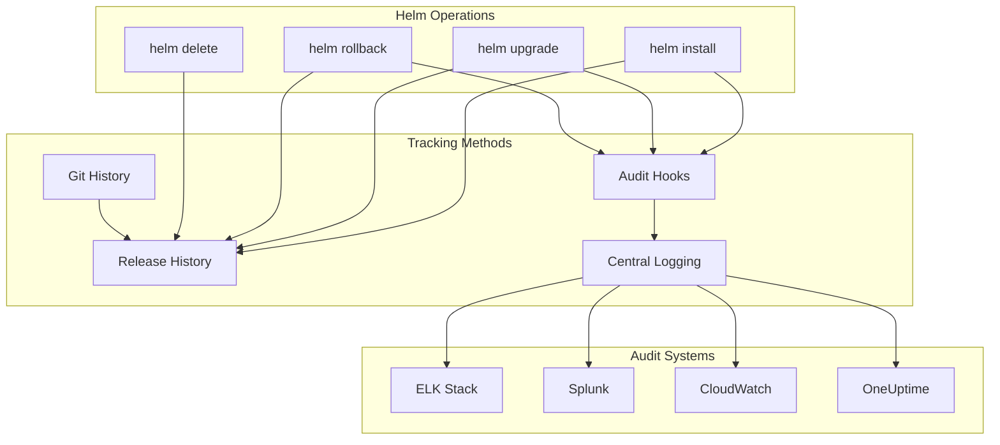

# How to Track Helm Release Changes and Maintain Audit Trails

Author: [nawazdhandala](https://www.github.com/nawazdhandala)

Tags: Helm, Kubernetes, DevOps, Audit, Compliance, Security, GitOps

Description: Complete guide to tracking Helm release changes with audit trails including deployment history, configuration diffs, and compliance logging for enterprise requirements.

> Tracking Helm release changes is essential for compliance, debugging, and operational visibility. This guide covers building comprehensive audit trails using Helm's built-in history, custom logging, and integration with enterprise audit systems.

## Audit Architecture



## Built-in Release History

### View Release History

```bash
# List all revisions
helm history myapp -n production

# Output:
# REVISION  UPDATED                   STATUS      CHART        APP VERSION  DESCRIPTION
# 1         Mon Jan 15 10:00:00 2024  superseded  myapp-1.0.0  v1.0.0       Install complete
# 2         Tue Jan 16 14:30:00 2024  superseded  myapp-1.1.0  v1.1.0       Upgrade complete
# 3         Wed Jan 17 09:00:00 2024  deployed    myapp-1.2.0  v1.2.0       Upgrade complete

# Detailed history with max results
helm history myapp -n production --max 20 -o yaml
```

### Compare Releases

```bash
# Get values from specific revision
helm get values myapp -n production --revision 2 > values-r2.yaml
helm get values myapp -n production --revision 3 > values-r3.yaml

# Diff values between revisions
diff values-r2.yaml values-r3.yaml

# Get manifest from specific revision
helm get manifest myapp -n production --revision 2 > manifest-r2.yaml
helm get manifest myapp -n production --revision 3 > manifest-r3.yaml

# Diff manifests
diff manifest-r2.yaml manifest-r3.yaml
```

### Helm Diff Plugin

```bash
# Install helm-diff plugin
helm plugin install https://github.com/databus23/helm-diff

# Diff current vs previous revision
helm diff revision myapp 2 3 -n production

# Diff before upgrade
helm diff upgrade myapp ./charts/myapp -n production -f values.yaml

# Output includes:
# - Added resources (green)
# - Removed resources (red)
# - Modified resources (yellow)
```

## Custom Audit Hooks

### Pre-upgrade Audit Hook

```yaml
# templates/audit-pre-upgrade.yaml
apiVersion: batch/v1
kind: Job
metadata:
  name: {{ include "myapp.fullname" . }}-audit-pre
  labels:
    {{- include "myapp.labels" . | nindent 4 }}
    audit-type: pre-upgrade
  annotations:
    "helm.sh/hook": pre-upgrade,pre-install
    "helm.sh/hook-weight": "-10"
    "helm.sh/hook-delete-policy": hook-succeeded,hook-failed
spec:
  ttlSecondsAfterFinished: 600
  template:
    metadata:
      labels:
        audit-type: pre-upgrade
    spec:
      restartPolicy: Never
      serviceAccountName: {{ include "myapp.fullname" . }}-audit
      containers:
        - name: audit
          image: bitnami/kubectl:latest
          command:
            - /bin/sh
            - -c
            - |
              # Capture current state
              TIMESTAMP=$(date -u +"%Y-%m-%dT%H:%M:%SZ")
              
              # Log audit event
              cat <<EOF | kubectl apply -f -
              apiVersion: v1
              kind: ConfigMap
              metadata:
                name: audit-{{ .Release.Name }}-pre-${TIMESTAMP//[:.]/}
                namespace: {{ .Release.Namespace }}
                labels:
                  audit-type: pre-upgrade
                  release: {{ .Release.Name }}
              data:
                timestamp: "${TIMESTAMP}"
                release: "{{ .Release.Name }}"
                namespace: "{{ .Release.Namespace }}"
                chart: "{{ .Chart.Name }}"
                chartVersion: "{{ .Chart.Version }}"
                appVersion: "{{ .Chart.AppVersion }}"
                action: "pre-upgrade"
                user: "${HELM_USER:-unknown}"
              EOF
              
              # Get current deployment state
              kubectl get deployment -n {{ .Release.Namespace }} \
                -l app.kubernetes.io/instance={{ .Release.Name }} \
                -o yaml > /tmp/current-state.yaml
              
              echo "Pre-upgrade audit completed at ${TIMESTAMP}"
```

### Post-upgrade Audit Hook

```yaml
# templates/audit-post-upgrade.yaml
apiVersion: batch/v1
kind: Job
metadata:
  name: {{ include "myapp.fullname" . }}-audit-post
  annotations:
    "helm.sh/hook": post-upgrade,post-install
    "helm.sh/hook-weight": "10"
    "helm.sh/hook-delete-policy": hook-succeeded
spec:
  ttlSecondsAfterFinished: 600
  template:
    spec:
      restartPolicy: Never
      containers:
        - name: audit
          image: curlimages/curl:latest
          env:
            - name: AUDIT_WEBHOOK
              valueFrom:
                secretKeyRef:
                  name: audit-config
                  key: webhook-url
          command:
            - /bin/sh
            - -c
            - |
              TIMESTAMP=$(date -u +"%Y-%m-%dT%H:%M:%SZ")
              
              # Send audit event to external system
              curl -X POST "$AUDIT_WEBHOOK" \
                -H "Content-Type: application/json" \
                -d '{
                  "timestamp": "'"${TIMESTAMP}"'",
                  "event": "helm-upgrade",
                  "release": "{{ .Release.Name }}",
                  "namespace": "{{ .Release.Namespace }}",
                  "chart": "{{ .Chart.Name }}",
                  "chartVersion": "{{ .Chart.Version }}",
                  "appVersion": "{{ .Chart.AppVersion }}",
                  "revision": {{ .Release.Revision }},
                  "status": "success"
                }'
              
              echo "Post-upgrade audit sent at ${TIMESTAMP}"
```

### Rollback Audit Hook

```yaml
# templates/audit-rollback.yaml
apiVersion: batch/v1
kind: Job
metadata:
  name: {{ include "myapp.fullname" . }}-audit-rollback
  annotations:
    "helm.sh/hook": post-rollback
    "helm.sh/hook-delete-policy": hook-succeeded
spec:
  template:
    spec:
      restartPolicy: Never
      containers:
        - name: audit
          image: curlimages/curl:latest
          env:
            - name: AUDIT_WEBHOOK
              value: "{{ .Values.audit.webhookUrl }}"
            - name: SLACK_WEBHOOK
              valueFrom:
                secretKeyRef:
                  name: slack-config
                  key: webhook-url
                  optional: true
          command:
            - /bin/sh
            - -c
            - |
              TIMESTAMP=$(date -u +"%Y-%m-%dT%H:%M:%SZ")
              
              # Critical: Rollback event
              PAYLOAD='{
                "timestamp": "'"${TIMESTAMP}"'",
                "event": "helm-rollback",
                "severity": "warning",
                "release": "{{ .Release.Name }}",
                "namespace": "{{ .Release.Namespace }}",
                "chart": "{{ .Chart.Name }}",
                "toRevision": {{ .Release.Revision }},
                "message": "Release rolled back"
              }'
              
              # Send to audit system
              curl -X POST "$AUDIT_WEBHOOK" \
                -H "Content-Type: application/json" \
                -d "$PAYLOAD"
              
              # Also notify Slack
              if [ -n "$SLACK_WEBHOOK" ]; then
                curl -X POST "$SLACK_WEBHOOK" \
                  -H "Content-Type: application/json" \
                  -d '{
                    "text": "⚠️ Rollback: {{ .Release.Name }} in {{ .Release.Namespace }}",
                    "blocks": [
                      {
                        "type": "section",
                        "text": {
                          "type": "mrkdwn",
                          "text": "*Helm Rollback Detected*\nRelease: {{ .Release.Name }}\nNamespace: {{ .Release.Namespace }}\nChart: {{ .Chart.Name }}"
                        }
                      }
                    ]
                  }'
              fi
```

## Centralized Audit Logging

### Fluent Bit Configuration

```yaml
# fluent-bit-config.yaml
apiVersion: v1
kind: ConfigMap
metadata:
  name: fluent-bit-helm-audit
  namespace: logging
data:
  fluent-bit.conf: |
    [SERVICE]
        Flush         5
        Log_Level     info
        Parsers_File  parsers.conf
    
    [INPUT]
        Name              tail
        Path              /var/log/containers/*audit*.log
        Parser            docker
        Tag               helm.audit.*
        Refresh_Interval  10
    
    [FILTER]
        Name    kubernetes
        Match   helm.audit.*
        Merge_Log On
        K8S-Logging.Parser On
    
    [FILTER]
        Name    modify
        Match   helm.audit.*
        Add     log_type helm-audit
    
    [OUTPUT]
        Name            es
        Match           helm.audit.*
        Host            elasticsearch.logging.svc.cluster.local
        Port            9200
        Index           helm-audit
        Type            _doc
  
  parsers.conf: |
    [PARSER]
        Name        docker
        Format      json
        Time_Key    time
        Time_Format %Y-%m-%dT%H:%M:%S.%L
```

### Elasticsearch Index Template

```json
{
  "index_patterns": ["helm-audit-*"],
  "template": {
    "settings": {
      "number_of_shards": 1,
      "number_of_replicas": 1
    },
    "mappings": {
      "properties": {
        "timestamp": { "type": "date" },
        "event": { "type": "keyword" },
        "release": { "type": "keyword" },
        "namespace": { "type": "keyword" },
        "chart": { "type": "keyword" },
        "chartVersion": { "type": "keyword" },
        "appVersion": { "type": "keyword" },
        "revision": { "type": "integer" },
        "user": { "type": "keyword" },
        "status": { "type": "keyword" },
        "changes": { "type": "text" }
      }
    }
  }
}
```

## GitOps Audit Trail

### Git-based Tracking

```yaml
# .github/workflows/helm-audit.yaml
name: Helm Deployment Audit

on:
  push:
    paths:
      - 'charts/**'
      - 'environments/**'

jobs:
  audit:
    runs-on: ubuntu-latest
    steps:
      - uses: actions/checkout@v4
        with:
          fetch-depth: 2
      
      - name: Generate Audit Record
        run: |
          TIMESTAMP=$(date -u +"%Y-%m-%dT%H:%M:%SZ")
          COMMIT_SHA=${{ github.sha }}
          AUTHOR=${{ github.actor }}
          
          # Get changed files
          CHANGED=$(git diff --name-only HEAD~1 HEAD | grep -E "^(charts|environments)/" || true)
          
          # Create audit record
          cat > audit-records/${TIMESTAMP//[:.]/}-${COMMIT_SHA:0:7}.json << EOF
          {
            "timestamp": "${TIMESTAMP}",
            "commit": "${COMMIT_SHA}",
            "author": "${AUTHOR}",
            "branch": "${{ github.ref_name }}",
            "changedFiles": $(echo "$CHANGED" | jq -R -s -c 'split("\n") | map(select(. != ""))'),
            "commitMessage": $(git log -1 --pretty=format:'%s' | jq -R -s)
          }
          EOF
      
      - name: Commit Audit Record
        run: |
          git config user.name "Audit Bot"
          git config user.email "audit@example.com"
          git add audit-records/
          git commit -m "Audit: Record deployment changes"
          git push
```

### ArgoCD Audit Integration

```yaml
# argocd-notifications-configmap.yaml
apiVersion: v1
kind: ConfigMap
metadata:
  name: argocd-notifications-cm
  namespace: argocd
data:
  trigger.on-deployed: |
    - when: app.status.operationState.phase in ['Succeeded']
      send: [audit-log]
  
  template.audit-log: |
    webhook:
      audit-webhook:
        method: POST
        body: |
          {
            "timestamp": "{{.app.status.operationState.finishedAt}}",
            "event": "argocd-sync",
            "application": "{{.app.metadata.name}}",
            "namespace": "{{.app.spec.destination.namespace}}",
            "chart": "{{.app.spec.source.chart}}",
            "revision": "{{.app.status.sync.revision}}",
            "status": "{{.app.status.operationState.phase}}",
            "user": "{{.app.status.operationState.operation.initiatedBy.username}}"
          }
  
  service.webhook.audit-webhook: |
    url: https://audit.example.com/api/events
    headers:
      - name: Authorization
        value: Bearer $AUDIT_TOKEN
```

## Audit Report Generation

### Daily Audit Report Script

```bash
#!/bin/bash
# generate-audit-report.sh

DATE=${1:-$(date -u +"%Y-%m-%d")}
OUTPUT="audit-report-${DATE}.md"

echo "# Helm Audit Report - ${DATE}" > "$OUTPUT"
echo "" >> "$OUTPUT"
echo "Generated: $(date -u)" >> "$OUTPUT"
echo "" >> "$OUTPUT"

# Get all namespaces with Helm releases
NAMESPACES=$(kubectl get secrets -A -l owner=helm -o jsonpath='{.items[*].metadata.namespace}' | tr ' ' '\n' | sort -u)

for NS in $NAMESPACES; do
  echo "## Namespace: ${NS}" >> "$OUTPUT"
  echo "" >> "$OUTPUT"
  
  # List releases in namespace
  RELEASES=$(helm list -n "$NS" -q)
  
  for RELEASE in $RELEASES; do
    echo "### Release: ${RELEASE}" >> "$OUTPUT"
    echo "" >> "$OUTPUT"
    
    # Get release info
    helm get metadata "$RELEASE" -n "$NS" >> "$OUTPUT" 2>/dev/null || echo "No metadata" >> "$OUTPUT"
    echo "" >> "$OUTPUT"
    
    # Get history
    echo "#### History" >> "$OUTPUT"
    echo '```' >> "$OUTPUT"
    helm history "$RELEASE" -n "$NS" --max 5 >> "$OUTPUT" 2>/dev/null
    echo '```' >> "$OUTPUT"
    echo "" >> "$OUTPUT"
  done
done

echo "Report generated: $OUTPUT"
```

### Compliance Report Template

```yaml
# compliance-report.yaml
apiVersion: v1
kind: ConfigMap
metadata:
  name: compliance-report-template
data:
  template.html: |
    <!DOCTYPE html>
    <html>
    <head>
      <title>Helm Compliance Report</title>
      <style>
        body { font-family: Arial, sans-serif; }
        table { border-collapse: collapse; width: 100%; }
        th, td { border: 1px solid #ddd; padding: 8px; text-align: left; }
        th { background-color: #4CAF50; color: white; }
        .success { color: green; }
        .warning { color: orange; }
        .error { color: red; }
      </style>
    </head>
    <body>
      <h1>Helm Release Compliance Report</h1>
      <p>Generated: {{ .GeneratedAt }}</p>
      
      <h2>Summary</h2>
      <table>
        <tr><th>Metric</th><th>Value</th></tr>
        <tr><td>Total Releases</td><td>{{ .TotalReleases }}</td></tr>
        <tr><td>Compliant</td><td class="success">{{ .Compliant }}</td></tr>
        <tr><td>Non-Compliant</td><td class="error">{{ .NonCompliant }}</td></tr>
      </table>
      
      <h2>Release Details</h2>
      <table>
        <tr>
          <th>Release</th>
          <th>Namespace</th>
          <th>Chart Version</th>
          <th>Last Updated</th>
          <th>Status</th>
        </tr>
        {{ range .Releases }}
        <tr>
          <td>{{ .Name }}</td>
          <td>{{ .Namespace }}</td>
          <td>{{ .ChartVersion }}</td>
          <td>{{ .Updated }}</td>
          <td class="{{ .StatusClass }}">{{ .Status }}</td>
        </tr>
        {{ end }}
      </table>
    </body>
    </html>
```

## Audit Storage Options

| Storage | Retention | Query | Cost |
|---------|-----------|-------|------|
| Kubernetes Secrets | Limited (10 revisions) | kubectl | Free |
| Elasticsearch | Configurable | Full-text | Medium |
| S3 + Athena | Unlimited | SQL | Low |
| Splunk | Configurable | SPL | High |
| Git Repository | Unlimited | Git log | Free |

## Best Practices

| Practice | Description |
|----------|-------------|
| Enable Audit Hooks | Add to all charts |
| Set History Limit | Configure max revisions |
| Use Structured Logging | JSON format for parsing |
| Include User Context | Track who made changes |
| Automate Reports | Daily/weekly summaries |
| Secure Audit Data | Encrypt sensitive info |

## Troubleshooting

```bash
# Check release history storage
kubectl get secrets -n production -l owner=helm

# View specific release data
kubectl get secret sh.helm.release.v1.myapp.v3 -n production -o jsonpath='{.data.release}' | base64 -d | base64 -d | gzip -d | jq

# Find when release was modified
kubectl get secret -n production -l owner=helm -o custom-columns=NAME:.metadata.name,CREATED:.metadata.creationTimestamp

# Debug audit hooks
kubectl logs -n production -l audit-type=pre-upgrade --tail=100
```

## Wrap-up

Comprehensive Helm audit trails require multiple layers: built-in release history for quick lookups, custom hooks for real-time audit events, centralized logging for long-term storage, and GitOps for change traceability. Combine these approaches based on your compliance requirements and operational needs.
