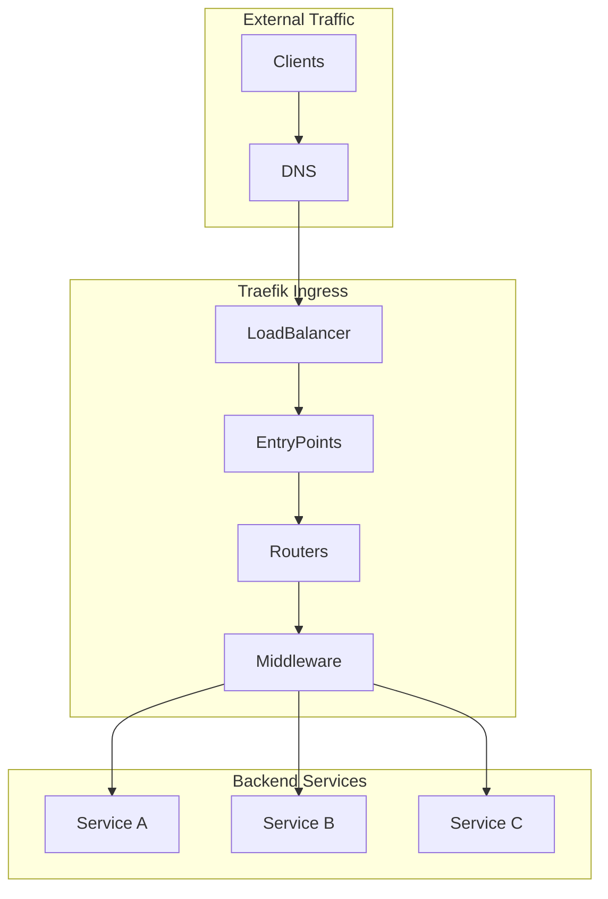

# How to Deploy Traefik Ingress Controller with Helm

Author: [nawazdhandala](https://www.github.com/nawazdhandala)

Tags: Helm, Kubernetes, Traefik, Ingress, Load Balancer, DevOps, Networking

Description: Complete guide to deploying Traefik Ingress Controller using Helm including configuration, TLS termination, middleware, and advanced routing features.

> Traefik is a modern cloud-native ingress controller with automatic service discovery and dynamic configuration. This guide covers deploying and configuring Traefik via Helm for production Kubernetes environments.

## Traefik Architecture



## Installation

### Add Helm Repository

```bash
# Add Traefik repository
helm repo add traefik https://traefik.github.io/charts
helm repo update

# Search available versions
helm search repo traefik/traefik --versions
```

### Basic Installation

```bash
# Install Traefik
helm install traefik traefik/traefik \
  --namespace traefik \
  --create-namespace

# Verify installation
kubectl get pods -n traefik
kubectl get svc -n traefik
```

## Production Configuration

### Values File

```yaml
# traefik-values.yaml

# Deployment configuration
deployment:
  replicas: 3
  
# Pod disruption budget
podDisruptionBudget:
  enabled: true
  minAvailable: 1

# Resource limits
resources:
  requests:
    cpu: "100m"
    memory: "128Mi"
  limits:
    cpu: "500m"
    memory: "256Mi"

# Service configuration
service:
  enabled: true
  type: LoadBalancer
  annotations:
    # AWS NLB
    service.beta.kubernetes.io/aws-load-balancer-type: nlb
    service.beta.kubernetes.io/aws-load-balancer-scheme: internet-facing

# Entry points
ports:
  web:
    port: 8000
    exposedPort: 80
    expose: true
    protocol: TCP
    # Redirect to websecure
    redirectTo:
      port: websecure
  websecure:
    port: 8443
    exposedPort: 443
    expose: true
    protocol: TCP
    tls:
      enabled: true
  # Dashboard (internal only)
  traefik:
    port: 9000
    expose: false

# Enable Kubernetes Ingress provider
providers:
  kubernetesIngress:
    enabled: true
    allowEmptyServices: false
    publishedService:
      enabled: true
  kubernetesCRD:
    enabled: true
    allowCrossNamespace: true

# Logs
logs:
  general:
    level: INFO
  access:
    enabled: true
    format: json

# Metrics
metrics:
  prometheus:
    entryPoint: metrics
    addEntryPointsLabels: true
    addServicesLabels: true
    buckets: "0.1,0.3,1.2,5.0"

# Affinity
affinity:
  podAntiAffinity:
    preferredDuringSchedulingIgnoredDuringExecution:
      - weight: 100
        podAffinityTerm:
          labelSelector:
            matchLabels:
              app.kubernetes.io/name: traefik
          topologyKey: kubernetes.io/hostname
```

### Deploy with Values

```bash
helm install traefik traefik/traefik \
  -f traefik-values.yaml \
  --namespace traefik \
  --create-namespace
```

## TLS Configuration

### Let's Encrypt with Cert-Manager

```yaml
# traefik-tls.yaml

# TLS options
tlsOptions:
  default:
    minVersion: VersionTLS12
    sniStrict: true
    cipherSuites:
      - TLS_ECDHE_RSA_WITH_AES_128_GCM_SHA256
      - TLS_ECDHE_RSA_WITH_AES_256_GCM_SHA384
      - TLS_ECDHE_RSA_WITH_CHACHA20_POLY1305

# TLS stores
tlsStore:
  default:
    defaultCertificate:
      secretName: default-tls-cert

# Certificate resolver (if not using cert-manager)
# additionalArguments:
#   - --certificatesresolvers.letsencrypt.acme.email=admin@example.com
#   - --certificatesresolvers.letsencrypt.acme.storage=/data/acme.json
#   - --certificatesresolvers.letsencrypt.acme.httpchallenge.entrypoint=web
```

### Cert-Manager Integration

```yaml
# certificate.yaml
apiVersion: cert-manager.io/v1
kind: Certificate
metadata:
  name: wildcard-cert
  namespace: traefik
spec:
  secretName: wildcard-tls
  issuerRef:
    name: letsencrypt-prod
    kind: ClusterIssuer
  dnsNames:
    - "*.example.com"
    - "example.com"
---
# Reference in IngressRoute
apiVersion: traefik.io/v1alpha1
kind: IngressRoute
metadata:
  name: myapp
  namespace: default
spec:
  entryPoints:
    - websecure
  routes:
    - match: Host(`myapp.example.com`)
      kind: Rule
      services:
        - name: myapp
          port: 80
  tls:
    secretName: wildcard-tls
```

## Traefik CRDs

### IngressRoute

```yaml
# ingressroute.yaml
apiVersion: traefik.io/v1alpha1
kind: IngressRoute
metadata:
  name: myapp
  namespace: default
spec:
  entryPoints:
    - websecure
  routes:
    - match: Host(`myapp.example.com`)
      kind: Rule
      middlewares:
        - name: rate-limit
        - name: compress
      services:
        - name: myapp
          port: 80
          sticky:
            cookie:
              name: myapp-sticky
              secure: true
    - match: Host(`myapp.example.com`) && PathPrefix(`/api`)
      kind: Rule
      middlewares:
        - name: api-auth
      services:
        - name: myapp-api
          port: 8080
  tls:
    secretName: myapp-tls
```

### Middleware Configuration

```yaml
# middleware.yaml
---
apiVersion: traefik.io/v1alpha1
kind: Middleware
metadata:
  name: rate-limit
  namespace: default
spec:
  rateLimit:
    average: 100
    burst: 50
    period: 1m
    sourceCriterion:
      ipStrategy:
        depth: 1
---
apiVersion: traefik.io/v1alpha1
kind: Middleware
metadata:
  name: compress
  namespace: default
spec:
  compress: {}
---
apiVersion: traefik.io/v1alpha1
kind: Middleware
metadata:
  name: basic-auth
  namespace: default
spec:
  basicAuth:
    secret: auth-secret
---
apiVersion: traefik.io/v1alpha1
kind: Middleware
metadata:
  name: strip-prefix
  namespace: default
spec:
  stripPrefix:
    prefixes:
      - /api
---
apiVersion: traefik.io/v1alpha1
kind: Middleware
metadata:
  name: security-headers
  namespace: default
spec:
  headers:
    frameDeny: true
    sslRedirect: true
    browserXssFilter: true
    contentTypeNosniff: true
    stsIncludeSubdomains: true
    stsPreload: true
    stsSeconds: 31536000
    customFrameOptionsValue: "SAMEORIGIN"
---
apiVersion: traefik.io/v1alpha1
kind: Middleware
metadata:
  name: redirect-https
  namespace: default
spec:
  redirectScheme:
    scheme: https
    permanent: true
```

### Middleware Chain

```yaml
# middleware-chain.yaml
apiVersion: traefik.io/v1alpha1
kind: Middleware
metadata:
  name: secure-chain
  namespace: default
spec:
  chain:
    middlewares:
      - name: rate-limit
      - name: security-headers
      - name: compress
```

## Advanced Routing

### Path-Based Routing

```yaml
# path-routing.yaml
apiVersion: traefik.io/v1alpha1
kind: IngressRoute
metadata:
  name: multi-service
  namespace: default
spec:
  entryPoints:
    - websecure
  routes:
    - match: Host(`example.com`) && PathPrefix(`/app1`)
      kind: Rule
      middlewares:
        - name: strip-prefix
          namespace: default
      services:
        - name: app1
          port: 80
    - match: Host(`example.com`) && PathPrefix(`/app2`)
      kind: Rule
      middlewares:
        - name: strip-prefix
      services:
        - name: app2
          port: 80
    - match: Host(`example.com`)
      kind: Rule
      services:
        - name: default-backend
          port: 80
  tls:
    secretName: example-tls
```

### Weighted Round Robin

```yaml
# weighted-routing.yaml
apiVersion: traefik.io/v1alpha1
kind: IngressRoute
metadata:
  name: canary-release
  namespace: default
spec:
  entryPoints:
    - websecure
  routes:
    - match: Host(`myapp.example.com`)
      kind: Rule
      services:
        # 90% to stable
        - name: myapp-stable
          port: 80
          weight: 90
        # 10% to canary
        - name: myapp-canary
          port: 80
          weight: 10
  tls:
    secretName: myapp-tls
```

### Header-Based Routing

```yaml
# header-routing.yaml
apiVersion: traefik.io/v1alpha1
kind: IngressRoute
metadata:
  name: header-based
  namespace: default
spec:
  entryPoints:
    - websecure
  routes:
    # Beta users
    - match: Host(`myapp.example.com`) && Headers(`X-Beta-User`, `true`)
      kind: Rule
      priority: 100
      services:
        - name: myapp-beta
          port: 80
    # Default
    - match: Host(`myapp.example.com`)
      kind: Rule
      priority: 1
      services:
        - name: myapp-stable
          port: 80
  tls:
    secretName: myapp-tls
```

## Dashboard Configuration

### Enable Dashboard

```yaml
# traefik-dashboard.yaml
ingressRoute:
  dashboard:
    enabled: true
    # Secure with middleware
    middlewares:
      - name: traefik-auth
        namespace: traefik
    # Match rule
    matchRule: Host(`traefik.example.com`)
    entryPoints:
      - websecure
    tls:
      secretName: traefik-tls

# Create auth middleware
extraObjects:
  - apiVersion: traefik.io/v1alpha1
    kind: Middleware
    metadata:
      name: traefik-auth
      namespace: traefik
    spec:
      basicAuth:
        secret: traefik-dashboard-auth
```

### Create Auth Secret

```bash
# Generate htpasswd
htpasswd -nb admin secure-password | base64

# Create secret
kubectl create secret generic traefik-dashboard-auth \
  --namespace traefik \
  --from-literal=users='admin:$apr1$...'
```

## Monitoring

### Prometheus ServiceMonitor

```yaml
# servicemonitor.yaml
apiVersion: monitoring.coreos.com/v1
kind: ServiceMonitor
metadata:
  name: traefik
  namespace: monitoring
spec:
  selector:
    matchLabels:
      app.kubernetes.io/name: traefik
  namespaceSelector:
    matchNames:
      - traefik
  endpoints:
    - port: metrics
      interval: 30s
      path: /metrics
```

### Key Metrics

```promql
# Request rate
sum(rate(traefik_entrypoint_requests_total[5m])) by (entrypoint)

# Error rate
sum(rate(traefik_entrypoint_requests_total{code=~"5.."}[5m])) 
/ 
sum(rate(traefik_entrypoint_requests_total[5m]))

# Latency
histogram_quantile(0.95, 
  sum(rate(traefik_entrypoint_request_duration_seconds_bucket[5m])) by (le, entrypoint)
)

# Active connections
traefik_entrypoint_open_connections
```

## TCP/UDP Services

### TCP IngressRoute

```yaml
# tcp-ingressroute.yaml
apiVersion: traefik.io/v1alpha1
kind: IngressRouteTCP
metadata:
  name: postgres
  namespace: database
spec:
  entryPoints:
    - postgres  # Custom entrypoint
  routes:
    - match: HostSNI(`*`)
      services:
        - name: postgres
          port: 5432
  tls:
    passthrough: true
```

### Enable TCP EntryPoint

```yaml
# In traefik values.yaml
ports:
  postgres:
    port: 5432
    expose: true
    protocol: TCP
```

## Troubleshooting

### Debug Commands

```bash
# Check Traefik logs
kubectl logs -n traefik -l app.kubernetes.io/name=traefik -f

# View configuration
kubectl port-forward -n traefik svc/traefik 9000:9000
# Visit http://localhost:9000/dashboard/

# Check IngressRoutes
kubectl get ingressroute -A

# Describe IngressRoute
kubectl describe ingressroute myapp -n default

# Check middleware
kubectl get middleware -A
```

### Common Issues

| Issue | Solution |
|-------|----------|
| 404 on all routes | Check entryPoints match |
| TLS errors | Verify certificate secret |
| Middleware not applied | Check middleware reference |
| High latency | Review middleware chain |
| Connection refused | Check service ports |

## Best Practices

| Practice | Description |
|----------|-------------|
| Use IngressRoute CRD | More features than Ingress |
| Chain Middlewares | Reusable security configs |
| Enable Access Logs | JSON format for parsing |
| Set Resource Limits | Prevent resource starvation |
| Use Pod Anti-Affinity | High availability |
| Enable Prometheus Metrics | Monitor performance |

## Wrap-up

Traefik provides a powerful and flexible ingress solution for Kubernetes. Its native CRD support enables advanced routing, middleware chains, and TCP/UDP proxying. Combined with Let's Encrypt integration and comprehensive observability, Traefik is an excellent choice for production Kubernetes ingress.
