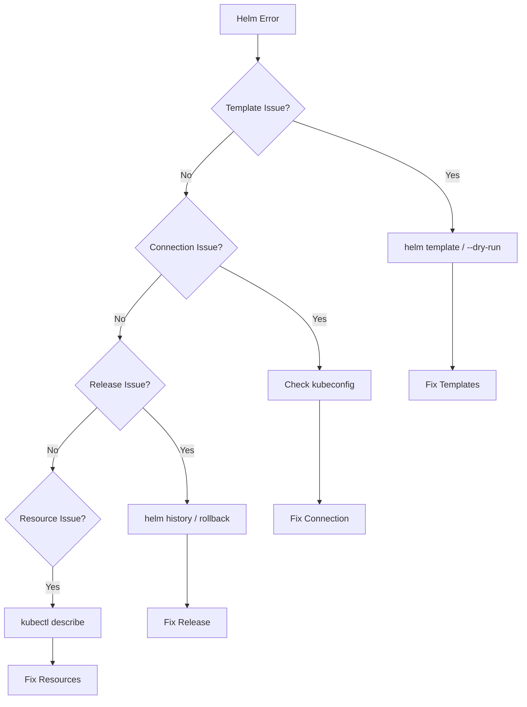

# Troubleshooting Common Helm Errors and Issues

Author: [nawazdhandala](https://www.github.com/nawazdhandala)

Tags: Helm, Kubernetes, DevOps, Troubleshooting, Debugging

Description: A comprehensive guide to diagnosing and fixing the most common Helm errors, from template issues to release failures and resource conflicts.

> Helm deployments can fail for many reasons - from syntax errors in templates to resource conflicts in Kubernetes. This guide covers the most common Helm errors you'll encounter and provides practical solutions to fix them quickly.

## Debugging Workflow



## Template Rendering Errors

### Error: Template Parse Error

**Symptom:**
```
Error: parse error at (mychart/templates/deployment.yaml:15): unexpected "{" in command
```

**Cause:** Syntax error in template, often mismatched braces or incorrect function usage.

**Solution:**

```yaml
# Wrong - missing closing brace
apiVersion: apps/v1
kind: Deployment
metadata:
  name: {{ .Values.name }

# Correct
apiVersion: apps/v1
kind: Deployment
metadata:
  name: {{ .Values.name }}
```

**Debug with:**
```bash
# Check template rendering
helm template my-release ./mychart

# More verbose output
helm template my-release ./mychart --debug
```

### Error: Nil Pointer Evaluating

**Symptom:**
```
Error: template: mychart/templates/deployment.yaml:10:20: executing "mychart/templates/deployment.yaml" at <.Values.app.name>: nil pointer evaluating interface {}.name
```

**Cause:** Accessing a value that doesn't exist or parent is nil.

**Solution:**

```yaml
# Wrong - assumes nested structure exists
name: {{ .Values.app.name }}

# Correct - check if exists
name: {{ .Values.app.name | default "myapp" }}

# Better - conditional check
{{- if .Values.app }}
{{- if .Values.app.name }}
name: {{ .Values.app.name }}
{{- end }}
{{- end }}

# Best - use dig function
name: {{ dig "app" "name" "default-name" .Values }}
```

### Error: Function Not Found

**Symptom:**
```
Error: template: mychart/templates/deployment.yaml:5:10: executing "mychart/templates/deployment.yaml" at <unknownFunc>: function "unknownFunc" not defined
```

**Cause:** Using a non-existent template function.

**Solution:**
```yaml
# Check available functions
# Common Sprig functions: default, required, quote, include, tpl, toYaml

# Wrong
name: {{ unknownFunc .Values.name }}

# Correct - use valid function
name: {{ .Values.name | quote }}
```

### Error: Required Value Not Set

**Symptom:**
```
Error: execution error at (mychart/templates/secret.yaml:8:20): required value 'database.password' not set
```

**Cause:** A required value wasn't provided.

**Solution:**
```bash
# Provide the required value
helm install my-release ./mychart --set database.password=secret123

# Or in values.yaml
# database:
#   password: secret123
```

## Release Management Errors

### Error: Cannot Re-use a Name

**Symptom:**
```
Error: cannot re-use a name that is still in use
```

**Cause:** A release with that name already exists.

**Solution:**
```bash
# Check existing releases
helm list -A

# Upgrade instead of install
helm upgrade my-release ./mychart

# Or use --install flag
helm upgrade --install my-release ./mychart

# If release is stuck, uninstall first
helm uninstall my-release
```

### Error: Release Not Found

**Symptom:**
```
Error: release: not found
```

**Cause:** Trying to upgrade or rollback a non-existent release.

**Solution:**
```bash
# List all releases including failed
helm list -A --all

# Use upgrade --install for idempotent deployments
helm upgrade --install my-release ./mychart

# Check if release exists in different namespace
helm list -A | grep my-release
```

### Error: Another Operation in Progress

**Symptom:**
```
Error: another operation (install/upgrade/rollback) is in progress
```

**Cause:** A previous Helm operation didn't complete or is still running.

**Solution:**
```bash
# Check release status
helm status my-release

# If stuck in pending state, wait or rollback
helm rollback my-release

# If completely stuck, manually fix the secret
kubectl get secrets -l owner=helm,name=my-release

# Delete the stuck release secret if needed (careful!)
kubectl delete secret sh.helm.release.v1.my-release.v2
```

### Error: UPGRADE FAILED: has no deployed releases

**Symptom:**
```
Error: UPGRADE FAILED: "my-release" has no deployed releases
```

**Cause:** All previous releases failed, no successful deployment to upgrade from.

**Solution:**
```bash
# Check release history
helm history my-release

# Uninstall failed release
helm uninstall my-release

# Fresh install
helm install my-release ./mychart
```

## Connection and Authentication Errors

### Error: Kubernetes Cluster Unreachable

**Symptom:**
```
Error: Kubernetes cluster unreachable: Get "https://127.0.0.1:6443/version": dial tcp 127.0.0.1:6443: connect: connection refused
```

**Solution:**
```bash
# Check kubeconfig
echo $KUBECONFIG
kubectl config current-context

# Test cluster connection
kubectl cluster-info

# Set correct context
kubectl config use-context my-cluster

# Verify kubeconfig file
cat ~/.kube/config
```

### Error: Forbidden - User Cannot Access

**Symptom:**
```
Error: release my-release failed: deployments.apps is forbidden: User "system:serviceaccount:default:default" cannot create resource "deployments" in API group "apps" in the namespace "production"
```

**Solution:**
```bash
# Check current permissions
kubectl auth can-i create deployments -n production

# Create appropriate RBAC
kubectl create clusterrolebinding helm-admin \
  --clusterrole=cluster-admin \
  --serviceaccount=default:default

# Or use a more restrictive role
cat <<EOF | kubectl apply -f -
apiVersion: rbac.authorization.k8s.io/v1
kind: Role
metadata:
  name: helm-deployer
  namespace: production
rules:
- apiGroups: ["", "apps", "extensions"]
  resources: ["*"]
  verbs: ["*"]
EOF
```

## Repository Errors

### Error: Repository Not Found

**Symptom:**
```
Error: repo myrepo not found
```

**Solution:**
```bash
# List repositories
helm repo list

# Add the repository
helm repo add myrepo https://charts.example.com

# Update repository index
helm repo update
```

### Error: Chart Not Found

**Symptom:**
```
Error: chart "myrepo/mychart" not found in myrepo index
```

**Solution:**
```bash
# Update repo index
helm repo update

# Search for the chart
helm search repo mychart

# Search with all versions
helm search repo mychart --versions

# Check if chart name is correct
helm search repo myrepo/
```

### Error: Failed to Fetch Chart

**Symptom:**
```
Error: failed to fetch https://charts.example.com/mychart-1.0.0.tgz : 404 Not Found
```

**Solution:**
```bash
# Check if version exists
helm search repo mychart --versions

# Update repository
helm repo update

# Try different version
helm install my-release myrepo/mychart --version 0.9.0
```

## Resource Conflicts

### Error: Resource Already Exists

**Symptom:**
```
Error: rendered manifests contain a resource that already exists. Unable to continue with install: Service "my-service" in namespace "default" exists and cannot be imported into the current release
```

**Solution:**
```bash
# Option 1: Adopt existing resources
kubectl annotate service my-service meta.helm.sh/release-name=my-release
kubectl annotate service my-service meta.helm.sh/release-namespace=default
kubectl label service my-service app.kubernetes.io/managed-by=Helm

# Option 2: Delete and recreate
kubectl delete service my-service
helm install my-release ./mychart
```

### Error: Invalid Value for Field

**Symptom:**
```
Error: INSTALLATION FAILED: unable to build kubernetes objects from release manifest: error validating "": error validating data: ValidationError(Deployment.spec.replicas): invalid type for io.k8s.api.apps.v1.DeploymentSpec.replicas: got "string", expected "integer"
```

**Solution:**
```yaml
# Wrong - string instead of integer
spec:
  replicas: "3"

# Correct
spec:
  replicas: 3

# In templates, convert string to int
spec:
  replicas: {{ .Values.replicas | int }}
```

### Error: Field is Immutable

**Symptom:**
```
Error: UPGRADE FAILED: cannot patch "my-app" with kind Deployment: Deployment.apps "my-app" is invalid: spec.selector: Invalid value: v1.LabelSelector{...}: field is immutable
```

**Solution:**
```bash
# Delete and recreate (will cause downtime)
kubectl delete deployment my-app
helm upgrade my-release ./mychart

# Or use --force flag
helm upgrade my-release ./mychart --force
```

## Hook Errors

### Error: Hook Failed

**Symptom:**
```
Error: INSTALLATION FAILED: Job failed: BackoffLimitExceeded
```

**Solution:**
```bash
# Check hook job logs
kubectl logs job/my-release-pre-install

# Check job status
kubectl describe job my-release-pre-install

# Skip hooks if needed
helm install my-release ./mychart --no-hooks

# Increase hook timeout
helm install my-release ./mychart --timeout 10m
```

### Error: Hook Deletion Timeout

**Symptom:**
```
Error: timed out waiting for the condition
```

**Solution:**
```yaml
# Add delete policy to hooks
apiVersion: batch/v1
kind: Job
metadata:
  name: "{{ .Release.Name }}-migration"
  annotations:
    "helm.sh/hook": pre-install,pre-upgrade
    "helm.sh/hook-weight": "-5"
    # Delete hook resource after success
    "helm.sh/hook-delete-policy": hook-succeeded
```

## Dependency Errors

### Error: Chart.yaml Dependencies Not Satisfied

**Symptom:**
```
Error: found in Chart.yaml, but missing in charts/ directory: postgresql
```

**Solution:**
```bash
# Update dependencies
helm dependency update ./mychart

# Build dependencies
helm dependency build ./mychart

# List dependencies
helm dependency list ./mychart
```

### Error: Dependency Version Mismatch

**Symptom:**
```
Error: Chart requires version 13.x.x of postgresql but version 12.x.x is present
```

**Solution:**
```yaml
# Update Chart.yaml with correct version range
dependencies:
  - name: postgresql
    version: ">=13.0.0"
    repository: https://charts.bitnami.com/bitnami
```

```bash
# Then update
helm dependency update ./mychart
```

## Namespace Errors

### Error: Namespace Not Found

**Symptom:**
```
Error: create: failed to create: namespaces "myns" not found
```

**Solution:**
```bash
# Create namespace first
kubectl create namespace myns

# Or use --create-namespace flag
helm install my-release ./mychart -n myns --create-namespace
```

## Timeout Errors

### Error: Timed Out Waiting for Condition

**Symptom:**
```
Error: timed out waiting for the condition
```

**Cause:** Pods didn't become ready in time.

**Solution:**
```bash
# Increase timeout
helm install my-release ./mychart --timeout 10m

# Check what's not ready
kubectl get pods
kubectl describe pod <pod-name>
kubectl logs <pod-name>

# Check events
kubectl get events --sort-by='.lastTimestamp'

# Don't wait for resources
helm install my-release ./mychart --wait=false
```

## Debugging Commands Reference

| Command | Purpose |
|---------|---------|
| `helm template ./mychart` | Render templates locally |
| `helm template ./mychart --debug` | Verbose template output |
| `helm install --dry-run --debug` | Simulate install |
| `helm get manifest release` | Get deployed manifests |
| `helm get values release` | Get deployed values |
| `helm history release` | View release history |
| `helm status release` | Check release status |
| `helm lint ./mychart` | Check chart for issues |

## Enable Debug Mode

```bash
# Verbose output
helm install my-release ./mychart --debug

# Even more verbose
export HELM_DEBUG=true
helm install my-release ./mychart

# Trace all HTTP requests
export HELM_DEBUG=1
```

## Complete Troubleshooting Checklist

```bash
# 1. Validate chart
helm lint ./mychart

# 2. Test template rendering
helm template my-release ./mychart --debug

# 3. Dry run
helm install my-release ./mychart --dry-run --debug

# 4. Check cluster connection
kubectl cluster-info

# 5. Check permissions
kubectl auth can-i create deployments

# 6. Check existing releases
helm list -A --all

# 7. Check namespace
kubectl get namespace myns

# 8. Install with debug
helm install my-release ./mychart --debug --timeout 10m

# 9. If failed, check pods
kubectl get pods
kubectl describe pod <pod-name>
kubectl logs <pod-name>

# 10. Check events
kubectl get events --sort-by='.lastTimestamp'
```

## Wrap-up

Most Helm errors fall into a few categories: template syntax, release state, connectivity, or resource conflicts. Use `helm template` and `--dry-run` to catch issues early, and always check pod logs and events when deployments fail. Keep your repositories updated, verify values before deployment, and use the debugging commands to quickly identify root causes.
