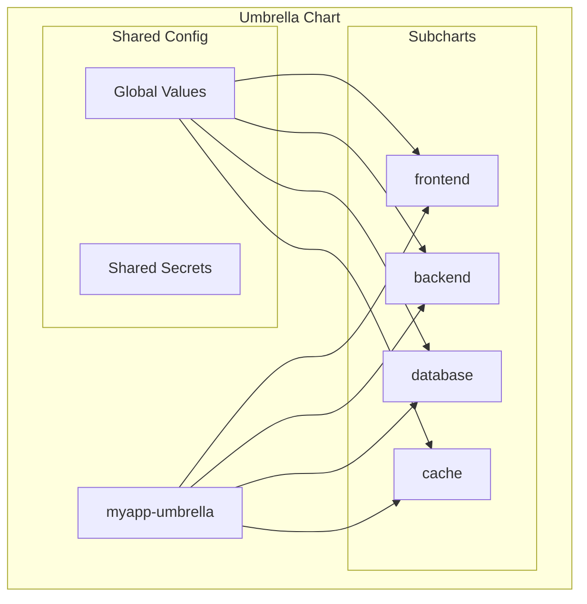

# How to Use Helm Umbrella Charts for Multi-Component Applications

Author: [nawazdhandala](https://www.github.com/nawazdhandala)

Tags: Helm, Kubernetes, DevOps, Microservices, Architecture, Deployment

Description: Complete guide to using Helm umbrella charts to deploy multi-component applications including structure, dependency management, and value inheritance.

> Umbrella charts bundle multiple Helm charts into a single deployable unit for complex applications. This guide covers creating, configuring, and managing umbrella charts for multi-component architectures.

## Umbrella Chart Concept



## Umbrella Chart Structure

### Directory Layout

```
myapp-umbrella/
├── Chart.yaml
├── Chart.lock
├── values.yaml
├── values-development.yaml
├── values-production.yaml
├── templates/
│   ├── _helpers.tpl
│   ├── NOTES.txt
│   ├── shared-configmap.yaml
│   └── shared-secret.yaml
└── charts/
    ├── frontend/
    │   ├── Chart.yaml
    │   ├── values.yaml
    │   └── templates/
    ├── backend/
    │   ├── Chart.yaml
    │   ├── values.yaml
    │   └── templates/
    └── common/
        ├── Chart.yaml
        └── templates/
```

### Chart.yaml with Dependencies

```yaml
# Chart.yaml
apiVersion: v2
name: myapp-umbrella
description: Umbrella chart for MyApp platform
type: application
version: 1.0.0
appVersion: "1.0.0"

dependencies:
  # Local subcharts
  - name: frontend
    version: "1.x.x"
    condition: frontend.enabled
    
  - name: backend
    version: "1.x.x"
    condition: backend.enabled
    
  # External charts
  - name: postgresql
    version: "13.x.x"
    repository: https://charts.bitnami.com/bitnami
    condition: postgresql.enabled
    alias: database
    
  - name: redis
    version: "18.x.x"
    repository: https://charts.bitnami.com/bitnami
    condition: redis.enabled
    alias: cache
    
  # Common library
  - name: common
    version: "1.x.x"
    repository: file://charts/common
```

## Global Values Configuration

### Main values.yaml

```yaml
# values.yaml

# Global values accessible to all subcharts
global:
  # Environment
  environment: production
  
  # Domain configuration
  domain: example.com
  
  # Image registry
  imageRegistry: myregistry.io
  imagePullSecrets:
    - name: registry-credentials
  
  # Database connection (shared)
  database:
    host: myapp-database-postgresql
    port: 5432
    name: myapp
    username: myapp
    # Password via secret
    existingSecret: myapp-database-credentials
    
  # Redis connection
  redis:
    host: myapp-cache-redis-master
    port: 6379
    
  # Monitoring
  monitoring:
    enabled: true
    
  # Tracing
  tracing:
    enabled: true
    endpoint: http://jaeger-collector:14268/api/traces

# Frontend subchart values
frontend:
  enabled: true
  replicaCount: 3
  image:
    repository: frontend
    tag: v1.2.0
  ingress:
    enabled: true
    hosts:
      - host: "{{ .Values.global.domain }}"
        paths:
          - path: /
  resources:
    limits:
      cpu: 500m
      memory: 256Mi

# Backend subchart values
backend:
  enabled: true
  replicaCount: 5
  image:
    repository: backend
    tag: v1.2.0
  ingress:
    enabled: true
    hosts:
      - host: "api.{{ .Values.global.domain }}"
        paths:
          - path: /
  resources:
    limits:
      cpu: 1
      memory: 1Gi

# PostgreSQL (aliased as database)
database:
  enabled: true
  auth:
    database: myapp
    username: myapp
    existingSecret: myapp-database-credentials
  primary:
    persistence:
      size: 50Gi

# Redis (aliased as cache)
cache:
  enabled: true
  auth:
    enabled: true
    existingSecret: myapp-redis-credentials
  replica:
    replicaCount: 2
```

### Environment-Specific Values

```yaml
# values-development.yaml
global:
  environment: development
  domain: dev.example.com
  
frontend:
  replicaCount: 1
  resources:
    limits:
      cpu: 200m
      memory: 128Mi

backend:
  replicaCount: 1
  resources:
    limits:
      cpu: 500m
      memory: 512Mi

database:
  primary:
    persistence:
      size: 5Gi

cache:
  replica:
    replicaCount: 0
```

```yaml
# values-production.yaml
global:
  environment: production
  domain: example.com
  
frontend:
  replicaCount: 5
  autoscaling:
    enabled: true
    minReplicas: 5
    maxReplicas: 20
  podDisruptionBudget:
    enabled: true
    minAvailable: 3

backend:
  replicaCount: 10
  autoscaling:
    enabled: true
    minReplicas: 10
    maxReplicas: 50
  podDisruptionBudget:
    enabled: true
    minAvailable: 5

database:
  primary:
    persistence:
      size: 100Gi
  readReplicas:
    replicaCount: 2

cache:
  replica:
    replicaCount: 3
```

## Subchart Configuration

### Frontend Subchart

```yaml
# charts/frontend/Chart.yaml
apiVersion: v2
name: frontend
description: Frontend application
type: application
version: 1.0.0
appVersion: "1.0.0"

# charts/frontend/values.yaml
replicaCount: 1

image:
  repository: frontend
  pullPolicy: IfNotPresent
  tag: ""

# Access global values via .Values.global
config:
  apiUrl: ""  # Set via global
  environment: ""  # Set via global
```

```yaml
# charts/frontend/templates/deployment.yaml
apiVersion: apps/v1
kind: Deployment
metadata:
  name: {{ include "frontend.fullname" . }}
spec:
  replicas: {{ .Values.replicaCount }}
  template:
    spec:
      {{- with .Values.global.imagePullSecrets }}
      imagePullSecrets:
        {{- toYaml . | nindent 8 }}
      {{- end }}
      containers:
        - name: {{ .Chart.Name }}
          image: "{{ .Values.global.imageRegistry }}/{{ .Values.image.repository }}:{{ .Values.image.tag }}"
          env:
            - name: API_URL
              value: "https://api.{{ .Values.global.domain }}"
            - name: ENVIRONMENT
              value: {{ .Values.global.environment }}
```

### Backend Subchart

```yaml
# charts/backend/templates/deployment.yaml
apiVersion: apps/v1
kind: Deployment
metadata:
  name: {{ include "backend.fullname" . }}
spec:
  replicas: {{ .Values.replicaCount }}
  template:
    spec:
      containers:
        - name: {{ .Chart.Name }}
          image: "{{ .Values.global.imageRegistry }}/{{ .Values.image.repository }}:{{ .Values.image.tag }}"
          env:
            # Database configuration from global
            - name: DATABASE_HOST
              value: {{ .Values.global.database.host }}
            - name: DATABASE_PORT
              value: {{ .Values.global.database.port | quote }}
            - name: DATABASE_NAME
              value: {{ .Values.global.database.name }}
            - name: DATABASE_USER
              value: {{ .Values.global.database.username }}
            - name: DATABASE_PASSWORD
              valueFrom:
                secretKeyRef:
                  name: {{ .Values.global.database.existingSecret }}
                  key: password
            # Redis configuration from global
            - name: REDIS_HOST
              value: {{ .Values.global.redis.host }}
            - name: REDIS_PORT
              value: {{ .Values.global.redis.port | quote }}
            # Tracing
            {{- if .Values.global.tracing.enabled }}
            - name: TRACING_ENDPOINT
              value: {{ .Values.global.tracing.endpoint }}
            {{- end }}
```

## Shared Templates

### Common Helpers

```yaml
# templates/_helpers.tpl

{{/*
Common labels for all resources
*/}}
{{- define "myapp.commonLabels" -}}
app.kubernetes.io/part-of: myapp
environment: {{ .Values.global.environment }}
{{- end }}

{{/*
Database connection string
*/}}
{{- define "myapp.databaseUrl" -}}
postgresql://{{ .Values.global.database.username }}@{{ .Values.global.database.host }}:{{ .Values.global.database.port }}/{{ .Values.global.database.name }}
{{- end }}

{{/*
Redis URL
*/}}
{{- define "myapp.redisUrl" -}}
redis://{{ .Values.global.redis.host }}:{{ .Values.global.redis.port }}
{{- end }}
```

### Shared ConfigMap

```yaml
# templates/shared-configmap.yaml
apiVersion: v1
kind: ConfigMap
metadata:
  name: {{ .Release.Name }}-shared-config
  labels:
    {{- include "myapp.commonLabels" . | nindent 4 }}
data:
  ENVIRONMENT: {{ .Values.global.environment }}
  DOMAIN: {{ .Values.global.domain }}
  DATABASE_HOST: {{ .Values.global.database.host }}
  DATABASE_PORT: {{ .Values.global.database.port | quote }}
  REDIS_HOST: {{ .Values.global.redis.host }}
  REDIS_PORT: {{ .Values.global.redis.port | quote }}
  {{- if .Values.global.tracing.enabled }}
  TRACING_ENABLED: "true"
  TRACING_ENDPOINT: {{ .Values.global.tracing.endpoint }}
  {{- end }}
```

### Shared Secret

```yaml
# templates/shared-secret.yaml
{{- if not .Values.global.database.existingSecret }}
apiVersion: v1
kind: Secret
metadata:
  name: {{ .Release.Name }}-database-credentials
type: Opaque
stringData:
  password: {{ .Values.global.database.password | required "Database password is required" }}
{{- end }}
```

## Deployment Commands

### Build Dependencies

```bash
# Update dependencies
helm dependency update myapp-umbrella/

# Build dependencies
helm dependency build myapp-umbrella/

# List dependencies
helm dependency list myapp-umbrella/
```

### Install Umbrella Chart

```bash
# Install with default values
helm install myapp ./myapp-umbrella

# Install with environment-specific values
helm install myapp ./myapp-umbrella \
  -f ./myapp-umbrella/values-production.yaml \
  --namespace production

# Upgrade
helm upgrade myapp ./myapp-umbrella \
  -f ./myapp-umbrella/values-production.yaml \
  --namespace production
```

### Selective Deployment

```bash
# Disable specific subcharts
helm install myapp ./myapp-umbrella \
  --set database.enabled=false \
  --set cache.enabled=false

# Only deploy frontend and backend
helm install myapp ./myapp-umbrella \
  --set frontend.enabled=true \
  --set backend.enabled=true \
  --set database.enabled=false \
  --set cache.enabled=false
```

## Version Management

### Subchart Versioning

```yaml
# Chart.yaml
dependencies:
  - name: frontend
    version: ">=1.0.0 <2.0.0"  # SemVer range
    
  - name: backend
    version: "1.2.x"  # Patch version wildcard
    
  - name: postgresql
    version: "~13.0.0"  # Tilde range
    repository: https://charts.bitnami.com/bitnami
```

### Lock File

```yaml
# Chart.lock (auto-generated)
dependencies:
  - name: frontend
    repository: file://charts/frontend
    version: 1.2.0
  - name: backend
    repository: file://charts/backend
    version: 1.2.0
  - name: postgresql
    repository: https://charts.bitnami.com/bitnami
    version: 13.2.24
  - name: redis
    repository: https://charts.bitnami.com/bitnami
    version: 18.4.0
digest: sha256:abc123...
generated: "2024-01-15T10:30:00.000Z"
```

## Testing Umbrella Charts

### Test Template Rendering

```bash
# Template all subcharts
helm template myapp ./myapp-umbrella

# Template with values
helm template myapp ./myapp-umbrella \
  -f values-production.yaml

# Template specific subchart
helm template myapp ./myapp-umbrella \
  --show-only charts/frontend/templates/deployment.yaml
```

### Lint Chart

```bash
# Lint umbrella chart
helm lint ./myapp-umbrella

# Lint with values
helm lint ./myapp-umbrella -f values-production.yaml
```

## Troubleshooting

```bash
# Debug template rendering
helm template myapp ./myapp-umbrella --debug

# Dry run install
helm install myapp ./myapp-umbrella --dry-run --debug

# Check dependency status
helm dependency list ./myapp-umbrella

# Force dependency update
rm -rf ./myapp-umbrella/charts/*.tgz
rm ./myapp-umbrella/Chart.lock
helm dependency update ./myapp-umbrella
```

## Best Practices

| Practice | Description |
|----------|-------------|
| Use Global Values | Share config across subcharts |
| Version Dependencies | Lock versions in Chart.yaml |
| Conditional Subcharts | Enable/disable via conditions |
| Environment Files | Separate values per environment |
| Local Development | Use `file://` for local charts |
| CI/CD Integration | Test with multiple value files |

## When to Use Umbrella Charts

| Use Case | Recommendation |
|----------|----------------|
| Microservices platform | ✅ Umbrella chart |
| Single application | ❌ Regular chart |
| Shared infrastructure | ✅ Umbrella chart |
| Independent services | ❌ Separate charts |
| Coupled components | ✅ Umbrella chart |

## Wrap-up

Umbrella charts simplify deploying multi-component applications by bundling related charts with shared configuration. Use global values for cross-cutting concerns, version dependencies carefully, and maintain environment-specific value files. This pattern works well for microservices platforms where components share configuration and need coordinated deployments.
