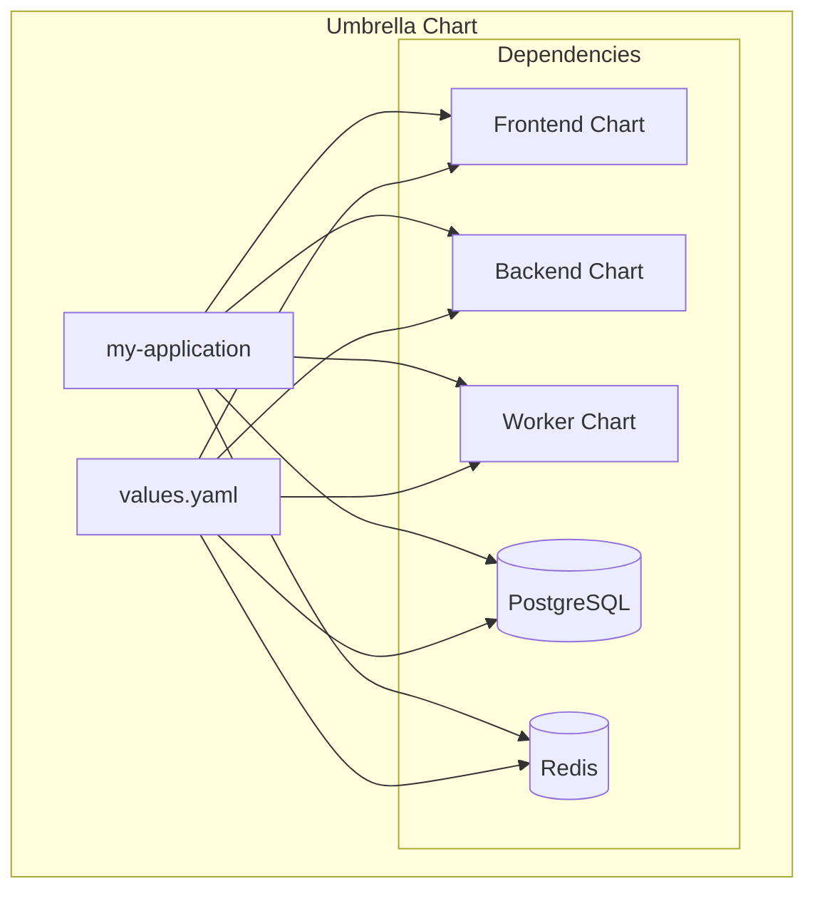

# Helm Umbrella Charts: Managing Multi-Service Applications

Author: [nawazdhandala](https://www.github.com/nawazdhandala)

Tags: Helm, Kubernetes, DevOps, Umbrella Charts, Microservices, Dependencies

Description: Learn how to create Helm umbrella charts to deploy and manage complex multi-service applications as a single unit with coordinated configuration.

> When deploying microservices or complex applications with multiple components, managing each service separately becomes unwieldy. Umbrella charts (also called parent charts) combine multiple charts into a single deployable unit, enabling coordinated deployments and shared configuration.

## What Are Umbrella Charts?



Umbrella charts:
- Have multiple charts as dependencies
- Deploy all components together
- Enable shared configuration across services
- Simplify complex application deployment

## Create an Umbrella Chart

### Directory Structure

```
my-application/
├── Chart.yaml
├── Chart.lock
├── values.yaml
├── values-production.yaml
├── values-staging.yaml
├── templates/
│   ├── _helpers.tpl
│   ├── configmap.yaml      # Shared config
│   ├── secrets.yaml        # Shared secrets
│   └── networkpolicy.yaml  # App-wide policies
└── charts/
    ├── frontend/           # Local chart
    ├── backend/            # Local chart
    └── worker/             # Local chart
```

### Chart.yaml with Dependencies

```yaml
# Chart.yaml
apiVersion: v2
name: my-application
description: Full application stack
type: application
version: 1.0.0
appVersion: "1.0.0"

dependencies:
  # Local charts
  - name: frontend
    version: "1.0.0"
    repository: "file://charts/frontend"
  
  - name: backend
    version: "1.0.0"
    repository: "file://charts/backend"
    condition: backend.enabled
  
  - name: worker
    version: "1.0.0"
    repository: "file://charts/worker"
    condition: worker.enabled
  
  # External charts from Bitnami
  - name: postgresql
    version: "13.x.x"
    repository: https://charts.bitnami.com/bitnami
    condition: postgresql.enabled
  
  - name: redis
    version: "18.x.x"
    repository: https://charts.bitnami.com/bitnami
    condition: redis.enabled
  
  # External chart from another repo
  - name: rabbitmq
    version: "12.x.x"
    repository: https://charts.bitnami.com/bitnami
    condition: rabbitmq.enabled
```

### Main values.yaml

```yaml
# values.yaml

# Global values available to all subcharts
global:
  environment: production
  domain: example.com
  
  image:
    registry: ghcr.io/myorg
    pullPolicy: IfNotPresent
  
  postgresql:
    host: "{{ .Release.Name }}-postgresql"
    port: 5432
    database: myapp
    username: myapp
  
  redis:
    host: "{{ .Release.Name }}-redis-master"
    port: 6379
  
  rabbitmq:
    host: "{{ .Release.Name }}-rabbitmq"
    port: 5672

# Enable/disable components
frontend:
  enabled: true
  
backend:
  enabled: true

worker:
  enabled: true

postgresql:
  enabled: true

redis:
  enabled: true

rabbitmq:
  enabled: false

# Frontend configuration
frontend:
  replicaCount: 3
  
  image:
    repository: myorg/frontend
    tag: "1.0.0"
  
  ingress:
    enabled: true
    hosts:
      - host: "{{ .Values.global.domain }}"
        paths:
          - path: /
  
  resources:
    limits:
      cpu: 500m
      memory: 512Mi
    requests:
      cpu: 100m
      memory: 128Mi

# Backend configuration
backend:
  replicaCount: 3
  
  image:
    repository: myorg/backend
    tag: "1.0.0"
  
  ingress:
    enabled: true
    hosts:
      - host: "api.{{ .Values.global.domain }}"
        paths:
          - path: /
  
  env:
    - name: DATABASE_URL
      valueFrom:
        secretKeyRef:
          name: "{{ .Release.Name }}-secrets"
          key: database-url
    - name: REDIS_URL
      valueFrom:
        secretKeyRef:
          name: "{{ .Release.Name }}-secrets"
          key: redis-url
  
  resources:
    limits:
      cpu: 1000m
      memory: 1Gi
    requests:
      cpu: 250m
      memory: 256Mi

# Worker configuration
worker:
  replicaCount: 2
  
  image:
    repository: myorg/worker
    tag: "1.0.0"
  
  env:
    - name: DATABASE_URL
      valueFrom:
        secretKeyRef:
          name: "{{ .Release.Name }}-secrets"
          key: database-url
    - name: REDIS_URL
      valueFrom:
        secretKeyRef:
          name: "{{ .Release.Name }}-secrets"
          key: redis-url
    - name: RABBITMQ_URL
      valueFrom:
        secretKeyRef:
          name: "{{ .Release.Name }}-secrets"
          key: rabbitmq-url
  
  resources:
    limits:
      cpu: 2000m
      memory: 2Gi
    requests:
      cpu: 500m
      memory: 512Mi

# PostgreSQL configuration
postgresql:
  auth:
    postgresPassword: "postgres-password"
    username: myapp
    password: "myapp-password"
    database: myapp
  
  primary:
    persistence:
      enabled: true
      size: 50Gi

# Redis configuration  
redis:
  auth:
    enabled: true
    password: "redis-password"
  
  master:
    persistence:
      enabled: true
      size: 10Gi
  
  replica:
    replicaCount: 2
```

### Shared Templates

```yaml
# templates/_helpers.tpl

{{/*
Create chart name
*/}}
{{- define "my-application.name" -}}
{{- .Chart.Name | trunc 63 | trimSuffix "-" -}}
{{- end -}}

{{/*
Common labels
*/}}
{{- define "my-application.labels" -}}
helm.sh/chart: {{ .Chart.Name }}-{{ .Chart.Version }}
app.kubernetes.io/name: {{ include "my-application.name" . }}
app.kubernetes.io/instance: {{ .Release.Name }}
app.kubernetes.io/managed-by: {{ .Release.Service }}
{{- end -}}

{{/*
Database URL
*/}}
{{- define "my-application.databaseUrl" -}}
postgresql://{{ .Values.postgresql.auth.username }}:{{ .Values.postgresql.auth.password }}@{{ .Release.Name }}-postgresql:5432/{{ .Values.postgresql.auth.database }}
{{- end -}}

{{/*
Redis URL
*/}}
{{- define "my-application.redisUrl" -}}
redis://:{{ .Values.redis.auth.password }}@{{ .Release.Name }}-redis-master:6379
{{- end -}}
```

### Shared ConfigMap

```yaml
# templates/configmap.yaml
apiVersion: v1
kind: ConfigMap
metadata:
  name: {{ .Release.Name }}-shared-config
  labels:
    {{- include "my-application.labels" . | nindent 4 }}
data:
  ENVIRONMENT: {{ .Values.global.environment | quote }}
  DOMAIN: {{ .Values.global.domain | quote }}
  LOG_LEVEL: {{ .Values.global.logLevel | default "info" | quote }}
```

### Shared Secrets

```yaml
# templates/secrets.yaml
apiVersion: v1
kind: Secret
metadata:
  name: {{ .Release.Name }}-secrets
  labels:
    {{- include "my-application.labels" . | nindent 4 }}
type: Opaque
stringData:
  database-url: {{ include "my-application.databaseUrl" . | quote }}
  redis-url: {{ include "my-application.redisUrl" . | quote }}
  {{- if .Values.rabbitmq.enabled }}
  rabbitmq-url: "amqp://{{ .Values.rabbitmq.auth.username }}:{{ .Values.rabbitmq.auth.password }}@{{ .Release.Name }}-rabbitmq:5672"
  {{- end }}
```

### Network Policy

```yaml
# templates/networkpolicy.yaml
{{- if .Values.networkPolicy.enabled }}
apiVersion: networking.k8s.io/v1
kind: NetworkPolicy
metadata:
  name: {{ .Release.Name }}-network-policy
  labels:
    {{- include "my-application.labels" . | nindent 4 }}
spec:
  podSelector:
    matchLabels:
      app.kubernetes.io/instance: {{ .Release.Name }}
  policyTypes:
    - Ingress
    - Egress
  ingress:
    - from:
        - podSelector:
            matchLabels:
              app.kubernetes.io/instance: {{ .Release.Name }}
    - from:
        - namespaceSelector:
            matchLabels:
              kubernetes.io/metadata.name: ingress-nginx
  egress:
    - to:
        - podSelector:
            matchLabels:
              app.kubernetes.io/instance: {{ .Release.Name }}
    - to:
        - namespaceSelector: {}
          podSelector:
            matchLabels:
              k8s-app: kube-dns
      ports:
        - protocol: UDP
          port: 53
{{- end }}
```

## Subchart Configuration

### Frontend Chart

```yaml
# charts/frontend/Chart.yaml
apiVersion: v2
name: frontend
description: Frontend service
type: application
version: 1.0.0
```

```yaml
# charts/frontend/values.yaml
replicaCount: 1

image:
  repository: frontend
  tag: latest
  pullPolicy: IfNotPresent

service:
  type: ClusterIP
  port: 80

ingress:
  enabled: false

resources: {}
```

### Backend Chart

```yaml
# charts/backend/Chart.yaml
apiVersion: v2
name: backend
description: Backend API service
type: application
version: 1.0.0
```

```yaml
# charts/backend/values.yaml
replicaCount: 1

image:
  repository: backend
  tag: latest
  pullPolicy: IfNotPresent

service:
  type: ClusterIP
  port: 8080

env: []

resources: {}
```

## Environment-Specific Values

### Production Values

```yaml
# values-production.yaml
global:
  environment: production
  domain: myapp.com

frontend:
  replicaCount: 5
  resources:
    limits:
      cpu: 1000m
      memory: 1Gi
    requests:
      cpu: 250m
      memory: 256Mi

backend:
  replicaCount: 5
  resources:
    limits:
      cpu: 2000m
      memory: 2Gi
    requests:
      cpu: 500m
      memory: 512Mi

worker:
  replicaCount: 3
  resources:
    limits:
      cpu: 4000m
      memory: 4Gi
    requests:
      cpu: 1000m
      memory: 1Gi

postgresql:
  primary:
    resources:
      limits:
        cpu: 2000m
        memory: 4Gi
    persistence:
      size: 200Gi

redis:
  master:
    resources:
      limits:
        cpu: 1000m
        memory: 2Gi
    persistence:
      size: 50Gi
```

### Staging Values

```yaml
# values-staging.yaml
global:
  environment: staging
  domain: staging.myapp.com

frontend:
  replicaCount: 2

backend:
  replicaCount: 2

worker:
  replicaCount: 1

postgresql:
  primary:
    persistence:
      size: 20Gi

redis:
  master:
    persistence:
      size: 5Gi
  replica:
    replicaCount: 1
```

## Build and Deploy

### Update Dependencies

```bash
# Download/update all dependencies
helm dependency update

# Or build if charts exist locally
helm dependency build

# List dependencies
helm dependency list
```

### Template and Verify

```bash
# Template with default values
helm template my-app .

# Template with production values
helm template my-app . -f values-production.yaml

# Debug mode
helm template my-app . --debug
```

### Install

```bash
# Install to staging
helm install my-app . \
  -n staging \
  --create-namespace \
  -f values-staging.yaml

# Install to production
helm install my-app . \
  -n production \
  --create-namespace \
  -f values-production.yaml
```

### Upgrade

```bash
# Upgrade with new values
helm upgrade my-app . \
  -n production \
  -f values-production.yaml \
  --set frontend.image.tag=1.1.0 \
  --set backend.image.tag=1.1.0
```

## Selective Component Installation

### Disable Specific Components

```bash
# Install without worker
helm install my-app . \
  --set worker.enabled=false

# Install without external databases (for dev with local DBs)
helm install my-app . \
  --set postgresql.enabled=false \
  --set redis.enabled=false
```

### Tags for Component Groups

```yaml
# Chart.yaml
dependencies:
  - name: frontend
    version: "1.0.0"
    repository: "file://charts/frontend"
    tags:
      - frontend
      - web
  
  - name: backend
    version: "1.0.0"
    repository: "file://charts/backend"
    tags:
      - backend
      - api
  
  - name: worker
    version: "1.0.0"
    repository: "file://charts/worker"
    tags:
      - backend
      - worker
```

```bash
# Install only frontend components
helm install my-app . --set tags.frontend=true --set tags.backend=false

# Install only backend components
helm install my-app . --set tags.frontend=false --set tags.backend=true
```

## Accessing Global Values in Subcharts

In subchart templates, access global values:

```yaml
# charts/backend/templates/deployment.yaml
apiVersion: apps/v1
kind: Deployment
metadata:
  name: {{ .Release.Name }}-backend
spec:
  template:
    spec:
      containers:
        - name: backend
          env:
            - name: ENVIRONMENT
              value: {{ .Values.global.environment | quote }}
            - name: DB_HOST
              value: {{ .Values.global.postgresql.host }}
            - name: REDIS_HOST
              value: {{ .Values.global.redis.host }}
```

## Dependency Import/Export

Share values between subcharts:

```yaml
# Chart.yaml
dependencies:
  - name: backend
    version: "1.0.0"
    repository: "file://charts/backend"
    import-values:
      - child: exports
        parent: backend

  - name: frontend
    version: "1.0.0"
    repository: "file://charts/frontend"
    import-values:
      - child: exports
        parent: frontend
```

In subchart:

```yaml
# charts/backend/values.yaml
exports:
  apiUrl: "http://backend:8080"
```

## Testing the Umbrella Chart

```bash
# Lint
helm lint .

# Test render
helm template my-app . --validate

# Dry run installation
helm install my-app . --dry-run --debug

# Run helm test (if tests are defined)
helm test my-app -n production
```

## Best Practices

| Practice | Description |
|----------|-------------|
| Use conditions | Enable/disable components with conditions |
| Global values | Share common config via global |
| Version pinning | Pin dependency versions explicitly |
| Environment files | Separate values files per environment |
| Local development | Support disabling external dependencies |
| Documentation | Document component dependencies |

## Wrap-up

Umbrella charts simplify deploying multi-service applications by combining multiple charts into a single deployable unit. Use Chart.yaml dependencies for external charts and local charts, configure components via parent values.yaml, and use conditions to enable/disable components. Share configuration through global values and environment-specific values files. This approach ensures consistent deployments while maintaining flexibility for different environments.
