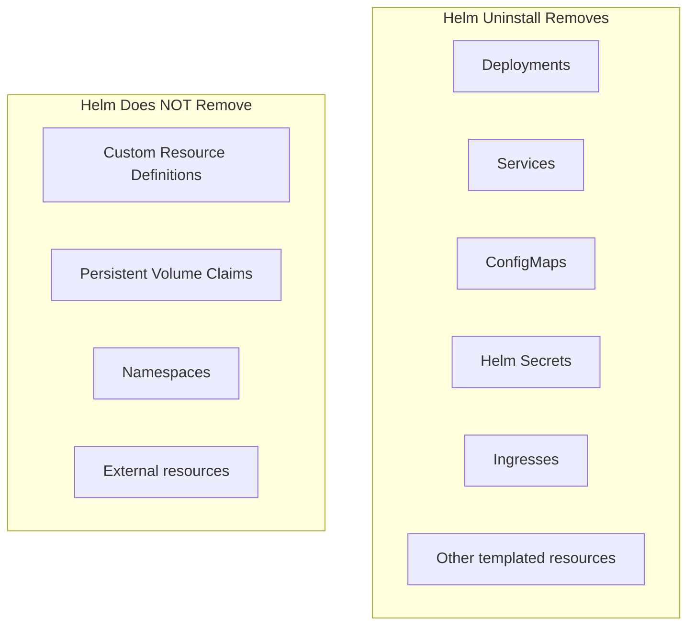

# How to Uninstall Helm Releases and Clean Up Resources

Author: [nawazdhandala](https://www.github.com/nawazdhandala)

Tags: Helm, Kubernetes, DevOps, Cleanup, Maintenance

Description: Learn proper Helm uninstallation, handling stuck resources, CRD cleanup, and managing orphaned resources for clean cluster maintenance.

> Uninstalling Helm releases seems simple, but leaving behind orphaned resources can cause conflicts, consume resources, and create security risks. This guide covers complete cleanup procedures.

## Basic Uninstallation

The `helm uninstall` command removes a release and its associated Kubernetes resources.

```bash
# Uninstall a release from the current namespace
helm uninstall my-app

# Uninstall from a specific namespace
helm uninstall my-app -n production

# Uninstall and wait for resources to be deleted
helm uninstall my-app -n production --wait

# Verify the release is gone
helm list -n production | grep my-app
```

## What Helm Deletes (and What It Doesn't)

Understanding what Helm removes is crucial for complete cleanup.



### Resources Helm Removes

By default, Helm deletes all resources created by the chart templates:

- Deployments, StatefulSets, DaemonSets
- Services, Ingresses
- ConfigMaps, Secrets (created by the chart)
- ServiceAccounts, Roles, RoleBindings
- Jobs (except those with `helm.sh/resource-policy: keep`)

### Resources Helm Does NOT Remove

These require manual cleanup:

- **CRDs** - Most charts don't delete CRDs to prevent data loss
- **PVCs** - Persistent Volume Claims often have `helm.sh/resource-policy: keep`
- **Namespaces** - Created with `--create-namespace` but not deleted
- **External resources** - Cloud load balancers, DNS records, etc.

## Keeping History for Auditing

By default, Helm 3 removes all history when uninstalling. Use `--keep-history` if you need an audit trail.

```bash
# Uninstall but keep the release history
helm uninstall my-app -n production --keep-history

# The release now shows as "uninstalled" in history
helm history my-app -n production

# You can still inspect what was deployed
helm get values my-app -n production --revision 3

# To completely remove history later
helm uninstall my-app -n production --keep-history
# Then manually delete the secret:
kubectl delete secret sh.helm.release.v1.my-app.v3 -n production
```

## Cleaning Up Persistent Volume Claims

PVCs often persist after uninstallation to protect data. Decide what to do with them based on your needs.

### Check for Orphaned PVCs

After uninstalling, check for leftover PVCs.

```bash
# List PVCs that might have been created by the release
kubectl get pvc -n production

# Check if PVCs have the Helm release label
kubectl get pvc -n production -l app.kubernetes.io/instance=my-app

# Describe a PVC to see if it's still bound
kubectl describe pvc data-my-app-postgresql-0 -n production
```

### Delete PVCs (Data Loss Warning)

Only delete PVCs when you're certain you don't need the data.

```bash
# Delete a specific PVC
kubectl delete pvc data-my-app-postgresql-0 -n production

# Delete all PVCs from the release
kubectl delete pvc -n production -l app.kubernetes.io/instance=my-app

# Also delete the underlying PVs if using static provisioning
kubectl get pv | grep my-app
kubectl delete pv pv-my-app-data
```

## Cleaning Up Custom Resource Definitions

CRDs persist after uninstallation because deleting them also deletes all Custom Resources of that type- potentially destroying data across the entire cluster.

### Check for CRDs

```bash
# List CRDs installed by common charts
kubectl get crd | grep -E "cert-manager|prometheus|istio"

# Check if any Custom Resources still exist
kubectl get prometheusrules --all-namespaces
kubectl get certificates --all-namespaces
```

### Safe CRD Removal Process

Only remove CRDs when you're certain no other releases depend on them.

```bash
# 1. Verify no Custom Resources exist
kubectl get prometheusrules --all-namespaces
# Output should be empty or show no resources

# 2. Delete the CRDs
kubectl delete crd prometheusrules.monitoring.coreos.com

# 3. Verify deletion
kubectl get crd | grep prometheus
```

### Forcing CRD Deletion (Stuck CRDs)

Sometimes CRDs get stuck due to finalizers. Here's how to force removal.

```bash
# Check for finalizers on a stuck CRD
kubectl get crd mycrd.example.com -o yaml | grep finalizers

# Remove the finalizer to allow deletion
kubectl patch crd mycrd.example.com -p '{"metadata":{"finalizers":[]}}' --type=merge

# Now delete should work
kubectl delete crd mycrd.example.com
```

## Handling Stuck Releases

Sometimes `helm uninstall` fails or leaves the release in a stuck state.

### Check Release State

```bash
# List all releases including failed ones
helm list --all -n production

# Look for releases in uninstalling state
helm list --uninstalling -n production
```

### Force Uninstall Stuck Releases

```bash
# If uninstall is stuck, first try with --no-hooks
helm uninstall my-app -n production --no-hooks

# If the release secret is corrupted, delete it manually
kubectl get secrets -n production | grep sh.helm.release
kubectl delete secret sh.helm.release.v1.my-app.v1 -n production
kubectl delete secret sh.helm.release.v1.my-app.v2 -n production
kubectl delete secret sh.helm.release.v1.my-app.v3 -n production

# Manually clean up any remaining resources
kubectl delete all -l app.kubernetes.io/instance=my-app -n production
```

## Cleaning Up Orphaned Resources

After uninstallation, some resources might remain due to failed hooks, manual modifications, or bugs.

### Find Orphaned Resources

Use labels to identify resources that should have been deleted.

```bash
# Find resources with Helm labels but no corresponding release
kubectl get all,configmap,secret,ingress,pvc -n production \
  -l app.kubernetes.io/managed-by=Helm

# Compare against active releases
helm list -n production

# Find resources from a specific release
kubectl get all -n production -l app.kubernetes.io/instance=my-app
```

### Delete Orphaned Resources

```bash
# Delete all resources from an orphaned release
kubectl delete all -n production -l app.kubernetes.io/instance=my-app

# Delete ConfigMaps and Secrets
kubectl delete configmap -n production -l app.kubernetes.io/instance=my-app
kubectl delete secret -n production -l app.kubernetes.io/instance=my-app

# Delete Ingresses
kubectl delete ingress -n production -l app.kubernetes.io/instance=my-app

# Nuclear option: delete everything with the label
kubectl delete all,configmap,secret,ingress,pvc,serviceaccount \
  -n production -l app.kubernetes.io/instance=my-app
```

## Namespace Cleanup

If you created a namespace just for the release, consider deleting it.

```bash
# Check if namespace is empty (or only has default resources)
kubectl get all -n my-app-namespace

# Delete the namespace (deletes everything inside)
kubectl delete namespace my-app-namespace

# Warning: This deletes ALL resources in the namespace, not just Helm-managed ones
```

## Cleanup in CI/CD Pipelines

Automate cleanup in your CI/CD pipelines for ephemeral environments.

```bash
#!/bin/bash
# cleanup-release.sh - Safe cleanup script for CI/CD

RELEASE_NAME=$1
NAMESPACE=$2

echo "Cleaning up release: $RELEASE_NAME in namespace: $NAMESPACE"

# Uninstall the Helm release
helm uninstall "$RELEASE_NAME" -n "$NAMESPACE" --wait --timeout 5m || true

# Clean up PVCs (only in non-production)
if [[ "$NAMESPACE" != "production" ]]; then
  kubectl delete pvc -n "$NAMESPACE" \
    -l app.kubernetes.io/instance="$RELEASE_NAME" \
    --ignore-not-found
fi

# Clean up any orphaned resources
kubectl delete all -n "$NAMESPACE" \
  -l app.kubernetes.io/instance="$RELEASE_NAME" \
  --ignore-not-found

echo "Cleanup complete"
```

## Pre-Uninstall Checklist

Before uninstalling a production release, verify these items.

| Check | Command | Why |
| --- | --- | --- |
| No dependent services | Check service mesh, ingress routing | Prevent cascading failures |
| Data backed up | Backup PVCs if needed | Prevent data loss |
| DNS updated | Remove DNS records | Prevent routing to non-existent service |
| Monitoring cleaned | Remove from dashboards | Prevent alert noise |
| Secrets externally stored | Copy to vault if needed | Prevent credential loss |
| CRD dependencies checked | `kubectl get <crd> -A` | Prevent breaking other services |

## Uninstall Command Reference

| Command | Description |
| --- | --- |
| `helm uninstall NAME` | Remove release from current namespace |
| `helm uninstall NAME -n NS` | Remove release from specific namespace |
| `helm uninstall NAME --keep-history` | Remove but keep audit history |
| `helm uninstall NAME --no-hooks` | Skip pre/post-delete hooks |
| `helm uninstall NAME --wait` | Wait for all resources to be deleted |
| `helm uninstall NAME --timeout 10m` | Set deletion timeout |
| `helm uninstall NAME --dry-run` | Preview what would be deleted |

## Troubleshooting Uninstallation Issues

| Issue | Cause | Solution |
| --- | --- | --- |
| `release not found` | Wrong namespace or typo | Check `helm list --all-namespaces` |
| Stuck in uninstalling | Finalizers blocking deletion | Remove finalizers from stuck resources |
| Resources remain after uninstall | `resource-policy: keep` annotation | Manually delete with kubectl |
| PVCs not deleted | Default PVC retention policy | Manually delete PVCs |
| Namespace won't delete | Resources with finalizers | Find and remove stuck resources |
| Timeout during uninstall | Hooks taking too long | Use `--no-hooks` flag |

## Wrap-up

Proper Helm cleanup goes beyond `helm uninstall`. Check for orphaned PVCs, verify CRD cleanup, and remove any resources that persist due to retention policies. In production, always verify data is backed up before removing PVCs, and check that no other services depend on CRDs before deleting them. Build cleanup automation into your CI/CD pipelines for ephemeral environments, and you'll maintain a clean, efficient cluster without accumulating technical debt.
