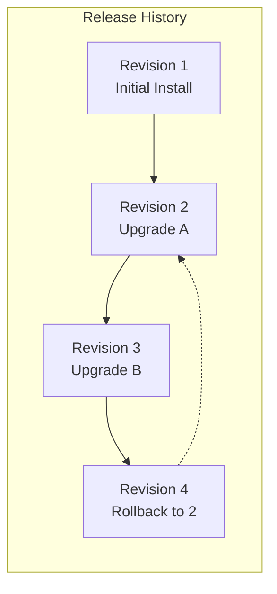

# How to Upgrade and Rollback Helm Releases Safely

Author: [nawazdhandala](https://www.github.com/nawazdhandala)

Tags: Helm, Kubernetes, DevOps, Releases, Rollback

Description: Master Helm upgrade strategies, atomic upgrades, rollback procedures, and version history management for safe production deployments.

> Deployments don't end at install. Real production work means upgrading charts, managing versions, and occasionally rolling back when things go wrong. Helm makes all of this trackable and reversible.

## Understanding Helm Releases

A Helm **release** is a deployed instance of a chart. Each release has a revision history that Helm maintains, allowing you to upgrade to new versions or roll back to previous states.



## Basic Upgrade Workflow

### Upgrading to a New Chart Version

When a chart releases a new version with bug fixes or features, upgrade your release to use it.

```bash
# First, update your repository cache to see the latest versions
helm repo update

# Check what versions are available
helm search repo bitnami/postgresql --versions

# Upgrade to a specific version
helm upgrade my-postgresql bitnami/postgresql \
  --namespace databases \
  --version 14.0.0

# Verify the upgrade
helm status my-postgresql -n databases
```

### Upgrading with Changed Values

More commonly, you'll upgrade to apply configuration changes while staying on the same chart version.

```bash
# Upgrade with new values file
helm upgrade my-postgresql bitnami/postgresql \
  --namespace databases \
  -f new-values.yaml

# Or override specific values
helm upgrade my-postgresql bitnami/postgresql \
  --namespace databases \
  --set primary.resources.limits.memory=4Gi
```

### Reusing vs. Resetting Values

Understanding how Helm handles values during upgrades is critical to avoid surprises.

```bash
# --reuse-values: Keep all previous values, only override what you specify
helm upgrade my-app bitnami/nginx --reuse-values --set replicaCount=5

# --reset-values: Start fresh with chart defaults, apply only what you specify
helm upgrade my-app bitnami/nginx --reset-values -f new-values.yaml

# Best practice: Always use explicit values files, avoid --reuse-values
# This makes upgrades reproducible and auditable
helm upgrade my-app bitnami/nginx -f production-values.yaml
```

## Safe Upgrade Strategies

### Atomic Upgrades

The `--atomic` flag automatically rolls back if the upgrade fails. This is essential for production.

```bash
# Atomic upgrade: if pods don't become healthy, rollback automatically
helm upgrade my-app bitnami/nginx \
  --namespace production \
  --atomic \
  --timeout 10m \
  -f production-values.yaml
```

### Staged Upgrades with --wait

Use `--wait` to ensure resources are healthy before considering the upgrade complete.

```bash
# Wait for all pods to be ready before returning
helm upgrade my-app bitnami/nginx \
  --wait \
  --timeout 5m \
  -f values.yaml

# Combine with atomic for production safety
helm upgrade my-app bitnami/nginx \
  --wait \
  --atomic \
  --timeout 10m \
  -f values.yaml
```

### Dry Run Before Upgrading

Always preview what an upgrade will change before applying it.

```bash
# See what would change without actually applying
helm upgrade my-app bitnami/nginx \
  --dry-run \
  --debug \
  -f new-values.yaml

# Use helm diff plugin for cleaner output (install first: helm plugin install https://github.com/databus23/helm-diff)
helm diff upgrade my-app bitnami/nginx -f new-values.yaml
```

## Managing Release History

### View Revision History

Every upgrade creates a new revision. Inspect the history to understand what changed.

```bash
# View release history
helm history my-app -n production

# Example output:
# REVISION  UPDATED                   STATUS      CHART          APP VERSION  DESCRIPTION
# 1         Mon Jan 15 10:00:00 2024  superseded  nginx-15.0.0   1.25.0       Install complete
# 2         Tue Jan 16 14:30:00 2024  superseded  nginx-15.1.0   1.25.1       Upgrade complete
# 3         Wed Jan 17 09:00:00 2024  deployed    nginx-15.1.0   1.25.1       Upgrade complete
```

### View Specific Revision Details

Inspect what values and manifests were used in a specific revision.

```bash
# Get the values used in a specific revision
helm get values my-app --revision 2

# Get all computed values (including defaults)
helm get values my-app --revision 2 --all

# Get the manifest (rendered templates) for a revision
helm get manifest my-app --revision 2

# Get hooks for a revision
helm get hooks my-app --revision 2

# Get everything
helm get all my-app --revision 2
```

## Rollback Procedures

### Basic Rollback

When an upgrade causes problems, roll back to a known-good revision.

```bash
# Rollback to the previous revision
helm rollback my-app -n production

# Rollback to a specific revision number
helm rollback my-app 2 -n production

# Verify the rollback
helm status my-app -n production
helm history my-app -n production
```

### Safe Rollback Strategies

For production systems, add safety flags to rollback operations.

```bash
# Wait for rollback to complete and verify pod health
helm rollback my-app 2 \
  --wait \
  --timeout 5m

# Force resource updates during rollback (recreate if needed)
helm rollback my-app 2 --force

# Clean up pending operations if rollback is stuck
helm rollback my-app 2 --cleanup-on-fail
```

### Rollback vs. Re-upgrade

Sometimes re-upgrading to the previous chart version is cleaner than rollback.

```bash
# Option 1: Rollback (quick, uses stored revision)
helm rollback my-app 2

# Option 2: Re-upgrade to previous version (cleaner for GitOps)
helm upgrade my-app bitnami/nginx \
  --version 15.0.0 \
  -f last-known-good-values.yaml
```

## Upgrade Patterns for Production

### Pattern 1: Blue-Green Style Upgrade

Deploy a new release alongside the old one, validate, then switch traffic.

```bash
# Deploy new version as separate release
helm install my-app-v2 bitnami/nginx \
  --namespace production \
  --set service.name=my-app-v2 \
  -f v2-values.yaml

# Validate the new version
kubectl port-forward svc/my-app-v2 8080:80 -n production
curl http://localhost:8080/health

# If good, update ingress to point to v2, then remove v1
helm uninstall my-app-v1 -n production
```

### Pattern 2: Canary Upgrade

Gradually shift traffic to the new version.

```bash
# Upgrade with reduced replica count initially
helm upgrade my-app bitnami/nginx \
  --set replicaCount=1 \
  -f new-values.yaml

# Monitor error rates in your observability platform
# If good, scale up
helm upgrade my-app bitnami/nginx \
  --set replicaCount=3 \
  -f new-values.yaml
```

### Pattern 3: GitOps-Driven Upgrades

In GitOps workflows, changes are committed to Git and synced automatically.

```yaml
# values-production.yaml in Git
image:
  tag: "1.25.1"  # Change this in a PR
replicaCount: 3
resources:
  requests:
    memory: 256Mi
```

```bash
# After PR is merged, ArgoCD/FluxCD detects the change and runs:
helm upgrade my-app ./charts/my-app -f values-production.yaml
```

## Handling Failed Upgrades

### Diagnosing Upgrade Failures

When upgrades fail, gather information before attempting fixes.

```bash
# Check release status
helm status my-app -n production

# View helm history to see failure message
helm history my-app -n production

# Check pod status and events
kubectl get pods -n production
kubectl describe pod my-app-xxx -n production
kubectl logs my-app-xxx -n production

# Check for pending operations
helm list --pending -n production
```

### Recovering from Stuck States

Sometimes releases get stuck in pending states. Here's how to recover.

```bash
# If a release is stuck in "pending-install" or "pending-upgrade"
# Check for secret storage issues
kubectl get secrets -n production | grep my-app

# Force the upgrade to overwrite the stuck state
helm upgrade my-app bitnami/nginx --force -f values.yaml

# As a last resort, manually fix the release secret
# WARNING: This is advanced - understand what you're doing
kubectl get secret sh.helm.release.v1.my-app.v3 -n production -o yaml
```

## Version History Management

### Controlling History Length

Helm stores revision history as Kubernetes Secrets. Limit this to prevent clutter.

```bash
# Set maximum history revisions to keep (default is 10)
helm upgrade my-app bitnami/nginx \
  --history-max 5 \
  -f values.yaml

# Or set globally in your upgrade scripts
export HELM_MAX_HISTORY=5
```

### Cleaning Up Old Revisions

Large history can slow down operations. Clean it periodically.

```bash
# List all helm secrets (where history is stored)
kubectl get secrets -n production | grep sh.helm.release

# Helm automatically prunes when exceeding history-max
# Manual cleanup is rarely needed
```

## Upgrade Command Reference

| Flag | Description | Use Case |
| --- | --- | --- |
| `--atomic` | Rollback on failure | Production safety |
| `--wait` | Wait for resources ready | Ensure deployment health |
| `--timeout` | Max wait time | Prevent infinite hangs |
| `--dry-run` | Preview without applying | Validate changes |
| `--reuse-values` | Keep previous values | Quick single-value changes |
| `--reset-values` | Start from defaults | Clean slate upgrades |
| `--force` | Force resource updates | Recover stuck releases |
| `--cleanup-on-fail` | Remove new resources on fail | Clean failure recovery |
| `--history-max` | Limit revision history | Reduce secret bloat |
| `--version` | Target chart version | Pin specific versions |

## Troubleshooting Upgrades and Rollbacks

| Issue | Cause | Solution |
| --- | --- | --- |
| `another operation in progress` | Concurrent Helm operation | Wait or fix stuck release |
| `UPGRADE FAILED: timed out` | Pods not becoming ready | Increase timeout, check pod logs |
| `cannot patch` immutable field | Trying to change immutable spec | Use `--force` or recreate resource |
| Rollback creates new issues | Old config incompatible with current state | Re-upgrade with fixed values instead |
| History growing too large | Default keeps 10 revisions | Set `--history-max` lower |

## Wrap-up

Helm's upgrade and rollback capabilities make it safe to iterate on production deployments. Always use `--atomic` and `--wait` in production, preview changes with `--dry-run`, and keep your values files in version control. When problems occur, the revision history gives you a clear path back to a working state. Master these workflows and you'll deploy with confidence, knowing you can always recover.
