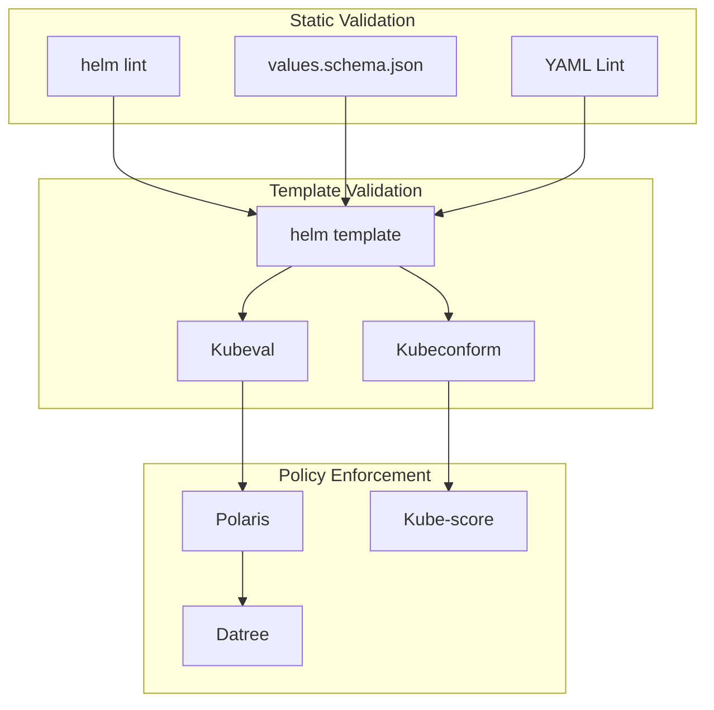

# How to Validate Helm Charts Before Deployment

Author: [nawazdhandala](https://www.github.com/nawazdhandala)

Tags: Helm, Kubernetes, DevOps, Validation, Security, Best Practices

Description: Complete guide to validating Helm charts using helm lint, kubeval, kubeconform, and Polaris for policy enforcement before deployment.

> Validating Helm charts before deployment prevents misconfigurations and security issues. This guide covers comprehensive validation using linting tools, schema validators, and policy enforcement frameworks.

## Validation Pipeline Overview



## Helm Lint

### Basic Linting

```bash
# Lint a chart
helm lint charts/myapp

# Lint with strict mode
helm lint charts/myapp --strict

# Lint with values file
helm lint charts/myapp -f values-production.yaml

# Lint with debug output
helm lint charts/myapp --debug
```

### Common Lint Errors

```bash
# Example output
==> Linting charts/myapp
[INFO] Chart.yaml: icon is recommended
[WARNING] templates/deployment.yaml: unable to parse YAML
[ERROR] templates/: template: myapp/templates/deployment.yaml:15: function "undefined" not defined

Error: 1 chart(s) linted, 1 chart(s) failed
```

### Fix Common Issues

```yaml
# charts/myapp/Chart.yaml
apiVersion: v2
name: myapp
description: My application chart
type: application
version: 1.0.0
appVersion: "1.0.0"
icon: https://example.com/icon.png  # Add icon to fix info message
maintainers:
  - name: Your Name
    email: you@example.com
```

## Values Schema Validation

### Create JSON Schema

```json
{
  "$schema": "https://json-schema.org/draft/2020-12/schema",
  "type": "object",
  "required": ["image", "service"],
  "properties": {
    "replicaCount": {
      "type": "integer",
      "minimum": 1,
      "maximum": 100,
      "default": 1,
      "description": "Number of replicas"
    },
    "image": {
      "type": "object",
      "required": ["repository"],
      "properties": {
        "repository": {
          "type": "string",
          "pattern": "^[a-z0-9.-/]+$",
          "description": "Container image repository"
        },
        "tag": {
          "type": "string",
          "default": "latest",
          "description": "Image tag"
        },
        "pullPolicy": {
          "type": "string",
          "enum": ["Always", "IfNotPresent", "Never"],
          "default": "IfNotPresent"
        }
      }
    },
    "service": {
      "type": "object",
      "required": ["port"],
      "properties": {
        "type": {
          "type": "string",
          "enum": ["ClusterIP", "NodePort", "LoadBalancer"],
          "default": "ClusterIP"
        },
        "port": {
          "type": "integer",
          "minimum": 1,
          "maximum": 65535
        }
      }
    },
    "resources": {
      "type": "object",
      "properties": {
        "limits": {
          "type": "object",
          "properties": {
            "cpu": {"type": "string", "pattern": "^[0-9]+m?$"},
            "memory": {"type": "string", "pattern": "^[0-9]+(Mi|Gi)$"}
          }
        },
        "requests": {
          "type": "object",
          "properties": {
            "cpu": {"type": "string", "pattern": "^[0-9]+m?$"},
            "memory": {"type": "string", "pattern": "^[0-9]+(Mi|Gi)$"}
          }
        }
      }
    }
  }
}
```

### Validate Against Schema

```bash
# Schema is automatically validated during lint
helm lint charts/myapp

# Manual validation with ajv-cli
npm install -g ajv-cli
ajv validate -s values.schema.json -d values.yaml
```

## Kubeval Validation

### Install Kubeval

```bash
# macOS
brew install kubeval

# Linux
wget https://github.com/instrumenta/kubeval/releases/download/v0.16.1/kubeval-linux-amd64.tar.gz
tar xzvf kubeval-linux-amd64.tar.gz
sudo mv kubeval /usr/local/bin/
```

### Validate Rendered Templates

```bash
# Render and validate
helm template myapp charts/myapp | kubeval --strict

# Validate with specific Kubernetes version
helm template myapp charts/myapp | kubeval --kubernetes-version 1.28.0

# Validate multiple files
helm template myapp charts/myapp --output-dir rendered/
kubeval --strict rendered/myapp/templates/*.yaml

# Ignore missing schemas
helm template myapp charts/myapp | kubeval --ignore-missing-schemas
```

### Example Output

```bash
PASS - myapp/templates/service.yaml contains a valid Service (myapp)
PASS - myapp/templates/deployment.yaml contains a valid Deployment (myapp)
WARN - myapp/templates/hpa.yaml contains a unknown resource
ERR  - myapp/templates/ingress.yaml: missing required field "backend" in spec.rules[0].http.paths[0]
```

## Kubeconform Validation

### Install Kubeconform

```bash
# macOS
brew install kubeconform

# Linux
wget https://github.com/yannh/kubeconform/releases/download/v0.6.3/kubeconform-linux-amd64.tar.gz
tar xzvf kubeconform-linux-amd64.tar.gz
sudo mv kubeconform /usr/local/bin/
```

### Validate Templates

```bash
# Basic validation
helm template myapp charts/myapp | kubeconform

# Strict validation with specific version
helm template myapp charts/myapp | kubeconform \
  -strict \
  -kubernetes-version 1.28.0 \
  -summary

# With CRD schemas
helm template myapp charts/myapp | kubeconform \
  -schema-location default \
  -schema-location 'https://raw.githubusercontent.com/datreeio/CRDs-catalog/main/{{.Group}}/{{.ResourceKind}}_{{.ResourceAPIVersion}}.json'

# Output formats
helm template myapp charts/myapp | kubeconform -output json
helm template myapp charts/myapp | kubeconform -output tap
```

### Custom Schema Registry

```bash
# Use local schema registry
kubeconform -schema-location './schemas/{{ .ResourceKind }}_{{ .ResourceAPIVersion }}.json'

# Multiple schema locations
kubeconform \
  -schema-location default \
  -schema-location './custom-schemas/{{ .ResourceKind }}.json'
```

## Polaris Policy Enforcement

### Install Polaris

```bash
# macOS
brew install fairwindsops/tap/polaris

# Linux
curl -L https://github.com/FairwindsOps/polaris/releases/download/8.5.3/polaris_linux_amd64.tar.gz | tar xzvf -
sudo mv polaris /usr/local/bin/
```

### Audit Helm Charts

```bash
# Audit rendered templates
helm template myapp charts/myapp | polaris audit --audit-path -

# Output formats
helm template myapp charts/myapp | polaris audit --audit-path - --format json
helm template myapp charts/myapp | polaris audit --audit-path - --format yaml
helm template myapp charts/myapp | polaris audit --audit-path - --format score

# Set failure threshold
helm template myapp charts/myapp | polaris audit --audit-path - --set-exit-code-on-danger
```

### Custom Polaris Configuration

```yaml
# polaris-config.yaml
checks:
  # Security
  hostIPCSet: danger
  hostPIDSet: danger
  notReadOnlyRootFilesystem: warning
  privilegeEscalationAllowed: danger
  runAsRootAllowed: warning
  runAsPrivileged: danger
  dangerousCapabilities: danger
  insecureCapabilities: warning
  
  # Reliability
  cpuRequestsMissing: warning
  cpuLimitsMissing: warning
  memoryRequestsMissing: warning
  memoryLimitsMissing: warning
  readinessProbeMissing: warning
  livenessProbeMissing: warning
  
  # Efficiency
  cpuRequestsMissing: warning
  memoryRequestsMissing: warning

exemptions:
  - namespace: kube-system
    controllerNames:
      - kube-proxy
      - coredns
    rules:
      - hostNetworkSet
      - hostPIDSet

customChecks:
  imageRegistry:
    successMessage: Image from approved registry
    failureMessage: Image not from approved registry
    category: Security
    target: Container
    schema:
      '$schema': http://json-schema.org/draft-07/schema
      type: object
      properties:
        image:
          type: string
          pattern: ^(gcr\.io|docker\.io)/myorg/.*$
```

```bash
# Use custom config
helm template myapp charts/myapp | polaris audit \
  --audit-path - \
  --config polaris-config.yaml
```

## Kube-score Validation

### Install Kube-score

```bash
# macOS
brew install kube-score

# Linux
wget https://github.com/zegl/kube-score/releases/download/v1.17.0/kube-score_1.17.0_linux_amd64.tar.gz
tar xzvf kube-score_1.17.0_linux_amd64.tar.gz
sudo mv kube-score /usr/local/bin/
```

### Score Helm Charts

```bash
# Score rendered templates
helm template myapp charts/myapp | kube-score score -

# Output formats
helm template myapp charts/myapp | kube-score score - --output-format ci
helm template myapp charts/myapp | kube-score score - --output-format json

# Ignore specific checks
helm template myapp charts/myapp | kube-score score - \
  --ignore-test container-security-context-readOnlyRootFilesystem
```

### Example Output

```
apps/v1/Deployment myapp
    [CRITICAL] Container Security Context ReadOnlyRootFilesystem
        · myapp -> The pod has a container with a writable root filesystem
    [CRITICAL] Pod NetworkPolicy
        · The pod does not have a matching NetworkPolicy
    [WARNING] Deployment has PodDisruptionBudget
        · No matching PodDisruptionBudget was found
    [OK] Container Resources
```

## Datree Policy Enforcement

### Install Datree

```bash
# macOS/Linux
curl https://get.datree.io | /bin/bash
```

### Validate Charts

```bash
# Test rendered templates
helm template myapp charts/myapp | datree test -

# Use specific policy
helm template myapp charts/myapp | datree test - --policy Production

# Output formats
helm template myapp charts/myapp | datree test - --output json
```

### Custom Datree Policies

```yaml
# datree-policy.yaml
apiVersion: v1
policies:
  - name: Production
    rules:
      - identifier: CONTAINERS_MISSING_LIVENESS_PROBE
        messageOnFailure: "Missing liveness probe"
      - identifier: CONTAINERS_MISSING_READINESS_PROBE
        messageOnFailure: "Missing readiness probe"
      - identifier: CONTAINERS_MISSING_CPU_LIMIT
        messageOnFailure: "Missing CPU limit"
      - identifier: CONTAINERS_MISSING_MEMORY_LIMIT
        messageOnFailure: "Missing memory limit"
      - identifier: CONTAINERS_INCORRECT_PRIVILEGED_VALUE_TRUE
        messageOnFailure: "Privileged containers not allowed"
      - identifier: CONTAINERS_MISSING_IMAGE_VALUE_DIGEST
        messageOnFailure: "Use image digest instead of tag"
```

## CI/CD Integration

### GitHub Actions Workflow

```yaml
# .github/workflows/validate-charts.yaml
name: Validate Helm Charts

on:
  push:
    paths:
      - 'charts/**'
  pull_request:
    paths:
      - 'charts/**'

jobs:
  validate:
    runs-on: ubuntu-latest
    steps:
      - uses: actions/checkout@v4

      - name: Set up Helm
        uses: azure/setup-helm@v3
        with:
          version: v3.13.0

      - name: Helm Lint
        run: |
          for chart in charts/*/; do
            helm lint "$chart" --strict
          done

      - name: Install Kubeconform
        run: |
          wget https://github.com/yannh/kubeconform/releases/download/v0.6.3/kubeconform-linux-amd64.tar.gz
          tar xzvf kubeconform-linux-amd64.tar.gz
          sudo mv kubeconform /usr/local/bin/

      - name: Validate Templates
        run: |
          for chart in charts/*/; do
            helm template test "$chart" | kubeconform -strict -summary
          done

      - name: Install Polaris
        run: |
          curl -L https://github.com/FairwindsOps/polaris/releases/download/8.5.3/polaris_linux_amd64.tar.gz | tar xzvf -
          sudo mv polaris /usr/local/bin/

      - name: Policy Audit
        run: |
          for chart in charts/*/; do
            helm template test "$chart" | polaris audit --audit-path - --set-exit-code-on-danger
          done
```

### Pre-commit Hook

```yaml
# .pre-commit-config.yaml
repos:
  - repo: local
    hooks:
      - id: helm-lint
        name: Helm Lint
        entry: bash -c 'helm lint charts/*'
        language: system
        files: charts/.*
        
      - id: kubeconform
        name: Kubeconform Validation
        entry: bash -c 'for chart in charts/*/; do helm template test "$chart" | kubeconform -strict; done'
        language: system
        files: charts/.*
```

## Validation Checklist

| Tool | Purpose | Severity |
|------|---------|----------|
| helm lint | Syntax and structure | High |
| values.schema.json | Values validation | High |
| kubeconform | Kubernetes schema | High |
| Polaris | Security policies | Critical |
| kube-score | Best practices | Medium |
| Datree | Compliance | Medium |

## Troubleshooting

```bash
# Debug template rendering
helm template myapp charts/myapp --debug 2>&1

# Validate single template
helm template myapp charts/myapp -s templates/deployment.yaml | kubeconform -strict

# Skip CRD validation
helm template myapp charts/myapp | kubeconform --skip CustomResourceDefinition

# Verbose output
helm template myapp charts/myapp | polaris audit --audit-path - --config polaris.yaml 2>&1
```

## Wrap-up

Validating Helm charts before deployment is essential for maintaining reliable and secure Kubernetes applications. Use helm lint for basic validation, kubeconform for schema validation, and Polaris or kube-score for policy enforcement. Integrate these tools into CI/CD pipelines to catch issues early in the development cycle.
