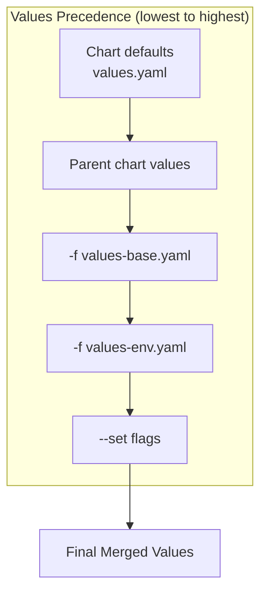

# How to Use Helm Values Files for Multi-Environment Deployments

Author: [nawazdhandala](https://www.github.com/nawazdhandala)

Tags: Helm, Kubernetes, DevOps, Configuration, Environments

Description: Master Helm values files to manage dev, staging, and production configurations with values file layering, --set overrides, and secrets management.

> One chart, many environments. Helm values files let you deploy the same application with different configurations for development, staging, and production without duplicating templates.

## Understanding Helm Values

Helm values are the configuration inputs that customize chart templates. They flow from multiple sources, merged in a specific order that determines the final configuration.



## Creating Environment-Specific Values Files

### Project Structure

Organize your values files by environment for clarity and maintainability.

```
my-app/
├── Chart.yaml
├── values.yaml              # Chart defaults
├── templates/
└── environments/
    ├── values-base.yaml     # Shared across all envs
    ├── values-dev.yaml      # Development overrides
    ├── values-staging.yaml  # Staging overrides
    └── values-prod.yaml     # Production overrides
```

### Base Values File

Start with a base file containing settings shared across all environments. This reduces duplication and ensures consistency.

```yaml
# environments/values-base.yaml
# Shared configuration across all environments

image:
  repository: myregistry.io/myapp
  pullPolicy: IfNotPresent

serviceAccount:
  create: true
  name: myapp

service:
  type: ClusterIP
  port: 80

# Health check configuration (same everywhere)
livenessProbe:
  httpGet:
    path: /health
    port: http
  initialDelaySeconds: 10
  periodSeconds: 10

readinessProbe:
  httpGet:
    path: /ready
    port: http
  initialDelaySeconds: 5
  periodSeconds: 5

# Default labels applied to all resources
commonLabels:
  app.kubernetes.io/name: myapp
  app.kubernetes.io/managed-by: helm
```

### Development Values

Development environments prioritize fast iteration and debugging capabilities over resilience.

```yaml
# environments/values-dev.yaml
# Development environment: fast iteration, debugging enabled

image:
  tag: "dev-latest"
  pullPolicy: Always  # Always pull for latest dev builds

replicaCount: 1  # Single replica sufficient for dev

resources:
  requests:
    cpu: 100m
    memory: 128Mi
  limits:
    cpu: 500m
    memory: 256Mi

# Enable debug logging
env:
  - name: LOG_LEVEL
    value: "debug"
  - name: ENVIRONMENT
    value: "development"

# Use development database
postgresql:
  host: postgres-dev.databases.svc
  database: myapp_dev

# Disable production features
autoscaling:
  enabled: false

podDisruptionBudget:
  enabled: false

# Enable debug endpoints
ingress:
  enabled: true
  annotations:
    nginx.ingress.kubernetes.io/enable-cors: "true"
  hosts:
    - host: myapp.dev.local
      paths:
        - path: /
          pathType: Prefix
```

### Staging Values

Staging mirrors production configuration but may use smaller resources and different endpoints.

```yaml
# environments/values-staging.yaml
# Staging environment: production-like but smaller scale

image:
  tag: "staging"  # Specific staging tag

replicaCount: 2  # Some redundancy for testing

resources:
  requests:
    cpu: 250m
    memory: 256Mi
  limits:
    cpu: 1000m
    memory: 512Mi

env:
  - name: LOG_LEVEL
    value: "info"
  - name: ENVIRONMENT
    value: "staging"

postgresql:
  host: postgres-staging.databases.svc
  database: myapp_staging

# Enable autoscaling for testing
autoscaling:
  enabled: true
  minReplicas: 2
  maxReplicas: 4
  targetCPUUtilizationPercentage: 70

podDisruptionBudget:
  enabled: true
  minAvailable: 1

ingress:
  enabled: true
  annotations:
    cert-manager.io/cluster-issuer: letsencrypt-staging
  hosts:
    - host: myapp.staging.example.com
      paths:
        - path: /
          pathType: Prefix
  tls:
    - secretName: myapp-staging-tls
      hosts:
        - myapp.staging.example.com
```

### Production Values

Production values emphasize stability, security, and resource allocation for real traffic.

```yaml
# environments/values-prod.yaml
# Production environment: stability, security, scale

image:
  tag: "1.5.2"  # Pinned version, never "latest"

replicaCount: 3  # Minimum for high availability

resources:
  requests:
    cpu: 500m
    memory: 512Mi
  limits:
    cpu: 2000m
    memory: 2Gi

env:
  - name: LOG_LEVEL
    value: "warn"  # Reduce log volume in prod
  - name: ENVIRONMENT
    value: "production"

postgresql:
  host: postgres-prod.databases.svc
  database: myapp_production

autoscaling:
  enabled: true
  minReplicas: 3
  maxReplicas: 20
  targetCPUUtilizationPercentage: 60

podDisruptionBudget:
  enabled: true
  minAvailable: 2  # Always keep 2 pods during disruptions

# Production-grade pod settings
podSecurityContext:
  runAsNonRoot: true
  runAsUser: 1000
  fsGroup: 1000

securityContext:
  allowPrivilegeEscalation: false
  readOnlyRootFilesystem: true
  capabilities:
    drop:
      - ALL

# Spread pods across availability zones
topologySpreadConstraints:
  - maxSkew: 1
    topologyKey: topology.kubernetes.io/zone
    whenUnsatisfiable: ScheduleAnyway
    labelSelector:
      matchLabels:
        app.kubernetes.io/name: myapp

ingress:
  enabled: true
  className: nginx
  annotations:
    cert-manager.io/cluster-issuer: letsencrypt-prod
    nginx.ingress.kubernetes.io/rate-limit: "100"
  hosts:
    - host: myapp.example.com
      paths:
        - path: /
          pathType: Prefix
  tls:
    - secretName: myapp-prod-tls
      hosts:
        - myapp.example.com
```

## Deploying to Different Environments

### Layer Values Files

Combine base values with environment-specific overrides. Later files override earlier ones.

```bash
# Deploy to development
helm upgrade --install myapp ./my-app \
  --namespace dev \
  --create-namespace \
  -f environments/values-base.yaml \
  -f environments/values-dev.yaml

# Deploy to staging
helm upgrade --install myapp ./my-app \
  --namespace staging \
  --create-namespace \
  -f environments/values-base.yaml \
  -f environments/values-staging.yaml

# Deploy to production
helm upgrade --install myapp ./my-app \
  --namespace production \
  --create-namespace \
  -f environments/values-base.yaml \
  -f environments/values-prod.yaml \
  --atomic \
  --wait
```

### Using --set for Overrides

Use `--set` for values that change frequently or come from CI/CD pipelines. These override everything in values files.

```bash
# Override image tag from CI/CD pipeline
helm upgrade --install myapp ./my-app \
  -f environments/values-base.yaml \
  -f environments/values-staging.yaml \
  --set image.tag="${CI_COMMIT_SHA}"

# Multiple overrides
helm upgrade --install myapp ./my-app \
  -f environments/values-base.yaml \
  -f environments/values-prod.yaml \
  --set image.tag="1.5.3" \
  --set replicaCount=5
```

### Using --set-file for Large Values

For large configurations (like config files), use `--set-file` to read from a file.

```bash
# Load an entire config file into a value
helm upgrade --install myapp ./my-app \
  -f environments/values-prod.yaml \
  --set-file config.appConfig=./app-config.json
```

## Managing Secrets in Values

### Never Store Secrets in Plain Values Files

Secrets should never appear in values files committed to Git. Here are safer approaches.

### Method 1: External Secrets

Reference secrets that exist in the cluster rather than defining them in values.

```yaml
# values-prod.yaml
# Reference pre-existing Kubernetes secrets
existingSecrets:
  database: myapp-db-credentials  # Created separately
  api: myapp-api-keys

# The chart templates reference these:
# envFrom:
#   - secretRef:
#       name: {{ .Values.existingSecrets.database }}
```

Create the secrets separately:

```bash
# Create secrets before deploying the app
kubectl create secret generic myapp-db-credentials \
  --from-literal=username=myuser \
  --from-literal=password=supersecret \
  -n production
```

### Method 2: helm-secrets Plugin

The helm-secrets plugin encrypts values files using SOPS, Mozilla's secrets management tool.

```bash
# Install helm-secrets plugin
helm plugin install https://github.com/jkroepke/helm-secrets

# Create encrypted secrets file
sops -e environments/secrets-prod.yaml > environments/secrets-prod.enc.yaml

# Deploy with encrypted secrets
helm secrets upgrade --install myapp ./my-app \
  -f environments/values-base.yaml \
  -f environments/values-prod.yaml \
  -f environments/secrets-prod.enc.yaml
```

### Method 3: Environment Variables in CI/CD

Pass secrets from CI/CD environment variables.

```bash
# In your CI/CD pipeline
helm upgrade --install myapp ./my-app \
  -f environments/values-prod.yaml \
  --set secrets.dbPassword="${DB_PASSWORD}" \
  --set secrets.apiKey="${API_KEY}"
```

## Values File Best Practices

| Practice | Why |
| --- | --- |
| Use layered files (base + env) | Reduces duplication, DRY principle |
| Never commit secrets | Security, compliance |
| Pin image tags in production | Reproducibility, prevents drift |
| Comment complex values | Team understanding |
| Use YAML anchors for repetition | Cleaner files |
| Validate with --dry-run | Catch errors before deploying |
| Version control all values files | Audit trail, rollback capability |

## YAML Anchors for Reusable Configurations

Use YAML anchors to avoid repetition within a values file.

```yaml
# Define resource profiles once
resourceProfiles:
  small: &small
    requests:
      cpu: 100m
      memory: 128Mi
    limits:
      cpu: 500m
      memory: 256Mi
  
  medium: &medium
    requests:
      cpu: 250m
      memory: 256Mi
    limits:
      cpu: 1000m
      memory: 512Mi
  
  large: &large
    requests:
      cpu: 500m
      memory: 512Mi
    limits:
      cpu: 2000m
      memory: 2Gi

# Reference the profiles
web:
  resources: *medium

worker:
  resources: *large

scheduler:
  resources: *small
```

## Validating Values Before Deployment

### Lint Your Values

Use `helm lint` to catch common errors in your chart and values.

```bash
# Lint with specific values
helm lint ./my-app -f environments/values-prod.yaml
```

### Dry Run to See Rendered Output

Preview the final rendered templates before deploying.

```bash
# See what Kubernetes manifests will be created
helm template myapp ./my-app \
  -f environments/values-base.yaml \
  -f environments/values-prod.yaml \
  > rendered-manifests.yaml

# Review the output
cat rendered-manifests.yaml

# Or use dry-run with upgrade
helm upgrade --install myapp ./my-app \
  -f environments/values-prod.yaml \
  --dry-run
```

### Validate Against Kubernetes API

Use tools like `kubeval` or `kubeconform` to validate rendered manifests.

```bash
# Render templates and validate
helm template myapp ./my-app -f environments/values-prod.yaml | kubeval

# Or with kubeconform (faster, supports newer APIs)
helm template myapp ./my-app -f environments/values-prod.yaml | kubeconform
```

## Environment Parity Checklist

Ensure your environment configurations maintain appropriate parity.

| Aspect | Dev | Staging | Prod |
| --- | --- | --- | --- |
| Image tag | dev-latest | staging | pinned version |
| Replicas | 1 | 2-3 | 3+ with HPA |
| Resources | minimal | moderate | production-sized |
| Secrets | local/mock | staging secrets | production secrets |
| TLS | optional | Let's Encrypt staging | Let's Encrypt prod |
| Logging | debug | info | warn |
| PDB | disabled | enabled | enabled |

## Troubleshooting Values Issues

| Issue | Cause | Solution |
| --- | --- | --- |
| Value not being applied | Override order issue | Check precedence, later files win |
| Nested value not merging | YAML structure mismatch | Ensure keys match exactly |
| Array values replacing instead of merging | Helm arrays don't merge | Define complete arrays in each file |
| Template error on missing value | Required value not set | Add defaults in chart values.yaml |
| Secret appearing in manifest | Values not properly externalized | Use existingSecret pattern |

## Wrap-up

Helm values files are the key to managing multiple environments from a single chart. Structure your values with a base file for shared settings, then layer environment-specific files on top. Never commit secrets in plain text- use external secrets, helm-secrets, or CI/CD variables instead. Validate your configurations with linting and dry runs before deploying, and you'll have confidence that each environment gets exactly the configuration it needs.
