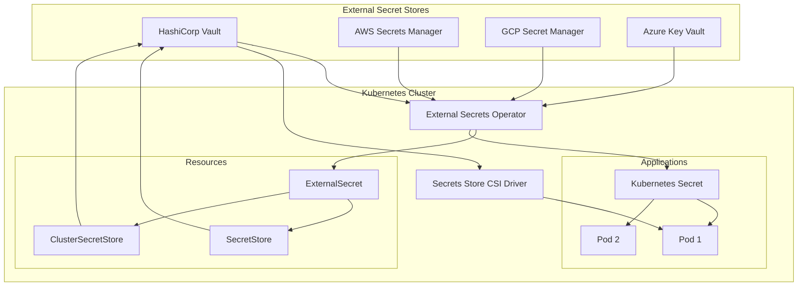

# Managing External Secrets with HashiCorp Vault and Helm

Author: [nawazdhandala](https://www.github.com/nawazdhandala)

Tags: Helm, Kubernetes, DevOps, Vault, Secrets Management, Security, External Secrets

Description: Complete guide to deploying HashiCorp Vault and External Secrets Operator using Helm charts for secure secrets management in Kubernetes.

> Secure secrets management is critical for production Kubernetes deployments. This guide covers deploying HashiCorp Vault and External Secrets Operator using Helm charts to centralize and secure your application secrets.

## Secrets Management Architecture



## Deploy HashiCorp Vault

### Add Helm Repository

```bash
helm repo add hashicorp https://helm.releases.hashicorp.com
helm repo update

# Search available versions
helm search repo hashicorp/vault --versions
```

### Install Vault in Dev Mode (Testing)

```yaml
# vault-dev-values.yaml
server:
  dev:
    enabled: true
    devRootToken: "root"

ui:
  enabled: true
  serviceType: LoadBalancer
```

```bash
helm install vault hashicorp/vault \
  --namespace vault \
  --create-namespace \
  -f vault-dev-values.yaml
```

### Install Vault in Production Mode

```yaml
# vault-production-values.yaml
global:
  enabled: true
  tlsDisable: false

injector:
  enabled: true
  replicas: 2
  
  resources:
    requests:
      cpu: 50m
      memory: 64Mi
    limits:
      cpu: 250m
      memory: 256Mi

server:
  enabled: true
  
  # Enterprise license
  enterpriseLicense:
    secretName: vault-license
    secretKey: license
    
  resources:
    requests:
      cpu: 500m
      memory: 256Mi
    limits:
      cpu: 2000m
      memory: 1Gi

  # High availability with Raft storage
  ha:
    enabled: true
    replicas: 3
    
    raft:
      enabled: true
      setNodeId: true
      
      config: |
        ui = true
        
        listener "tcp" {
          tls_disable = 0
          address = "[::]:8200"
          cluster_address = "[::]:8201"
          tls_cert_file = "/vault/userconfig/vault-tls/tls.crt"
          tls_key_file = "/vault/userconfig/vault-tls/tls.key"
          tls_client_ca_file = "/vault/userconfig/vault-tls/ca.crt"
        }
        
        storage "raft" {
          path = "/vault/data"
          
          retry_join {
            leader_api_addr = "https://vault-0.vault-internal:8200"
            leader_ca_cert_file = "/vault/userconfig/vault-tls/ca.crt"
            leader_client_cert_file = "/vault/userconfig/vault-tls/tls.crt"
            leader_client_key_file = "/vault/userconfig/vault-tls/tls.key"
          }
          
          retry_join {
            leader_api_addr = "https://vault-1.vault-internal:8200"
            leader_ca_cert_file = "/vault/userconfig/vault-tls/ca.crt"
            leader_client_cert_file = "/vault/userconfig/vault-tls/tls.crt"
            leader_client_key_file = "/vault/userconfig/vault-tls/tls.key"
          }
          
          retry_join {
            leader_api_addr = "https://vault-2.vault-internal:8200"
            leader_ca_cert_file = "/vault/userconfig/vault-tls/ca.crt"
            leader_client_cert_file = "/vault/userconfig/vault-tls/tls.crt"
            leader_client_key_file = "/vault/userconfig/vault-tls/tls.key"
          }
        }
        
        service_registration "kubernetes" {}
        
        seal "awskms" {
          region     = "us-east-1"
          kms_key_id = "alias/vault-unseal"
        }

  # Mount TLS certificates
  volumes:
    - name: vault-tls
      secret:
        secretName: vault-tls

  volumeMounts:
    - name: vault-tls
      mountPath: /vault/userconfig/vault-tls
      readOnly: true

  # Persistent storage
  dataStorage:
    enabled: true
    size: 10Gi
    storageClass: fast-ssd

  # Audit log storage
  auditStorage:
    enabled: true
    size: 10Gi
    storageClass: standard

  # Service account for auto-unseal
  serviceAccount:
    annotations:
      eks.amazonaws.com/role-arn: arn:aws:iam::123456789:role/vault-unseal

  # Ingress
  ingress:
    enabled: true
    annotations:
      kubernetes.io/ingress.class: nginx
      nginx.ingress.kubernetes.io/backend-protocol: "HTTPS"
    hosts:
      - host: vault.example.com
    tls:
      - secretName: vault-ingress-tls
        hosts:
          - vault.example.com

ui:
  enabled: true
```

```bash
helm install vault hashicorp/vault \
  --namespace vault \
  --create-namespace \
  -f vault-production-values.yaml
```

### Initialize Vault

```bash
# Initialize with key shares and threshold
kubectl exec -n vault vault-0 -- vault operator init \
  -key-shares=5 \
  -key-threshold=3 \
  -format=json > vault-keys.json

# Unseal each node (if not using auto-unseal)
UNSEAL_KEY_1=$(jq -r '.unseal_keys_b64[0]' vault-keys.json)
UNSEAL_KEY_2=$(jq -r '.unseal_keys_b64[1]' vault-keys.json)
UNSEAL_KEY_3=$(jq -r '.unseal_keys_b64[2]' vault-keys.json)

kubectl exec -n vault vault-0 -- vault operator unseal $UNSEAL_KEY_1
kubectl exec -n vault vault-0 -- vault operator unseal $UNSEAL_KEY_2
kubectl exec -n vault vault-0 -- vault operator unseal $UNSEAL_KEY_3

# Check status
kubectl exec -n vault vault-0 -- vault status
```

### Configure Vault for Kubernetes

```bash
# Login to Vault
ROOT_TOKEN=$(jq -r '.root_token' vault-keys.json)
kubectl exec -n vault vault-0 -- vault login $ROOT_TOKEN

# Enable Kubernetes auth
kubectl exec -n vault vault-0 -- vault auth enable kubernetes

# Configure Kubernetes auth
kubectl exec -n vault vault-0 -- vault write auth/kubernetes/config \
  kubernetes_host="https://kubernetes.default.svc:443"

# Enable KV secrets engine
kubectl exec -n vault vault-0 -- vault secrets enable -path=secret kv-v2

# Create a policy
kubectl exec -n vault vault-0 -- vault policy write app-policy - <<EOF
path "secret/data/app/*" {
  capabilities = ["read", "list"]
}
path "secret/data/shared/*" {
  capabilities = ["read", "list"]
}
EOF

# Create a role for applications
kubectl exec -n vault vault-0 -- vault write auth/kubernetes/role/app-role \
  bound_service_account_names=app-sa \
  bound_service_account_namespaces=default \
  policies=app-policy \
  ttl=1h
```

## External Secrets Operator

### Install External Secrets Operator

```bash
helm repo add external-secrets https://charts.external-secrets.io
helm repo update
```

```yaml
# external-secrets-values.yaml
replicaCount: 2

resources:
  requests:
    cpu: 50m
    memory: 128Mi
  limits:
    cpu: 200m
    memory: 256Mi

webhook:
  replicaCount: 2
  resources:
    requests:
      cpu: 50m
      memory: 64Mi
    limits:
      cpu: 100m
      memory: 128Mi

certController:
  replicaCount: 2
  resources:
    requests:
      cpu: 50m
      memory: 64Mi
    limits:
      cpu: 100m
      memory: 128Mi

serviceMonitor:
  enabled: true

# Process cluster-wide resources
installCRDs: true
```

```bash
helm install external-secrets external-secrets/external-secrets \
  --namespace external-secrets \
  --create-namespace \
  -f external-secrets-values.yaml
```

### Configure SecretStore for Vault

```yaml
# vault-secretstore.yaml
apiVersion: external-secrets.io/v1beta1
kind: SecretStore
metadata:
  name: vault-backend
  namespace: default
spec:
  provider:
    vault:
      server: "https://vault.vault.svc:8200"
      path: "secret"
      version: "v2"
      
      # Kubernetes auth
      auth:
        kubernetes:
          mountPath: "kubernetes"
          role: "app-role"
          serviceAccountRef:
            name: "app-sa"
            
      # TLS configuration
      caProvider:
        type: "Secret"
        name: "vault-ca"
        key: "ca.crt"
```

### ClusterSecretStore for Organization-Wide Access

```yaml
# vault-cluster-secretstore.yaml
apiVersion: external-secrets.io/v1beta1
kind: ClusterSecretStore
metadata:
  name: vault-cluster-store
spec:
  provider:
    vault:
      server: "https://vault.vault.svc:8200"
      path: "secret"
      version: "v2"
      
      auth:
        kubernetes:
          mountPath: "kubernetes"
          role: "cluster-role"
          serviceAccountRef:
            name: "external-secrets-sa"
            namespace: "external-secrets"
```

### Create ExternalSecret

```yaml
# external-secret.yaml
apiVersion: external-secrets.io/v1beta1
kind: ExternalSecret
metadata:
  name: app-secrets
  namespace: default
spec:
  refreshInterval: "1h"
  
  secretStoreRef:
    name: vault-backend
    kind: SecretStore
    
  target:
    name: app-secrets
    creationPolicy: Owner
    deletionPolicy: Retain
    
    template:
      type: Opaque
      data:
        # Template the secret data
        config.json: |
          {
            "database": {
              "host": "{{ .db_host }}",
              "password": "{{ .db_password }}"
            },
            "api_key": "{{ .api_key }}"
          }
          
  data:
    - secretKey: db_host
      remoteRef:
        key: secret/data/app/database
        property: host
        
    - secretKey: db_password
      remoteRef:
        key: secret/data/app/database
        property: password
        
    - secretKey: api_key
      remoteRef:
        key: secret/data/app/api
        property: key
```

### ExternalSecret with Multiple Sources

```yaml
# multi-source-secret.yaml
apiVersion: external-secrets.io/v1beta1
kind: ExternalSecret
metadata:
  name: multi-source-secrets
spec:
  refreshInterval: "30m"
  
  secretStoreRef:
    name: vault-backend
    kind: SecretStore
    
  target:
    name: app-config
    creationPolicy: Owner
    
  dataFrom:
    # Get all keys from a path
    - extract:
        key: secret/data/app/config
        
    # Find secrets matching pattern
    - find:
        path: secret/data/app/
        name:
          regexp: "^api-.*"
```

## AWS Secrets Manager Integration

### SecretStore for AWS

```yaml
# aws-secretstore.yaml
apiVersion: external-secrets.io/v1beta1
kind: SecretStore
metadata:
  name: aws-secrets
  namespace: default
spec:
  provider:
    aws:
      service: SecretsManager
      region: us-east-1
      
      # Use IRSA (IAM Roles for Service Accounts)
      auth:
        jwt:
          serviceAccountRef:
            name: external-secrets-sa
```

### ExternalSecret from AWS

```yaml
# aws-external-secret.yaml
apiVersion: external-secrets.io/v1beta1
kind: ExternalSecret
metadata:
  name: aws-secrets
spec:
  refreshInterval: "1h"
  
  secretStoreRef:
    name: aws-secrets
    kind: SecretStore
    
  target:
    name: app-aws-secrets
    
  data:
    - secretKey: db_password
      remoteRef:
        key: prod/database/credentials
        property: password
        
    - secretKey: api_key
      remoteRef:
        key: prod/api/keys
        property: primary_key
```

## Vault Agent Injector

### Inject Secrets as Files

```yaml
# deployment-with-vault-agent.yaml
apiVersion: apps/v1
kind: Deployment
metadata:
  name: app
spec:
  template:
    metadata:
      annotations:
        # Enable Vault Agent injection
        vault.hashicorp.com/agent-inject: "true"
        vault.hashicorp.com/role: "app-role"
        
        # Inject secrets as files
        vault.hashicorp.com/agent-inject-secret-config: "secret/data/app/config"
        vault.hashicorp.com/agent-inject-template-config: |
          {{- with secret "secret/data/app/config" -}}
          {
            "database": {
              "host": "{{ .Data.data.db_host }}",
              "password": "{{ .Data.data.db_password }}"
            }
          }
          {{- end }}
          
        # Additional secret
        vault.hashicorp.com/agent-inject-secret-api-key: "secret/data/app/api"
        vault.hashicorp.com/agent-inject-template-api-key: |
          {{- with secret "secret/data/app/api" -}}
          {{ .Data.data.key }}
          {{- end }}
          
    spec:
      serviceAccountName: app-sa
      containers:
        - name: app
          image: my-app:latest
          # Secrets are mounted at /vault/secrets/
          volumeMounts:
            - name: config
              mountPath: /app/config
              readOnly: true
```

### Inject Secrets as Environment Variables

```yaml
# deployment-env-injection.yaml
apiVersion: apps/v1
kind: Deployment
metadata:
  name: app
spec:
  template:
    metadata:
      annotations:
        vault.hashicorp.com/agent-inject: "true"
        vault.hashicorp.com/role: "app-role"
        vault.hashicorp.com/agent-inject-secret-env: "secret/data/app/env"
        vault.hashicorp.com/agent-inject-template-env: |
          {{- with secret "secret/data/app/env" -}}
          export DB_HOST="{{ .Data.data.db_host }}"
          export DB_PASSWORD="{{ .Data.data.db_password }}"
          export API_KEY="{{ .Data.data.api_key }}"
          {{- end }}
          
    spec:
      serviceAccountName: app-sa
      containers:
        - name: app
          image: my-app:latest
          command:
            - /bin/sh
            - -c
            - source /vault/secrets/env && exec /app/start.sh
```

## Secrets Store CSI Driver

### Install CSI Driver

```bash
helm repo add secrets-store-csi-driver https://kubernetes-sigs.github.io/secrets-store-csi-driver/charts
helm repo update
```

```yaml
# secrets-store-csi-driver-values.yaml
syncSecret:
  enabled: true

enableSecretRotation: true
rotationPollInterval: "2m"

resources:
  requests:
    cpu: 50m
    memory: 64Mi
  limits:
    cpu: 100m
    memory: 128Mi
```

```bash
helm install csi-secrets-store secrets-store-csi-driver/secrets-store-csi-driver \
  --namespace kube-system \
  -f secrets-store-csi-driver-values.yaml
```

### Install Vault Provider

```bash
helm install vault-provider hashicorp/vault \
  --namespace vault \
  --set "csi.enabled=true" \
  --set "injector.enabled=false" \
  --set "server.enabled=false"
```

### SecretProviderClass

```yaml
# secret-provider-class.yaml
apiVersion: secrets-store.csi.x-k8s.io/v1
kind: SecretProviderClass
metadata:
  name: vault-secrets
spec:
  provider: vault
  
  parameters:
    vaultAddress: "https://vault.vault.svc:8200"
    roleName: "app-role"
    
    objects: |
      - objectName: "db-password"
        secretPath: "secret/data/app/database"
        secretKey: "password"
      - objectName: "api-key"
        secretPath: "secret/data/app/api"
        secretKey: "key"
        
  # Sync to Kubernetes Secret
  secretObjects:
    - secretName: app-secrets-synced
      type: Opaque
      data:
        - objectName: db-password
          key: DB_PASSWORD
        - objectName: api-key
          key: API_KEY
```

### Mount Secrets via CSI

```yaml
# deployment-csi.yaml
apiVersion: apps/v1
kind: Deployment
metadata:
  name: app
spec:
  template:
    spec:
      serviceAccountName: app-sa
      containers:
        - name: app
          image: my-app:latest
          
          # Reference synced secret
          envFrom:
            - secretRef:
                name: app-secrets-synced
                
          volumeMounts:
            - name: secrets
              mountPath: /secrets
              readOnly: true
              
      volumes:
        - name: secrets
          csi:
            driver: secrets-store.csi.k8s.io
            readOnly: true
            volumeAttributes:
              secretProviderClass: vault-secrets
```

## Helm Chart with Secrets

### Values with Secret References

```yaml
# values.yaml
secrets:
  enabled: true
  
  vault:
    enabled: true
    path: "secret/data/{{ .Release.Namespace }}/app"
    refreshInterval: "1h"
    
  aws:
    enabled: false
    region: "us-east-1"
    secretName: "prod/app/config"
    
  keys:
    - name: DATABASE_URL
      vaultKey: database_url
    - name: API_KEY
      vaultKey: api_key
    - name: JWT_SECRET
      vaultKey: jwt_secret
```

### External Secret Template

```yaml
# templates/external-secret.yaml
{{- if .Values.secrets.enabled }}
{{- if .Values.secrets.vault.enabled }}
apiVersion: external-secrets.io/v1beta1
kind: ExternalSecret
metadata:
  name: {{ include "app.fullname" . }}
spec:
  refreshInterval: {{ .Values.secrets.vault.refreshInterval }}
  
  secretStoreRef:
    name: vault-backend
    kind: ClusterSecretStore
    
  target:
    name: {{ include "app.fullname" . }}-secrets
    creationPolicy: Owner
    
  data:
    {{- range .Values.secrets.keys }}
    - secretKey: {{ .name }}
      remoteRef:
        key: {{ $.Values.secrets.vault.path }}
        property: {{ .vaultKey }}
    {{- end }}
{{- end }}
{{- end }}
```

## Monitoring and Alerts

### Prometheus Rules

```yaml
# secrets-prometheus-rules.yaml
apiVersion: monitoring.coreos.com/v1
kind: PrometheusRule
metadata:
  name: external-secrets-alerts
spec:
  groups:
    - name: external-secrets
      rules:
        - alert: ExternalSecretSyncFailed
          expr: |
            externalsecret_status_condition{condition="Ready", status="False"} == 1
          for: 5m
          labels:
            severity: critical
          annotations:
            summary: "ExternalSecret sync failed"
            
        - alert: VaultUnsealed
          expr: |
            vault_core_unsealed == 0
          for: 1m
          labels:
            severity: critical
          annotations:
            summary: "Vault is sealed"
```

## Troubleshooting

```bash
# Check External Secrets Operator
kubectl get pods -n external-secrets

# Check ExternalSecret status
kubectl get externalsecrets
kubectl describe externalsecret app-secrets

# Check generated secrets
kubectl get secrets

# Check Vault status
kubectl exec -n vault vault-0 -- vault status

# Check Vault logs
kubectl logs -n vault vault-0

# Check Agent Injector logs
kubectl logs -n vault -l app.kubernetes.io/name=vault-agent-injector

# Debug External Secrets
kubectl logs -n external-secrets -l app.kubernetes.io/name=external-secrets
```

## Wrap-up

Secure secrets management requires a combination of external secret stores and Kubernetes integration. Use HashiCorp Vault for centralized secrets management, External Secrets Operator for syncing secrets to Kubernetes, and choose between Vault Agent Injector or CSI Driver based on your use case. Always enable audit logging, implement proper RBAC, and rotate secrets regularly.
