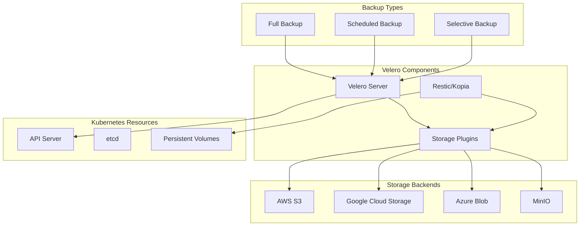

# Kubernetes Backup and Restore with Helm and Velero

Author: [nawazdhandala](https://www.github.com/nawazdhandala)

Tags: Helm, Kubernetes, DevOps, Velero, Backup, Disaster Recovery, Data Protection

Description: Complete guide to deploying Velero with Helm for Kubernetes backup and disaster recovery across clusters and cloud providers.

> Velero is the industry-standard tool for Kubernetes backup and restore operations. This guide covers deploying Velero with Helm, configuring backup strategies, and implementing disaster recovery procedures.

## Velero Architecture



## Installing Velero

### Add Helm Repository

```bash
# Add VMware Tanzu Helm repository
helm repo add vmware-tanzu https://vmware-tanzu.github.io/helm-charts
helm repo update

# Create namespace
kubectl create namespace velero
```

### AWS S3 Backend

```yaml
# velero-aws-values.yaml
configuration:
  backupStorageLocation:
    - name: default
      provider: aws
      bucket: my-velero-backups
      config:
        region: us-east-1
        s3ForcePathStyle: "false"
        
  volumeSnapshotLocation:
    - name: default
      provider: aws
      config:
        region: us-east-1
        
  defaultBackupStorageLocation: default
  defaultVolumeSnapshotLocations: aws:default

credentials:
  useSecret: true
  secretContents:
    cloud: |
      [default]
      aws_access_key_id=YOUR_ACCESS_KEY
      aws_secret_access_key=YOUR_SECRET_KEY

initContainers:
  - name: velero-plugin-for-aws
    image: velero/velero-plugin-for-aws:v1.8.0
    volumeMounts:
      - mountPath: /target
        name: plugins

# Enable restic for PV backup
deployNodeAgent: true
nodeAgent:
  podVolumePath: /var/lib/kubelet/pods
  privileged: true
  resources:
    requests:
      cpu: 500m
      memory: 512Mi
    limits:
      cpu: 1000m
      memory: 1Gi

# Velero server resources
resources:
  requests:
    cpu: 500m
    memory: 128Mi
  limits:
    cpu: 1000m
    memory: 512Mi

# Enable metrics
metrics:
  enabled: true
  serviceMonitor:
    enabled: true
```

```bash
# Install Velero with AWS configuration
helm install velero vmware-tanzu/velero \
  --namespace velero \
  -f velero-aws-values.yaml
```

### GCP Backend

```yaml
# velero-gcp-values.yaml
configuration:
  backupStorageLocation:
    - name: default
      provider: gcp
      bucket: my-velero-backups
      config:
        serviceAccount: velero@project-id.iam.gserviceaccount.com
        
  volumeSnapshotLocation:
    - name: default
      provider: gcp
      config:
        project: your-project-id

credentials:
  useSecret: true
  secretContents:
    cloud: |
      {
        "type": "service_account",
        "project_id": "your-project-id",
        ...
      }

initContainers:
  - name: velero-plugin-for-gcp
    image: velero/velero-plugin-for-gcp:v1.8.0
    volumeMounts:
      - mountPath: /target
        name: plugins

deployNodeAgent: true
```

### Azure Backend

```yaml
# velero-azure-values.yaml
configuration:
  backupStorageLocation:
    - name: default
      provider: azure
      bucket: velero
      config:
        resourceGroup: velero-backups
        storageAccount: velerobackups
        subscriptionId: YOUR_SUBSCRIPTION_ID
        
  volumeSnapshotLocation:
    - name: default
      provider: azure
      config:
        resourceGroup: velero-backups
        subscriptionId: YOUR_SUBSCRIPTION_ID

credentials:
  useSecret: true
  secretContents:
    cloud: |
      AZURE_SUBSCRIPTION_ID=YOUR_SUBSCRIPTION_ID
      AZURE_TENANT_ID=YOUR_TENANT_ID
      AZURE_CLIENT_ID=YOUR_CLIENT_ID
      AZURE_CLIENT_SECRET=YOUR_CLIENT_SECRET
      AZURE_RESOURCE_GROUP=velero-backups
      AZURE_CLOUD_NAME=AzurePublicCloud

initContainers:
  - name: velero-plugin-for-microsoft-azure
    image: velero/velero-plugin-for-microsoft-azure:v1.8.0
    volumeMounts:
      - mountPath: /target
        name: plugins

deployNodeAgent: true
```

### MinIO Backend (On-Premises)

```yaml
# velero-minio-values.yaml
configuration:
  backupStorageLocation:
    - name: default
      provider: aws
      bucket: velero
      config:
        region: minio
        s3ForcePathStyle: "true"
        s3Url: http://minio.minio.svc:9000
        publicUrl: https://minio.example.com
        
credentials:
  useSecret: true
  secretContents:
    cloud: |
      [default]
      aws_access_key_id=minio-access-key
      aws_secret_access_key=minio-secret-key

initContainers:
  - name: velero-plugin-for-aws
    image: velero/velero-plugin-for-aws:v1.8.0
    volumeMounts:
      - mountPath: /target
        name: plugins

deployNodeAgent: true
```

## Production Configuration

```yaml
# velero-production-values.yaml
configuration:
  backupStorageLocation:
    - name: primary
      provider: aws
      bucket: velero-backups-primary
      default: true
      config:
        region: us-east-1
        serverSideEncryption: AES256
    - name: secondary
      provider: aws
      bucket: velero-backups-secondary
      config:
        region: us-west-2
        serverSideEncryption: AES256
        
  volumeSnapshotLocation:
    - name: primary
      provider: aws
      config:
        region: us-east-1
    - name: secondary
      provider: aws
      config:
        region: us-west-2

  # Feature flags
  features: EnableCSI

  # Garbage collection
  garbageCollectionFrequency: 1h

  # Log level
  logLevel: info

# Use IRSA for AWS
serviceAccount:
  server:
    create: true
    annotations:
      eks.amazonaws.com/role-arn: arn:aws:iam::123456789012:role/velero

credentials:
  useSecret: false  # Using IRSA instead

# High availability
replicaCount: 2

# Pod disruption budget
podDisruptionBudget:
  minAvailable: 1

# Resources
resources:
  requests:
    cpu: 500m
    memory: 256Mi
  limits:
    cpu: 1000m
    memory: 1Gi

# Node agent (restic/kopia)
deployNodeAgent: true
nodeAgent:
  podVolumePath: /var/lib/kubelet/pods
  privileged: true
  tolerations:
    - operator: Exists
  resources:
    requests:
      cpu: 500m
      memory: 512Mi
    limits:
      cpu: 2000m
      memory: 2Gi

# Plugins
initContainers:
  - name: velero-plugin-for-aws
    image: velero/velero-plugin-for-aws:v1.8.0
    volumeMounts:
      - mountPath: /target
        name: plugins
  - name: velero-plugin-for-csi
    image: velero/velero-plugin-for-csi:v0.6.0
    volumeMounts:
      - mountPath: /target
        name: plugins

# Metrics
metrics:
  enabled: true
  serviceMonitor:
    enabled: true
    additionalLabels:
      release: prometheus

# Schedules (defined in separate resources)
schedules: {}
```

## Backup Strategies

### Full Cluster Backup

```yaml
# full-backup.yaml
apiVersion: velero.io/v1
kind: Backup
metadata:
  name: full-cluster-backup
  namespace: velero
spec:
  # Include all namespaces
  includedNamespaces:
    - "*"
    
  # Exclude system namespaces
  excludedNamespaces:
    - kube-system
    - kube-public
    - kube-node-lease
    - velero
    
  # Include all resources
  includedResources:
    - "*"
    
  # Exclude certain resources
  excludedResources:
    - events
    - events.events.k8s.io
    
  # Include cluster-scoped resources
  includeClusterResources: true
  
  # Storage location
  storageLocation: primary
  
  # Volume snapshot location
  volumeSnapshotLocations:
    - primary
    
  # Snapshot PVs
  snapshotVolumes: true
  
  # TTL - keep for 30 days
  ttl: 720h
  
  # Labels
  labels:
    backup-type: full
    
  # Hooks
  hooks:
    resources:
      - name: database-backup-hook
        includedNamespaces:
          - databases
        labelSelector:
          matchLabels:
            app: postgresql
        pre:
          - exec:
              container: postgresql
              command:
                - /bin/bash
                - -c
                - pg_dump -U postgres mydb > /backup/pre-backup.sql
              onError: Fail
              timeout: 5m
```

### Scheduled Backups

```yaml
# scheduled-backups.yaml
apiVersion: velero.io/v1
kind: Schedule
metadata:
  name: daily-backup
  namespace: velero
spec:
  schedule: "0 2 * * *"  # Daily at 2 AM
  template:
    includedNamespaces:
      - "*"
    excludedNamespaces:
      - kube-system
      - velero
    includeClusterResources: true
    snapshotVolumes: true
    storageLocation: primary
    volumeSnapshotLocations:
      - primary
    ttl: 168h  # Keep for 7 days
    
---
apiVersion: velero.io/v1
kind: Schedule
metadata:
  name: weekly-backup
  namespace: velero
spec:
  schedule: "0 3 * * 0"  # Weekly on Sunday at 3 AM
  template:
    includedNamespaces:
      - "*"
    excludedNamespaces:
      - kube-system
      - velero
    includeClusterResources: true
    snapshotVolumes: true
    storageLocation: primary
    volumeSnapshotLocations:
      - primary
    ttl: 720h  # Keep for 30 days
    
---
apiVersion: velero.io/v1
kind: Schedule
metadata:
  name: hourly-critical
  namespace: velero
spec:
  schedule: "0 * * * *"  # Every hour
  template:
    includedNamespaces:
      - production
      - critical-apps
    includeClusterResources: false
    snapshotVolumes: true
    storageLocation: primary
    ttl: 72h  # Keep for 3 days
```

### Namespace Backup

```yaml
# namespace-backup.yaml
apiVersion: velero.io/v1
kind: Backup
metadata:
  name: production-backup
  namespace: velero
spec:
  includedNamespaces:
    - production
    
  # Include specific resources
  includedResources:
    - deployments
    - services
    - configmaps
    - secrets
    - persistentvolumeclaims
    - ingresses
    
  includeClusterResources: false
  snapshotVolumes: true
  storageLocation: primary
  ttl: 168h
```

### Label-Based Backup

```yaml
# label-backup.yaml
apiVersion: velero.io/v1
kind: Backup
metadata:
  name: critical-apps-backup
  namespace: velero
spec:
  labelSelector:
    matchLabels:
      backup: critical
      
  includedNamespaces:
    - "*"
    
  snapshotVolumes: true
  storageLocation: primary
  ttl: 168h
```

## Restore Operations

### Full Restore

```yaml
# full-restore.yaml
apiVersion: velero.io/v1
kind: Restore
metadata:
  name: full-restore
  namespace: velero
spec:
  backupName: full-cluster-backup
  
  # Include all namespaces from backup
  includedNamespaces:
    - "*"
    
  # Restore cluster-scoped resources
  includeClusterResources: true
  
  # Restore PVs
  restorePVs: true
  
  # Preserve node ports
  preserveNodePorts: true
  
  # Existing resource policy
  existingResourcePolicy: update
```

### Selective Restore

```yaml
# selective-restore.yaml
apiVersion: velero.io/v1
kind: Restore
metadata:
  name: namespace-restore
  namespace: velero
spec:
  backupName: daily-backup-20240117120000
  
  # Restore specific namespace
  includedNamespaces:
    - production
    
  # Restore specific resources
  includedResources:
    - deployments
    - services
    - configmaps
    
  # Skip existing resources
  existingResourcePolicy: none
  
  # Namespace mapping (restore to different namespace)
  namespaceMapping:
    production: production-restored
```

### Restore with Transformations

```yaml
# restore-with-hooks.yaml
apiVersion: velero.io/v1
kind: Restore
metadata:
  name: restore-with-hooks
  namespace: velero
spec:
  backupName: daily-backup-20240117120000
  
  includedNamespaces:
    - databases
    
  # Post-restore hooks
  hooks:
    resources:
      - name: database-restore-hook
        includedNamespaces:
          - databases
        labelSelector:
          matchLabels:
            app: postgresql
        postHooks:
          - init:
              initContainers:
                - name: restore-data
                  image: postgres:15
                  command:
                    - /bin/bash
                    - -c
                    - |
                      until pg_isready -h localhost; do sleep 2; done
                      psql -U postgres -c "VACUUM ANALYZE;"
```

## Cross-Cluster Migration

### Source Cluster Backup

```bash
# Create backup on source cluster
velero backup create migration-backup \
  --include-namespaces production \
  --include-cluster-resources=true \
  --snapshot-volumes \
  --storage-location primary

# Wait for backup to complete
velero backup describe migration-backup --details
```

### Target Cluster Restore

```bash
# On target cluster, ensure same storage location is configured
# Then restore
velero restore create migration-restore \
  --from-backup migration-backup \
  --include-namespaces production \
  --restore-volumes

# Monitor restore progress
velero restore describe migration-restore --details
```

## Helm Integration

### Backup Before Helm Upgrade

```yaml
# pre-upgrade-backup.yaml
apiVersion: velero.io/v1
kind: Backup
metadata:
  name: pre-upgrade-{{ .Release.Name }}
  namespace: velero
  annotations:
    helm.sh/hook: pre-upgrade
    helm.sh/hook-weight: "-10"
    helm.sh/hook-delete-policy: before-hook-creation
spec:
  includedNamespaces:
    - {{ .Release.Namespace }}
  labelSelector:
    matchLabels:
      app.kubernetes.io/instance: {{ .Release.Name }}
  snapshotVolumes: true
  storageLocation: primary
  ttl: 168h
```

### Backup Schedule in Chart

```yaml
# templates/velero-schedule.yaml
{{- if .Values.backup.enabled }}
apiVersion: velero.io/v1
kind: Schedule
metadata:
  name: {{ include "myapp.fullname" . }}-backup
  namespace: velero
spec:
  schedule: {{ .Values.backup.schedule | quote }}
  template:
    includedNamespaces:
      - {{ .Release.Namespace }}
    labelSelector:
      matchLabels:
        {{- include "myapp.selectorLabels" . | nindent 8 }}
    snapshotVolumes: {{ .Values.backup.snapshotVolumes }}
    storageLocation: {{ .Values.backup.storageLocation }}
    ttl: {{ .Values.backup.ttl }}
{{- end }}
```

## Monitoring

### Prometheus Alerts

```yaml
# velero-alerts.yaml
apiVersion: monitoring.coreos.com/v1
kind: PrometheusRule
metadata:
  name: velero-alerts
  namespace: monitoring
spec:
  groups:
    - name: velero
      rules:
        - alert: VeleroBackupFailed
          expr: |
            increase(velero_backup_failure_total[1h]) > 0
          for: 1m
          labels:
            severity: critical
          annotations:
            summary: Velero backup failed
            description: A Velero backup has failed in the last hour
            
        - alert: VeleroBackupPartiallyFailed
          expr: |
            increase(velero_backup_partial_failure_total[1h]) > 0
          for: 1m
          labels:
            severity: warning
          annotations:
            summary: Velero backup partially failed
            
        - alert: VeleroNoRecentBackup
          expr: |
            time() - velero_backup_last_successful_timestamp > 86400
          for: 1h
          labels:
            severity: warning
          annotations:
            summary: No successful backup in 24 hours
```

### Grafana Dashboard

```json
{
  "title": "Velero Backups",
  "panels": [
    {
      "title": "Backup Success Rate",
      "type": "stat",
      "targets": [
        {
          "expr": "sum(velero_backup_success_total) / sum(velero_backup_attempt_total) * 100"
        }
      ]
    },
    {
      "title": "Backup Duration",
      "type": "graph",
      "targets": [
        {
          "expr": "velero_backup_duration_seconds"
        }
      ]
    }
  ]
}
```

## Troubleshooting

```bash
# Check Velero status
velero version
kubectl get pods -n velero

# List all backups
velero backup get

# Describe backup
velero backup describe my-backup --details

# View backup logs
velero backup logs my-backup

# List restores
velero restore get

# Describe restore
velero restore describe my-restore --details

# View restore logs
velero restore logs my-restore

# Check backup storage location
velero backup-location get

# Debug storage connection
kubectl logs -n velero -l app.kubernetes.io/name=velero

# Check volume snapshots
kubectl get volumesnapshots -A
kubectl get volumesnapshotcontents
```

## Wrap-up

Velero provides comprehensive backup and disaster recovery capabilities for Kubernetes clusters. Use Helm to deploy Velero with appropriate storage backends, configure scheduled backups for data protection, and implement restore procedures for disaster recovery scenarios. Integrate with monitoring to ensure backup health and reliability.
