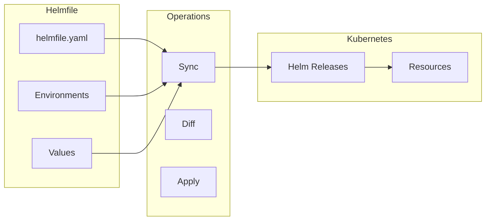

# Managing Multiple Helm Releases with Helmfile

Author: [nawazdhandala](https://www.github.com/nawazdhandala)

Tags: Helm, Kubernetes, DevOps, Helmfile, GitOps, Multi-Environment

Description: Learn how to manage multiple Helm releases declaratively using Helmfile for consistent, repeatable deployments across environments.

> Managing many Helm releases with individual commands becomes unwieldy. Helmfile provides a declarative approach to manage multiple releases, environments, and values in a single file, making deployments consistent and reproducible.

## What is Helmfile?

Helmfile is a declarative spec for deploying Helm charts. It lets you:

- Define multiple releases in one file
- Manage environment-specific values
- Apply releases in order with dependencies
- Sync, diff, and apply changes atomically



## Install Helmfile

```bash
# macOS
brew install helmfile

# Linux
curl -LO https://github.com/helmfile/helmfile/releases/download/v0.158.0/helmfile_0.158.0_linux_amd64.tar.gz
tar xzf helmfile_0.158.0_linux_amd64.tar.gz
sudo mv helmfile /usr/local/bin/

# Verify installation
helmfile version
```

## Basic Helmfile Structure

Create a `helmfile.yaml` in your project root:

```yaml
# helmfile.yaml
repositories:
  - name: bitnami
    url: https://charts.bitnami.com/bitnami
  - name: prometheus-community
    url: https://prometheus-community.github.io/helm-charts

releases:
  - name: redis
    namespace: cache
    chart: bitnami/redis
    version: 18.0.0
    values:
      - redis-values.yaml

  - name: postgresql
    namespace: database
    chart: bitnami/postgresql
    version: 13.0.0
    values:
      - postgresql-values.yaml
```

### Values File

```yaml
# redis-values.yaml
auth:
  enabled: true
  password: "secret"

master:
  persistence:
    size: 10Gi

replica:
  replicaCount: 2
```

## Common Commands

```bash
# Install helm-diff plugin (required for diff/apply)
helm plugin install https://github.com/databus23/helm-diff

# Sync all releases (install/upgrade)
helmfile sync

# Show diff before applying
helmfile diff

# Apply changes (diff + sync)
helmfile apply

# List releases
helmfile list

# Destroy all releases
helmfile destroy

# Template all releases
helmfile template

# Lint all releases
helmfile lint
```

## Environment Management

Define environments for different configurations.

### Environment Definition

```yaml
# helmfile.yaml
environments:
  development:
    values:
      - environments/development/values.yaml
  staging:
    values:
      - environments/staging/values.yaml
  production:
    values:
      - environments/production/values.yaml

releases:
  - name: my-app
    namespace: {{ .Environment.Name }}
    chart: ./charts/my-app
    values:
      - values/{{ .Environment.Name }}/my-app.yaml
```

### Environment Values

```yaml
# environments/development/values.yaml
replicaCount: 1
imageTag: latest
resources:
  limits:
    cpu: 500m
    memory: 256Mi

# environments/production/values.yaml
replicaCount: 5
imageTag: v1.0.0
resources:
  limits:
    cpu: 2000m
    memory: 2Gi
```

### Use Environment

```bash
# Deploy to development
helmfile -e development sync

# Deploy to production
helmfile -e production sync

# Diff for staging
helmfile -e staging diff
```

## Release Conditions and Selectors

### Conditional Releases

```yaml
releases:
  - name: redis
    namespace: cache
    chart: bitnami/redis
    # Only install if condition is true
    condition: redis.enabled
    values:
      - redis-values.yaml

  - name: monitoring
    namespace: monitoring
    chart: prometheus-community/kube-prometheus-stack
    # Install only in production
    installed: {{ eq .Environment.Name "production" }}
```

### Environment Values for Conditions

```yaml
# environments/development/values.yaml
redis:
  enabled: true

monitoring:
  enabled: false

# environments/production/values.yaml
redis:
  enabled: true

monitoring:
  enabled: true
```

### Label Selectors

```yaml
releases:
  - name: redis
    namespace: cache
    chart: bitnami/redis
    labels:
      tier: backend
      app: cache

  - name: nginx
    namespace: frontend
    chart: bitnami/nginx
    labels:
      tier: frontend
      app: web

  - name: prometheus
    namespace: monitoring
    chart: prometheus-community/prometheus
    labels:
      tier: monitoring
```

Use selectors to target specific releases:

```bash
# Sync only backend tier
helmfile -l tier=backend sync

# Sync specific app
helmfile -l app=cache sync

# Combine selectors
helmfile -l tier=backend -l app=cache diff
```

## Release Dependencies

Control the order of release installation.

```yaml
releases:
  - name: postgresql
    namespace: database
    chart: bitnami/postgresql
    values:
      - postgresql-values.yaml

  - name: my-app
    namespace: app
    chart: ./charts/my-app
    # Wait for postgresql before installing
    needs:
      - database/postgresql
    values:
      - my-app-values.yaml

  - name: api-gateway
    namespace: gateway
    chart: ./charts/api-gateway
    # Depends on my-app
    needs:
      - app/my-app
    values:
      - api-gateway-values.yaml
```

## Layered Values

Combine multiple values files with precedence.

```yaml
releases:
  - name: my-app
    namespace: app
    chart: ./charts/my-app
    values:
      # Base values (lowest priority)
      - values/base.yaml
      # Environment-specific overrides
      - values/{{ .Environment.Name }}.yaml
      # Secret values (highest priority)
      - values/secrets.yaml
      # Inline values (highest priority)
      - replicaCount: {{ .Values.replicaCount | default 1 }}
```

### Values File Hierarchy

```yaml
# values/base.yaml
replicaCount: 1
image:
  repository: myapp
  tag: latest
resources:
  requests:
    cpu: 100m
    memory: 128Mi

# values/production.yaml
replicaCount: 5
image:
  tag: v1.0.0
resources:
  requests:
    cpu: 500m
    memory: 512Mi
  limits:
    cpu: 2000m
    memory: 2Gi
```

## Templating in Helmfile

Helmfile supports Go templating.

### Template Functions

```yaml
releases:
  - name: my-app-{{ .Environment.Name }}
    namespace: {{ .Environment.Name | default "default" }}
    chart: ./charts/my-app
    version: {{ .Values.chartVersion | default "1.0.0" }}
    values:
      - image:
          tag: {{ requiredEnv "IMAGE_TAG" }}
      - config:
          environment: {{ .Environment.Name | upper }}
          debug: {{ eq .Environment.Name "development" }}
```

### Conditional Blocks

```yaml
releases:
  - name: my-app
    namespace: app
    chart: ./charts/my-app
    {{- if eq .Environment.Name "production" }}
    values:
      - replicaCount: 5
      - autoscaling:
          enabled: true
          minReplicas: 3
          maxReplicas: 10
    {{- else }}
    values:
      - replicaCount: 1
      - autoscaling:
          enabled: false
    {{- end }}
```

## Secrets Management

### Using SOPS

Integrate with SOPS for encrypted secrets.

```yaml
# helmfile.yaml
releases:
  - name: my-app
    namespace: app
    chart: ./charts/my-app
    secrets:
      # Automatically decrypted by helmfile
      - secrets/{{ .Environment.Name }}/secrets.yaml
    values:
      - values/{{ .Environment.Name }}.yaml
```

Install helm-secrets plugin:

```bash
helm plugin install https://github.com/jkroepke/helm-secrets
```

### Environment Variables

```yaml
releases:
  - name: my-app
    namespace: app
    chart: ./charts/my-app
    values:
      - database:
          password: {{ requiredEnv "DB_PASSWORD" }}
        api:
          key: {{ env "API_KEY" | default "dev-key" }}
```

## Hooks

Run commands before or after releases.

```yaml
releases:
  - name: my-app
    namespace: app
    chart: ./charts/my-app
    hooks:
      - events: ["presync"]
        showlogs: true
        command: "kubectl"
        args:
          - "create"
          - "namespace"
          - "app"
          - "--dry-run=client"
          - "-o"
          - "yaml"
          - "|"
          - "kubectl"
          - "apply"
          - "-f"
          - "-"
      
      - events: ["postsync"]
        showlogs: true
        command: "./scripts/post-deploy.sh"
        args:
          - "{{ .Environment.Name }}"
```

## Multi-File Organization

Split large helmfiles into multiple files.

### Directory Structure

```
helmfile/
├── helmfile.yaml       # Main file
├── releases/
│   ├── databases.yaml
│   ├── applications.yaml
│   └── monitoring.yaml
├── values/
│   ├── base/
│   ├── development/
│   ├── staging/
│   └── production/
└── environments/
    ├── development.yaml
    ├── staging.yaml
    └── production.yaml
```

### Main Helmfile

```yaml
# helmfile.yaml
environments:
  development:
    values:
      - environments/development.yaml
  staging:
    values:
      - environments/staging.yaml
  production:
    values:
      - environments/production.yaml

helmfiles:
  - path: releases/databases.yaml
  - path: releases/applications.yaml
  - path: releases/monitoring.yaml
    selectors:
      - tier=monitoring
```

### Sub-Helmfiles

```yaml
# releases/databases.yaml
repositories:
  - name: bitnami
    url: https://charts.bitnami.com/bitnami

releases:
  - name: postgresql
    namespace: database
    chart: bitnami/postgresql
    version: 13.0.0
    labels:
      tier: database
    values:
      - ../values/{{ .Environment.Name }}/postgresql.yaml

  - name: redis
    namespace: database
    chart: bitnami/redis
    version: 18.0.0
    labels:
      tier: database
    values:
      - ../values/{{ .Environment.Name }}/redis.yaml
```

```yaml
# releases/applications.yaml
releases:
  - name: frontend
    namespace: app
    chart: ./charts/frontend
    labels:
      tier: frontend
    needs:
      - database/redis
    values:
      - ../values/{{ .Environment.Name }}/frontend.yaml

  - name: backend
    namespace: app
    chart: ./charts/backend
    labels:
      tier: backend
    needs:
      - database/postgresql
      - database/redis
    values:
      - ../values/{{ .Environment.Name }}/backend.yaml
```

## OCI Registry Support

Use OCI registries for charts:

```yaml
repositories:
  - name: myregistry
    url: ghcr.io/myorg/charts
    oci: true

releases:
  - name: my-app
    namespace: app
    chart: myregistry/my-app
    version: 1.0.0
```

## State Management

Helmfile can manage state files for tracking releases.

```yaml
# helmfile.yaml
helmDefaults:
  # Enable state management
  createNamespace: true
  wait: true
  timeout: 600
  
  # Atomic operations
  atomic: true
```

## CI/CD Integration

### GitHub Actions

```yaml
# .github/workflows/deploy.yml
name: Deploy with Helmfile

on:
  push:
    branches: [main]

jobs:
  deploy:
    runs-on: ubuntu-latest
    steps:
      - uses: actions/checkout@v4
      
      - name: Install Helmfile
        run: |
          curl -LO https://github.com/helmfile/helmfile/releases/download/v0.158.0/helmfile_0.158.0_linux_amd64.tar.gz
          tar xzf helmfile_0.158.0_linux_amd64.tar.gz
          sudo mv helmfile /usr/local/bin/
          
      - name: Install helm-diff
        run: helm plugin install https://github.com/databus23/helm-diff
        
      - name: Configure kubectl
        run: |
          echo "${{ secrets.KUBECONFIG }}" | base64 -d > kubeconfig
          export KUBECONFIG=kubeconfig
          
      - name: Diff
        run: helmfile -e production diff
        
      - name: Apply
        run: helmfile -e production apply
```

### GitLab CI

```yaml
# .gitlab-ci.yml
deploy:
  stage: deploy
  image: alpine:latest
  before_script:
    - apk add --no-cache curl bash
    - curl -LO https://github.com/helmfile/helmfile/releases/download/v0.158.0/helmfile_0.158.0_linux_amd64.tar.gz
    - tar xzf helmfile_0.158.0_linux_amd64.tar.gz
    - mv helmfile /usr/local/bin/
    - helm plugin install https://github.com/databus23/helm-diff
  script:
    - helmfile -e ${CI_ENVIRONMENT_NAME} apply
  environment:
    name: production
```

## Complete Example

```yaml
# helmfile.yaml
environments:
  development:
    values:
      - replicaCount: 1
      - domain: dev.example.com
  staging:
    values:
      - replicaCount: 2
      - domain: staging.example.com
  production:
    values:
      - replicaCount: 5
      - domain: example.com

repositories:
  - name: bitnami
    url: https://charts.bitnami.com/bitnami
  - name: ingress-nginx
    url: https://kubernetes.github.io/ingress-nginx

helmDefaults:
  wait: true
  timeout: 600
  createNamespace: true
  atomic: true

releases:
  # Infrastructure
  - name: ingress-nginx
    namespace: ingress-nginx
    chart: ingress-nginx/ingress-nginx
    version: 4.8.3
    labels:
      tier: infrastructure

  # Database
  - name: postgresql
    namespace: database
    chart: bitnami/postgresql
    version: 13.0.0
    labels:
      tier: database
    values:
      - auth:
          postgresPassword: {{ requiredEnv "POSTGRES_PASSWORD" }}
          database: myapp
      - primary:
          persistence:
            size: {{ .Values.replicaCount | mul 10 }}Gi

  # Cache
  - name: redis
    namespace: cache
    chart: bitnami/redis
    version: 18.0.0
    labels:
      tier: cache
    values:
      - auth:
          password: {{ requiredEnv "REDIS_PASSWORD" }}
      - replica:
          replicaCount: {{ .Values.replicaCount }}

  # Application
  - name: my-app
    namespace: app
    chart: ./charts/my-app
    labels:
      tier: application
    needs:
      - database/postgresql
      - cache/redis
    values:
      - replicaCount: {{ .Values.replicaCount }}
      - image:
          tag: {{ requiredEnv "IMAGE_TAG" }}
      - ingress:
          enabled: true
          hosts:
            - host: {{ .Values.domain }}
              paths:
                - path: /
                  pathType: Prefix
```

## Wrap-up

Helmfile simplifies managing multiple Helm releases with a declarative approach. Use environments for different configurations, dependencies for installation order, and selectors for targeted operations. Organize large deployments with multiple helmfile files, integrate secrets management with SOPS, and automate deployments in CI/CD pipelines. Helmfile's diff and apply workflow ensures safe, predictable changes across environments.
