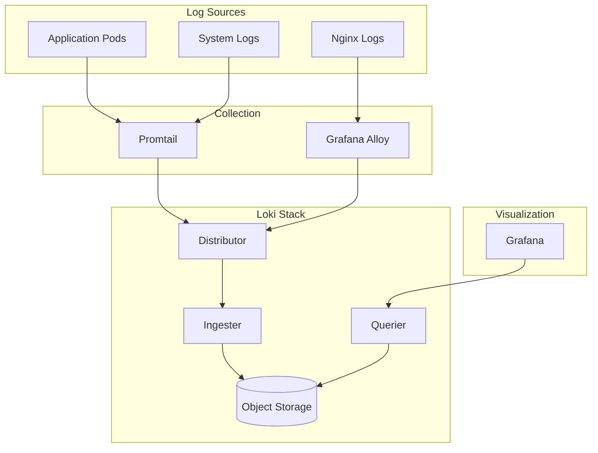

# How to Implement Loki for Log Aggregation in Grafana

Author: [nawazdhandala](https://www.github.com/nawazdhandala)

Tags: Grafana, Loki, Logs, Log Aggregation, Promtail, Observability, LogQL

Description: Learn how to deploy and configure Grafana Loki for cost-effective log aggregation, including Promtail setup, LogQL queries, and integration with metrics and traces.

---

Logs are essential for debugging, but traditional log solutions like Elasticsearch can become expensive at scale. Grafana Loki takes a different approach: it indexes only metadata (labels), not the full log content. This dramatically reduces storage costs while keeping logs searchable. This guide covers deploying Loki and integrating it with Grafana.

## Understanding Loki Architecture

Loki differs from traditional log systems:

- **Label-based indexing**: Only labels are indexed, not log content
- **Prometheus-like model**: Uses the same label concepts as Prometheus
- **Cost-effective**: Storage costs are fraction of Elasticsearch
- **LogQL**: Query language similar to PromQL



## Deploying Loki on Kubernetes

Use the Loki Helm chart for deployment:

```bash
# Add the Grafana Helm repository
helm repo add grafana https://grafana.github.io/helm-charts
helm repo update

# Create namespace
kubectl create namespace logging

# Install Loki stack (includes Promtail)
helm install loki grafana/loki-stack \
  --namespace logging \
  --set loki.persistence.enabled=true \
  --set loki.persistence.size=50Gi \
  --set promtail.enabled=true
```

For production, use the distributed deployment:

```yaml
# loki-values.yaml
loki:
  auth_enabled: false

  storage:
    type: s3
    s3:
      endpoint: s3.amazonaws.com
      bucketnames: company-loki-logs
      region: us-east-1
      access_key_id: ${AWS_ACCESS_KEY_ID}
      secret_access_key: ${AWS_SECRET_ACCESS_KEY}

  schemaConfig:
    configs:
      - from: "2024-01-01"
        store: tsdb
        object_store: s3
        schema: v13
        index:
          prefix: loki_index_
          period: 24h

  limits_config:
    retention_period: 30d
    max_query_length: 721h
    max_entries_limit_per_query: 5000

  compactor:
    retention_enabled: true
    delete_request_store: s3

gateway:
  enabled: true
  replicas: 2

write:
  replicas: 3
  persistence:
    size: 10Gi

read:
  replicas: 3

backend:
  replicas: 2
  persistence:
    size: 10Gi
```

Install with custom values:

```bash
helm install loki grafana/loki \
  --namespace logging \
  -f loki-values.yaml
```

## Configuring Promtail

Promtail is the log collection agent that ships logs to Loki. It runs as a DaemonSet on each node.

```yaml
# promtail-values.yaml
config:
  clients:
    - url: http://loki-gateway.logging.svc:3100/loki/api/v1/push
      tenant_id: default

  snippets:
    scrapeConfigs: |
      # Scrape Kubernetes pod logs
      - job_name: kubernetes-pods
        kubernetes_sd_configs:
          - role: pod
        relabel_configs:
          # Keep pod name as label
          - source_labels: [__meta_kubernetes_pod_name]
            target_label: pod
          # Keep namespace as label
          - source_labels: [__meta_kubernetes_namespace]
            target_label: namespace
          # Keep container name as label
          - source_labels: [__meta_kubernetes_pod_container_name]
            target_label: container
          # Keep node name as label
          - source_labels: [__meta_kubernetes_pod_node_name]
            target_label: node
          # Add app label from pod labels
          - source_labels: [__meta_kubernetes_pod_label_app]
            target_label: app
        pipeline_stages:
          # Parse JSON logs
          - json:
              expressions:
                level: level
                message: msg
                timestamp: ts
          # Add log level as label
          - labels:
              level:
          # Set timestamp from log
          - timestamp:
              source: timestamp
              format: RFC3339Nano

      # Scrape system logs
      - job_name: system
        static_configs:
          - targets:
              - localhost
            labels:
              job: system
              __path__: /var/log/syslog
```

Install Promtail:

```bash
helm install promtail grafana/promtail \
  --namespace logging \
  -f promtail-values.yaml
```

## Configuring Grafana Data Source

Add Loki as a data source in Grafana:

```yaml
# datasource-loki.yaml
apiVersion: 1
datasources:
  - name: Loki
    type: loki
    access: proxy
    url: http://loki-gateway.logging.svc:3100
    jsonData:
      maxLines: 1000
      derivedFields:
        - name: TraceID
          matcherRegex: '"traceID":"(\w+)"'
          url: '${__value.raw}'
          datasourceUid: tempo
          urlDisplayLabel: View Trace
```

## LogQL Query Basics

LogQL combines log selection with processing pipelines.

### Stream Selection

Select logs by labels:

```logql
# All logs from namespace
{namespace="production"}

# Logs from specific pod
{namespace="production", pod=~"api-.*"}

# Multiple namespaces
{namespace=~"production|staging"}

# Exclude debug containers
{namespace="production", container!="debug"}
```

### Line Filters

Filter log content:

```logql
# Logs containing "error"
{namespace="production"} |= "error"

# Logs NOT containing "health"
{namespace="production"} != "health"

# Regex match
{namespace="production"} |~ "error|exception|fatal"

# Case insensitive
{namespace="production"} |~ "(?i)error"
```

### JSON Parsing

Extract fields from JSON logs:

```logql
# Parse JSON and filter by field
{namespace="production"} | json | level="error"

# Extract specific fields
{namespace="production"} | json | line_format "{{.level}}: {{.message}}"

# Filter by extracted field value
{namespace="production"} | json | duration > 1000
```

### Log Metrics

Convert logs to metrics:

```logql
# Count errors per minute
count_over_time({namespace="production"} |= "error" [1m])

# Rate of logs per second
rate({namespace="production"}[5m])

# Error rate by service
sum by (app) (
  rate({namespace="production"} | json | level="error" [5m])
)
```

### Aggregations

```logql
# Top 10 pods by log volume
topk(10, sum by (pod) (rate({namespace="production"}[5m])))

# Average response time from logs
avg_over_time({namespace="production"} | json | unwrap duration [5m])

# Quantiles from log values
quantile_over_time(0.99, {namespace="production"} | json | unwrap latency_ms [5m])
```

## Building Log Dashboards

### Log Volume Panel

```logql
# Log volume over time by level
sum by (level) (
  count_over_time({namespace="$namespace"} | json [1m])
)
```

Panel configuration:
- Type: Time series
- Stack series: Normal
- Legend: Table

### Error Logs Panel

```logql
# Recent errors with context
{namespace="$namespace"} | json | level="error"
```

Panel configuration:
- Type: Logs
- Show time
- Enable line wrapping

### Log-Based Error Rate

```logql
# Error percentage
sum(rate({namespace="$namespace"} | json | level="error" [5m]))
/
sum(rate({namespace="$namespace"} [5m]))
* 100
```

Panel configuration:
- Type: Stat
- Unit: Percent
- Thresholds: Green < 1%, Yellow < 5%, Red >= 5%

## Pipeline Stages

Configure log processing in Promtail:

```yaml
pipeline_stages:
  # Parse JSON
  - json:
      expressions:
        level: level
        message: msg
        trace_id: traceID
        user_id: userId

  # Add labels from parsed fields
  - labels:
      level:

  # Transform output
  - output:
      source: message

  # Drop debug logs in production
  - match:
      selector: '{namespace="production"}'
      stages:
        - drop:
            expression: ".*level.*debug.*"

  # Redact sensitive data
  - replace:
      expression: "(password=)[^ ]+"
      replace: "${1}[REDACTED]"

  # Parse metrics from logs
  - metrics:
      http_request_duration:
        type: histogram
        description: "HTTP request duration"
        source: duration
        config:
          buckets: [0.01, 0.05, 0.1, 0.5, 1, 5]
```

## Multi-Tenant Setup

Enable multi-tenancy for isolation:

```yaml
# loki-values.yaml
loki:
  auth_enabled: true

  limits_config:
    per_tenant_override_config: /etc/loki/overrides/overrides.yaml

# Promtail configuration
config:
  clients:
    - url: http://loki:3100/loki/api/v1/push
      tenant_id: team-a
```

## Retention and Compaction

Configure log retention:

```yaml
loki:
  limits_config:
    retention_period: 30d

  compactor:
    retention_enabled: true
    retention_delete_delay: 2h
    retention_delete_worker_count: 150
```

## Performance Tuning

### Optimize Label Cardinality

High cardinality labels (like user IDs) increase index size:

```yaml
# Bad: High cardinality
labels:
  user_id: "12345"

# Good: Keep user_id in log content
labels:
  app: "api"
```

### Chunk Configuration

```yaml
loki:
  ingester:
    chunk_idle_period: 30m
    chunk_block_size: 262144
    chunk_retain_period: 1m
    max_transfer_retries: 0
```

### Query Limits

```yaml
loki:
  limits_config:
    max_entries_limit_per_query: 5000
    max_query_series: 500
    max_query_parallelism: 32
```

## Alerting on Logs

Create Grafana alerts based on log queries:

```yaml
# Alert on high error rate from logs
groups:
  - name: log-alerts
    rules:
      - alert: HighErrorRate
        expr: |
          sum(rate({namespace="production"} | json | level="error" [5m])) > 10
        for: 5m
        labels:
          severity: warning
        annotations:
          summary: High error rate in logs
```

## Integrating with Traces

Link logs to traces using trace IDs:

```yaml
# Grafana data source configuration
datasources:
  - name: Loki
    type: loki
    jsonData:
      derivedFields:
        - name: TraceID
          matcherRegex: 'traceID=(\w+)'
          url: '${__value.raw}'
          datasourceUid: tempo
```

Now clicking a trace ID in logs opens the corresponding trace in Tempo.

Loki provides cost-effective log aggregation that integrates seamlessly with Grafana's metrics and tracing ecosystem. Start with basic deployment, tune retention for your needs, and leverage LogQL's power for debugging and alerting.
