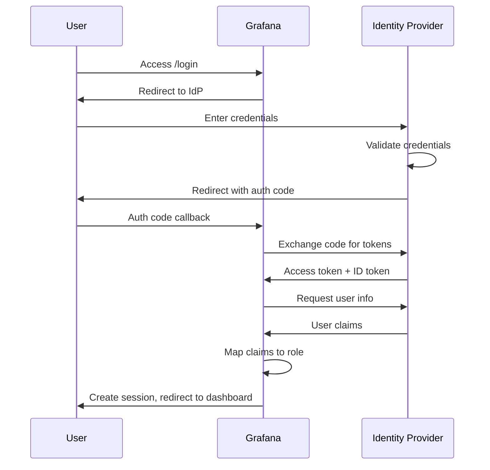

# How to Configure SSO Authentication in Grafana

Author: [nawazdhandala](https://www.github.com/nawazdhandala)

Tags: Grafana, SSO, OAuth, SAML, Authentication, Security, LDAP, Okta, Azure AD

Description: A complete guide to configuring Single Sign-On (SSO) in Grafana using OAuth2, SAML, LDAP, and popular identity providers like Okta, Azure AD, and Google.

---

Managing separate credentials for every tool frustrates users and creates security risks. Single Sign-On (SSO) lets your team authenticate to Grafana using their existing corporate identity. This guide covers configuring SSO with popular identity providers.

## Authentication Options in Grafana

Grafana supports multiple authentication methods:

- **OAuth 2.0**: Google, GitHub, Azure AD, Okta, generic OAuth2
- **SAML**: Enterprise identity providers
- **LDAP**: Active Directory, OpenLDAP
- **Proxy authentication**: Header-based auth behind a proxy

Each method has trade-offs in complexity, features, and compatibility.

## OAuth 2.0 Configuration

OAuth is the most common SSO method. Configure it in `grafana.ini` or environment variables.

### Generic OAuth Setup

```ini
# /etc/grafana/grafana.ini
[auth.generic_oauth]
enabled = true
name = Corporate SSO
allow_sign_up = true
client_id = your-client-id
client_secret = your-client-secret
scopes = openid profile email
auth_url = https://idp.company.com/oauth2/authorize
token_url = https://idp.company.com/oauth2/token
api_url = https://idp.company.com/oauth2/userinfo
role_attribute_path = contains(groups[*], 'grafana-admins') && 'Admin' || contains(groups[*], 'grafana-editors') && 'Editor' || 'Viewer'
```

### Google OAuth

```ini
[auth.google]
enabled = true
allow_sign_up = true
client_id = your-google-client-id.apps.googleusercontent.com
client_secret = your-client-secret
scopes = openid email profile
auth_url = https://accounts.google.com/o/oauth2/v2/auth
token_url = https://oauth2.googleapis.com/token
api_url = https://openidconnect.googleapis.com/v1/userinfo
allowed_domains = company.com
```

To get Google OAuth credentials:
1. Go to Google Cloud Console
2. Create a new project or select existing
3. Navigate to APIs & Services > Credentials
4. Create OAuth 2.0 Client ID
5. Set authorized redirect URI: `https://grafana.company.com/login/google`

### GitHub OAuth

```ini
[auth.github]
enabled = true
allow_sign_up = true
client_id = your-github-client-id
client_secret = your-github-client-secret
scopes = user:email,read:org
auth_url = https://github.com/login/oauth/authorize
token_url = https://github.com/login/oauth/access_token
api_url = https://api.github.com/user
allowed_organizations = your-org
team_ids = 123456,789012
```

Create a GitHub OAuth App:
1. Go to GitHub > Settings > Developer settings > OAuth Apps
2. Create New OAuth App
3. Set callback URL: `https://grafana.company.com/login/github`

### Azure AD (Entra ID) OAuth

```ini
[auth.azuread]
enabled = true
name = Azure AD
allow_sign_up = true
client_id = your-azure-app-id
client_secret = your-client-secret
scopes = openid email profile
auth_url = https://login.microsoftonline.com/your-tenant-id/oauth2/v2.0/authorize
token_url = https://login.microsoftonline.com/your-tenant-id/oauth2/v2.0/token
allowed_domains = company.com
allowed_groups = grafana-admins,grafana-users
role_attribute_path = contains(groups[*], 'grafana-admins') && 'Admin' || 'Viewer'
```

Azure AD setup:
1. Go to Azure Portal > Azure Active Directory > App registrations
2. Create new registration
3. Add redirect URI: `https://grafana.company.com/login/azuread`
4. Create client secret
5. Configure API permissions: `User.Read`, `GroupMember.Read.All`

### Okta OAuth

```ini
[auth.generic_oauth]
enabled = true
name = Okta
allow_sign_up = true
client_id = your-okta-client-id
client_secret = your-okta-client-secret
scopes = openid profile email groups
auth_url = https://your-org.okta.com/oauth2/v1/authorize
token_url = https://your-org.okta.com/oauth2/v1/token
api_url = https://your-org.okta.com/oauth2/v1/userinfo
role_attribute_path = contains(groups[*], 'GrafanaAdmins') && 'Admin' || contains(groups[*], 'GrafanaEditors') && 'Editor' || 'Viewer'
```

## SAML Configuration

SAML is common in enterprise environments with identity providers like Okta, OneLogin, or ADFS.

```ini
[auth.saml]
enabled = true
certificate_path = /etc/grafana/saml/certificate.crt
private_key_path = /etc/grafana/saml/private.key
idp_metadata_url = https://idp.company.com/saml/metadata
assertion_attribute_name = displayName
assertion_attribute_login = mail
assertion_attribute_email = mail
assertion_attribute_groups = groups
role_values_admin = GrafanaAdmins
role_values_editor = GrafanaEditors
role_values_viewer = GrafanaViewers
allow_sign_up = true
```

Generate the SAML certificate:

```bash
# Generate private key and certificate
openssl req -x509 -newkey rsa:4096 \
  -keyout /etc/grafana/saml/private.key \
  -out /etc/grafana/saml/certificate.crt \
  -days 365 -nodes \
  -subj "/CN=grafana.company.com"
```

## LDAP Configuration

For organizations using Active Directory or OpenLDAP:

```ini
# /etc/grafana/grafana.ini
[auth.ldap]
enabled = true
config_file = /etc/grafana/ldap.toml
allow_sign_up = true
```

```toml
# /etc/grafana/ldap.toml
[[servers]]
host = "ldap.company.com"
port = 636
use_ssl = true
start_tls = false
ssl_skip_verify = false
root_ca_cert = "/etc/grafana/ldap/ca.crt"

# Search user
bind_dn = "cn=grafana,ou=service-accounts,dc=company,dc=com"
bind_password = "${LDAP_BIND_PASSWORD}"

# User search
search_filter = "(sAMAccountName=%s)"
search_base_dns = ["ou=users,dc=company,dc=com"]

# Group search
group_search_filter = "(&(objectClass=group)(member=%s))"
group_search_base_dns = ["ou=groups,dc=company,dc=com"]
group_search_filter_user_attribute = "dn"

# Attributes
[servers.attributes]
name = "displayName"
surname = "sn"
username = "sAMAccountName"
member_of = "memberOf"
email = "mail"

# Map groups to roles
[[servers.group_mappings]]
group_dn = "cn=grafana-admins,ou=groups,dc=company,dc=com"
org_role = "Admin"

[[servers.group_mappings]]
group_dn = "cn=grafana-editors,ou=groups,dc=company,dc=com"
org_role = "Editor"

[[servers.group_mappings]]
group_dn = "cn=grafana-viewers,ou=groups,dc=company,dc=com"
org_role = "Viewer"
```

## Role Mapping with JMESPath

Map identity provider groups to Grafana roles using JMESPath expressions:

```ini
# Simple role mapping
role_attribute_path = role

# Conditional mapping based on groups
role_attribute_path = contains(groups[*], 'admins') && 'Admin' || contains(groups[*], 'editors') && 'Editor' || 'Viewer'

# Mapping based on claims
role_attribute_path = info.role

# Complex nested conditions
role_attribute_path = contains(groups[*], 'super-admins') && 'GrafanaAdmin' || contains(groups[*], 'admins') && 'Admin' || contains(groups[*], 'power-users') && 'Editor' || 'Viewer'
```

## Authentication Flow



## Kubernetes Deployment with SSO

Configure SSO via Helm values:

```yaml
# grafana-values.yaml
grafana.ini:
  server:
    root_url: https://grafana.company.com
  auth:
    disable_login_form: false
    oauth_auto_login: true
  auth.generic_oauth:
    enabled: true
    name: "Corporate SSO"
    allow_sign_up: true
    client_id: ${OAUTH_CLIENT_ID}
    client_secret: ${OAUTH_CLIENT_SECRET}
    scopes: openid profile email groups
    auth_url: https://idp.company.com/oauth2/authorize
    token_url: https://idp.company.com/oauth2/token
    api_url: https://idp.company.com/oauth2/userinfo
    role_attribute_path: contains(groups[*], 'grafana-admins') && 'Admin' || 'Viewer'

# Store secrets separately
envFromSecret: grafana-oauth-secrets
```

Create the secret:

```bash
kubectl create secret generic grafana-oauth-secrets \
  --from-literal=OAUTH_CLIENT_ID='your-client-id' \
  --from-literal=OAUTH_CLIENT_SECRET='your-client-secret' \
  -n monitoring
```

## Security Best Practices

### 1. Use HTTPS Only

```ini
[server]
protocol = https
cert_file = /etc/grafana/ssl/grafana.crt
cert_key = /etc/grafana/ssl/grafana.key
```

### 2. Restrict Allowed Domains

```ini
[auth.google]
allowed_domains = company.com,subsidiary.com
```

### 3. Disable Sign-Up for Untrusted Users

```ini
[users]
allow_sign_up = false
auto_assign_org = true
auto_assign_org_id = 1
auto_assign_org_role = Viewer
```

### 4. Enable Auto-Login for SSO

```ini
[auth]
oauth_auto_login = true
disable_login_form = true
```

### 5. Configure Session Security

```ini
[security]
cookie_secure = true
cookie_samesite = strict
strict_transport_security = true
strict_transport_security_max_age_seconds = 86400
```

## Troubleshooting SSO

### Enable Debug Logging

```ini
[log]
level = debug
filters = auth.generic_oauth:debug
```

### Common Issues

**Redirect URI mismatch**: Ensure the callback URL in your IdP matches exactly:
```
https://grafana.company.com/login/generic_oauth
```

**Groups not returned**: Request the correct scopes:
```ini
scopes = openid profile email groups
```

**Role not mapped**: Test your JMESPath expression at https://jmespath.org/

**SSL certificate errors**: Add CA certificate:
```ini
tls_client_ca = /etc/grafana/certs/ca.crt
tls_skip_verify_insecure = false
```

### Test OAuth Flow Manually

```bash
# Get authorization URL
echo "https://idp.company.com/oauth2/authorize?client_id=your-client-id&redirect_uri=https://grafana.company.com/login/generic_oauth&response_type=code&scope=openid%20profile%20email"

# Exchange code for token (after redirect)
curl -X POST https://idp.company.com/oauth2/token \
  -d "grant_type=authorization_code" \
  -d "code=AUTH_CODE_FROM_REDIRECT" \
  -d "client_id=your-client-id" \
  -d "client_secret=your-client-secret" \
  -d "redirect_uri=https://grafana.company.com/login/generic_oauth"
```

## Combining Multiple Auth Methods

Enable multiple authentication methods for flexibility:

```ini
[auth]
disable_login_form = false

[auth.google]
enabled = true

[auth.github]
enabled = true

[auth.ldap]
enabled = true
```

Users can choose their preferred method on the login page.

SSO integration simplifies access management and improves security. Start with OAuth for most use cases, use SAML for enterprise requirements, and fall back to LDAP when other options are not available. Always test thoroughly in a staging environment before rolling out to production.
