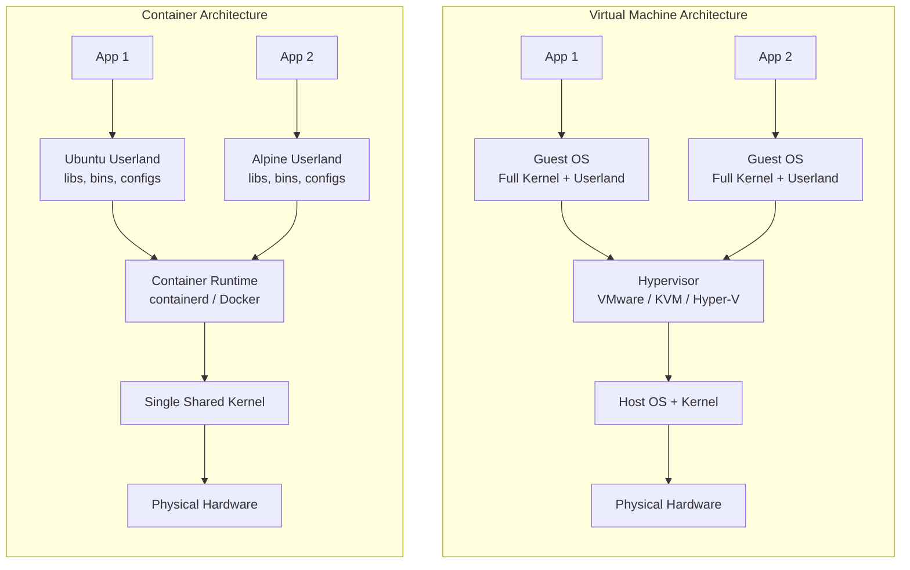
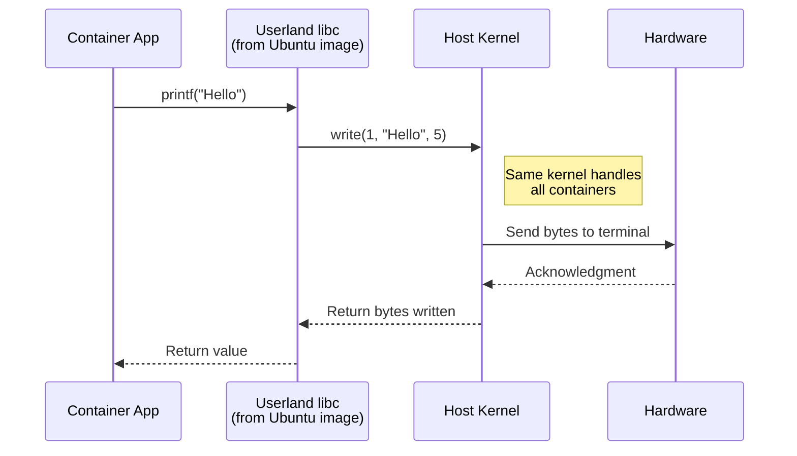
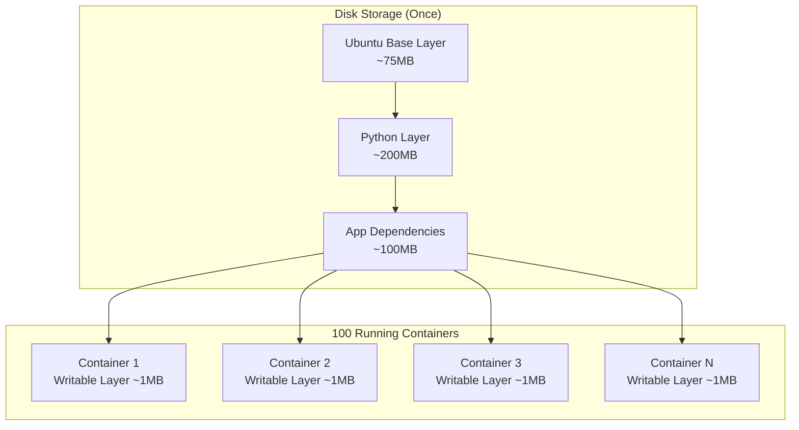

# Demystifying Docker Base Images: Why Ubuntu in a Container Isn't Really Ubuntu

Author: [nawazdhandala](https://www.github.com/nawazdhandala)

Tags: Docker, Containers, Linux, DevOps, Virtualization, Ubuntu, Base Images

Description: A deep dive into how OS base images like Ubuntu work in Docker containers. Learn why containers share the host kernel, how they differ from VMs, why they're so efficient, and how many you can theoretically run on a single machine.

---

> When you run `docker run ubuntu`, you're not running Ubuntu. You're running your host's Linux kernel with Ubuntu's userland tools layered on top. Understanding this distinction unlocks the real power of containers.

---

## The Fundamental Question: What Does "Running Ubuntu" Mean?

Let's start with what happens when you execute this command:

```bash
docker run -it ubuntu:22.04 bash
```

You get a bash prompt that *looks* like Ubuntu. You can run `apt update`, install packages, and everything behaves as expected. But here's the twist:

```bash
# Inside the container, check the kernel
$ uname -r
6.5.0-44-generic  # This is your HOST kernel, not Ubuntu 22.04's

# Check the distribution
$ cat /etc/os-release
NAME="Ubuntu"
VERSION="22.04.3 LTS (Jammy Jellyfish)"
```

The kernel is from your host machine. The "Ubuntu" part is just the filesystem - the binaries, libraries, and configuration files that make up Ubuntu's userland.

---

## Containers vs Virtual Machines: Architecture Comparison

The following diagram illustrates the fundamental architectural difference between virtual machines and containers. VMs virtualize hardware, while containers virtualize the operating system.



### Key Differences

| Aspect | Virtual Machine | Container |
|--------|----------------|-----------|
| Kernel | Each VM has its own kernel | All containers share host kernel |
| Boot time | Minutes | Milliseconds |
| Memory overhead | 512MB - 4GB per VM | 1-10MB per container |
| Disk footprint | 10-100GB per VM | 10-500MB per image |
| Isolation | Hardware-level | Process-level |
| Performance | ~5-10% overhead | Near-native |

---

## What's Actually in a Base Image?

When you pull `ubuntu:22.04`, you're downloading a tarball containing:

### 1. Essential Binaries (`/bin`, `/usr/bin`)

The core command-line tools:

```bash
# These binaries come from the Ubuntu base image
/bin/bash          # Shell
/bin/ls            # List files
/bin/cat           # Display files
/usr/bin/apt       # Package manager
/usr/bin/dpkg      # Debian package tool
```

### 2. Shared Libraries (`/lib`, `/usr/lib`)

The C library (glibc) and other shared libraries that programs link against:

```bash
# libc is the foundation - every C program needs it
/lib/x86_64-linux-gnu/libc.so.6

# Other essential libraries
/lib/x86_64-linux-gnu/libpthread.so.0
/lib/x86_64-linux-gnu/libm.so.6
```

### 3. Configuration Files (`/etc`)

System configuration that defines behavior:

```bash
/etc/apt/sources.list    # Package repositories
/etc/passwd              # User database
/etc/group               # Group database
/etc/resolv.conf         # DNS configuration (usually mounted from host)
```

### 4. Package Database

The dpkg/apt database that tracks installed packages:

```bash
/var/lib/dpkg/status     # Installed packages
/var/lib/apt/lists/      # Available packages cache
```

---

## Why Containers Share the Host Kernel

This is the critical insight. The Linux kernel provides:

- Process scheduling
- Memory management  
- Filesystem operations
- Network stack
- Device drivers
- System calls

When a container process calls `open()`, `read()`, or `fork()`, those calls go directly to the host kernel. The kernel doesn't know or care that the process came from an "Ubuntu container" or an "Alpine container."

This diagram shows what happens when a containerized application makes a system call. The call passes through the container runtime's namespace isolation but ultimately reaches the same host kernel.



### The Syscall Interface is Stable

The Linux syscall ABI is remarkably stable. A binary compiled against glibc 2.31 (Ubuntu 20.04) will work on a kernel from Ubuntu 24.04 because:

1. The kernel maintains backward compatibility
2. System call numbers don't change
3. New features are added, old ones rarely removed

This is why you can run Ubuntu 18.04 containers on a host running kernel 6.5 - the syscall interface remains compatible.

---

## Practical Demonstration: Same Kernel, Different Userlands

Let's prove this with a hands-on example. This script runs the same kernel query across different base images to demonstrate that they all share the host kernel.

```bash
#!/bin/bash
# demonstrate-shared-kernel.sh
# Run the same kernel version check across different "distributions"

echo "Host kernel version:"
uname -r
echo ""

# Each container reports the same kernel because they ALL use the host kernel
# Only the userland tools (uname binary, libc) come from the image
for image in ubuntu:22.04 debian:12 alpine:3.19 fedora:39 archlinux:latest; do
    echo "Kernel inside $image:"
    docker run --rm $image uname -r
    echo ""
done
```

Output:

```
Host kernel version:
6.5.0-44-generic

Kernel inside ubuntu:22.04:
6.5.0-44-generic

Kernel inside debian:12:
6.5.0-44-generic

Kernel inside alpine:3.19:
6.5.0-44-generic

Kernel inside fedora:39:
6.5.0-44-generic

Kernel inside archlinux:latest:
6.5.0-44-generic
```

Every container reports the exact same kernel version because they're all running on the same kernel.

---

## Why This Makes Containers Incredibly Efficient

### 1. No Kernel Duplication

A VM must load an entire kernel into memory (~100-500MB). With 10 VMs, you have 10 kernels consuming memory. With 10 containers, you have one kernel.

### 2. Instant Startup

VMs must boot: BIOS → bootloader → kernel → init system → services. Containers just call `fork()` and `exec()` - the process exists in milliseconds.

This comparison shows startup time differences between VMs and containers. VMs must complete a full boot sequence, while containers start almost instantly.

```bash
# Time a VM boot (typical KVM/QEMU)
$ time virsh start ubuntu-vm && virsh console ubuntu-vm
# ... wait for GRUB, kernel, systemd ...
# Total: 30-60 seconds

# Time a container start
$ time docker run --rm ubuntu:22.04 echo "Ready"
Ready
# real    0m0.347s
```

### 3. Shared Image Layers

When you run 100 containers from `ubuntu:22.04`, the base image layers exist only once on disk. Each container gets a thin copy-on-write layer for its changes.

This diagram shows how Docker's layered filesystem works. Base image layers are shared and read-only, while each container gets its own thin writable layer.



### 4. Memory Sharing Through the Kernel

The kernel's page cache is shared. If 50 containers read the same file, the kernel caches it once. If containers use the same shared libraries (and they often do), those memory pages can be shared via copy-on-write.

---

## How Many Containers Can You Run? Let's Do the Math

For a standard 16GB RAM VM, here's a realistic calculation:

### Memory Breakdown

```
Total RAM:                    16,384 MB
Host OS overhead:             -1,024 MB  (kernel, systemd, etc.)
Docker daemon:                  -256 MB
Container runtime overhead:     -512 MB  (containerd, metadata)
----------------------------------------
Available for containers:     14,592 MB
```

### Per-Container Memory

| Container Type | Base Memory | Typical App Memory | Total |
|---------------|-------------|-------------------|-------|
| Minimal (sleep) | ~1 MB | 0 MB | ~1 MB |
| Alpine + small app | ~5 MB | 10-20 MB | ~25 MB |
| Ubuntu + Python app | ~20 MB | 50-100 MB | ~120 MB |
| Ubuntu + Java app | ~50 MB | 200-500 MB | ~500 MB |
| Node.js service | ~30 MB | 100-200 MB | ~200 MB |

### Theoretical Maximum

The following script demonstrates the theoretical maximum number of minimal containers you can run on a system with available memory.

```bash
#!/bin/bash
# theoretical-container-count.sh
# Calculate theoretical container limits

# Minimal containers (just sleeping)
# These use almost no memory - just the process overhead
echo "Minimal containers (1MB each): $((14592 / 1)) containers"

# Lightweight Alpine containers with small apps
echo "Alpine + small app (25MB each): $((14592 / 25)) containers"

# Standard Ubuntu Python containers
echo "Ubuntu + Python (120MB each): $((14592 / 120)) containers"

# Java microservices
echo "Java microservices (500MB each): $((14592 / 500)) containers"
```

Output:

```
Minimal containers (1MB each): 14592 containers
Alpine + small app (25MB each): 583 containers
Ubuntu + Python (120MB each): 121 containers
Java microservices (500MB each): 29 containers
```

### Real-World Limits

Beyond memory, consider:

1. **CPU scheduling**: Too many containers competing for CPU causes latency spikes
2. **File descriptors**: Each container needs FDs; default ulimit is often 1024
3. **Network ports**: Only 65535 ports available for port mapping
4. **PIDs**: `/proc/sys/kernel/pid_max` limits total processes (default: 32768)
5. **Disk I/O**: OverlayFS has overhead; many containers = many layers to traverse

A practical limit for a 16GB VM running real workloads:
- **50-100 lightweight containers** (APIs, workers)
- **10-30 medium containers** (databases, caches)
- **5-10 heavy containers** (ML models, JVM apps)

---

## What About Linux Distribution Compatibility?

### The Kernel ABI Promise

Linux maintains a stable syscall interface. Key points:

```bash
# Check your kernel's syscall compatibility
$ cat /proc/sys/kernel/osrelease
6.5.0-44-generic

# Binaries compiled for older kernels work on newer ones
# This Ubuntu 18.04 binary runs fine on kernel 6.5
$ docker run ubuntu:18.04 /bin/ls
```

### When Compatibility Breaks

Rare cases where containers might fail:

1. **Kernel feature requirements**: Container needs a feature your kernel lacks
   ```bash
   # Example: io_uring requires kernel 5.1+
   # Container using io_uring on kernel 4.15 will fail
   ```

2. **Kernel module dependencies**: Some software needs specific kernel modules
   ```bash
   # Wireguard needs the wireguard kernel module
   # NVIDIA containers need nvidia kernel drivers
   ```

3. **Seccomp/capability restrictions**: Host may block syscalls the container needs
   ```bash
   # Container trying to use ptrace but host blocks it
   docker run --cap-add SYS_PTRACE ...
   ```

---

## Choosing the Right Base Image

The choice of base image affects:

| Base Image | Size | Package Manager | Use Case |
|------------|------|-----------------|----------|
| `scratch` | 0 MB | None | Statically compiled Go/Rust binaries |
| `alpine` | 7 MB | apk | Minimal containers, musl libc |
| `distroless` | 20 MB | None | Security-focused, no shell |
| `debian-slim` | 80 MB | apt | Balanced size and compatibility |
| `ubuntu` | 78 MB | apt | Development familiarity |
| `fedora` | 180 MB | dnf | Latest packages, SELinux |

### When to Use Each

This Dockerfile demonstrates using scratch (empty) base image for maximum efficiency. Only works with statically compiled binaries that have no external dependencies.

```dockerfile
# scratch: For statically compiled binaries
# No OS at all - just your binary
FROM scratch
COPY myapp /myapp
ENTRYPOINT ["/myapp"]
```

```dockerfile
# alpine: For minimal images with shell access
# Uses musl libc instead of glibc - some compatibility issues
FROM alpine:3.19
RUN apk add --no-cache python3
COPY app.py /app.py
CMD ["python3", "/app.py"]
```

```dockerfile
# distroless: Security-focused production images
# No shell, no package manager - harder to debug but more secure
FROM gcr.io/distroless/python3-debian12
COPY app.py /app.py
CMD ["app.py"]
```

For a deeper dive into choosing and optimizing base images, see [How to Containerize Python Apps with Multi-Stage Dockerfiles](https://oneuptime.com/blog/post/2025-01-06-python-docker-multi-stage/view).

---

## The Userland-Kernel Contract

Understanding the boundary between userland and kernel clarifies container behavior:

### What Comes from the Base Image (Userland)

- Shell (`/bin/bash`, `/bin/sh`)
- C library (`glibc`, `musl`)
- Package manager (`apt`, `apk`, `yum`)
- Core utilities (`ls`, `cat`, `grep`)
- Init system configuration (but not systemd itself usually)
- Default users and groups (`/etc/passwd`)
- Library paths and configurations

### What Comes from the Host (Kernel)

- Process scheduling and memory management
- Network stack (TCP/IP, routing)
- Filesystem operations (read, write, mount)
- Security features (namespaces, cgroups, seccomp)
- Device drivers (GPU, network, storage)
- Time and clock management
- Crypto and random number generation

### The Namespace Illusion

The kernel provides namespaces to make containers feel isolated:

```bash
# Inside container - appears to be PID 1
$ docker run --rm ubuntu:22.04 ps aux
USER       PID %CPU %MEM    VSZ   RSS TTY      STAT START   TIME COMMAND
root         1  0.0  0.0   4624  3456 pts/0    Rs+  10:00   0:00 ps aux

# On host - container's "PID 1" is actually a higher PID
$ ps aux | grep "ps aux"
root     45678  0.0  0.0   4624  3456 pts/0    Rs+  10:00   0:00 ps aux
```

The kernel maintains a mapping: container PID 1 → host PID 45678. This is how isolation works without virtualization.

---

## Implications for Production

### 1. Kernel Vulnerabilities Affect All Containers

If your host kernel has a vulnerability, every container is exposed. Keep hosts patched.

### 2. Host Kernel Limits Container Features

Want to use io_uring? Your host kernel needs 5.1+. Want eBPF features? Need kernel 4.15+ with specific options enabled.

### 3. glibc vs musl Matters

Alpine uses musl libc. Some binaries compiled for glibc won't work:

```bash
# This might fail on Alpine due to glibc dependency
$ docker run alpine ./glibc-binary
Error: /lib/x86_64-linux-gnu/libc.so.6: no such file or directory
```

### 4. Container "OS" is Purely Organizational

From the kernel's perspective, there's no difference between an "Ubuntu container" and a "Debian container." They're both just processes making syscalls.

---

## Common Misconceptions

### ❌ "Containers are lightweight VMs"

Containers are processes with fancy isolation. VMs virtualize hardware and run separate kernels.

### ❌ "Each container has its own kernel"

All containers share the host kernel. The "OS" in the container is just userland files.

### ❌ "Running Ubuntu container means running Ubuntu"

You're running your host's kernel with Ubuntu's tools. If your host is Debian, you're really running Debian's kernel.

### ❌ "Base images contain complete operating systems"

Base images contain the minimum userland tools. No kernel, no bootloader, no drivers.

### ❌ "More containers always means more memory"

Shared layers and kernel page caching mean containers often share memory efficiently.

---

## Wrapping Up

Docker base images are filesystem snapshots of Linux distributions' userland components - the binaries, libraries, and configurations that make Ubuntu feel like Ubuntu. But the actual operating system - the kernel - is shared with the host.

This architecture enables:
- **Millisecond startup times** (no kernel boot)
- **Minimal memory overhead** (one kernel, shared pages)
- **Massive density** (hundreds of containers per host)
- **Near-native performance** (direct syscalls to kernel)

The trade-off is weaker isolation than VMs - containers share a kernel, so kernel exploits affect all containers. For most workloads, this trade-off is worth it.

**Key takeaways:**

1. **Base images = userland only** - shells, libraries, package managers
2. **Kernel = shared from host** - all containers use the same kernel
3. **VMs virtualize hardware** - containers virtualize the OS
4. **Efficiency comes from sharing** - one kernel, layered filesystems, page caching
5. **Choose base images wisely** - smaller isn't always better; compatibility matters

---

## Further Reading

- [How Docker Actually Works](https://oneuptime.com/blog/post/2025-12-08-how-docker-actually-works/view) - Deep dive into Docker internals
- [Learn Docker Step by Step](https://oneuptime.com/blog/post/2025-11-27-learn-docker-step-by-step/view) - Beginner-friendly Docker guide
- [Building Your Own Container Engine](https://oneuptime.com/blog/post/2025-12-09-building-docker-from-scratch/view) - Understand containers by building one
- [10 Docker Superpowers Developers Forget to Use](https://oneuptime.com/blog/post/2025-11-27-ten-docker-superpowers-youre-probably-not-using/view) - Advanced Docker techniques

---

*Need to monitor your containerized workloads? [OneUptime](https://oneuptime.com) provides comprehensive container monitoring with resource tracking, log aggregation, and intelligent alerting - whether you're running 10 containers or 10,000.*