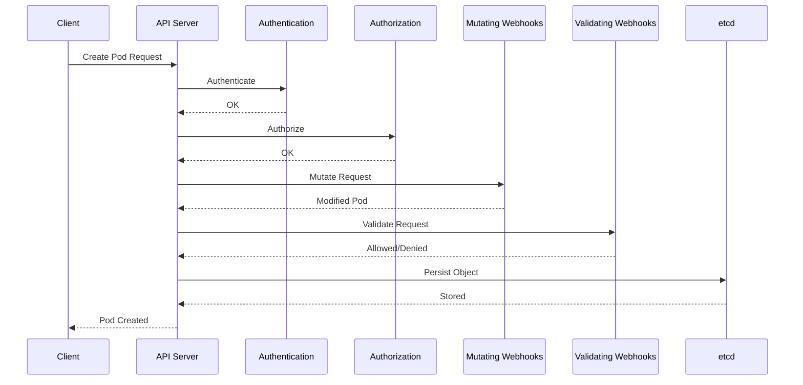

# How to Write Kubernetes Admission Webhooks from Scratch

Author: [nawazdhandala](https://www.github.com/nawazdhandala)

Tags: Kubernetes, Admission Webhooks, Security, Validation, Mutation, Policy Enforcement, DevOps

Description: Learn how to build Kubernetes admission webhooks to validate and mutate resources before they're persisted, enabling custom policy enforcement and automatic configuration injection.

---

Admission webhooks are HTTP callbacks that intercept requests to the Kubernetes API server before objects are persisted. They enable custom validation, mutation, and policy enforcement—essential for security and standardization.

## How Admission Webhooks Work



| Type | Purpose | Modifies Object |
|------|---------|-----------------|
| Mutating | Add defaults, inject sidecars | Yes |
| Validating | Enforce policies | No |

## Project Structure

```
admission-webhook/
├── cmd/
│   └── webhook/
│       └── main.go
├── internal/
│   ├── handler/
│   │   ├── mutate.go
│   │   └── validate.go
│   └── webhook/
│       └── server.go
├── deploy/
│   ├── deployment.yaml
│   ├── service.yaml
│   ├── webhook-config.yaml
│   └── rbac.yaml
├── Dockerfile
├── go.mod
└── Makefile
```

## Building a Mutating Webhook

### Main Entry Point

```go
// cmd/webhook/main.go
package main

import (
    "context"
    "crypto/tls"
    "flag"
    "fmt"
    "net/http"
    "os"
    "os/signal"
    "syscall"

    "github.com/myorg/admission-webhook/internal/handler"
    "k8s.io/klog/v2"
)

func main() {
    var (
        port     int
        certFile string
        keyFile  string
    )

    flag.IntVar(&port, "port", 8443, "Webhook server port")
    flag.StringVar(&certFile, "cert", "/certs/tls.crt", "TLS certificate file")
    flag.StringVar(&keyFile, "key", "/certs/tls.key", "TLS key file")
    flag.Parse()

    // Load TLS certificate
    cert, err := tls.LoadX509KeyPair(certFile, keyFile)
    if err != nil {
        klog.Fatalf("Failed to load certificate: %v", err)
    }

    // Create handlers
    mux := http.NewServeMux()
    mux.HandleFunc("/mutate", handler.MutateHandler)
    mux.HandleFunc("/validate", handler.ValidateHandler)
    mux.HandleFunc("/health", healthHandler)

    // Create server with TLS
    server := &http.Server{
        Addr:    fmt.Sprintf(":%d", port),
        Handler: mux,
        TLSConfig: &tls.Config{
            Certificates: []tls.Certificate{cert},
        },
    }

    // Start server
    go func() {
        klog.Infof("Starting webhook server on port %d", port)
        if err := server.ListenAndServeTLS("", ""); err != nil && err != http.ErrServerClosed {
            klog.Fatalf("Failed to start server: %v", err)
        }
    }()

    // Graceful shutdown
    sigCh := make(chan os.Signal, 1)
    signal.Notify(sigCh, syscall.SIGINT, syscall.SIGTERM)
    <-sigCh

    klog.Info("Shutting down webhook server...")
    if err := server.Shutdown(context.Background()); err != nil {
        klog.Errorf("Server shutdown error: %v", err)
    }
}

func healthHandler(w http.ResponseWriter, r *http.Request) {
    w.WriteHeader(http.StatusOK)
    w.Write([]byte("OK"))
}
```

### Mutating Handler

```go
// internal/handler/mutate.go
package handler

import (
    "encoding/json"
    "fmt"
    "io"
    "net/http"

    admissionv1 "k8s.io/api/admission/v1"
    corev1 "k8s.io/api/core/v1"
    metav1 "k8s.io/apimachinery/pkg/apis/meta/v1"
    "k8s.io/klog/v2"
)

// Patch represents a JSON patch operation
type Patch struct {
    Op    string      `json:"op"`
    Path  string      `json:"path"`
    Value interface{} `json:"value,omitempty"`
}

func MutateHandler(w http.ResponseWriter, r *http.Request) {
    // Read request body
    body, err := io.ReadAll(r.Body)
    if err != nil {
        http.Error(w, fmt.Sprintf("Failed to read body: %v", err), http.StatusBadRequest)
        return
    }

    // Parse admission review
    admissionReview := &admissionv1.AdmissionReview{}
    if err := json.Unmarshal(body, admissionReview); err != nil {
        http.Error(w, fmt.Sprintf("Failed to parse admission review: %v", err), http.StatusBadRequest)
        return
    }

    // Process the request
    response := mutatePod(admissionReview.Request)

    // Create response
    admissionReview.Response = response
    admissionReview.Response.UID = admissionReview.Request.UID

    // Send response
    respBytes, err := json.Marshal(admissionReview)
    if err != nil {
        http.Error(w, fmt.Sprintf("Failed to marshal response: %v", err), http.StatusInternalServerError)
        return
    }

    w.Header().Set("Content-Type", "application/json")
    w.Write(respBytes)
}

func mutatePod(req *admissionv1.AdmissionRequest) *admissionv1.AdmissionResponse {
    // Only handle Pod creation
    if req.Kind.Kind != "Pod" {
        return &admissionv1.AdmissionResponse{Allowed: true}
    }

    // Parse Pod
    pod := &corev1.Pod{}
    if err := json.Unmarshal(req.Object.Raw, pod); err != nil {
        return &admissionv1.AdmissionResponse{
            Allowed: false,
            Result: &metav1.Status{
                Message: fmt.Sprintf("Failed to parse pod: %v", err),
            },
        }
    }

    klog.Infof("Mutating pod: %s/%s", pod.Namespace, pod.Name)

    // Build patches
    patches := []Patch{}

    // 1. Add default labels if missing
    if pod.Labels == nil {
        patches = append(patches, Patch{
            Op:    "add",
            Path:  "/metadata/labels",
            Value: map[string]string{},
        })
    }

    // Add managed-by label
    if _, exists := pod.Labels["app.kubernetes.io/managed-by"]; !exists {
        patches = append(patches, Patch{
            Op:    "add",
            Path:  "/metadata/labels/app.kubernetes.io~1managed-by",
            Value: "my-webhook",
        })
    }

    // 2. Inject sidecar container if annotation present
    if pod.Annotations["inject-sidecar"] == "true" {
        sidecar := corev1.Container{
            Name:  "sidecar",
            Image: "busybox:latest",
            Command: []string{
                "/bin/sh",
                "-c",
                "while true; do echo sidecar running; sleep 300; done",
            },
            Resources: corev1.ResourceRequirements{
                Requests: corev1.ResourceList{
                    corev1.ResourceCPU:    resource.MustParse("10m"),
                    corev1.ResourceMemory: resource.MustParse("16Mi"),
                },
                Limits: corev1.ResourceList{
                    corev1.ResourceCPU:    resource.MustParse("50m"),
                    corev1.ResourceMemory: resource.MustParse("64Mi"),
                },
            },
        }

        if len(pod.Spec.Containers) == 0 {
            patches = append(patches, Patch{
                Op:    "add",
                Path:  "/spec/containers",
                Value: []corev1.Container{sidecar},
            })
        } else {
            patches = append(patches, Patch{
                Op:    "add",
                Path:  "/spec/containers/-",
                Value: sidecar,
            })
        }
    }

    // 3. Set default resource requests if not specified
    for i, container := range pod.Spec.Containers {
        if container.Resources.Requests == nil {
            patches = append(patches, Patch{
                Op:   "add",
                Path: fmt.Sprintf("/spec/containers/%d/resources/requests", i),
                Value: corev1.ResourceList{
                    corev1.ResourceCPU:    resource.MustParse("100m"),
                    corev1.ResourceMemory: resource.MustParse("128Mi"),
                },
            })
        }
    }

    // 4. Add security context defaults
    if pod.Spec.SecurityContext == nil {
        patches = append(patches, Patch{
            Op:   "add",
            Path: "/spec/securityContext",
            Value: corev1.PodSecurityContext{
                RunAsNonRoot: boolPtr(true),
                SeccompProfile: &corev1.SeccompProfile{
                    Type: corev1.SeccompProfileTypeRuntimeDefault,
                },
            },
        })
    }

    // Create patch response
    patchBytes, err := json.Marshal(patches)
    if err != nil {
        return &admissionv1.AdmissionResponse{
            Allowed: false,
            Result: &metav1.Status{
                Message: fmt.Sprintf("Failed to marshal patches: %v", err),
            },
        }
    }

    patchType := admissionv1.PatchTypeJSONPatch
    return &admissionv1.AdmissionResponse{
        Allowed:   true,
        Patch:     patchBytes,
        PatchType: &patchType,
    }
}

func boolPtr(b bool) *bool {
    return &b
}
```

### Validating Handler

```go
// internal/handler/validate.go
package handler

import (
    "encoding/json"
    "fmt"
    "io"
    "net/http"
    "strings"

    admissionv1 "k8s.io/api/admission/v1"
    corev1 "k8s.io/api/core/v1"
    metav1 "k8s.io/apimachinery/pkg/apis/meta/v1"
    "k8s.io/klog/v2"
)

func ValidateHandler(w http.ResponseWriter, r *http.Request) {
    body, err := io.ReadAll(r.Body)
    if err != nil {
        http.Error(w, fmt.Sprintf("Failed to read body: %v", err), http.StatusBadRequest)
        return
    }

    admissionReview := &admissionv1.AdmissionReview{}
    if err := json.Unmarshal(body, admissionReview); err != nil {
        http.Error(w, fmt.Sprintf("Failed to parse admission review: %v", err), http.StatusBadRequest)
        return
    }

    response := validatePod(admissionReview.Request)
    admissionReview.Response = response
    admissionReview.Response.UID = admissionReview.Request.UID

    respBytes, err := json.Marshal(admissionReview)
    if err != nil {
        http.Error(w, fmt.Sprintf("Failed to marshal response: %v", err), http.StatusInternalServerError)
        return
    }

    w.Header().Set("Content-Type", "application/json")
    w.Write(respBytes)
}

func validatePod(req *admissionv1.AdmissionRequest) *admissionv1.AdmissionResponse {
    if req.Kind.Kind != "Pod" {
        return &admissionv1.AdmissionResponse{Allowed: true}
    }

    pod := &corev1.Pod{}
    if err := json.Unmarshal(req.Object.Raw, pod); err != nil {
        return &admissionv1.AdmissionResponse{
            Allowed: false,
            Result: &metav1.Status{
                Message: fmt.Sprintf("Failed to parse pod: %v", err),
            },
        }
    }

    klog.Infof("Validating pod: %s/%s", pod.Namespace, pod.Name)

    // Collect validation errors
    var errors []string

    // 1. Check for required labels
    requiredLabels := []string{"app", "env"}
    for _, label := range requiredLabels {
        if _, exists := pod.Labels[label]; !exists {
            errors = append(errors, fmt.Sprintf("missing required label: %s", label))
        }
    }

    // 2. Validate container images
    for _, container := range pod.Spec.Containers {
        // Require specific registry
        if !strings.HasPrefix(container.Image, "myregistry.io/") {
            errors = append(errors, fmt.Sprintf(
                "container %s: image must be from myregistry.io", 
                container.Name,
            ))
        }

        // Disallow 'latest' tag
        if strings.HasSuffix(container.Image, ":latest") || !strings.Contains(container.Image, ":") {
            errors = append(errors, fmt.Sprintf(
                "container %s: must use specific image tag, not 'latest'",
                container.Name,
            ))
        }

        // Require resource limits
        if container.Resources.Limits == nil {
            errors = append(errors, fmt.Sprintf(
                "container %s: must specify resource limits",
                container.Name,
            ))
        }
    }

    // 3. Validate security context
    for _, container := range pod.Spec.Containers {
        sc := container.SecurityContext
        if sc == nil {
            errors = append(errors, fmt.Sprintf(
                "container %s: must have securityContext",
                container.Name,
            ))
            continue
        }

        // Disallow privileged containers
        if sc.Privileged != nil && *sc.Privileged {
            errors = append(errors, fmt.Sprintf(
                "container %s: privileged containers are not allowed",
                container.Name,
            ))
        }

        // Require non-root
        if sc.RunAsNonRoot == nil || !*sc.RunAsNonRoot {
            errors = append(errors, fmt.Sprintf(
                "container %s: must run as non-root",
                container.Name,
            ))
        }
    }

    // 4. Check for prohibited volume types
    for _, volume := range pod.Spec.Volumes {
        if volume.HostPath != nil {
            errors = append(errors, fmt.Sprintf(
                "volume %s: hostPath volumes are not allowed",
                volume.Name,
            ))
        }
    }

    // Return response
    if len(errors) > 0 {
        return &admissionv1.AdmissionResponse{
            Allowed: false,
            Result: &metav1.Status{
                Message: fmt.Sprintf("validation failed: %s", strings.Join(errors, "; ")),
            },
        }
    }

    return &admissionv1.AdmissionResponse{Allowed: true}
}
```

## Deployment Manifests

### Webhook Deployment

```yaml
# deploy/deployment.yaml
apiVersion: apps/v1
kind: Deployment
metadata:
  name: admission-webhook
  namespace: webhook-system
  labels:
    app: admission-webhook
spec:
  replicas: 2
  selector:
    matchLabels:
      app: admission-webhook
  template:
    metadata:
      labels:
        app: admission-webhook
    spec:
      serviceAccountName: admission-webhook
      containers:
        - name: webhook
          image: myregistry.io/admission-webhook:v1.0.0
          args:
            - --port=8443
            - --cert=/certs/tls.crt
            - --key=/certs/tls.key
          ports:
            - containerPort: 8443
              name: https
          readinessProbe:
            httpGet:
              path: /health
              port: 8443
              scheme: HTTPS
            initialDelaySeconds: 5
            periodSeconds: 10
          livenessProbe:
            httpGet:
              path: /health
              port: 8443
              scheme: HTTPS
            initialDelaySeconds: 10
            periodSeconds: 20
          resources:
            requests:
              cpu: 50m
              memory: 64Mi
            limits:
              cpu: 200m
              memory: 128Mi
          volumeMounts:
            - name: certs
              mountPath: /certs
              readOnly: true
          securityContext:
            readOnlyRootFilesystem: true
            runAsNonRoot: true
            runAsUser: 1000
      volumes:
        - name: certs
          secret:
            secretName: admission-webhook-certs
---
apiVersion: v1
kind: Service
metadata:
  name: admission-webhook
  namespace: webhook-system
spec:
  ports:
    - port: 443
      targetPort: 8443
      protocol: TCP
      name: https
  selector:
    app: admission-webhook
```

### Webhook Configuration

```yaml
# deploy/webhook-config.yaml
apiVersion: admissionregistration.k8s.io/v1
kind: MutatingWebhookConfiguration
metadata:
  name: pod-mutating-webhook
webhooks:
  - name: pod-mutator.mycompany.io
    clientConfig:
      service:
        name: admission-webhook
        namespace: webhook-system
        path: /mutate
        port: 443
      caBundle: ${CA_BUNDLE}  # Base64-encoded CA cert
    rules:
      - operations: ["CREATE"]
        apiGroups: [""]
        apiVersions: ["v1"]
        resources: ["pods"]
    admissionReviewVersions: ["v1"]
    sideEffects: None
    failurePolicy: Fail
    namespaceSelector:
      matchExpressions:
        - key: webhook
          operator: NotIn
          values: ["disabled"]
    timeoutSeconds: 10
---
apiVersion: admissionregistration.k8s.io/v1
kind: ValidatingWebhookConfiguration
metadata:
  name: pod-validating-webhook
webhooks:
  - name: pod-validator.mycompany.io
    clientConfig:
      service:
        name: admission-webhook
        namespace: webhook-system
        path: /validate
        port: 443
      caBundle: ${CA_BUNDLE}
    rules:
      - operations: ["CREATE", "UPDATE"]
        apiGroups: [""]
        apiVersions: ["v1"]
        resources: ["pods"]
    admissionReviewVersions: ["v1"]
    sideEffects: None
    failurePolicy: Fail
    namespaceSelector:
      matchExpressions:
        - key: webhook
          operator: NotIn
          values: ["disabled"]
    timeoutSeconds: 10
```

### Certificate Generation

```bash
#!/bin/bash
# scripts/generate-certs.sh

# Variables
SERVICE=admission-webhook
NAMESPACE=webhook-system
SECRET=admission-webhook-certs

# Generate CA
openssl genrsa -out ca.key 2048
openssl req -x509 -new -nodes -key ca.key -sha256 -days 365 \
    -out ca.crt -subj "/CN=Admission Webhook CA"

# Generate server key and CSR
openssl genrsa -out server.key 2048
openssl req -new -key server.key -out server.csr \
    -subj "/CN=${SERVICE}.${NAMESPACE}.svc" \
    -config <(cat <<EOF
[req]
distinguished_name = req_distinguished_name
req_extensions = v3_req
[req_distinguished_name]
[v3_req]
subjectAltName = @alt_names
[alt_names]
DNS.1 = ${SERVICE}
DNS.2 = ${SERVICE}.${NAMESPACE}
DNS.3 = ${SERVICE}.${NAMESPACE}.svc
DNS.4 = ${SERVICE}.${NAMESPACE}.svc.cluster.local
EOF
)

# Sign server certificate
openssl x509 -req -in server.csr -CA ca.crt -CAkey ca.key \
    -CAcreateserial -out server.crt -days 365 -sha256 \
    -extensions v3_req -extfile <(cat <<EOF
[v3_req]
subjectAltName = @alt_names
[alt_names]
DNS.1 = ${SERVICE}
DNS.2 = ${SERVICE}.${NAMESPACE}
DNS.3 = ${SERVICE}.${NAMESPACE}.svc
DNS.4 = ${SERVICE}.${NAMESPACE}.svc.cluster.local
EOF
)

# Create Kubernetes secret
kubectl create secret tls ${SECRET} \
    --cert=server.crt --key=server.key \
    -n ${NAMESPACE} --dry-run=client -o yaml | kubectl apply -f -

# Output CA bundle for webhook config
echo "CA Bundle (base64):"
cat ca.crt | base64 | tr -d '\n'
```

### Using cert-manager

```yaml
# deploy/certificate.yaml
apiVersion: cert-manager.io/v1
kind: Certificate
metadata:
  name: admission-webhook
  namespace: webhook-system
spec:
  secretName: admission-webhook-certs
  dnsNames:
    - admission-webhook
    - admission-webhook.webhook-system
    - admission-webhook.webhook-system.svc
    - admission-webhook.webhook-system.svc.cluster.local
  issuerRef:
    name: selfsigned-issuer
    kind: ClusterIssuer
---
apiVersion: cert-manager.io/v1
kind: ClusterIssuer
metadata:
  name: selfsigned-issuer
spec:
  selfSigned: {}
```

## Dockerfile

```dockerfile
# Dockerfile
FROM golang:1.21-alpine AS builder

WORKDIR /app

COPY go.mod go.sum ./
RUN go mod download

COPY . .
RUN CGO_ENABLED=0 GOOS=linux go build -o webhook ./cmd/webhook

FROM gcr.io/distroless/static:nonroot

COPY --from=builder /app/webhook /webhook

USER 65532:65532

ENTRYPOINT ["/webhook"]
```

## Testing the Webhook

### Unit Tests

```go
// internal/handler/validate_test.go
package handler

import (
    "encoding/json"
    "testing"

    admissionv1 "k8s.io/api/admission/v1"
    corev1 "k8s.io/api/core/v1"
    metav1 "k8s.io/apimachinery/pkg/apis/meta/v1"
    "k8s.io/apimachinery/pkg/runtime"
)

func TestValidatePod(t *testing.T) {
    tests := []struct {
        name    string
        pod     *corev1.Pod
        allowed bool
    }{
        {
            name: "valid pod",
            pod: &corev1.Pod{
                ObjectMeta: metav1.ObjectMeta{
                    Labels: map[string]string{
                        "app": "myapp",
                        "env": "production",
                    },
                },
                Spec: corev1.PodSpec{
                    Containers: []corev1.Container{
                        {
                            Name:  "app",
                            Image: "myregistry.io/myapp:v1.0.0",
                            Resources: corev1.ResourceRequirements{
                                Limits: corev1.ResourceList{
                                    corev1.ResourceCPU:    resource.MustParse("100m"),
                                    corev1.ResourceMemory: resource.MustParse("128Mi"),
                                },
                            },
                            SecurityContext: &corev1.SecurityContext{
                                RunAsNonRoot: boolPtr(true),
                            },
                        },
                    },
                },
            },
            allowed: true,
        },
        {
            name: "missing labels",
            pod: &corev1.Pod{
                Spec: corev1.PodSpec{
                    Containers: []corev1.Container{
                        {Name: "app", Image: "myregistry.io/myapp:v1.0.0"},
                    },
                },
            },
            allowed: false,
        },
    }

    for _, tt := range tests {
        t.Run(tt.name, func(t *testing.T) {
            raw, _ := json.Marshal(tt.pod)
            req := &admissionv1.AdmissionRequest{
                Kind:   metav1.GroupVersionKind{Kind: "Pod"},
                Object: runtime.RawExtension{Raw: raw},
            }

            resp := validatePod(req)
            if resp.Allowed != tt.allowed {
                t.Errorf("expected allowed=%v, got %v", tt.allowed, resp.Allowed)
            }
        })
    }
}
```

### Integration Test

```bash
# Test pod that should be mutated
cat <<EOF | kubectl apply -f -
apiVersion: v1
kind: Pod
metadata:
  name: test-pod
  annotations:
    inject-sidecar: "true"
spec:
  containers:
    - name: app
      image: nginx
EOF

# Check if sidecar was injected
kubectl get pod test-pod -o jsonpath='{.spec.containers[*].name}'
```

## Summary

| Component | Purpose |
|-----------|---------|
| Mutating Webhook | Modify resources before storage |
| Validating Webhook | Enforce policies and reject invalid resources |
| Webhook Config | Define which resources trigger webhooks |
| TLS Certificates | Secure communication with API server |

## Related Posts

- [How to Test Kubernetes Manifests with Conftest and OPA](https://oneuptime.com/blog/post/2026-01-19-kubernetes-conftest-opa-testing/view) - Policy as code
- [How to Implement Custom Resource Definitions in Kubernetes](https://oneuptime.com/blog/post/2026-01-19-kubernetes-crds-implementation/view) - Extending Kubernetes
- [How to Implement Pod Security Contexts Correctly](https://oneuptime.com/blog/post/2026-01-19-kubernetes-pod-security-contexts/view) - Security best practices
