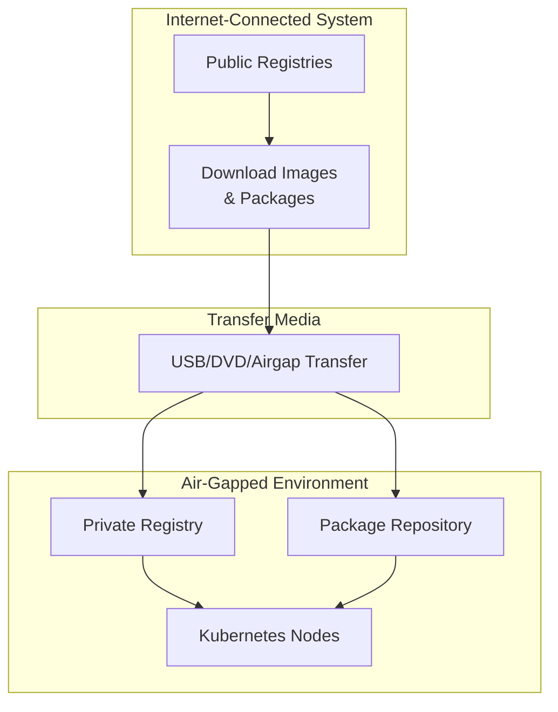

# How to Install Kubernetes in Air-Gapped Environments

Author: [nawazdhandala](https://www.github.com/nawazdhandala)

Tags: Kubernetes, Air-Gapped, Offline, Installation, Security, DevOps

Description: Learn how to install and operate Kubernetes clusters in air-gapped environments without internet access using private registries and offline packages.

---

Air-gapped Kubernetes installations are required in secure environments without internet access. This guide covers preparing offline packages, setting up private registries, and deploying Kubernetes in isolated networks.

## Air-Gapped Architecture



## Prerequisites Collection

### List Required Images

```bash
#!/bin/bash
# list-required-images.sh

# Kubernetes core images
KUBE_VERSION="v1.28.0"
kubeadm config images list --kubernetes-version=$KUBE_VERSION > images.txt

# Add common add-on images
cat >> images.txt << EOF
docker.io/calico/cni:v3.26.1
docker.io/calico/node:v3.26.1
docker.io/calico/kube-controllers:v3.26.1
k8s.gcr.io/metrics-server/metrics-server:v0.6.4
k8s.gcr.io/ingress-nginx/controller:v1.8.0
k8s.gcr.io/coredns/coredns:v1.10.1
docker.io/library/nginx:1.25
docker.io/library/busybox:1.36
quay.io/coreos/flannel:v0.22.0
EOF

echo "Images to download:"
cat images.txt
```

### Download Images

```bash
#!/bin/bash
# download-images.sh

# Read images and pull them
while read image; do
    echo "Pulling $image..."
    docker pull $image
done < images.txt

# Save images to tar archive
echo "Saving images to archive..."
docker save $(cat images.txt | tr '\n' ' ') -o kubernetes-images.tar

# Compress the archive
gzip kubernetes-images.tar
echo "Created kubernetes-images.tar.gz"
```

### Download Packages

```bash
#!/bin/bash
# download-packages.sh

KUBE_VERSION="1.28.0"

# For RHEL/CentOS
mkdir -p packages/rhel

# Download RPM packages
yumdownloader --destdir=packages/rhel --resolve \
    kubelet-$KUBE_VERSION \
    kubeadm-$KUBE_VERSION \
    kubectl-$KUBE_VERSION \
    containerd.io \
    container-selinux

# For Ubuntu/Debian
mkdir -p packages/debian

# Download DEB packages
apt-get download \
    kubelet=$KUBE_VERSION-00 \
    kubeadm=$KUBE_VERSION-00 \
    kubectl=$KUBE_VERSION-00 \
    containerd.io

mv *.deb packages/debian/

# Create archive
tar -czvf kubernetes-packages.tar.gz packages/
```

## Set Up Private Registry

### Install Harbor (Recommended)

```bash
# On connected system, download Harbor offline installer
wget https://github.com/goharbor/harbor/releases/download/v2.9.0/harbor-offline-installer-v2.9.0.tgz

# Transfer to air-gapped environment
# Then on air-gapped system:
tar xvf harbor-offline-installer-v2.9.0.tgz
cd harbor

# Configure harbor
cp harbor.yml.tmpl harbor.yml

# Edit harbor.yml
cat > harbor.yml << EOF
hostname: registry.airgap.local
http:
  port: 80
https:
  port: 443
  certificate: /etc/harbor/certs/registry.crt
  private_key: /etc/harbor/certs/registry.key
harbor_admin_password: Harbor12345
database:
  password: root123
data_volume: /data/harbor
EOF

# Install Harbor
./install.sh --with-notary --with-trivy
```

### Simple Docker Registry

```bash
# For simpler setups, use Docker registry
# On air-gapped system with Docker installed

# Create registry directories
mkdir -p /opt/registry/{data,certs,auth}

# Generate self-signed certificate
openssl req -x509 -nodes -days 365 -newkey rsa:2048 \
    -keyout /opt/registry/certs/registry.key \
    -out /opt/registry/certs/registry.crt \
    -subj "/CN=registry.airgap.local"

# Start registry
docker run -d \
    --restart=always \
    --name registry \
    -p 5000:5000 \
    -v /opt/registry/data:/var/lib/registry \
    -v /opt/registry/certs:/certs \
    -e REGISTRY_HTTP_TLS_CERTIFICATE=/certs/registry.crt \
    -e REGISTRY_HTTP_TLS_KEY=/certs/registry.key \
    registry:2
```

### Load Images to Private Registry

```bash
#!/bin/bash
# load-images.sh

REGISTRY="registry.airgap.local:5000"

# Load images from archive
gunzip kubernetes-images.tar.gz
docker load -i kubernetes-images.tar

# Tag and push to private registry
while read image; do
    # Get image name without registry
    IMAGE_NAME=$(echo $image | sed 's|.*/||')
    
    # Tag for private registry
    docker tag $image $REGISTRY/$IMAGE_NAME
    
    # Push to private registry
    docker push $REGISTRY/$IMAGE_NAME
    
    echo "Pushed $REGISTRY/$IMAGE_NAME"
done < images.txt
```

## Configure Nodes

### Trust Private Registry

```bash
#!/bin/bash
# configure-registry-trust.sh

REGISTRY="registry.airgap.local:5000"
CERT_PATH="/opt/registry/certs/registry.crt"

# Copy certificate to all nodes
for node in node1 node2 node3; do
    # Create cert directory
    ssh $node "mkdir -p /etc/docker/certs.d/$REGISTRY"
    ssh $node "mkdir -p /etc/containerd/certs.d/$REGISTRY"
    
    # Copy certificate
    scp $CERT_PATH $node:/etc/docker/certs.d/$REGISTRY/ca.crt
    scp $CERT_PATH $node:/usr/local/share/ca-certificates/registry.crt
    
    # Update CA certificates
    ssh $node "update-ca-certificates"
done
```

### Configure containerd

```bash
# /etc/containerd/config.toml

[plugins."io.containerd.grpc.v1.cri".registry]
  [plugins."io.containerd.grpc.v1.cri".registry.mirrors]
    [plugins."io.containerd.grpc.v1.cri".registry.mirrors."docker.io"]
      endpoint = ["https://registry.airgap.local:5000"]
    [plugins."io.containerd.grpc.v1.cri".registry.mirrors."k8s.gcr.io"]
      endpoint = ["https://registry.airgap.local:5000"]
    [plugins."io.containerd.grpc.v1.cri".registry.mirrors."gcr.io"]
      endpoint = ["https://registry.airgap.local:5000"]
    [plugins."io.containerd.grpc.v1.cri".registry.mirrors."quay.io"]
      endpoint = ["https://registry.airgap.local:5000"]
  
  [plugins."io.containerd.grpc.v1.cri".registry.configs]
    [plugins."io.containerd.grpc.v1.cri".registry.configs."registry.airgap.local:5000".tls]
      ca_file = "/etc/containerd/certs.d/registry.airgap.local:5000/ca.crt"
```

```bash
# Restart containerd
sudo systemctl restart containerd
```

## Install Kubernetes

### Install Packages Offline

```bash
#!/bin/bash
# install-packages.sh

# Extract packages
tar -xzvf kubernetes-packages.tar.gz

# For RHEL/CentOS
cd packages/rhel
sudo rpm -ivh *.rpm --nodeps

# For Ubuntu/Debian
cd packages/debian
sudo dpkg -i *.deb
sudo apt-get install -f
```

### Initialize Cluster with Private Registry

```yaml
# kubeadm-config.yaml
apiVersion: kubeadm.k8s.io/v1beta3
kind: ClusterConfiguration
kubernetesVersion: v1.28.0
imageRepository: registry.airgap.local:5000
networking:
  podSubnet: 10.244.0.0/16
  serviceSubnet: 10.96.0.0/12
apiServer:
  extraArgs:
    audit-log-path: /var/log/kubernetes/audit.log
    audit-policy-file: /etc/kubernetes/audit-policy.yaml
controllerManager:
  extraArgs:
    bind-address: 0.0.0.0
scheduler:
  extraArgs:
    bind-address: 0.0.0.0
---
apiVersion: kubeadm.k8s.io/v1beta3
kind: InitConfiguration
nodeRegistration:
  criSocket: unix:///var/run/containerd/containerd.sock
```

```bash
# Initialize cluster
sudo kubeadm init --config kubeadm-config.yaml

# Configure kubectl
mkdir -p $HOME/.kube
sudo cp -i /etc/kubernetes/admin.conf $HOME/.kube/config
sudo chown $(id -u):$(id -g) $HOME/.kube/config
```

### Install CNI (Calico) Offline

```yaml
# calico-airgap.yaml
# Download original manifest and modify image references
# Change: docker.io/calico/* to registry.airgap.local:5000/calico/*

apiVersion: operator.tigera.io/v1
kind: Installation
metadata:
  name: default
spec:
  registry: registry.airgap.local:5000
  calicoNetwork:
    bgp: Disabled
    ipPools:
      - blockSize: 26
        cidr: 10.244.0.0/16
        encapsulation: VXLANCrossSubnet
        natOutgoing: Enabled
        nodeSelector: all()
```

```bash
# Apply CNI
kubectl apply -f calico-airgap.yaml
```

## Deploy Applications Offline

### Modify Helm Charts

```bash
#!/bin/bash
# modify-helm-chart.sh

CHART_PATH=$1
PRIVATE_REGISTRY="registry.airgap.local:5000"

# Find and replace image references in values.yaml
sed -i "s|docker.io/|$PRIVATE_REGISTRY/|g" $CHART_PATH/values.yaml
sed -i "s|gcr.io/|$PRIVATE_REGISTRY/|g" $CHART_PATH/values.yaml
sed -i "s|k8s.gcr.io/|$PRIVATE_REGISTRY/|g" $CHART_PATH/values.yaml
sed -i "s|quay.io/|$PRIVATE_REGISTRY/|g" $CHART_PATH/values.yaml
```

### Create ImagePullSecret

```bash
# Create secret for private registry
kubectl create secret docker-registry airgap-registry \
    --docker-server=registry.airgap.local:5000 \
    --docker-username=admin \
    --docker-password=Harbor12345

# Patch default service account
kubectl patch serviceaccount default -p '{"imagePullSecrets": [{"name": "airgap-registry"}]}'
```

### Deploy with Modified Images

```yaml
# app-deployment-airgap.yaml
apiVersion: apps/v1
kind: Deployment
metadata:
  name: myapp
spec:
  replicas: 3
  selector:
    matchLabels:
      app: myapp
  template:
    metadata:
      labels:
        app: myapp
    spec:
      # Use private registry
      imagePullSecrets:
        - name: airgap-registry
      containers:
        - name: myapp
          # Changed from docker.io/nginx:latest
          image: registry.airgap.local:5000/nginx:latest
          ports:
            - containerPort: 80
```

## Maintenance Scripts

### Update Images Script

```bash
#!/bin/bash
# update-images.sh

# On connected system
NEW_IMAGES="
nginx:1.26
redis:7.2
postgresql:16
"

# Pull new images
for image in $NEW_IMAGES; do
    docker pull $image
done

# Save to archive
docker save $NEW_IMAGES -o update-images.tar
gzip update-images.tar

# Transfer to air-gapped environment
# Then on air-gapped system:
gunzip update-images.tar.gz
docker load -i update-images.tar

REGISTRY="registry.airgap.local:5000"
for image in $NEW_IMAGES; do
    IMAGE_NAME=$(echo $image | tr '/' '_')
    docker tag $image $REGISTRY/$IMAGE_NAME
    docker push $REGISTRY/$IMAGE_NAME
done
```

### Backup Script

```bash
#!/bin/bash
# backup-airgap-cluster.sh

BACKUP_DIR="/backup/kubernetes-$(date +%Y%m%d)"
mkdir -p $BACKUP_DIR

# Backup etcd
ETCDCTL_API=3 etcdctl snapshot save $BACKUP_DIR/etcd-snapshot.db \
    --endpoints=https://127.0.0.1:2379 \
    --cacert=/etc/kubernetes/pki/etcd/ca.crt \
    --cert=/etc/kubernetes/pki/etcd/server.crt \
    --key=/etc/kubernetes/pki/etcd/server.key

# Backup kubernetes manifests
cp -r /etc/kubernetes $BACKUP_DIR/

# Backup all resources
kubectl get all --all-namespaces -o yaml > $BACKUP_DIR/all-resources.yaml

# Backup registry data
tar -czvf $BACKUP_DIR/registry-data.tar.gz /opt/registry/data

echo "Backup completed: $BACKUP_DIR"
```

## Validation

### Verify Installation

```bash
#!/bin/bash
# verify-airgap-installation.sh

echo "=== Node Status ==="
kubectl get nodes -o wide

echo ""
echo "=== System Pods ==="
kubectl get pods -n kube-system

echo ""
echo "=== Registry Access ==="
curl -k https://registry.airgap.local:5000/v2/_catalog

echo ""
echo "=== Test Pod ==="
kubectl run test-pod --image=registry.airgap.local:5000/busybox:1.36 --rm -it -- echo "Air-gapped installation working!"

echo ""
echo "=== Image Pull Test ==="
kubectl run nginx-test --image=registry.airgap.local:5000/nginx:latest --port=80
kubectl wait --for=condition=ready pod/nginx-test --timeout=60s
kubectl delete pod nginx-test
```

## Troubleshooting

### Common Issues

```bash
# Check registry connectivity
curl -k https://registry.airgap.local:5000/v2/

# Check containerd can pull
crictl pull registry.airgap.local:5000/nginx:latest

# Check certificate trust
openssl s_client -connect registry.airgap.local:5000 -showcerts

# Debug image pull
kubectl describe pod <pod-name> | grep -A 10 Events

# Check containerd logs
journalctl -u containerd -f
```

### DNS Configuration

```bash
# Ensure internal DNS resolves registry
cat >> /etc/hosts << EOF
10.0.0.10 registry.airgap.local
EOF

# Or configure CoreDNS
kubectl edit configmap coredns -n kube-system
```

## Conclusion

Air-gapped Kubernetes installations require careful planning:

1. **Download everything** - Images, packages, Helm charts
2. **Private registry** - Harbor or Docker registry for images
3. **Configure trust** - TLS certificates on all nodes
4. **Modify manifests** - Update image references
5. **Automate updates** - Scripts for ongoing maintenance

For monitoring your air-gapped Kubernetes clusters, check out [OneUptime's on-premise monitoring](https://oneuptime.com/enterprise/overview).

## Related Resources

- [How to Backup with Velero](https://oneuptime.com/blog/post/kubernetes-velero-backup-restore/view)
- [How to Upgrade Kubernetes with Zero Downtime](https://oneuptime.com/blog/post/kubernetes-upgrade-zero-downtime/view)
- [How to Build Helm Charts](https://oneuptime.com/blog/post/kubernetes-helm-charts-from-scratch/view)
