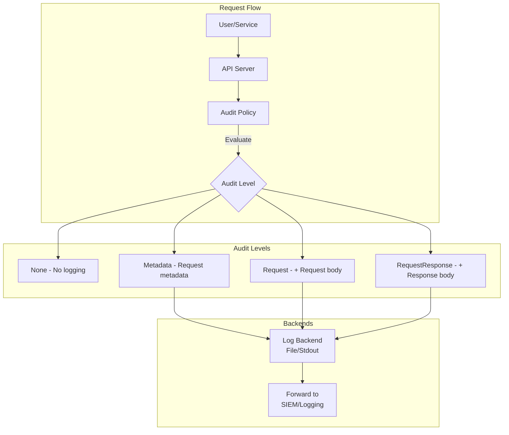

# How to Implement Kubernetes Audit Logging for Compliance

Author: [nawazdhandala](https://www.github.com/nawazdhandala)

Tags: Kubernetes, Audit Logging, Compliance, Security, RBAC, DevOps

Description: Learn how to configure Kubernetes audit logging to meet compliance requirements, track API activity, and detect security threats.

---

Kubernetes audit logging provides a chronological record of all API server activity. This guide covers configuring audit policies, storing audit logs, and analyzing them for compliance and security.

## Audit Logging Overview



| Audit Level | Content Logged |
|-------------|----------------|
| None | Nothing logged |
| Metadata | Request metadata (user, timestamp, resource) |
| Request | Metadata + request body |
| RequestResponse | Metadata + request body + response body |

## Configure Audit Policy

### Basic Audit Policy

```yaml
# /etc/kubernetes/audit-policy.yaml
apiVersion: audit.k8s.io/v1
kind: Policy
rules:
  # Don't log read requests to certain non-resource URLs
  - level: None
    nonResourceURLs:
      - /healthz*
      - /version
      - /swagger*
      - /readyz
      - /livez

  # Don't log watch requests (too noisy)
  - level: None
    verbs:
      - watch

  # Don't log kube-proxy read-only access
  - level: None
    users:
      - system:kube-proxy
    verbs:
      - get
      - list

  # Log all secret access at Metadata level
  - level: Metadata
    resources:
      - group: ""
        resources:
          - secrets
          - configmaps

  # Log authentication attempts
  - level: RequestResponse
    resources:
      - group: "authentication.k8s.io"
        resources:
          - tokenreviews

  # Log RBAC changes
  - level: RequestResponse
    resources:
      - group: "rbac.authorization.k8s.io"
        resources:
          - clusterroles
          - clusterrolebindings
          - roles
          - rolebindings

  # Log pod exec and attach
  - level: Request
    resources:
      - group: ""
        resources:
          - pods/exec
          - pods/attach
          - pods/portforward

  # Log all write operations
  - level: Request
    verbs:
      - create
      - update
      - patch
      - delete
      - deletecollection

  # Log everything else at Metadata level
  - level: Metadata
    omitStages:
      - RequestReceived
```

### Comprehensive Compliance Policy

```yaml
# /etc/kubernetes/audit-policy-compliance.yaml
apiVersion: audit.k8s.io/v1
kind: Policy
# Omit request received stage for all events
omitStages:
  - RequestReceived

rules:
  # 1. Exclude noisy endpoints
  - level: None
    nonResourceURLs:
      - /healthz*
      - /version
      - /swagger*
      - /readyz
      - /livez
      - /metrics
      - /openapi/*

  # 2. Exclude system users for routine operations
  - level: None
    users:
      - system:apiserver
      - system:kube-scheduler
      - system:kube-controller-manager
    verbs:
      - get
      - list
      - watch

  # 3. Critical: Full audit of authentication/authorization
  - level: RequestResponse
    resources:
      - group: "authentication.k8s.io"
      - group: "authorization.k8s.io"
    omitStages: []

  # 4. Critical: Full audit of RBAC changes
  - level: RequestResponse
    resources:
      - group: "rbac.authorization.k8s.io"
    verbs:
      - create
      - update
      - patch
      - delete

  # 5. Critical: Secrets access
  - level: Metadata
    resources:
      - group: ""
        resources:
          - secrets

  # 6. Critical: Service account token creation
  - level: RequestResponse
    resources:
      - group: ""
        resources:
          - serviceaccounts/token

  # 7. Security: Pod exec/attach/port-forward
  - level: Request
    resources:
      - group: ""
        resources:
          - pods/exec
          - pods/attach
          - pods/portforward
          - pods/proxy

  # 8. Security: Node and namespace operations
  - level: RequestResponse
    resources:
      - group: ""
        resources:
          - nodes
          - namespaces
    verbs:
      - create
      - delete
      - patch
      - update

  # 9. Security: Network policies
  - level: RequestResponse
    resources:
      - group: "networking.k8s.io"
        resources:
          - networkpolicies

  # 10. Security: Pod security policies
  - level: RequestResponse
    resources:
      - group: "policy"
        resources:
          - podsecuritypolicies

  # 11. Security: Admission webhooks
  - level: RequestResponse
    resources:
      - group: "admissionregistration.k8s.io"

  # 12. Workloads: Deployments, StatefulSets, DaemonSets
  - level: Request
    resources:
      - group: "apps"
    verbs:
      - create
      - update
      - patch
      - delete

  # 13. Workloads: Jobs and CronJobs
  - level: Request
    resources:
      - group: "batch"
    verbs:
      - create
      - update
      - patch
      - delete

  # 14. CRDs and custom resources
  - level: Request
    resources:
      - group: "apiextensions.k8s.io"
    verbs:
      - create
      - update
      - patch
      - delete

  # 15. Default: Log write operations
  - level: Request
    verbs:
      - create
      - update
      - patch
      - delete
      - deletecollection

  # 16. Default: Metadata for reads
  - level: Metadata
    verbs:
      - get
      - list
```

## Enable Audit Logging

### Configure API Server

```yaml
# /etc/kubernetes/manifests/kube-apiserver.yaml
apiVersion: v1
kind: Pod
metadata:
  name: kube-apiserver
  namespace: kube-system
spec:
  containers:
    - name: kube-apiserver
      command:
        - kube-apiserver
        # ... other flags ...
        
        # Audit policy
        - --audit-policy-file=/etc/kubernetes/audit-policy.yaml
        
        # Log backend
        - --audit-log-path=/var/log/kubernetes/audit/audit.log
        - --audit-log-maxage=30
        - --audit-log-maxbackup=10
        - --audit-log-maxsize=100
        
        # Optional: Webhook backend
        # - --audit-webhook-config-file=/etc/kubernetes/audit-webhook.yaml
        # - --audit-webhook-batch-buffer-size=10000
        # - --audit-webhook-batch-max-size=400
        
      volumeMounts:
        - mountPath: /etc/kubernetes/audit-policy.yaml
          name: audit-policy
          readOnly: true
        - mountPath: /var/log/kubernetes/audit
          name: audit-log
  volumes:
    - name: audit-policy
      hostPath:
        path: /etc/kubernetes/audit-policy.yaml
        type: File
    - name: audit-log
      hostPath:
        path: /var/log/kubernetes/audit
        type: DirectoryOrCreate
```

### Webhook Backend

```yaml
# /etc/kubernetes/audit-webhook.yaml
apiVersion: v1
kind: Config
clusters:
  - name: audit-webhook
    cluster:
      server: https://audit-collector.logging.svc:443
      certificate-authority: /etc/kubernetes/pki/audit-ca.crt
contexts:
  - name: audit-webhook
    context:
      cluster: audit-webhook
current-context: audit-webhook
```

## Collect and Forward Audit Logs

### Fluent Bit DaemonSet

```yaml
# fluent-bit-audit.yaml
apiVersion: v1
kind: ConfigMap
metadata:
  name: fluent-bit-audit-config
  namespace: logging
data:
  fluent-bit.conf: |
    [SERVICE]
        Flush         1
        Log_Level     info
        Daemon        off
        Parsers_File  parsers.conf

    [INPUT]
        Name              tail
        Path              /var/log/kubernetes/audit/audit.log
        Parser            json
        Tag               kube.audit
        Refresh_Interval  5
        Mem_Buf_Limit     50MB
        Skip_Long_Lines   On

    [FILTER]
        Name    record_modifier
        Match   kube.audit
        Record  cluster ${CLUSTER_NAME}
        Record  environment ${ENVIRONMENT}

    [OUTPUT]
        Name            es
        Match           kube.audit
        Host            ${ELASTICSEARCH_HOST}
        Port            ${ELASTICSEARCH_PORT}
        Logstash_Format On
        Logstash_Prefix kubernetes-audit
        Type            _doc

  parsers.conf: |
    [PARSER]
        Name        json
        Format      json
        Time_Key    requestReceivedTimestamp
        Time_Format %Y-%m-%dT%H:%M:%S.%LZ
---
apiVersion: apps/v1
kind: DaemonSet
metadata:
  name: fluent-bit-audit
  namespace: logging
spec:
  selector:
    matchLabels:
      app: fluent-bit-audit
  template:
    metadata:
      labels:
        app: fluent-bit-audit
    spec:
      nodeSelector:
        node-role.kubernetes.io/control-plane: ""
      tolerations:
        - key: node-role.kubernetes.io/control-plane
          effect: NoSchedule
      containers:
        - name: fluent-bit
          image: fluent/fluent-bit:2.1
          volumeMounts:
            - name: audit-log
              mountPath: /var/log/kubernetes/audit
              readOnly: true
            - name: config
              mountPath: /fluent-bit/etc/
          env:
            - name: CLUSTER_NAME
              value: "production-cluster"
            - name: ENVIRONMENT
              value: "production"
            - name: ELASTICSEARCH_HOST
              value: "elasticsearch.logging.svc"
            - name: ELASTICSEARCH_PORT
              value: "9200"
      volumes:
        - name: audit-log
          hostPath:
            path: /var/log/kubernetes/audit
        - name: config
          configMap:
            name: fluent-bit-audit-config
```

### Vector for Log Processing

```yaml
# vector-audit.yaml
apiVersion: v1
kind: ConfigMap
metadata:
  name: vector-config
  namespace: logging
data:
  vector.toml: |
    [sources.kubernetes_audit]
    type = "file"
    include = ["/var/log/kubernetes/audit/audit.log"]
    
    [transforms.parse_audit]
    type = "remap"
    inputs = ["kubernetes_audit"]
    source = '''
    . = parse_json!(.message)
    .cluster = "production"
    .severity = if .responseStatus.code >= 400 { "error" } else { "info" }
    '''
    
    [transforms.filter_sensitive]
    type = "filter"
    inputs = ["parse_audit"]
    condition = '''
    .verb != "watch" && 
    .objectRef.resource != "events"
    '''
    
    [sinks.elasticsearch]
    type = "elasticsearch"
    inputs = ["filter_sensitive"]
    endpoint = "http://elasticsearch.logging.svc:9200"
    index = "kubernetes-audit-%Y.%m.%d"
    
    [sinks.loki]
    type = "loki"
    inputs = ["filter_sensitive"]
    endpoint = "http://loki.logging.svc:3100"
    labels = { source = "kubernetes-audit", cluster = "{{ cluster }}" }
```

## Analyzing Audit Logs

### Elasticsearch Queries

```json
// Find secret access
{
  "query": {
    "bool": {
      "must": [
        { "match": { "objectRef.resource": "secrets" } }
      ],
      "filter": [
        { "range": { "requestReceivedTimestamp": { "gte": "now-1d" } } }
      ]
    }
  }
}

// Find failed authentication
{
  "query": {
    "bool": {
      "must": [
        { "match": { "responseStatus.code": 401 } }
      ]
    }
  }
}

// Find pod exec commands
{
  "query": {
    "bool": {
      "must": [
        { "match": { "objectRef.subresource": "exec" } }
      ]
    }
  }
}

// Find RBAC changes
{
  "query": {
    "bool": {
      "must": [
        { "match": { "objectRef.apiGroup": "rbac.authorization.k8s.io" } },
        { "terms": { "verb": ["create", "update", "patch", "delete"] } }
      ]
    }
  }
}
```

### Alert Rules

```yaml
# prometheus-audit-alerts.yaml
apiVersion: monitoring.coreos.com/v1
kind: PrometheusRule
metadata:
  name: audit-alerts
  namespace: monitoring
spec:
  groups:
    - name: kubernetes-audit
      rules:
        - alert: HighAuthenticationFailures
          expr: |
            sum(rate(apiserver_audit_event_total{response_code="401"}[5m])) > 10
          for: 5m
          labels:
            severity: warning
          annotations:
            summary: "High number of authentication failures"
            description: "More than 10 auth failures per second"

        - alert: SecretAccessAnomaly
          expr: |
            sum(rate(apiserver_audit_event_total{resource="secrets",verb="get"}[5m])) > 100
          for: 5m
          labels:
            severity: warning
          annotations:
            summary: "Unusual secret access activity"

        - alert: RBACChanges
          expr: |
            sum(increase(apiserver_audit_event_total{
              apigroup="rbac.authorization.k8s.io",
              verb=~"create|update|patch|delete"
            }[1h])) > 0
          labels:
            severity: info
          annotations:
            summary: "RBAC changes detected"
```

## Compliance Reporting

### Generate Compliance Report

```bash
#!/bin/bash
# generate-audit-report.sh

START_DATE=$1
END_DATE=$2
OUTPUT_DIR="/reports/audit"

mkdir -p $OUTPUT_DIR

# Extract audit events from Elasticsearch
curl -X GET "elasticsearch:9200/kubernetes-audit-*/_search" \
  -H "Content-Type: application/json" \
  -d '{
    "query": {
      "range": {
        "requestReceivedTimestamp": {
          "gte": "'$START_DATE'",
          "lte": "'$END_DATE'"
        }
      }
    },
    "size": 10000
  }' > $OUTPUT_DIR/raw-events.json

# Generate summary
python3 << EOF
import json
from collections import defaultdict
from datetime import datetime

with open('$OUTPUT_DIR/raw-events.json') as f:
    data = json.load(f)

events = data['hits']['hits']
summary = defaultdict(int)
users = defaultdict(int)
resources = defaultdict(int)
failed = []

for event in events:
    src = event['_source']
    summary[src.get('verb', 'unknown')] += 1
    users[src.get('user', {}).get('username', 'unknown')] += 1
    resources[src.get('objectRef', {}).get('resource', 'unknown')] += 1
    
    if src.get('responseStatus', {}).get('code', 200) >= 400:
        failed.append(src)

report = {
    'period': {'start': '$START_DATE', 'end': '$END_DATE'},
    'total_events': len(events),
    'by_verb': dict(summary),
    'by_user': dict(users),
    'by_resource': dict(resources),
    'failed_count': len(failed),
    'generated_at': datetime.now().isoformat()
}

with open('$OUTPUT_DIR/compliance-report.json', 'w') as f:
    json.dump(report, f, indent=2)

print(json.dumps(report, indent=2))
EOF
```

### CIS Benchmark Checks

```yaml
# cis-audit-checks.yaml
# Check for audit policy existence and configuration
apiVersion: batch/v1
kind: Job
metadata:
  name: cis-audit-check
spec:
  template:
    spec:
      containers:
        - name: checker
          image: aquasec/kube-bench:latest
          command:
            - kube-bench
            - run
            - --targets
            - master
            - --check
            - 1.2.19,1.2.20,1.2.21,1.2.22
          volumeMounts:
            - name: etc-kubernetes
              mountPath: /etc/kubernetes
              readOnly: true
      volumes:
        - name: etc-kubernetes
          hostPath:
            path: /etc/kubernetes
      restartPolicy: Never
      nodeSelector:
        node-role.kubernetes.io/control-plane: ""
      tolerations:
        - key: node-role.kubernetes.io/control-plane
          effect: NoSchedule
```

## Audit Dashboard

### Grafana Dashboard JSON

```json
{
  "title": "Kubernetes Audit Dashboard",
  "panels": [
    {
      "title": "API Requests by Verb",
      "type": "piechart",
      "targets": [
        {
          "expr": "sum(apiserver_audit_event_total) by (verb)"
        }
      ]
    },
    {
      "title": "Failed Requests",
      "type": "timeseries",
      "targets": [
        {
          "expr": "sum(rate(apiserver_audit_event_total{response_code=~'4..|5..'}[5m])) by (response_code)"
        }
      ]
    },
    {
      "title": "Secret Access",
      "type": "timeseries",
      "targets": [
        {
          "expr": "sum(rate(apiserver_audit_event_total{resource='secrets'}[5m])) by (verb)"
        }
      ]
    },
    {
      "title": "Top Users by Activity",
      "type": "table",
      "targets": [
        {
          "expr": "topk(10, sum(apiserver_audit_event_total) by (user))"
        }
      ]
    }
  ]
}
```

## Conclusion

Kubernetes audit logging is essential for:

1. **Compliance** - Meet regulatory requirements (SOC2, HIPAA, PCI-DSS)
2. **Security** - Detect unauthorized access and anomalies
3. **Forensics** - Investigate incidents with detailed records
4. **Monitoring** - Track API activity and usage patterns
5. **Accountability** - Know who did what and when

For monitoring your audit logs and compliance status, check out [OneUptime's security monitoring](https://oneuptime.com/product/metrics).

## Related Resources

- [How to Implement Pod Security Standards](https://oneuptime.com/blog/post/2026-01-06-kubernetes-pod-security-standards/view)
- [How to Configure RBAC](https://oneuptime.com/blog/post/kubernetes-rbac-configuration/view)
- [How to Set Up OPA Gatekeeper](https://oneuptime.com/blog/post/kubernetes-opa-gatekeeper-policies/view)
