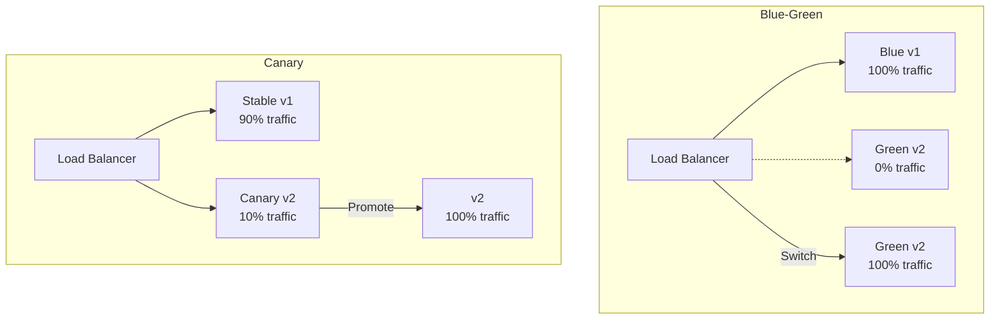

# How to Implement Blue-Green and Canary Deployments in Kubernetes

Author: [nawazdhandala](https://www.github.com/nawazdhandala)

Tags: Kubernetes, Blue-Green, Canary, Deployments, Progressive Delivery, DevOps

Description: Learn how to implement blue-green and canary deployment strategies in Kubernetes for safe, zero-downtime releases with easy rollback capabilities.

---

Blue-green and canary deployments are progressive delivery strategies that minimize deployment risk by gradually shifting traffic to new versions. This guide covers implementing both strategies in Kubernetes.

## Deployment Strategies Overview



| Strategy | Risk | Rollback Speed | Resource Usage |
|----------|------|----------------|----------------|
| Blue-Green | Low | Instant | 2x during deployment |
| Canary | Very Low | Fast | 1.1x during deployment |
| Rolling Update | Medium | Slow | 1.2x during deployment |

## Blue-Green Deployment

### Manual Blue-Green with Services

```yaml
# blue-deployment.yaml
apiVersion: apps/v1
kind: Deployment
metadata:
  name: myapp-blue
  labels:
    app: myapp
    version: blue
spec:
  replicas: 3
  selector:
    matchLabels:
      app: myapp
      version: blue
  template:
    metadata:
      labels:
        app: myapp
        version: blue
    spec:
      containers:
        - name: myapp
          image: myapp:v1.0.0
          ports:
            - containerPort: 8080
---
# green-deployment.yaml
apiVersion: apps/v1
kind: Deployment
metadata:
  name: myapp-green
  labels:
    app: myapp
    version: green
spec:
  replicas: 3
  selector:
    matchLabels:
      app: myapp
      version: green
  template:
    metadata:
      labels:
        app: myapp
        version: green
    spec:
      containers:
        - name: myapp
          image: myapp:v2.0.0
          ports:
            - containerPort: 8080
---
# service.yaml - Points to active deployment
apiVersion: v1
kind: Service
metadata:
  name: myapp
spec:
  selector:
    app: myapp
    version: blue  # Switch to 'green' to change traffic
  ports:
    - port: 80
      targetPort: 8080
```

### Blue-Green Switch Script

```bash
#!/bin/bash
# blue-green-switch.sh

SERVICE="myapp"
NAMESPACE="production"
CURRENT=$(kubectl get svc $SERVICE -n $NAMESPACE -o jsonpath='{.spec.selector.version}')

if [ "$CURRENT" == "blue" ]; then
  NEW_VERSION="green"
else
  NEW_VERSION="blue"
fi

echo "Switching from $CURRENT to $NEW_VERSION"

# Verify new deployment is ready
READY=$(kubectl get deployment myapp-$NEW_VERSION -n $NAMESPACE \
  -o jsonpath='{.status.readyReplicas}')
DESIRED=$(kubectl get deployment myapp-$NEW_VERSION -n $NAMESPACE \
  -o jsonpath='{.spec.replicas}')

if [ "$READY" != "$DESIRED" ]; then
  echo "ERROR: New deployment not ready ($READY/$DESIRED)"
  exit 1
fi

# Switch traffic
kubectl patch svc $SERVICE -n $NAMESPACE \
  -p "{\"spec\":{\"selector\":{\"version\":\"$NEW_VERSION\"}}}"

echo "Switched to $NEW_VERSION"

# Verify switch
NEW_CURRENT=$(kubectl get svc $SERVICE -n $NAMESPACE -o jsonpath='{.spec.selector.version}')
echo "Service now pointing to: $NEW_CURRENT"
```

### Blue-Green with Ingress

```yaml
# blue-green-ingress.yaml
apiVersion: networking.k8s.io/v1
kind: Ingress
metadata:
  name: myapp
  annotations:
    nginx.ingress.kubernetes.io/canary: "false"
spec:
  ingressClassName: nginx
  rules:
    - host: myapp.example.com
      http:
        paths:
          - path: /
            pathType: Prefix
            backend:
              service:
                name: myapp-blue  # Switch to myapp-green for blue-green
                port:
                  number: 80
---
# Preview ingress for testing green before switching
apiVersion: networking.k8s.io/v1
kind: Ingress
metadata:
  name: myapp-preview
spec:
  ingressClassName: nginx
  rules:
    - host: preview.myapp.example.com
      http:
        paths:
          - path: /
            pathType: Prefix
            backend:
              service:
                name: myapp-green
                port:
                  number: 80
```

## Canary Deployment

### Manual Canary with Replica Ratios

```yaml
# stable-deployment.yaml
apiVersion: apps/v1
kind: Deployment
metadata:
  name: myapp-stable
spec:
  replicas: 9  # 90% of traffic
  selector:
    matchLabels:
      app: myapp
      track: stable
  template:
    metadata:
      labels:
        app: myapp
        track: stable
    spec:
      containers:
        - name: myapp
          image: myapp:v1.0.0
          ports:
            - containerPort: 8080
---
# canary-deployment.yaml
apiVersion: apps/v1
kind: Deployment
metadata:
  name: myapp-canary
spec:
  replicas: 1  # 10% of traffic
  selector:
    matchLabels:
      app: myapp
      track: canary
  template:
    metadata:
      labels:
        app: myapp
        track: canary
    spec:
      containers:
        - name: myapp
          image: myapp:v2.0.0
          ports:
            - containerPort: 8080
---
# service.yaml - Routes to both stable and canary
apiVersion: v1
kind: Service
metadata:
  name: myapp
spec:
  selector:
    app: myapp  # Matches both stable and canary
  ports:
    - port: 80
      targetPort: 8080
```

### Canary with NGINX Ingress

```yaml
# Main ingress (stable)
apiVersion: networking.k8s.io/v1
kind: Ingress
metadata:
  name: myapp-stable
spec:
  ingressClassName: nginx
  rules:
    - host: myapp.example.com
      http:
        paths:
          - path: /
            pathType: Prefix
            backend:
              service:
                name: myapp-stable
                port:
                  number: 80
---
# Canary ingress
apiVersion: networking.k8s.io/v1
kind: Ingress
metadata:
  name: myapp-canary
  annotations:
    nginx.ingress.kubernetes.io/canary: "true"
    nginx.ingress.kubernetes.io/canary-weight: "10"  # 10% to canary
spec:
  ingressClassName: nginx
  rules:
    - host: myapp.example.com
      http:
        paths:
          - path: /
            pathType: Prefix
            backend:
              service:
                name: myapp-canary
                port:
                  number: 80
```

### Header-Based Canary Routing

```yaml
# Route specific users to canary
apiVersion: networking.k8s.io/v1
kind: Ingress
metadata:
  name: myapp-canary-header
  annotations:
    nginx.ingress.kubernetes.io/canary: "true"
    nginx.ingress.kubernetes.io/canary-by-header: "X-Canary"
    nginx.ingress.kubernetes.io/canary-by-header-value: "true"
spec:
  ingressClassName: nginx
  rules:
    - host: myapp.example.com
      http:
        paths:
          - path: /
            pathType: Prefix
            backend:
              service:
                name: myapp-canary
                port:
                  number: 80
```

## Argo Rollouts

### Install Argo Rollouts

```bash
# Install Argo Rollouts controller
kubectl create namespace argo-rollouts
kubectl apply -n argo-rollouts -f https://github.com/argoproj/argo-rollouts/releases/latest/download/install.yaml

# Install kubectl plugin
curl -LO https://github.com/argoproj/argo-rollouts/releases/latest/download/kubectl-argo-rollouts-linux-amd64
chmod +x kubectl-argo-rollouts-linux-amd64
sudo mv kubectl-argo-rollouts-linux-amd64 /usr/local/bin/kubectl-argo-rollouts
```

### Blue-Green Rollout

```yaml
# blue-green-rollout.yaml
apiVersion: argoproj.io/v1alpha1
kind: Rollout
metadata:
  name: myapp
spec:
  replicas: 3
  revisionHistoryLimit: 2
  selector:
    matchLabels:
      app: myapp
  template:
    metadata:
      labels:
        app: myapp
    spec:
      containers:
        - name: myapp
          image: myapp:v1.0.0
          ports:
            - containerPort: 8080
          readinessProbe:
            httpGet:
              path: /ready
              port: 8080
            initialDelaySeconds: 5
            periodSeconds: 5
  strategy:
    blueGreen:
      # Service pointing to active (blue) version
      activeService: myapp-active
      # Service pointing to preview (green) version
      previewService: myapp-preview
      # Auto-promote after successful analysis
      autoPromotionEnabled: true
      # Seconds to wait before auto-promotion
      autoPromotionSeconds: 60
      # Scale down previous version
      scaleDownDelaySeconds: 30
---
apiVersion: v1
kind: Service
metadata:
  name: myapp-active
spec:
  selector:
    app: myapp
  ports:
    - port: 80
      targetPort: 8080
---
apiVersion: v1
kind: Service
metadata:
  name: myapp-preview
spec:
  selector:
    app: myapp
  ports:
    - port: 80
      targetPort: 8080
```

### Canary Rollout

```yaml
# canary-rollout.yaml
apiVersion: argoproj.io/v1alpha1
kind: Rollout
metadata:
  name: myapp
spec:
  replicas: 10
  selector:
    matchLabels:
      app: myapp
  template:
    metadata:
      labels:
        app: myapp
    spec:
      containers:
        - name: myapp
          image: myapp:v1.0.0
          ports:
            - containerPort: 8080
  strategy:
    canary:
      # Canary Service
      canaryService: myapp-canary
      stableService: myapp-stable
      
      # Traffic management with NGINX
      trafficRouting:
        nginx:
          stableIngress: myapp-stable
          additionalIngressAnnotations:
            canary-by-header: X-Canary
      
      # Canary steps
      steps:
        # Step 1: 10% traffic
        - setWeight: 10
        - pause: {duration: 5m}
        
        # Step 2: 25% traffic
        - setWeight: 25
        - pause: {duration: 5m}
        
        # Step 3: 50% traffic
        - setWeight: 50
        - pause: {duration: 5m}
        
        # Step 4: 75% traffic
        - setWeight: 75
        - pause: {duration: 5m}
        
        # Step 5: Full rollout
        - setWeight: 100
```

### Canary with Analysis

```yaml
# canary-with-analysis.yaml
apiVersion: argoproj.io/v1alpha1
kind: Rollout
metadata:
  name: myapp
spec:
  replicas: 10
  selector:
    matchLabels:
      app: myapp
  template:
    metadata:
      labels:
        app: myapp
    spec:
      containers:
        - name: myapp
          image: myapp:v1.0.0
          ports:
            - containerPort: 8080
  strategy:
    canary:
      steps:
        - setWeight: 10
        - pause: {duration: 2m}
        
        # Run analysis
        - analysis:
            templates:
              - templateName: success-rate
            args:
              - name: service-name
                value: myapp-canary
        
        - setWeight: 50
        - pause: {duration: 5m}
        
        - analysis:
            templates:
              - templateName: success-rate
              - templateName: latency-check
        
        - setWeight: 100
---
# AnalysisTemplate for success rate
apiVersion: argoproj.io/v1alpha1
kind: AnalysisTemplate
metadata:
  name: success-rate
spec:
  args:
    - name: service-name
  metrics:
    - name: success-rate
      interval: 1m
      count: 5
      successCondition: result[0] >= 0.95
      failureLimit: 3
      provider:
        prometheus:
          address: http://prometheus.monitoring:9090
          query: |
            sum(rate(http_requests_total{service="{{args.service-name}}",status=~"2.."}[5m])) /
            sum(rate(http_requests_total{service="{{args.service-name}}"}[5m]))
---
# AnalysisTemplate for latency
apiVersion: argoproj.io/v1alpha1
kind: AnalysisTemplate
metadata:
  name: latency-check
spec:
  metrics:
    - name: latency-p99
      interval: 1m
      count: 5
      successCondition: result[0] < 500
      failureLimit: 3
      provider:
        prometheus:
          address: http://prometheus.monitoring:9090
          query: |
            histogram_quantile(0.99, 
              sum(rate(http_request_duration_seconds_bucket{service="myapp-canary"}[5m])) by (le)
            ) * 1000
```

## Flagger for Automated Canary

### Install Flagger

```bash
# Install Flagger with NGINX support
helm repo add flagger https://flagger.app
helm install flagger flagger/flagger \
  --namespace flagger \
  --create-namespace \
  --set prometheus.install=true \
  --set meshProvider=nginx
```

### Flagger Canary Resource

```yaml
# flagger-canary.yaml
apiVersion: flagger.app/v1beta1
kind: Canary
metadata:
  name: myapp
  namespace: production
spec:
  # Target deployment
  targetRef:
    apiVersion: apps/v1
    kind: Deployment
    name: myapp
  
  # Ingress reference for traffic shifting
  ingressRef:
    apiVersion: networking.k8s.io/v1
    kind: Ingress
    name: myapp
  
  # Service configuration
  service:
    port: 80
    targetPort: 8080
  
  # Analysis configuration
  analysis:
    # Schedule interval
    interval: 1m
    # Max traffic weight
    threshold: 10
    # Max failures before rollback
    maxWeight: 50
    # Increment step
    stepWeight: 10
    
    # Metrics for analysis
    metrics:
      - name: request-success-rate
        thresholdRange:
          min: 99
        interval: 1m
      - name: request-duration
        thresholdRange:
          max: 500
        interval: 1m
    
    # Webhooks for notifications
    webhooks:
      - name: load-test
        url: http://flagger-loadtester.flagger/
        timeout: 5s
        metadata:
          type: cmd
          cmd: "hey -z 1m -q 10 -c 2 http://myapp-canary.production/"
```

## Monitoring Deployments

### Deployment Metrics Dashboard

```promql
# Canary vs Stable error rates
sum(rate(http_requests_total{status=~"5..",deployment="canary"}[5m])) /
sum(rate(http_requests_total{deployment="canary"}[5m]))

# Latency comparison
histogram_quantile(0.99, 
  sum(rate(http_request_duration_seconds_bucket[5m])) by (deployment, le)
)

# Request rate by deployment
sum(rate(http_requests_total[5m])) by (deployment)
```

### Rollout Status Commands

```bash
# Argo Rollouts status
kubectl argo rollouts status myapp
kubectl argo rollouts get rollout myapp

# Watch rollout progress
kubectl argo rollouts get rollout myapp --watch

# Promote canary manually
kubectl argo rollouts promote myapp

# Abort rollout (rollback)
kubectl argo rollouts abort myapp

# Retry failed rollout
kubectl argo rollouts retry rollout myapp
```

## Best Practices

### 1. Always Have Readiness Probes

```yaml
readinessProbe:
  httpGet:
    path: /ready
    port: 8080
  initialDelaySeconds: 5
  periodSeconds: 5
  failureThreshold: 3
```

### 2. Use Meaningful Analysis Metrics

```yaml
metrics:
  - name: error-rate
    successCondition: result[0] < 0.01  # Less than 1% errors
  - name: latency-p99
    successCondition: result[0] < 500   # Less than 500ms
  - name: saturation
    successCondition: result[0] < 0.8   # Less than 80% CPU
```

### 3. Configure Appropriate Timeouts

```yaml
strategy:
  canary:
    steps:
      - setWeight: 10
      - pause: {duration: 5m}  # Enough time to detect issues
```

## Conclusion

Blue-green and canary deployments significantly reduce release risk. Key takeaways:

1. **Blue-green for instant rollback** - Double resources, instant switch
2. **Canary for gradual rollout** - Lower risk, early detection
3. **Automate with Argo Rollouts or Flagger** - Metrics-driven promotion
4. **Monitor throughout** - Track error rates and latency
5. **Have rollback ready** - Know how to abort quickly

For monitoring your deployments, check out [OneUptime's deployment monitoring](https://oneuptime.com/product/metrics).

## Related Resources

- [How to Set Up ArgoCD for GitOps](https://oneuptime.com/blog/post/kubernetes-argocd-gitops/view)
- [How to Build Helm Charts from Scratch](https://oneuptime.com/blog/post/2026-01-19-kubernetes-helm-charts-from-scratch/view)
- [How to Set Up Prometheus ServiceMonitor](https://oneuptime.com/blog/post/2026-01-19-kubernetes-prometheus-servicemonitor/view)
