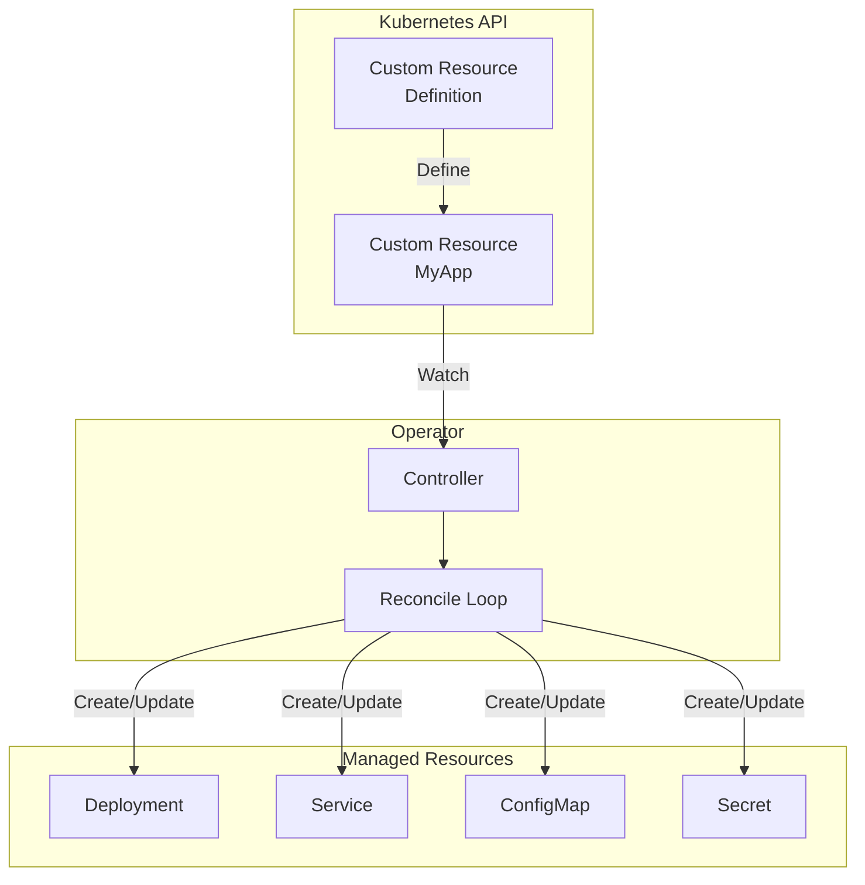

# How to Build Custom Kubernetes Operators

Author: [nawazdhandala](https://www.github.com/nawazdhandala)

Tags: Kubernetes, Operators, Custom Resources, Go, Operator SDK, DevOps

Description: Learn how to build custom Kubernetes operators to automate complex application management using the Operator SDK and controller-runtime.

---

Kubernetes Operators extend the Kubernetes API to automate the management of complex applications. This guide covers building operators from scratch using the Operator SDK and Go.

## Operator Pattern Overview



| Concept | Description |
|---------|-------------|
| Custom Resource | User-defined Kubernetes object |
| Controller | Watches resources and reconciles state |
| Reconciliation | Loop that ensures desired state = actual state |
| Finalizer | Cleanup logic before resource deletion |

## Prerequisites

```bash
# Install Operator SDK
brew install operator-sdk

# Or download directly
export ARCH=$(case $(uname -m) in x86_64) echo -n amd64 ;; aarch64) echo -n arm64 ;; *) echo -n $(uname -m) ;; esac)
export OS=$(uname | awk '{print tolower($0)}')
export OPERATOR_SDK_DL_URL=https://github.com/operator-framework/operator-sdk/releases/download/v1.32.0
curl -LO ${OPERATOR_SDK_DL_URL}/operator-sdk_${OS}_${ARCH}
chmod +x operator-sdk_${OS}_${ARCH}
sudo mv operator-sdk_${OS}_${ARCH} /usr/local/bin/operator-sdk

# Verify installation
operator-sdk version
```

## Initialize Operator Project

```bash
# Create new operator project
mkdir myapp-operator && cd myapp-operator
operator-sdk init --domain example.com --repo github.com/example/myapp-operator

# Create API (Custom Resource and Controller)
operator-sdk create api --group apps --version v1alpha1 --kind MyApp --resource --controller
```

### Project Structure

```
myapp-operator/
├── api/
│   └── v1alpha1/
│       ├── myapp_types.go      # Custom Resource definition
│       ├── groupversion_info.go
│       └── zz_generated.deepcopy.go
├── config/
│   ├── crd/                    # CRD manifests
│   ├── manager/                # Operator deployment
│   ├── rbac/                   # RBAC rules
│   └── samples/                # Example CRs
├── controllers/
│   └── myapp_controller.go     # Controller logic
├── main.go
├── Dockerfile
└── Makefile
```

## Define Custom Resource

### Types Definition

```go
// api/v1alpha1/myapp_types.go
package v1alpha1

import (
    metav1 "k8s.io/apimachinery/pkg/apis/meta/v1"
)

// MyAppSpec defines the desired state of MyApp
type MyAppSpec struct {
    // Size is the number of replicas
    // +kubebuilder:validation:Minimum=1
    // +kubebuilder:validation:Maximum=10
    // +kubebuilder:default=1
    Size int32 `json:"size,omitempty"`

    // Image is the container image
    // +kubebuilder:validation:Required
    Image string `json:"image"`

    // Port is the container port
    // +kubebuilder:validation:Minimum=1
    // +kubebuilder:validation:Maximum=65535
    // +kubebuilder:default=8080
    Port int32 `json:"port,omitempty"`

    // Resources defines resource requirements
    Resources ResourceRequirements `json:"resources,omitempty"`

    // Config is application configuration
    Config map[string]string `json:"config,omitempty"`
}

// ResourceRequirements defines resource limits
type ResourceRequirements struct {
    // CPU limit
    CPULimit string `json:"cpuLimit,omitempty"`
    // Memory limit
    MemoryLimit string `json:"memoryLimit,omitempty"`
    // CPU request
    CPURequest string `json:"cpuRequest,omitempty"`
    // Memory request
    MemoryRequest string `json:"memoryRequest,omitempty"`
}

// MyAppStatus defines the observed state of MyApp
type MyAppStatus struct {
    // Conditions represent the latest available observations
    Conditions []metav1.Condition `json:"conditions,omitempty"`
    
    // AvailableReplicas is the number of ready replicas
    AvailableReplicas int32 `json:"availableReplicas,omitempty"`
    
    // Phase represents the current phase
    // +kubebuilder:validation:Enum=Pending;Running;Failed
    Phase string `json:"phase,omitempty"`
}

//+kubebuilder:object:root=true
//+kubebuilder:subresource:status
//+kubebuilder:printcolumn:name="Size",type="integer",JSONPath=".spec.size"
//+kubebuilder:printcolumn:name="Phase",type="string",JSONPath=".status.phase"
//+kubebuilder:printcolumn:name="Age",type="date",JSONPath=".metadata.creationTimestamp"

// MyApp is the Schema for the myapps API
type MyApp struct {
    metav1.TypeMeta   `json:",inline"`
    metav1.ObjectMeta `json:"metadata,omitempty"`

    Spec   MyAppSpec   `json:"spec,omitempty"`
    Status MyAppStatus `json:"status,omitempty"`
}

//+kubebuilder:object:root=true

// MyAppList contains a list of MyApp
type MyAppList struct {
    metav1.TypeMeta `json:",inline"`
    metav1.ListMeta `json:"metadata,omitempty"`
    Items           []MyApp `json:"items"`
}

func init() {
    SchemeBuilder.Register(&MyApp{}, &MyAppList{})
}
```

## Implement Controller

### Controller Logic

```go
// controllers/myapp_controller.go
package controllers

import (
    "context"
    "fmt"
    "time"

    appsv1 "k8s.io/api/apps/v1"
    corev1 "k8s.io/api/core/v1"
    "k8s.io/apimachinery/pkg/api/errors"
    "k8s.io/apimachinery/pkg/api/resource"
    metav1 "k8s.io/apimachinery/pkg/apis/meta/v1"
    "k8s.io/apimachinery/pkg/runtime"
    "k8s.io/apimachinery/pkg/types"
    "k8s.io/apimachinery/pkg/util/intstr"
    ctrl "sigs.k8s.io/controller-runtime"
    "sigs.k8s.io/controller-runtime/pkg/client"
    "sigs.k8s.io/controller-runtime/pkg/controller/controllerutil"
    "sigs.k8s.io/controller-runtime/pkg/log"

    appsv1alpha1 "github.com/example/myapp-operator/api/v1alpha1"
)

const myappFinalizer = "apps.example.com/finalizer"

// MyAppReconciler reconciles a MyApp object
type MyAppReconciler struct {
    client.Client
    Scheme *runtime.Scheme
}

//+kubebuilder:rbac:groups=apps.example.com,resources=myapps,verbs=get;list;watch;create;update;patch;delete
//+kubebuilder:rbac:groups=apps.example.com,resources=myapps/status,verbs=get;update;patch
//+kubebuilder:rbac:groups=apps.example.com,resources=myapps/finalizers,verbs=update
//+kubebuilder:rbac:groups=apps,resources=deployments,verbs=get;list;watch;create;update;patch;delete
//+kubebuilder:rbac:groups=core,resources=services,verbs=get;list;watch;create;update;patch;delete
//+kubebuilder:rbac:groups=core,resources=configmaps,verbs=get;list;watch;create;update;patch;delete

func (r *MyAppReconciler) Reconcile(ctx context.Context, req ctrl.Request) (ctrl.Result, error) {
    logger := log.FromContext(ctx)
    logger.Info("Reconciling MyApp", "name", req.Name, "namespace", req.Namespace)

    // Fetch the MyApp instance
    myapp := &appsv1alpha1.MyApp{}
    err := r.Get(ctx, req.NamespacedName, myapp)
    if err != nil {
        if errors.IsNotFound(err) {
            logger.Info("MyApp resource not found. Ignoring since object must be deleted")
            return ctrl.Result{}, nil
        }
        logger.Error(err, "Failed to get MyApp")
        return ctrl.Result{}, err
    }

    // Check if the MyApp instance is marked to be deleted
    if myapp.GetDeletionTimestamp() != nil {
        if controllerutil.ContainsFinalizer(myapp, myappFinalizer) {
            // Run finalization logic
            if err := r.finalizeMyApp(ctx, myapp); err != nil {
                return ctrl.Result{}, err
            }

            // Remove finalizer
            controllerutil.RemoveFinalizer(myapp, myappFinalizer)
            err := r.Update(ctx, myapp)
            if err != nil {
                return ctrl.Result{}, err
            }
        }
        return ctrl.Result{}, nil
    }

    // Add finalizer if not present
    if !controllerutil.ContainsFinalizer(myapp, myappFinalizer) {
        controllerutil.AddFinalizer(myapp, myappFinalizer)
        err = r.Update(ctx, myapp)
        if err != nil {
            return ctrl.Result{}, err
        }
    }

    // Reconcile ConfigMap
    if err := r.reconcileConfigMap(ctx, myapp); err != nil {
        return ctrl.Result{}, err
    }

    // Reconcile Deployment
    if err := r.reconcileDeployment(ctx, myapp); err != nil {
        return ctrl.Result{}, err
    }

    // Reconcile Service
    if err := r.reconcileService(ctx, myapp); err != nil {
        return ctrl.Result{}, err
    }

    // Update status
    if err := r.updateStatus(ctx, myapp); err != nil {
        return ctrl.Result{}, err
    }

    // Requeue after 30 seconds to check status
    return ctrl.Result{RequeueAfter: time.Second * 30}, nil
}

func (r *MyAppReconciler) reconcileConfigMap(ctx context.Context, myapp *appsv1alpha1.MyApp) error {
    logger := log.FromContext(ctx)

    cm := &corev1.ConfigMap{
        ObjectMeta: metav1.ObjectMeta{
            Name:      myapp.Name + "-config",
            Namespace: myapp.Namespace,
        },
    }

    _, err := controllerutil.CreateOrUpdate(ctx, r.Client, cm, func() error {
        cm.Data = myapp.Spec.Config
        return controllerutil.SetControllerReference(myapp, cm, r.Scheme)
    })

    if err != nil {
        logger.Error(err, "Failed to reconcile ConfigMap")
        return err
    }

    logger.Info("ConfigMap reconciled", "name", cm.Name)
    return nil
}

func (r *MyAppReconciler) reconcileDeployment(ctx context.Context, myapp *appsv1alpha1.MyApp) error {
    logger := log.FromContext(ctx)

    deploy := &appsv1.Deployment{
        ObjectMeta: metav1.ObjectMeta{
            Name:      myapp.Name,
            Namespace: myapp.Namespace,
        },
    }

    _, err := controllerutil.CreateOrUpdate(ctx, r.Client, deploy, func() error {
        labels := map[string]string{
            "app":                          myapp.Name,
            "app.kubernetes.io/name":       myapp.Name,
            "app.kubernetes.io/managed-by": "myapp-operator",
        }

        deploy.Spec = appsv1.DeploymentSpec{
            Replicas: &myapp.Spec.Size,
            Selector: &metav1.LabelSelector{
                MatchLabels: labels,
            },
            Template: corev1.PodTemplateSpec{
                ObjectMeta: metav1.ObjectMeta{
                    Labels: labels,
                },
                Spec: corev1.PodSpec{
                    Containers: []corev1.Container{{
                        Name:  "myapp",
                        Image: myapp.Spec.Image,
                        Ports: []corev1.ContainerPort{{
                            ContainerPort: myapp.Spec.Port,
                            Protocol:      corev1.ProtocolTCP,
                        }},
                        Resources: r.buildResourceRequirements(myapp),
                        EnvFrom: []corev1.EnvFromSource{{
                            ConfigMapRef: &corev1.ConfigMapEnvSource{
                                LocalObjectReference: corev1.LocalObjectReference{
                                    Name: myapp.Name + "-config",
                                },
                            },
                        }},
                        LivenessProbe: &corev1.Probe{
                            ProbeHandler: corev1.ProbeHandler{
                                HTTPGet: &corev1.HTTPGetAction{
                                    Path: "/health",
                                    Port: intstr.FromInt(int(myapp.Spec.Port)),
                                },
                            },
                            InitialDelaySeconds: 10,
                            PeriodSeconds:       10,
                        },
                        ReadinessProbe: &corev1.Probe{
                            ProbeHandler: corev1.ProbeHandler{
                                HTTPGet: &corev1.HTTPGetAction{
                                    Path: "/ready",
                                    Port: intstr.FromInt(int(myapp.Spec.Port)),
                                },
                            },
                            InitialDelaySeconds: 5,
                            PeriodSeconds:       5,
                        },
                    }},
                },
            },
        }

        return controllerutil.SetControllerReference(myapp, deploy, r.Scheme)
    })

    if err != nil {
        logger.Error(err, "Failed to reconcile Deployment")
        return err
    }

    logger.Info("Deployment reconciled", "name", deploy.Name)
    return nil
}

func (r *MyAppReconciler) buildResourceRequirements(myapp *appsv1alpha1.MyApp) corev1.ResourceRequirements {
    resources := corev1.ResourceRequirements{}

    if myapp.Spec.Resources.CPULimit != "" || myapp.Spec.Resources.MemoryLimit != "" {
        resources.Limits = corev1.ResourceList{}
        if myapp.Spec.Resources.CPULimit != "" {
            resources.Limits[corev1.ResourceCPU] = resource.MustParse(myapp.Spec.Resources.CPULimit)
        }
        if myapp.Spec.Resources.MemoryLimit != "" {
            resources.Limits[corev1.ResourceMemory] = resource.MustParse(myapp.Spec.Resources.MemoryLimit)
        }
    }

    if myapp.Spec.Resources.CPURequest != "" || myapp.Spec.Resources.MemoryRequest != "" {
        resources.Requests = corev1.ResourceList{}
        if myapp.Spec.Resources.CPURequest != "" {
            resources.Requests[corev1.ResourceCPU] = resource.MustParse(myapp.Spec.Resources.CPURequest)
        }
        if myapp.Spec.Resources.MemoryRequest != "" {
            resources.Requests[corev1.ResourceMemory] = resource.MustParse(myapp.Spec.Resources.MemoryRequest)
        }
    }

    return resources
}

func (r *MyAppReconciler) reconcileService(ctx context.Context, myapp *appsv1alpha1.MyApp) error {
    logger := log.FromContext(ctx)

    svc := &corev1.Service{
        ObjectMeta: metav1.ObjectMeta{
            Name:      myapp.Name,
            Namespace: myapp.Namespace,
        },
    }

    _, err := controllerutil.CreateOrUpdate(ctx, r.Client, svc, func() error {
        svc.Spec = corev1.ServiceSpec{
            Selector: map[string]string{
                "app": myapp.Name,
            },
            Ports: []corev1.ServicePort{{
                Port:       myapp.Spec.Port,
                TargetPort: intstr.FromInt(int(myapp.Spec.Port)),
                Protocol:   corev1.ProtocolTCP,
            }},
            Type: corev1.ServiceTypeClusterIP,
        }

        return controllerutil.SetControllerReference(myapp, svc, r.Scheme)
    })

    if err != nil {
        logger.Error(err, "Failed to reconcile Service")
        return err
    }

    logger.Info("Service reconciled", "name", svc.Name)
    return nil
}

func (r *MyAppReconciler) updateStatus(ctx context.Context, myapp *appsv1alpha1.MyApp) error {
    logger := log.FromContext(ctx)

    // Get the deployment
    deploy := &appsv1.Deployment{}
    err := r.Get(ctx, types.NamespacedName{Name: myapp.Name, Namespace: myapp.Namespace}, deploy)
    if err != nil {
        return err
    }

    // Update status
    myapp.Status.AvailableReplicas = deploy.Status.AvailableReplicas

    if deploy.Status.AvailableReplicas == myapp.Spec.Size {
        myapp.Status.Phase = "Running"
    } else if deploy.Status.AvailableReplicas > 0 {
        myapp.Status.Phase = "Pending"
    } else {
        myapp.Status.Phase = "Pending"
    }

    err = r.Status().Update(ctx, myapp)
    if err != nil {
        logger.Error(err, "Failed to update status")
        return err
    }

    return nil
}

func (r *MyAppReconciler) finalizeMyApp(ctx context.Context, myapp *appsv1alpha1.MyApp) error {
    logger := log.FromContext(ctx)
    logger.Info("Running finalizer for MyApp", "name", myapp.Name)
    
    // Perform cleanup logic here
    // For example, clean up external resources
    
    return nil
}

// SetupWithManager sets up the controller with the Manager
func (r *MyAppReconciler) SetupWithManager(mgr ctrl.Manager) error {
    return ctrl.NewControllerManagedBy(mgr).
        For(&appsv1alpha1.MyApp{}).
        Owns(&appsv1.Deployment{}).
        Owns(&corev1.Service{}).
        Owns(&corev1.ConfigMap{}).
        Complete(r)
}
```

## Build and Deploy

### Generate Manifests

```bash
# Generate CRD manifests
make manifests

# Generate deep copy functions
make generate
```

### Build and Push Image

```bash
# Build the operator image
make docker-build IMG=myregistry.com/myapp-operator:v0.1.0

# Push to registry
make docker-push IMG=myregistry.com/myapp-operator:v0.1.0
```

### Deploy to Cluster

```bash
# Install CRDs
make install

# Deploy operator
make deploy IMG=myregistry.com/myapp-operator:v0.1.0

# Verify deployment
kubectl get pods -n myapp-operator-system
```

## Using the Operator

### Create Custom Resource

```yaml
# config/samples/apps_v1alpha1_myapp.yaml
apiVersion: apps.example.com/v1alpha1
kind: MyApp
metadata:
  name: myapp-sample
spec:
  size: 3
  image: nginx:1.25
  port: 80
  resources:
    cpuLimit: "500m"
    memoryLimit: "256Mi"
    cpuRequest: "100m"
    memoryRequest: "128Mi"
  config:
    LOG_LEVEL: "info"
    ENVIRONMENT: "production"
```

```bash
# Apply the custom resource
kubectl apply -f config/samples/apps_v1alpha1_myapp.yaml

# Check status
kubectl get myapp
kubectl describe myapp myapp-sample

# View created resources
kubectl get deploy,svc,cm -l app=myapp-sample
```

## Testing

### Unit Tests

```go
// controllers/myapp_controller_test.go
package controllers

import (
    "context"
    "time"

    . "github.com/onsi/ginkgo/v2"
    . "github.com/onsi/gomega"
    appsv1 "k8s.io/api/apps/v1"
    corev1 "k8s.io/api/core/v1"
    metav1 "k8s.io/apimachinery/pkg/apis/meta/v1"
    "k8s.io/apimachinery/pkg/types"

    appsv1alpha1 "github.com/example/myapp-operator/api/v1alpha1"
)

var _ = Describe("MyApp Controller", func() {
    const (
        MyAppName      = "test-myapp"
        MyAppNamespace = "default"
        timeout        = time.Second * 30
        interval       = time.Millisecond * 250
    )

    Context("When creating a MyApp", func() {
        It("Should create a Deployment", func() {
            ctx := context.Background()

            myapp := &appsv1alpha1.MyApp{
                ObjectMeta: metav1.ObjectMeta{
                    Name:      MyAppName,
                    Namespace: MyAppNamespace,
                },
                Spec: appsv1alpha1.MyAppSpec{
                    Size:  2,
                    Image: "nginx:latest",
                    Port:  80,
                },
            }

            Expect(k8sClient.Create(ctx, myapp)).Should(Succeed())

            // Check Deployment is created
            deployKey := types.NamespacedName{Name: MyAppName, Namespace: MyAppNamespace}
            createdDeploy := &appsv1.Deployment{}

            Eventually(func() bool {
                err := k8sClient.Get(ctx, deployKey, createdDeploy)
                return err == nil
            }, timeout, interval).Should(BeTrue())

            Expect(*createdDeploy.Spec.Replicas).Should(Equal(int32(2)))
        })
    })
})
```

### Run Tests

```bash
# Run unit tests
make test

# Run e2e tests
make test-e2e
```

## Conclusion

Building Kubernetes Operators enables:

1. **Automated management** - Encode operational knowledge
2. **Custom resources** - Extend Kubernetes API
3. **Declarative configuration** - Desired state reconciliation
4. **Self-healing** - Automatic recovery and scaling
5. **Standardization** - Consistent application deployment

For monitoring your operators and custom resources, check out [OneUptime's Kubernetes monitoring](https://oneuptime.com/product/metrics).

## Related Resources

- [How to Use Jobs and CronJobs](https://oneuptime.com/blog/post/kubernetes-jobs-cronjobs-batch-processing/view)
- [How to Build Helm Charts](https://oneuptime.com/blog/post/kubernetes-helm-charts-from-scratch/view)
- [How to Set Up ArgoCD for GitOps](https://oneuptime.com/blog/post/kubernetes-argocd-gitops/view)
