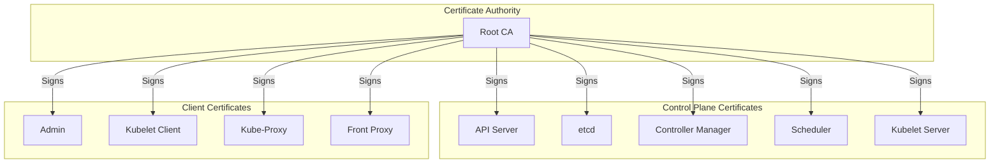

# How to Rotate Kubernetes Cluster Certificates Before Expiry

Author: [nawazdhandala](https://www.github.com/nawazdhandala)

Tags: Kubernetes, Certificates, TLS, Security, PKI, Maintenance, DevOps

Description: Learn how to check certificate expiration dates, rotate Kubernetes control plane certificates, and automate certificate renewal to prevent cluster outages.

---

Kubernetes uses TLS certificates extensively for secure communication between components. These certificates expire—typically after one year—and failing to rotate them causes cluster outages. This guide covers certificate management for all major Kubernetes distributions.

## Kubernetes Certificate Architecture



| Certificate | Purpose | Default Validity |
|-------------|---------|------------------|
| CA | Root certificate authority | 10 years |
| API Server | Server authentication | 1 year |
| etcd | etcd server and peer | 1 year |
| Kubelet | Node authentication | 1 year |
| Admin | kubectl authentication | 1 year |

## Checking Certificate Expiration

### kubeadm Clusters

```bash
# Check all certificate expiration dates
sudo kubeadm certs check-expiration

# Output example:
# CERTIFICATE                EXPIRES                  RESIDUAL TIME   CERTIFICATE AUTHORITY   EXTERNALLY MANAGED
# admin.conf                 Jan 15, 2025 10:00 UTC   364d            ca                      no
# apiserver                  Jan 15, 2025 10:00 UTC   364d            ca                      no
# apiserver-etcd-client      Jan 15, 2025 10:00 UTC   364d            etcd-ca                 no
# apiserver-kubelet-client   Jan 15, 2025 10:00 UTC   364d            ca                      no
# controller-manager.conf    Jan 15, 2025 10:00 UTC   364d            ca                      no
# etcd-healthcheck-client    Jan 15, 2025 10:00 UTC   364d            etcd-ca                 no
# etcd-peer                  Jan 15, 2025 10:00 UTC   364d            etcd-ca                 no
# etcd-server                Jan 15, 2025 10:00 UTC   364d            etcd-ca                 no
# front-proxy-client         Jan 15, 2025 10:00 UTC   364d            front-proxy-ca          no
# scheduler.conf             Jan 15, 2025 10:00 UTC   364d            ca                      no

# Check specific certificate
openssl x509 -in /etc/kubernetes/pki/apiserver.crt -noout -dates
```

### Manual Certificate Check

```bash
# Check API server certificate
echo | openssl s_client -connect localhost:6443 2>/dev/null | \
  openssl x509 -noout -dates

# Check etcd certificate
echo | openssl s_client -connect localhost:2379 2>/dev/null | \
  openssl x509 -noout -dates

# Parse certificate details
openssl x509 -in /etc/kubernetes/pki/apiserver.crt -noout -text | \
  grep -A2 "Validity"
```

### Prometheus Monitoring

```yaml
# cert-expiry-exporter.yaml
apiVersion: apps/v1
kind: DaemonSet
metadata:
  name: cert-exporter
  namespace: monitoring
spec:
  selector:
    matchLabels:
      app: cert-exporter
  template:
    metadata:
      labels:
        app: cert-exporter
    spec:
      containers:
        - name: cert-exporter
          image: joeelliott/cert-exporter:v2.12.0
          args:
            - --secrets-include-glob=*.crt
            - --secrets-include-glob=*.pem
            - --logtostderr
          ports:
            - containerPort: 8080
              name: metrics
          volumeMounts:
            - name: certs
              mountPath: /etc/kubernetes/pki
              readOnly: true
      volumes:
        - name: certs
          hostPath:
            path: /etc/kubernetes/pki
      nodeSelector:
        node-role.kubernetes.io/control-plane: ""
      tolerations:
        - key: node-role.kubernetes.io/control-plane
          operator: Exists
          effect: NoSchedule
```

### Alert on Expiring Certificates

```yaml
# cert-alerts.yaml
apiVersion: monitoring.coreos.com/v1
kind: PrometheusRule
metadata:
  name: certificate-alerts
  namespace: monitoring
spec:
  groups:
    - name: certificates
      rules:
        - alert: KubernetesCertificateExpiringSoon
          expr: |
            cert_exporter_cert_expires_in_seconds < 2592000  # 30 days
          for: 1h
          labels:
            severity: warning
          annotations:
            summary: "Kubernetes certificate expiring soon"
            description: "Certificate {{ $labels.filename }} expires in {{ $value | humanizeDuration }}"
        
        - alert: KubernetesCertificateExpiryCritical
          expr: |
            cert_exporter_cert_expires_in_seconds < 604800  # 7 days
          for: 1h
          labels:
            severity: critical
          annotations:
            summary: "Kubernetes certificate expiring critically soon"
            description: "Certificate {{ $labels.filename }} expires in {{ $value | humanizeDuration }}"
```

## Rotating Certificates with kubeadm

### Automatic Rotation (Kubernetes 1.17+)

```bash
# kubeadm automatically renews certificates during control plane upgrade
sudo kubeadm upgrade apply v1.28.0

# Certificates are renewed when within 180 days of expiration
```

### Manual Rotation - All Certificates

```bash
# Renew all certificates
sudo kubeadm certs renew all

# Restart control plane components to pick up new certs
sudo systemctl restart kubelet

# For static pods, move manifests and back
sudo mv /etc/kubernetes/manifests/*.yaml /tmp/
sleep 30
sudo mv /tmp/*.yaml /etc/kubernetes/manifests/
```

### Manual Rotation - Individual Certificates

```bash
# Renew specific certificate
sudo kubeadm certs renew apiserver
sudo kubeadm certs renew apiserver-kubelet-client
sudo kubeadm certs renew front-proxy-client
sudo kubeadm certs renew etcd-server
sudo kubeadm certs renew etcd-peer
sudo kubeadm certs renew etcd-healthcheck-client
sudo kubeadm certs renew apiserver-etcd-client

# Renew admin kubeconfig
sudo kubeadm certs renew admin.conf
sudo kubeadm certs renew controller-manager.conf
sudo kubeadm certs renew scheduler.conf
```

### Update kubeconfig Files

```bash
# After certificate renewal, update kubeconfig
sudo cp /etc/kubernetes/admin.conf $HOME/.kube/config
sudo chown $(id -u):$(id -g) $HOME/.kube/config

# Or update in-place
kubectl config set-credentials kubernetes-admin \
  --client-certificate=/etc/kubernetes/pki/admin.crt \
  --client-key=/etc/kubernetes/pki/admin.key
```

## Rotating etcd Certificates

### Standalone etcd Cluster

```bash
#!/bin/bash
# rotate-etcd-certs.sh

ETCD_DATA_DIR=/var/lib/etcd
ETCD_PKI_DIR=/etc/kubernetes/pki/etcd
BACKUP_DIR=/root/etcd-cert-backup-$(date +%Y%m%d)

# Backup existing certificates
mkdir -p $BACKUP_DIR
cp -r $ETCD_PKI_DIR/* $BACKUP_DIR/

# Generate new certificates using kubeadm
kubeadm init phase certs etcd-ca
kubeadm init phase certs etcd-server
kubeadm init phase certs etcd-peer
kubeadm init phase certs etcd-healthcheck-client
kubeadm init phase certs apiserver-etcd-client

# Restart etcd
systemctl restart etcd

# Verify etcd health
etcdctl --endpoints=https://127.0.0.1:2379 \
  --cacert=$ETCD_PKI_DIR/ca.crt \
  --cert=$ETCD_PKI_DIR/healthcheck-client.crt \
  --key=$ETCD_PKI_DIR/healthcheck-client.key \
  endpoint health
```

### etcd in Kubernetes Static Pod

```bash
# Certificates are rotated with kubeadm certs renew
sudo kubeadm certs renew etcd-server
sudo kubeadm certs renew etcd-peer
sudo kubeadm certs renew etcd-healthcheck-client
sudo kubeadm certs renew apiserver-etcd-client

# Restart etcd pod
kubectl -n kube-system delete pod etcd-<node-name>
# Or move manifest
sudo mv /etc/kubernetes/manifests/etcd.yaml /tmp/
sleep 10
sudo mv /tmp/etcd.yaml /etc/kubernetes/manifests/
```

## Rotating Kubelet Certificates

### Enable Auto-Rotation

```yaml
# kubelet-config.yaml
apiVersion: kubelet.config.k8s.io/v1beta1
kind: KubeletConfiguration
rotateCertificates: true
serverTLSBootstrap: true
```

```bash
# Enable via kubelet flag
# Add to /var/lib/kubelet/kubeadm-flags.env or kubelet service
--rotate-certificates=true
--rotate-server-certificates=true
```

### Approve Kubelet CSRs

```bash
# Check pending CSRs
kubectl get csr

# Approve CSR
kubectl certificate approve <csr-name>

# Auto-approve kubelet CSRs (use with caution)
kubectl create clusterrolebinding auto-approve-csrs \
  --clusterrole=system:certificates.k8s.io:certificatesigningrequests:selfnodeclient \
  --group=system:nodes
```

### Manual Kubelet Certificate Rotation

```bash
#!/bin/bash
# rotate-kubelet-certs.sh

NODE_NAME=$(hostname)

# Remove existing kubelet certificates
rm -f /var/lib/kubelet/pki/kubelet-client-current.pem
rm -f /var/lib/kubelet/pki/kubelet.crt
rm -f /var/lib/kubelet/pki/kubelet.key

# Restart kubelet to trigger new certificate request
systemctl restart kubelet

# Check for pending CSR
kubectl get csr | grep $NODE_NAME

# Approve if needed
kubectl certificate approve $(kubectl get csr -o name | grep $NODE_NAME)
```

## EKS Certificate Management

```bash
# EKS manages control plane certificates automatically
# For worker nodes, certificates rotate automatically with kubelet

# Check node certificate status
aws eks describe-nodegroup \
  --cluster-name my-cluster \
  --nodegroup-name my-nodegroup

# Force certificate rotation by replacing nodes
eksctl upgrade nodegroup \
  --cluster=my-cluster \
  --name=my-nodegroup
```

## GKE Certificate Management

```bash
# GKE manages certificates automatically
# Verify cluster certificate expiration (master)
gcloud container clusters describe my-cluster \
  --zone us-central1-a \
  --format='value(masterAuth.clusterCaCertificate)' | \
  base64 -d | openssl x509 -noout -dates

# Rotate credentials manually if needed
gcloud container clusters update my-cluster \
  --zone us-central1-a \
  --start-credential-rotation

# Complete rotation
gcloud container clusters update my-cluster \
  --zone us-central1-a \
  --complete-credential-rotation
```

## AKS Certificate Management

```bash
# AKS auto-rotates certificates
# Check certificate status
az aks show \
  --resource-group myResourceGroup \
  --name myAKSCluster \
  --query "aadProfile"

# Manually rotate certificates
az aks rotate-certs \
  --resource-group myResourceGroup \
  --name myAKSCluster

# This requires node reboot, plan maintenance window
```

## Automating Certificate Rotation

### CronJob for Monitoring

```yaml
# cert-check-cronjob.yaml
apiVersion: batch/v1
kind: CronJob
metadata:
  name: cert-expiry-check
  namespace: kube-system
spec:
  schedule: "0 8 * * *"  # Daily at 8 AM
  jobTemplate:
    spec:
      template:
        spec:
          serviceAccountName: cert-checker
          containers:
            - name: checker
              image: bitnami/kubectl:latest
              command:
                - /bin/sh
                - -c
                - |
                  # Check certificate expiration
                  CERTS=$(find /etc/kubernetes/pki -name "*.crt" -type f)
                  for cert in $CERTS; do
                    EXPIRY=$(openssl x509 -in $cert -noout -enddate | cut -d= -f2)
                    EXPIRY_EPOCH=$(date -d "$EXPIRY" +%s)
                    NOW_EPOCH=$(date +%s)
                    DAYS_LEFT=$(( ($EXPIRY_EPOCH - $NOW_EPOCH) / 86400 ))
                    
                    if [ $DAYS_LEFT -lt 30 ]; then
                      echo "WARNING: $cert expires in $DAYS_LEFT days"
                      # Send alert (webhook, email, etc.)
                    fi
                  done
              volumeMounts:
                - name: certs
                  mountPath: /etc/kubernetes/pki
                  readOnly: true
          volumes:
            - name: certs
              hostPath:
                path: /etc/kubernetes/pki
          restartPolicy: OnFailure
          nodeSelector:
            node-role.kubernetes.io/control-plane: ""
          tolerations:
            - key: node-role.kubernetes.io/control-plane
              operator: Exists
              effect: NoSchedule
```

### Ansible Playbook for Rotation

```yaml
# rotate-certs.yaml
---
- name: Rotate Kubernetes Certificates
  hosts: control_plane
  become: yes
  serial: 1  # One node at a time
  
  tasks:
    - name: Check certificate expiration
      command: kubeadm certs check-expiration
      register: cert_status
      changed_when: false
    
    - name: Display certificate status
      debug:
        var: cert_status.stdout_lines
    
    - name: Backup existing certificates
      archive:
        path: /etc/kubernetes/pki
        dest: "/root/pki-backup-{{ ansible_date_time.date }}.tar.gz"
    
    - name: Renew all certificates
      command: kubeadm certs renew all
      when: "'days' in cert_status.stdout and days < 30"
    
    - name: Restart kubelet
      systemd:
        name: kubelet
        state: restarted
    
    - name: Wait for node to be ready
      command: kubectl get node {{ inventory_hostname }} -o jsonpath='{.status.conditions[?(@.type=="Ready")].status}'
      register: node_status
      until: node_status.stdout == "True"
      retries: 30
      delay: 10
      delegate_to: localhost
    
    - name: Copy new admin.conf
      copy:
        src: /etc/kubernetes/admin.conf
        dest: "{{ ansible_env.HOME }}/.kube/config"
        remote_src: yes
        owner: "{{ ansible_user }}"
        mode: '0600'
```

## Summary

| Distribution | Auto-Rotation | Manual Rotation |
|--------------|---------------|-----------------|
| kubeadm | During upgrade | `kubeadm certs renew` |
| EKS | Automatic | Node replacement |
| GKE | Automatic | `gcloud rotate-certs` |
| AKS | Automatic | `az aks rotate-certs` |
| k3s | Automatic | Restart k3s service |

## Related Posts

- [How to Set Up mTLS Between Kubernetes Services Without Service Mesh](https://oneuptime.com/blog/post/2026-01-19-kubernetes-mtls-without-service-mesh/view) - Service-level TLS
- [How to Monitor etcd Health in Kubernetes](https://oneuptime.com/blog/post/2026-01-19-kubernetes-etcd-monitoring-health/view) - etcd monitoring
- [How to Upgrade Kubernetes Clusters with Zero Downtime](https://oneuptime.com/blog/post/2026-01-19-kubernetes-upgrade-zero-downtime/view) - Cluster upgrades
