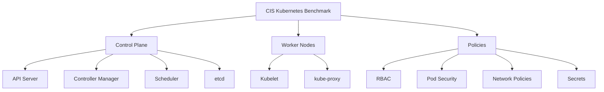

# How to Scan Kubernetes Clusters for CIS Benchmark Compliance

Author: [nawazdhandala](https://www.github.com/nawazdhandala)

Tags: Kubernetes, Security, CIS Benchmark, Compliance, Auditing, kube-bench, DevSecOps

Description: Learn how to scan Kubernetes clusters for CIS Benchmark compliance using kube-bench, automate security assessments, and remediate common compliance failures.

---

The CIS (Center for Internet Security) Kubernetes Benchmark provides security configuration guidelines for Kubernetes clusters. This guide covers automated scanning with kube-bench, understanding results, and implementing remediations.

## CIS Benchmark Categories



## Install kube-bench

### Run as a Job

```yaml
# kube-bench-job.yaml
apiVersion: batch/v1
kind: Job
metadata:
  name: kube-bench
  namespace: kube-system
spec:
  template:
    metadata:
      labels:
        app: kube-bench
    spec:
      hostPID: true
      containers:
        - name: kube-bench
          image: aquasec/kube-bench:v0.7.1
          command: ["kube-bench"]
          args: ["run", "--targets", "node,policies", "--json"]
          volumeMounts:
            - name: var-lib-kubelet
              mountPath: /var/lib/kubelet
              readOnly: true
            - name: etc-systemd
              mountPath: /etc/systemd
              readOnly: true
            - name: etc-kubernetes
              mountPath: /etc/kubernetes
              readOnly: true
            - name: results
              mountPath: /results
          securityContext:
            privileged: true
      volumes:
        - name: var-lib-kubelet
          hostPath:
            path: /var/lib/kubelet
        - name: etc-systemd
          hostPath:
            path: /etc/systemd
        - name: etc-kubernetes
          hostPath:
            path: /etc/kubernetes
        - name: results
          emptyDir: {}
      restartPolicy: Never
      nodeSelector:
        node-role.kubernetes.io/control-plane: ""
      tolerations:
        - key: node-role.kubernetes.io/control-plane
          operator: Exists
          effect: NoSchedule
  backoffLimit: 4
```

### Run as DaemonSet for All Nodes

```yaml
# kube-bench-daemonset.yaml
apiVersion: apps/v1
kind: DaemonSet
metadata:
  name: kube-bench-node
  namespace: kube-system
spec:
  selector:
    matchLabels:
      app: kube-bench-node
  template:
    metadata:
      labels:
        app: kube-bench-node
    spec:
      hostPID: true
      containers:
        - name: kube-bench
          image: aquasec/kube-bench:v0.7.1
          command: ["sh", "-c"]
          args:
            - |
              kube-bench run --targets node --json > /results/$(hostname).json
              sleep infinity
          volumeMounts:
            - name: var-lib-kubelet
              mountPath: /var/lib/kubelet
              readOnly: true
            - name: etc-systemd
              mountPath: /etc/systemd
              readOnly: true
            - name: results
              mountPath: /results
          securityContext:
            privileged: true
      volumes:
        - name: var-lib-kubelet
          hostPath:
            path: /var/lib/kubelet
        - name: etc-systemd
          hostPath:
            path: /etc/systemd
        - name: results
          hostPath:
            path: /var/log/kube-bench
      tolerations:
        - operator: Exists
```

## Run kube-bench Manually

```bash
# On control plane node
kube-bench run --targets master

# On worker node
kube-bench run --targets node

# Run all checks
kube-bench run

# Output as JSON
kube-bench run --json --outputfile results.json

# Run specific CIS version
kube-bench run --benchmark cis-1.8

# Check specific section
kube-bench run --targets master --check 1.1,1.2
```

## Understand Results

### Sample Output

```
[INFO] 1 Control Plane Security Configuration
[INFO] 1.1 Control Plane Node Configuration Files
[PASS] 1.1.1 Ensure that the API server pod specification file permissions are set to 644 or more restrictive
[PASS] 1.1.2 Ensure that the API server pod specification file ownership is set to root:root
[FAIL] 1.1.3 Ensure that the controller manager pod specification file permissions are set to 644 or more restrictive
[WARN] 1.1.4 Ensure that the controller manager pod specification file ownership is set to root:root

== Summary total ==
45 checks PASS
10 checks FAIL
12 checks WARN
5 checks INFO
```

### JSON Output Analysis

```bash
# Parse JSON results
cat results.json | jq '.Controls[] | select(.tests[].results[].status == "FAIL") | .id + " " + .text'

# Get all failures
cat results.json | jq -r '
.Controls[].tests[].results[] | 
select(.status == "FAIL") | 
"\(.test_number): \(.test_desc)"
'

# Count by status
cat results.json | jq '
[.Controls[].tests[].results[].status] | 
group_by(.) | 
map({status: .[0], count: length})
'
```

## Common Remediations

### 1.1 - Control Plane File Permissions

```bash
# Fix API server pod spec permissions (1.1.1)
chmod 644 /etc/kubernetes/manifests/kube-apiserver.yaml
chown root:root /etc/kubernetes/manifests/kube-apiserver.yaml

# Fix controller manager permissions (1.1.3)
chmod 644 /etc/kubernetes/manifests/kube-controller-manager.yaml
chown root:root /etc/kubernetes/manifests/kube-controller-manager.yaml

# Fix scheduler permissions (1.1.5)
chmod 644 /etc/kubernetes/manifests/kube-scheduler.yaml
chown root:root /etc/kubernetes/manifests/kube-scheduler.yaml

# Fix etcd permissions (1.1.7)
chmod 644 /etc/kubernetes/manifests/etcd.yaml
chown root:root /etc/kubernetes/manifests/etcd.yaml

# Fix admin.conf permissions (1.1.13)
chmod 600 /etc/kubernetes/admin.conf
chown root:root /etc/kubernetes/admin.conf
```

### 1.2 - API Server Configuration

```yaml
# /etc/kubernetes/manifests/kube-apiserver.yaml
apiVersion: v1
kind: Pod
metadata:
  name: kube-apiserver
spec:
  containers:
    - name: kube-apiserver
      command:
        - kube-apiserver
        # 1.2.1 - Ensure anonymous auth is disabled
        - --anonymous-auth=false
        
        # 1.2.5 - Ensure kubelet HTTPS
        - --kubelet-https=true
        
        # 1.2.6 - Ensure proper authorization mode
        - --authorization-mode=Node,RBAC
        
        # 1.2.10 - Ensure admission plugins enabled
        - --enable-admission-plugins=NodeRestriction,PodSecurityPolicy
        
        # 1.2.16 - Ensure audit logging enabled
        - --audit-log-path=/var/log/kubernetes/audit.log
        - --audit-log-maxage=30
        - --audit-log-maxbackup=10
        - --audit-log-maxsize=100
        
        # 1.2.22 - Ensure audit policy file
        - --audit-policy-file=/etc/kubernetes/audit-policy.yaml
        
        # 1.2.24 - Ensure TLS cert file
        - --tls-cert-file=/etc/kubernetes/pki/apiserver.crt
        - --tls-private-key-file=/etc/kubernetes/pki/apiserver.key
        
        # 1.2.29 - Ensure encryption provider
        - --encryption-provider-config=/etc/kubernetes/encryption-config.yaml
```

### 1.3 - Controller Manager Configuration

```yaml
# /etc/kubernetes/manifests/kube-controller-manager.yaml
apiVersion: v1
kind: Pod
metadata:
  name: kube-controller-manager
spec:
  containers:
    - name: kube-controller-manager
      command:
        - kube-controller-manager
        # 1.3.2 - Ensure profiling disabled
        - --profiling=false
        
        # 1.3.3 - Ensure use service account credentials
        - --use-service-account-credentials=true
        
        # 1.3.4 - Ensure service account private key
        - --service-account-private-key-file=/etc/kubernetes/pki/sa.key
        
        # 1.3.5 - Ensure root CA file
        - --root-ca-file=/etc/kubernetes/pki/ca.crt
        
        # 1.3.6 - Ensure RotateKubeletServerCertificate
        - --feature-gates=RotateKubeletServerCertificate=true
        
        # 1.3.7 - Ensure bind address
        - --bind-address=127.0.0.1
```

### 2.x - etcd Configuration

```yaml
# /etc/kubernetes/manifests/etcd.yaml
apiVersion: v1
kind: Pod
metadata:
  name: etcd
spec:
  containers:
    - name: etcd
      command:
        - etcd
        # 2.1 - Ensure cert file set
        - --cert-file=/etc/kubernetes/pki/etcd/server.crt
        - --key-file=/etc/kubernetes/pki/etcd/server.key
        
        # 2.2 - Ensure client-cert-auth enabled
        - --client-cert-auth=true
        
        # 2.4 - Ensure peer cert file set
        - --peer-cert-file=/etc/kubernetes/pki/etcd/peer.crt
        - --peer-key-file=/etc/kubernetes/pki/etcd/peer.key
        
        # 2.5 - Ensure peer-client-cert-auth enabled
        - --peer-client-cert-auth=true
        
        # 2.6 - Ensure peer-auto-tls disabled
        - --peer-auto-tls=false
```

### 4.x - Worker Node Configuration

```yaml
# /var/lib/kubelet/config.yaml
apiVersion: kubelet.config.k8s.io/v1beta1
kind: KubeletConfiguration

# 4.2.1 - Ensure anonymous auth disabled
authentication:
  anonymous:
    enabled: false
  webhook:
    enabled: true
  x509:
    clientCAFile: /etc/kubernetes/pki/ca.crt

# 4.2.2 - Ensure authorization mode not AlwaysAllow
authorization:
  mode: Webhook

# 4.2.4 - Ensure read-only port disabled
readOnlyPort: 0

# 4.2.6 - Ensure protect-kernel-defaults enabled
protectKernelDefaults: true

# 4.2.10 - Ensure event-qps reasonable
eventRecordQPS: 5

# 4.2.11 - Ensure rotate certificates
rotateCertificates: true

# 4.2.12 - Ensure RotateKubeletServerCertificate enabled
serverTLSBootstrap: true
```

### 5.x - Policies

```yaml
# 5.1.1 - Ensure cluster-admin role is only used where required
# Audit command:
# kubectl get clusterrolebindings -o json | jq '.items[] | select(.roleRef.name=="cluster-admin")'

# 5.2.x - Pod Security Standards
apiVersion: v1
kind: Namespace
metadata:
  name: production
  labels:
    pod-security.kubernetes.io/enforce: restricted
    pod-security.kubernetes.io/audit: restricted
    pod-security.kubernetes.io/warn: restricted

# 5.3.x - Network Policies
---
apiVersion: networking.k8s.io/v1
kind: NetworkPolicy
metadata:
  name: default-deny-all
  namespace: production
spec:
  podSelector: {}
  policyTypes:
    - Ingress
    - Egress

# 5.4.x - Secrets Management
# Ensure encryption at rest is configured
---
apiVersion: apiserver.config.k8s.io/v1
kind: EncryptionConfiguration
resources:
  - resources:
      - secrets
    providers:
      - aescbc:
          keys:
            - name: key1
              secret: <base64-encoded-key>
      - identity: {}
```

## Automated Compliance Scanning

### CronJob for Regular Scans

```yaml
# kube-bench-cronjob.yaml
apiVersion: batch/v1
kind: CronJob
metadata:
  name: kube-bench-scan
  namespace: security
spec:
  schedule: "0 2 * * *"  # Daily at 2 AM
  jobTemplate:
    spec:
      template:
        spec:
          hostPID: true
          serviceAccountName: kube-bench
          containers:
            - name: kube-bench
              image: aquasec/kube-bench:v0.7.1
              command: ["/bin/sh", "-c"]
              args:
                - |
                  kube-bench run --json > /results/scan-$(date +%Y%m%d).json
                  # Send to monitoring system
                  curl -X POST -H "Content-Type: application/json" \
                    -d @/results/scan-$(date +%Y%m%d).json \
                    http://security-dashboard:8080/api/scans
              volumeMounts:
                - name: var-lib-kubelet
                  mountPath: /var/lib/kubelet
                  readOnly: true
                - name: etc-kubernetes
                  mountPath: /etc/kubernetes
                  readOnly: true
                - name: results
                  mountPath: /results
              securityContext:
                privileged: true
          volumes:
            - name: var-lib-kubelet
              hostPath:
                path: /var/lib/kubelet
            - name: etc-kubernetes
              hostPath:
                path: /etc/kubernetes
            - name: results
              emptyDir: {}
          restartPolicy: OnFailure
          tolerations:
            - operator: Exists
```

## Summary

| Section | Focus Area |
|---------|------------|
| 1.x | Control Plane Components |
| 2.x | etcd Configuration |
| 3.x | Control Plane Configuration |
| 4.x | Worker Node Security |
| 5.x | Policies (RBAC, PSS, Network) |

## Related Posts

- [How to Implement Kubernetes Pod Security Contexts Correctly](https://oneuptime.com/blog/post/2026-01-19-kubernetes-pod-security-contexts/view) - Pod security
- [How to Implement mTLS in Kubernetes Without a Service Mesh](https://oneuptime.com/blog/post/2026-01-19-kubernetes-mtls-without-service-mesh/view) - TLS security
- [How to Rotate Kubernetes Cluster Certificates Before Expiry](https://oneuptime.com/blog/post/2026-01-19-kubernetes-certificate-rotation-expiry/view) - Certificate management
