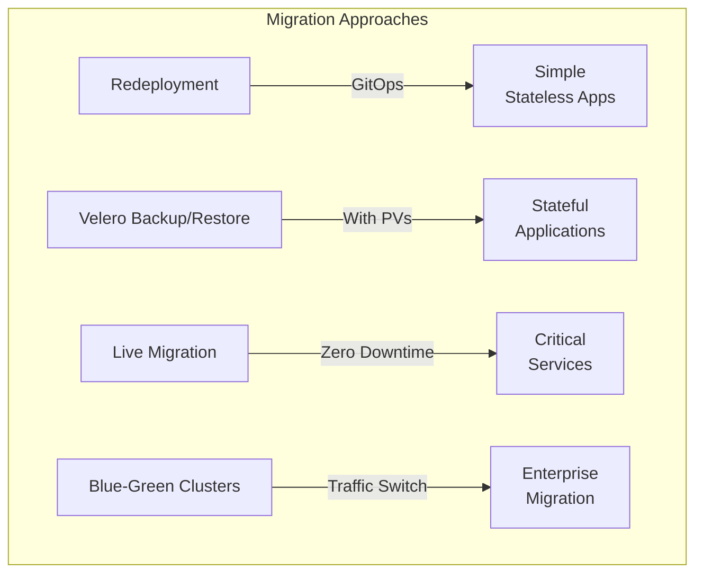

# How to Migrate Workloads Between Kubernetes Clusters

Author: [nawazdhandala](https://www.github.com/nawazdhandala)

Tags: Kubernetes, Migration, Cluster Migration, Velero, GitOps, Multi-Cluster, DevOps

Description: Learn how to safely migrate workloads, data, and configurations between Kubernetes clusters using Velero, GitOps, and live migration strategies.

---

Migrating workloads between Kubernetes clusters is a common requirement for upgrading cluster versions, changing cloud providers, consolidating infrastructure, or implementing disaster recovery. This guide covers various migration strategies from simple stateless migrations to complex stateful workload transfers.

## Migration Strategies Overview



| Strategy | Downtime | Complexity | Best For |
|----------|----------|------------|----------|
| GitOps Redeployment | Minutes | Low | Stateless apps with external data |
| Velero Backup/Restore | Minutes-Hours | Medium | Full cluster or namespace migration |
| Live Migration | Zero | High | Critical production workloads |
| Blue-Green Clusters | Seconds | High | Enterprise-grade migrations |

## Pre-Migration Assessment

### Inventory Your Workloads

```bash
#!/bin/bash
# cluster-inventory.sh - Generate migration inventory

echo "=== Cluster Inventory Report ===" > inventory.txt
echo "Generated: $(date)" >> inventory.txt
echo "" >> inventory.txt

# Namespaces
echo "=== Namespaces ===" >> inventory.txt
kubectl get namespaces -o name >> inventory.txt
echo "" >> inventory.txt

# Workloads per namespace
for ns in $(kubectl get namespaces -o jsonpath='{.items[*].metadata.name}'); do
    echo "=== Namespace: $ns ===" >> inventory.txt
    
    echo "Deployments:" >> inventory.txt
    kubectl get deployments -n $ns -o wide 2>/dev/null >> inventory.txt
    
    echo "StatefulSets:" >> inventory.txt
    kubectl get statefulsets -n $ns -o wide 2>/dev/null >> inventory.txt
    
    echo "DaemonSets:" >> inventory.txt
    kubectl get daemonsets -n $ns -o wide 2>/dev/null >> inventory.txt
    
    echo "Services:" >> inventory.txt
    kubectl get services -n $ns -o wide 2>/dev/null >> inventory.txt
    
    echo "PersistentVolumeClaims:" >> inventory.txt
    kubectl get pvc -n $ns -o wide 2>/dev/null >> inventory.txt
    
    echo "ConfigMaps:" >> inventory.txt
    kubectl get configmaps -n $ns 2>/dev/null >> inventory.txt
    
    echo "Secrets:" >> inventory.txt
    kubectl get secrets -n $ns 2>/dev/null >> inventory.txt
    
    echo "" >> inventory.txt
done

# Custom Resource Definitions
echo "=== Custom Resource Definitions ===" >> inventory.txt
kubectl get crds -o name >> inventory.txt

# Storage Classes
echo "=== Storage Classes ===" >> inventory.txt
kubectl get storageclasses >> inventory.txt

echo "Inventory complete: inventory.txt"
```

### Check for Migration Blockers

```bash
#!/bin/bash
# check-migration-blockers.sh

echo "=== Checking Migration Blockers ==="

# Check for hostPath volumes
echo "Checking for hostPath volumes..."
kubectl get pods --all-namespaces -o json | \
  jq -r '.items[] | select(.spec.volumes[]?.hostPath != null) | 
    "\(.metadata.namespace)/\(.metadata.name)"'

# Check for node selectors that won't exist in new cluster
echo "Checking for specific node selectors..."
kubectl get pods --all-namespaces -o json | \
  jq -r '.items[] | select(.spec.nodeSelector != null) | 
    "\(.metadata.namespace)/\(.metadata.name): \(.spec.nodeSelector)"'

# Check for local persistent volumes
echo "Checking for local PVs..."
kubectl get pv -o json | \
  jq -r '.items[] | select(.spec.local != null) | .metadata.name'

# Check for LoadBalancer services (IPs will change)
echo "Checking LoadBalancer services..."
kubectl get svc --all-namespaces -o json | \
  jq -r '.items[] | select(.spec.type == "LoadBalancer") | 
    "\(.metadata.namespace)/\(.metadata.name)"'

# Check for cluster-specific annotations
echo "Checking for cloud-specific annotations..."
kubectl get ingress --all-namespaces -o json | \
  jq -r '.items[] | select(.metadata.annotations | 
    keys[] | test("aws|gcp|azure")) | 
    "\(.metadata.namespace)/\(.metadata.name)"'
```

## Strategy 1: GitOps Redeployment

Best for stateless applications with data stored externally.

### Export Current State

```bash
# Export all resources from namespace
kubectl get all,configmap,secret,ingress,pvc -n myapp -o yaml > myapp-export.yaml

# Clean up cluster-specific fields
cat myapp-export.yaml | \
  yq eval 'del(.items[].metadata.uid, 
              .items[].metadata.resourceVersion,
              .items[].metadata.creationTimestamp,
              .items[].metadata.generation,
              .items[].status)' - > myapp-clean.yaml
```

### Using ArgoCD for Migration

```yaml
# argocd-application-migration.yaml
apiVersion: argoproj.io/v1alpha1
kind: Application
metadata:
  name: myapp-migration
  namespace: argocd
spec:
  project: default
  source:
    repoURL: https://github.com/myorg/kubernetes-manifests
    targetRevision: main
    path: apps/myapp
  destination:
    # Point to new cluster
    server: https://new-cluster.example.com
    namespace: myapp
  syncPolicy:
    automated:
      prune: true
      selfHeal: true
    syncOptions:
      - CreateNamespace=true
```

```bash
# Register new cluster with ArgoCD
argocd cluster add new-cluster-context --name new-cluster

# Create application pointing to new cluster
argocd app create myapp-new \
  --repo https://github.com/myorg/kubernetes-manifests \
  --path apps/myapp \
  --dest-server https://new-cluster.example.com \
  --dest-namespace myapp \
  --sync-policy automated

# Sync to new cluster
argocd app sync myapp-new
```

## Strategy 2: Velero Backup and Restore

### Install Velero on Both Clusters

```bash
# Install Velero on source cluster
velero install \
  --provider aws \
  --plugins velero/velero-plugin-for-aws:v1.8.0 \
  --bucket velero-migration-bucket \
  --backup-location-config region=us-west-2 \
  --snapshot-location-config region=us-west-2 \
  --secret-file ./credentials-velero

# Install on destination cluster (same bucket for shared backups)
velero install \
  --provider aws \
  --plugins velero/velero-plugin-for-aws:v1.8.0 \
  --bucket velero-migration-bucket \
  --backup-location-config region=us-west-2 \
  --snapshot-location-config region=us-west-2 \
  --secret-file ./credentials-velero
```

### Backup Source Cluster

```bash
# Backup entire namespace with PVs
velero backup create myapp-migration \
  --include-namespaces myapp \
  --include-cluster-resources=true \
  --snapshot-volumes=true \
  --wait

# Backup multiple namespaces
velero backup create full-migration \
  --include-namespaces myapp,monitoring,logging \
  --include-cluster-resources=true \
  --snapshot-volumes=true

# Backup with label selector
velero backup create labeled-migration \
  --selector 'migrate=true' \
  --include-cluster-resources=true

# Check backup status
velero backup describe myapp-migration --details
```

### Restore to Destination Cluster

```bash
# List available backups
velero backup get

# Restore to new cluster
velero restore create myapp-restore \
  --from-backup myapp-migration \
  --wait

# Restore with namespace mapping (rename namespace)
velero restore create myapp-restore \
  --from-backup myapp-migration \
  --namespace-mappings myapp:myapp-prod

# Restore excluding specific resources
velero restore create myapp-restore \
  --from-backup myapp-migration \
  --exclude-resources persistentvolumeclaims,persistentvolumes

# Check restore status
velero restore describe myapp-restore --details
velero restore logs myapp-restore
```

### Cross-Cloud Migration with Velero

```yaml
# velero-restic-config.yaml
# Use Restic for portable PV backup (filesystem-level)
apiVersion: velero.io/v1
kind: BackupStorageLocation
metadata:
  name: cross-cloud
  namespace: velero
spec:
  provider: aws
  objectStorage:
    bucket: velero-cross-cloud-migration
  config:
    region: us-east-1
---
apiVersion: velero.io/v1
kind: Backup
metadata:
  name: cross-cloud-backup
  namespace: velero
spec:
  includedNamespaces:
    - myapp
  storageLocation: cross-cloud
  # Use Restic for portable backups
  defaultVolumesToRestic: true
  ttl: 720h  # 30 days
```

```bash
# Create backup with Restic (portable across clouds)
velero backup create cross-cloud-migration \
  --include-namespaces myapp \
  --default-volumes-to-restic \
  --storage-location cross-cloud \
  --wait

# On destination cluster, restore from same storage location
velero restore create cross-cloud-restore \
  --from-backup cross-cloud-migration \
  --wait
```

## Strategy 3: Live Migration (Zero Downtime)

### Step 1: Set Up Cross-Cluster Networking

```yaml
# Using Submariner for cross-cluster connectivity
# Install on both clusters
apiVersion: submariner.io/v1alpha1
kind: Broker
metadata:
  name: submariner-broker
  namespace: submariner-broker
spec:
  globalnetEnabled: true
---
apiVersion: submariner.io/v1alpha1
kind: Submariner
metadata:
  name: submariner
  namespace: submariner-operator
spec:
  broker: k8s
  brokerK8sApiServer: https://broker-cluster.example.com
  brokerK8sApiServerToken: <token>
  clusterID: cluster-a
  serviceCIDR: 10.96.0.0/12
  clusterCIDR: 10.244.0.0/16
```

### Step 2: Deploy to Both Clusters

```yaml
# deployment-both-clusters.yaml
apiVersion: apps/v1
kind: Deployment
metadata:
  name: myapp
  namespace: production
spec:
  replicas: 3
  selector:
    matchLabels:
      app: myapp
  template:
    metadata:
      labels:
        app: myapp
        migration-phase: active  # Track migration status
    spec:
      containers:
        - name: myapp
          image: myregistry/myapp:v2.1.0
          ports:
            - containerPort: 8080
          readinessProbe:
            httpGet:
              path: /health
              port: 8080
            initialDelaySeconds: 5
            periodSeconds: 5
```

### Step 3: Gradual Traffic Shift

```yaml
# Using Istio for traffic management
# istio-traffic-split.yaml
apiVersion: networking.istio.io/v1beta1
kind: VirtualService
metadata:
  name: myapp
  namespace: production
spec:
  hosts:
    - myapp.example.com
  http:
    - match:
        - headers:
            x-canary:
              exact: "true"
      route:
        - destination:
            host: myapp.new-cluster.svc.cluster.local
            port:
              number: 80
    - route:
        - destination:
            host: myapp.old-cluster.svc.cluster.local
            port:
              number: 80
          weight: 90
        - destination:
            host: myapp.new-cluster.svc.cluster.local
            port:
              number: 80
          weight: 10
```

```bash
# Gradually shift traffic
# Phase 1: 10% to new cluster
kubectl patch virtualservice myapp -n production --type=merge -p '
spec:
  http:
  - route:
    - destination:
        host: myapp.old-cluster.svc.cluster.local
      weight: 90
    - destination:
        host: myapp.new-cluster.svc.cluster.local
      weight: 10'

# Phase 2: 50% to new cluster
kubectl patch virtualservice myapp -n production --type=merge -p '
spec:
  http:
  - route:
    - destination:
        host: myapp.old-cluster.svc.cluster.local
      weight: 50
    - destination:
        host: myapp.new-cluster.svc.cluster.local
      weight: 50'

# Phase 3: 100% to new cluster
kubectl patch virtualservice myapp -n production --type=merge -p '
spec:
  http:
  - route:
    - destination:
        host: myapp.new-cluster.svc.cluster.local
      weight: 100'
```

## Strategy 4: Database Migration

### PostgreSQL Migration with pg_dump

```yaml
# postgres-migration-job.yaml
apiVersion: batch/v1
kind: Job
metadata:
  name: postgres-migration
  namespace: database
spec:
  template:
    spec:
      containers:
        - name: migrator
          image: postgres:15
          command:
            - /bin/bash
            - -c
            - |
              # Dump from source
              PGPASSWORD=$SOURCE_PASSWORD pg_dump \
                -h $SOURCE_HOST \
                -U $SOURCE_USER \
                -d $SOURCE_DB \
                -F c \
                -f /backup/dump.sql
              
              # Restore to destination
              PGPASSWORD=$DEST_PASSWORD pg_restore \
                -h $DEST_HOST \
                -U $DEST_USER \
                -d $DEST_DB \
                -c \
                /backup/dump.sql
          env:
            - name: SOURCE_HOST
              value: postgres-old.database.svc.cluster.local
            - name: SOURCE_USER
              valueFrom:
                secretKeyRef:
                  name: postgres-old-creds
                  key: username
            - name: SOURCE_PASSWORD
              valueFrom:
                secretKeyRef:
                  name: postgres-old-creds
                  key: password
            - name: SOURCE_DB
              value: myapp
            - name: DEST_HOST
              value: postgres-new.database.svc.cluster.local
            - name: DEST_USER
              valueFrom:
                secretKeyRef:
                  name: postgres-new-creds
                  key: username
            - name: DEST_PASSWORD
              valueFrom:
                secretKeyRef:
                  name: postgres-new-creds
                  key: password
            - name: DEST_DB
              value: myapp
          volumeMounts:
            - name: backup-storage
              mountPath: /backup
      volumes:
        - name: backup-storage
          persistentVolumeClaim:
            claimName: migration-pvc
      restartPolicy: Never
```

### Streaming Replication for Zero-Downtime DB Migration

```yaml
# postgres-streaming-replica.yaml
apiVersion: v1
kind: ConfigMap
metadata:
  name: postgres-replica-config
  namespace: database
data:
  postgresql.conf: |
    listen_addresses = '*'
    wal_level = replica
    max_wal_senders = 3
    wal_keep_size = 1GB
    hot_standby = on
  
  pg_hba.conf: |
    host replication replicator 0.0.0.0/0 md5
    host all all 0.0.0.0/0 md5
---
apiVersion: apps/v1
kind: StatefulSet
metadata:
  name: postgres-replica
  namespace: database
spec:
  serviceName: postgres-replica
  replicas: 1
  selector:
    matchLabels:
      app: postgres-replica
  template:
    metadata:
      labels:
        app: postgres-replica
    spec:
      initContainers:
        - name: init-replica
          image: postgres:15
          command:
            - /bin/bash
            - -c
            - |
              # Create base backup from primary
              PGPASSWORD=$REPLICATION_PASSWORD pg_basebackup \
                -h $PRIMARY_HOST \
                -U replicator \
                -D /var/lib/postgresql/data \
                -P -R -X stream
          env:
            - name: PRIMARY_HOST
              value: postgres-primary.old-cluster.svc.cluster.local
            - name: REPLICATION_PASSWORD
              valueFrom:
                secretKeyRef:
                  name: postgres-replication
                  key: password
          volumeMounts:
            - name: data
              mountPath: /var/lib/postgresql/data
      containers:
        - name: postgres
          image: postgres:15
          ports:
            - containerPort: 5432
          volumeMounts:
            - name: data
              mountPath: /var/lib/postgresql/data
            - name: config
              mountPath: /etc/postgresql
      volumes:
        - name: config
          configMap:
            name: postgres-replica-config
  volumeClaimTemplates:
    - metadata:
        name: data
      spec:
        accessModes: ["ReadWriteOnce"]
        resources:
          requests:
            storage: 100Gi
```

## Migration Validation

### Pre-Migration Checklist

```bash
#!/bin/bash
# pre-migration-check.sh

echo "=== Pre-Migration Validation ==="

# Check source cluster health
echo "Checking source cluster health..."
kubectl get nodes
kubectl get pods --all-namespaces | grep -v Running | grep -v Completed

# Verify backup
echo "Verifying backup completeness..."
velero backup describe migration-backup --details

# Check destination cluster readiness
echo "Checking destination cluster..."
kubectl --context=new-cluster get nodes
kubectl --context=new-cluster get storageclasses

# Verify network connectivity
echo "Testing cross-cluster connectivity..."
kubectl run test-connectivity --image=busybox --rm -it --restart=Never -- \
  wget -qO- http://service.new-cluster.svc.cluster.local/health
```

### Post-Migration Validation

```bash
#!/bin/bash
# post-migration-check.sh

echo "=== Post-Migration Validation ==="

# Check all pods are running
echo "Checking pod status..."
kubectl --context=new-cluster get pods -n myapp
FAILED_PODS=$(kubectl --context=new-cluster get pods -n myapp --field-selector=status.phase!=Running,status.phase!=Succeeded -o name | wc -l)
if [ "$FAILED_PODS" -gt 0 ]; then
    echo "ERROR: $FAILED_PODS pods not running"
    exit 1
fi

# Verify services
echo "Checking services..."
kubectl --context=new-cluster get svc -n myapp

# Test endpoints
echo "Testing application endpoints..."
APP_URL=$(kubectl --context=new-cluster get ingress -n myapp -o jsonpath='{.items[0].spec.rules[0].host}')
curl -s -o /dev/null -w "%{http_code}" https://$APP_URL/health

# Verify data integrity
echo "Verifying data integrity..."
# Add your data verification commands

# Compare resource counts
echo "Comparing resource counts..."
OLD_PODS=$(kubectl --context=old-cluster get pods -n myapp --no-headers | wc -l)
NEW_PODS=$(kubectl --context=new-cluster get pods -n myapp --no-headers | wc -l)
echo "Old cluster pods: $OLD_PODS, New cluster pods: $NEW_PODS"

echo "=== Migration Validation Complete ==="
```

## Rollback Plan

```bash
#!/bin/bash
# rollback-migration.sh

echo "=== Starting Migration Rollback ==="

# Revert traffic to old cluster
echo "Reverting traffic..."
kubectl patch virtualservice myapp -n production --type=merge -p '
spec:
  http:
  - route:
    - destination:
        host: myapp.old-cluster.svc.cluster.local
      weight: 100'

# Scale up old cluster if scaled down
echo "Scaling up old cluster workloads..."
kubectl --context=old-cluster scale deployment myapp -n myapp --replicas=5

# Update DNS if changed
echo "Reverting DNS..."
# Add DNS reversion commands

# Notify team
echo "Sending rollback notification..."
curl -X POST -H 'Content-type: application/json' \
  --data '{"text":"Migration rollback initiated"}' \
  $SLACK_WEBHOOK_URL

echo "=== Rollback Complete ==="
```

## Summary

| Phase | Actions | Tools |
|-------|---------|-------|
| Assessment | Inventory workloads, identify blockers | kubectl, jq scripts |
| Preparation | Set up backup storage, install tools | Velero, ArgoCD |
| Execution | Backup, restore, or gradual migration | Velero, Istio |
| Validation | Verify pods, services, data | Custom scripts |
| Cutover | DNS switch, traffic shift | External-DNS, Load Balancer |
| Cleanup | Decommission old cluster | kubectl delete |

## Related Posts

- [How to Back Up and Restore Kubernetes Clusters with Velero](https://oneuptime.com/blog/post/2026-01-19-kubernetes-velero-backup-restore/view) - Detailed Velero usage
- [How to Implement Blue-Green and Canary Deployments in Kubernetes](https://oneuptime.com/blog/post/2026-01-19-kubernetes-blue-green-canary-deployments/view) - Deployment strategies for migration
- [How to Set Up Cross-Cluster Service Discovery in Kubernetes](https://oneuptime.com/blog/post/2026-01-19-kubernetes-cross-cluster-service-discovery/view) - Multi-cluster connectivity
